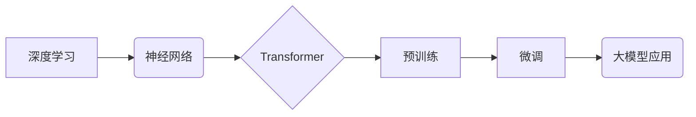

> AI大模型、深度学习、自然语言处理、计算机视觉、Transformer、经济价值、应用场景

## 1. 背景介绍

人工智能（AI）正以惊人的速度发展，其核心驱动力之一是大模型的涌现。大模型是指拥有数亿甚至数十亿参数的深度学习模型，它们能够学习和理解复杂的模式，并应用于各种任务，例如自然语言处理、计算机视觉、语音识别等。

近年来，大模型取得了突破性的进展，例如GPT-3、BERT、DALL-E等，它们在文本生成、机器翻译、图像识别等领域展现出强大的能力，引发了学术界和产业界的广泛关注。

大模型的出现，为我们提供了构建更智能、更强大的AI系统的全新可能性。它们能够24小时不间断地工作，处理海量数据，并提供持续的经济价值。

## 2. 核心概念与联系

大模型的构建和应用涉及多个核心概念，包括深度学习、神经网络、Transformer、预训练和微调等。

**2.1 深度学习**

深度学习是机器学习的一个子领域，它利用多层神经网络来模拟人类大脑的学习过程。深度学习模型能够从海量数据中自动学习特征，并进行复杂的模式识别和预测。

**2.2 神经网络**

神经网络是深度学习的基础，它由多个相互连接的神经元组成。每个神经元接收输入信号，对其进行处理，并输出信号。神经网络通过调整神经元之间的连接权重来学习数据模式。

**2.3 Transformer**

Transformer是一种新型的神经网络架构，它能够有效处理序列数据，例如文本和语音。Transformer的核心是注意力机制，它能够学习不同词语之间的关系，并赋予它们不同的权重。

**2.4 预训练和微调**

预训练是指在大量通用数据上训练大模型，使其学习到通用的语言表示或视觉特征。微调是指在特定任务的数据上对预训练模型进行进一步训练，使其能够更好地完成特定任务。

**2.5 核心概念关系图**



## 3. 核心算法原理 & 具体操作步骤

### 3.1  算法原理概述

大模型的训练主要基于深度学习算法，其中最常用的算法是反向传播算法。反向传播算法通过计算模型输出与真实值的误差，并反向传播误差信号，调整模型参数，使得模型输出更接近真实值。

### 3.2  算法步骤详解

1. **数据预处理:** 将原始数据转换为模型可以理解的格式，例如文本数据需要进行分词、词向量化等处理。
2. **模型构建:** 根据任务需求选择合适的深度学习模型架构，例如Transformer、CNN等。
3. **模型训练:** 使用反向传播算法训练模型，通过不断调整模型参数，使得模型输出更接近真实值。
4. **模型评估:** 使用测试数据评估模型的性能，例如准确率、召回率等指标。
5. **模型调优:** 根据评估结果，调整模型参数、学习率等超参数，进一步提高模型性能。

### 3.3  算法优缺点

**优点:**

* 能够学习复杂的模式，并取得优异的性能。
* 能够处理海量数据，并进行高效的推理。
* 能够进行泛化学习，在新的数据上也能表现良好。

**缺点:**

* 训练成本高，需要大量的计算资源和时间。
* 模型参数量大，部署和推理成本较高。
* 容易受到数据偏差的影响，可能产生不公平或有偏的结果。

### 3.4  算法应用领域

大模型的应用领域非常广泛，包括：

* **自然语言处理:** 文本生成、机器翻译、问答系统、情感分析等。
* **计算机视觉:** 图像识别、物体检测、图像分割、视频分析等。
* **语音识别:** 语音转文本、语音合成、语音助手等。
* **推荐系统:** 商品推荐、内容推荐、用户画像等。
* **药物研发:** 药物发现、药物设计、药物安全性评估等。

## 4. 数学模型和公式 & 详细讲解 & 举例说明

### 4.1  数学模型构建

大模型的训练过程可以看作是一个优化问题，目标是找到模型参数，使得模型输出与真实值之间的误差最小。

常用的损失函数包括均方误差（MSE）、交叉熵损失（Cross-Entropy Loss）等。

**4.1.1 均方误差 (MSE)**

MSE 衡量预测值与真实值之间的平方差的平均值。

$$MSE = \frac{1}{N} \sum_{i=1}^{N} (y_i - \hat{y}_i)^2$$

其中：

* $N$ 是样本数量
* $y_i$ 是真实值
* $\hat{y}_i$ 是预测值

**4.1.2 交叉熵损失 (Cross-Entropy Loss)**

交叉熵损失用于分类任务，衡量预测概率分布与真实概率分布之间的差异。

$$Cross-Entropy Loss = - \sum_{i=1}^{C} y_i \log(\hat{y}_i)$$

其中：

* $C$ 是类别数量
* $y_i$ 是真实类别概率
* $\hat{y}_i$ 是预测类别概率

### 4.2  公式推导过程

反向传播算法通过链式法则计算梯度，并根据梯度更新模型参数。

梯度下降算法是一种常用的优化算法，它通过迭代更新模型参数，使得损失函数不断减小。

### 4.3  案例分析与讲解

例如，在训练一个图像分类模型时，可以使用交叉熵损失函数来衡量模型预测结果与真实标签之间的差异。

通过反向传播算法，可以计算出每个模型参数的梯度，并根据梯度更新模型参数。

## 5. 项目实践：代码实例和详细解释说明

### 5.1  开发环境搭建

使用Python语言和深度学习框架TensorFlow或PyTorch搭建开发环境。

### 5.2  源代码详细实现

```python
import tensorflow as tf

# 定义模型架构
model = tf.keras.models.Sequential([
    tf.keras.layers.Conv2D(32, (3, 3), activation='relu', input_shape=(28, 28, 1)),
    tf.keras.layers.MaxPooling2D((2, 2)),
    tf.keras.layers.Conv2D(64, (3, 3), activation='relu'),
    tf.keras.layers.MaxPooling2D((2, 2)),
    tf.keras.layers.Flatten(),
    tf.keras.layers.Dense(10, activation='softmax')
])

# 定义损失函数和优化器
model.compile(loss='sparse_categorical_crossentropy',
              optimizer='adam',
              metrics=['accuracy'])

# 加载数据集
(x_train, y_train), (x_test, y_test) = tf.keras.datasets.mnist.load_data()

# 数据预处理
x_train = x_train.astype('float32') / 255.0
x_test = x_test.astype('float32') / 255.0
x_train = x_train.reshape((x_train.shape[0], 28, 28, 1))
x_test = x_test.reshape((x_test.shape[0], 28, 28, 1))

# 模型训练
model.fit(x_train, y_train, epochs=5)

# 模型评估
loss, accuracy = model.evaluate(x_test, y_test)
print('Test loss:', loss)
print('Test accuracy:', accuracy)
```

### 5.3  代码解读与分析

这段代码实现了使用TensorFlow框架训练一个简单的图像分类模型。

首先，定义了模型架构，包括卷积层、池化层和全连接层。

然后，定义了损失函数和优化器，用于训练模型。

接着，加载了MNIST数据集，并对数据进行了预处理。

最后，训练模型并评估模型性能。

### 5.4  运行结果展示

训练完成后，可以观察到模型的准确率不断提高。

## 6. 实际应用场景

### 6.1  自然语言处理

大模型在自然语言处理领域有着广泛的应用，例如：

* **文本生成:** 可以生成高质量的文本内容，例如文章、故事、诗歌等。
* **机器翻译:** 可以将文本从一种语言翻译成另一种语言。
* **问答系统:** 可以理解用户的问题，并给出准确的答案。
* **情感分析:** 可以分析文本的情感倾向，例如正面、负面或中性。

### 6.2  计算机视觉

大模型在计算机视觉领域也取得了突破性进展，例如：

* **图像识别:** 可以识别图像中的物体、场景和人物。
* **物体检测:** 可以定位图像中物体的边界框。
* **图像分割:** 可以将图像分割成不同的区域。
* **视频分析:** 可以分析视频内容，例如识别动作、跟踪物体等。

### 6.3  语音识别

大模型可以用于语音识别，例如：

* **语音转文本:** 将语音转换为文本。
* **语音合成:** 将文本转换为语音。
* **语音助手:** 可以理解用户的语音指令，并执行相应的操作。

### 6.4  未来应用展望

随着大模型技术的不断发展，其应用场景将更加广泛，例如：

* **个性化教育:** 根据学生的学习情况，提供个性化的学习内容和辅导。
* **医疗诊断:** 辅助医生进行疾病诊断，提高诊断准确率。
* **自动驾驶:** 帮助自动驾驶汽车感知周围环境，并做出决策。
* **科学研究:** 加速科学研究的进程，例如药物研发、材料科学等。

## 7. 工具和资源推荐

### 7.1  学习资源推荐

* **书籍:**
    * 《深度学习》
    * 《动手学深度学习》
    * 《自然语言处理》
* **在线课程:**
    * Coursera: 深度学习
    * Udacity: 
    * fast.ai: 深度学习课程
* **博客和网站:**
    * TensorFlow博客
    * PyTorch博客
    * OpenAI博客

### 7.2  开发工具推荐

* **深度学习框架:** TensorFlow, PyTorch, Keras
* **编程语言:** Python
* **云计算平台:** AWS, Google Cloud, Azure

### 7.3  相关论文推荐

* Attention Is All You Need
* BERT: Pre-training of Deep Bidirectional Transformers for Language Understanding
* GPT-3: Language Models are Few-Shot Learners

## 8. 总结：未来发展趋势与挑战

### 8.1  研究成果总结

大模型的出现，标志着人工智能领域迈入了新的时代。大模型能够学习和理解复杂的模式，并应用于各种任务，为我们提供了构建更智能、更强大的AI系统的全新可能性。

### 8.2  未来发展趋势

* **模型规模的进一步扩大:** 随着计算资源的不断发展，大模型的规模将继续扩大，模型能力将进一步提升。
* **模型架构的创新:** 研究人员将继续探索新的模型架构，例如Transformer的变体、混合模型等，以提高模型的效率和性能。
* **多模态学习:** 大模型将能够处理多种模态数据，例如文本、图像、语音等，实现跨模态的理解和生成。
* **可解释性研究:** 研究人员将更加关注大模型的可解释性，以便更好地理解模型的决策过程，提高模型的信任度。

### 8.3  面临的挑战

* **训练成本:** 大模型的训练成本非常高，需要大量的计算资源和时间。
* **数据偏差:** 大