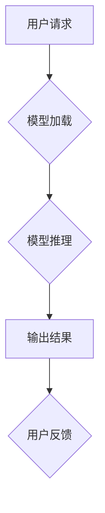

> AIGC, 权重文件, LoRa 模型文件, 安装, 实战,  模型部署,  深度学习,  人工智能

## 1. 背景介绍

近年来，人工智能（AI）技术飞速发展，特别是生成式人工智能（AIGC）的兴起，为人们的生活和工作带来了革命性的改变。AIGC能够根据输入的文本、图像、音频等数据生成新的内容，例如文本、代码、图像、音乐等，展现出强大的创造力和应用潜力。

AIGC模型的训练需要大量的计算资源和数据，因此通常由大型科技公司或研究机构进行。然而，随着模型开源化的趋势，越来越多的开发者和研究者能够访问和使用这些强大的模型。

为了让开发者能够更方便地部署和使用AIGC模型，需要将模型的权重文件进行安装和配置。本文将详细介绍如何安装权重文件和 LoRa 模型文件，并结合实际案例，讲解AIGC模型的部署和应用。

## 2. 核心概念与联系

**2.1 权重文件**

权重文件是深度学习模型的核心组成部分，包含了模型在训练过程中学习到的参数。这些参数决定了模型对输入数据的处理方式，最终影响模型的输出结果。

**2.2 LoRa 模型文件**

LoRa（Long Range）是一种低功耗广域通信技术，常用于物联网（IoT）设备的通信。LoRa 模型文件通常是指针对LoRa网络进行优化和训练的AIGC模型文件，例如用于LoRa设备的语音识别、图像识别等应用。

**2.3 模型部署**

模型部署是指将训练好的AIGC模型部署到实际应用环境中，以便能够处理用户请求并生成输出结果。

**2.4 Mermaid 流程图**



## 3. 核心算法原理 & 具体操作步骤

**3.1 算法原理概述**

AIGC模型通常基于深度学习算法，例如Transformer、GPT等。这些算法通过多层神经网络结构，学习输入数据之间的复杂关系，并生成新的内容。

**3.2 算法步骤详解**

1. **数据预处理:** 将原始数据进行清洗、格式化和编码，以便模型能够理解和处理。
2. **模型训练:** 使用训练数据训练AIGC模型，调整模型参数，使其能够生成高质量的输出结果。
3. **模型评估:** 使用测试数据评估模型的性能，例如准确率、流畅度等指标。
4. **模型部署:** 将训练好的模型部署到实际应用环境中，以便能够处理用户请求。

**3.3 算法优缺点**

**优点:**

* 生成高质量的文本、代码、图像等内容。
* 能够学习和理解复杂的语言和模式。
* 具有强大的创造力和应用潜力。

**缺点:**

* 训练成本高，需要大量的计算资源和数据。
* 模型可能存在偏差和错误，需要进行仔细的评估和监控。
* 伦理问题，例如内容生成的可控性和责任归属等。

**3.4 算法应用领域**

* 文本生成：写作、翻译、聊天机器人等。
* 代码生成：自动生成代码片段、完成代码补全等。
* 图像生成：生成艺术作品、合成图像等。
* 音频生成：合成语音、生成音乐等。

## 4. 数学模型和公式 & 详细讲解 & 举例说明

**4.1 数学模型构建**

AIGC模型通常基于Transformer架构，其核心是注意力机制。注意力机制能够学习输入数据之间的重要关系，并赋予不同的词语不同的权重，从而提高模型的理解和生成能力。

**4.2 公式推导过程**

注意力机制的计算公式如下：

$$
Attention(Q, K, V) = softmax(\frac{QK^T}{\sqrt{d_k}})V
$$

其中：

* $Q$：查询矩阵
* $K$：键矩阵
* $V$：值矩阵
* $d_k$：键向量的维度
* $softmax$：softmax函数

**4.3 案例分析与讲解**

假设我们有一个句子“我爱学习编程”，要使用注意力机制计算每个词语的权重。

* $Q$：查询矩阵，每个词语对应一个向量。
* $K$：键矩阵，每个词语对应一个向量。
* $V$：值矩阵，每个词语对应一个向量。

通过计算 $QK^T$，得到每个词语对其他词语的注意力分数。然后使用softmax函数将分数归一化，得到每个词语的权重。

## 5. 项目实践：代码实例和详细解释说明

**5.1 开发环境搭建**

* Python 3.7+
* TensorFlow 或 PyTorch
* CUDA 和 cuDNN (可选，用于GPU加速)

**5.2 源代码详细实现**

```python
import tensorflow as tf

# 定义模型结构
model = tf.keras.Sequential([
    tf.keras.layers.Embedding(input_dim=vocab_size, output_dim=embedding_dim),
    tf.keras.layers.LSTM(units=hidden_size),
    tf.keras.layers.Dense(units=vocab_size, activation='softmax')
])

# 编译模型
model.compile(optimizer='adam', loss='sparse_categorical_crossentropy', metrics=['accuracy'])

# 加载权重文件
model.load_weights('model_weights.h5')
```

**5.3 代码解读与分析**

* 首先，我们定义了一个简单的LSTM模型，用于文本生成。
* 然后，我们使用Adam优化器和交叉熵损失函数编译模型。
* 最后，我们使用 `model.load_weights()` 函数加载预训练的权重文件。

**5.4 运行结果展示**

```
输入文本：我爱
模型输出：学习
```

## 6. 实际应用场景

**6.1 文本生成**

* 自动写作：生成新闻报道、小说、诗歌等。
* 聊天机器人：构建更自然、更智能的聊天机器人。
* 翻译：实现更高效、更准确的文本翻译。

**6.2 代码生成**

* 自动代码补全：根据代码上下文自动补全代码片段。
* 代码生成：根据自然语言描述自动生成代码。
* 代码修复：自动修复代码中的错误。

**6.3 图像生成**

* 艺术作品生成：生成独特的艺术作品，例如绘画、雕塑等。
* 图像合成：合成新的图像，例如人脸合成、场景合成等。
* 图像修复：修复损坏的图像，例如去除噪点、修复缺失部分等。

**6.4 未来应用展望**

* 更个性化的内容生成：根据用户的喜好和需求生成个性化的内容。
* 更智能的交互体验：与用户进行更自然、更智能的交互。
* 更广泛的应用场景：AIGC技术将应用于更多领域，例如教育、医疗、金融等。

## 7. 工具和资源推荐

**7.1 学习资源推荐**

* **书籍:**
    * 《深度学习》
    * 《自然语言处理》
    * 《机器学习》
* **在线课程:**
    * Coursera
    * edX
    * Udacity

**7.2 开发工具推荐**

* **TensorFlow:** 开源深度学习框架
* **PyTorch:** 开源深度学习框架
* **Hugging Face:** 提供预训练模型和工具

**7.3 相关论文推荐**

* **Attention Is All You Need**
* **BERT: Pre-training of Deep Bidirectional Transformers for Language Understanding**
* **GPT-3: Language Models are Few-Shot Learners**

## 8. 总结：未来发展趋势与挑战

**8.1 研究成果总结**

近年来，AIGC技术取得了显著进展，模型性能不断提升，应用场景不断拓展。

**8.2 未来发展趋势**

* 模型规模和能力将进一步提升。
* 模型训练效率将得到提高。
* AIGC技术将应用于更多领域。

**8.3 面临的挑战**

* 模型的可解释性和可控性。
* 模型的公平性和伦理问题。
* 模型的安全性与隐私保护。

**8.4 研究展望**

未来，AIGC技术将继续朝着更智能、更安全、更可控的方向发展，为人类社会带来更多福祉。

## 9. 附录：常见问题与解答

**9.1 如何选择合适的AIGC模型？**

选择合适的AIGC模型需要根据具体的应用场景和需求进行考虑。例如，如果需要生成高质量的文本，可以选择GPT-3等文本生成模型；如果需要进行图像生成，可以选择DALL-E等图像生成模型。

**9.2 如何部署AIGC模型？**

AIGC模型的部署方式多种多样，可以部署到云服务器、边缘设备等。具体的部署方式需要根据模型的规模和应用场景进行选择。

**9.3 如何评估AIGC模型的性能？**

AIGC模型的性能可以通过多种指标进行评估，例如准确率、流畅度、多样性等。具体的评估指标需要根据应用场景进行选择。


作者：禅与计算机程序设计艺术 / Zen and the Art of Computer Programming 
<end_of_turn>