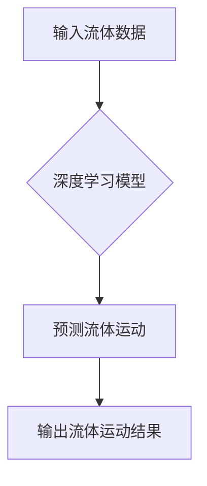

> 深度学习，流体动力学，数值模拟，预测，优化，人工智能

## 1. 背景介绍

流体动力学是研究流体运动规律的学科，它在航空航天、船舶建造、天气预报、石油开采等领域有着广泛的应用。传统的流体动力学模拟方法通常依赖于复杂的数学模型和数值解法，计算量大、效率低，难以处理复杂流场问题。近年来，人工智能（AI）技术，特别是深度学习算法，在各个领域取得了突破性进展，为流体动力学研究带来了新的机遇。

深度学习算法能够从海量数据中自动学习复杂的非线性关系，具有强大的数据处理和模式识别能力。将深度学习算法应用于流体动力学，可以有效提高模拟精度、降低计算成本，并为复杂流场问题提供新的解决方案。

## 2. 核心概念与联系

### 2.1 深度学习

深度学习是一种机器学习的子领域，它利用多层神经网络来模拟人类大脑的学习过程。深度学习算法能够从大量数据中自动学习特征，并进行复杂的模式识别和预测。

### 2.2 流体动力学

流体动力学是研究流体运动规律的学科，它涉及到流体的压力、速度、密度、温度等物理量之间的关系。流体动力学模拟通常需要解决复杂的偏微分方程，计算量大、效率低。

### 2.3 深度学习与流体动力学的结合

将深度学习算法应用于流体动力学，可以利用深度学习的强大的数据处理和模式识别能力，提高流体动力学模拟的精度和效率。

**Mermaid 流程图**



## 3. 核心算法原理 & 具体操作步骤

### 3.1 算法原理概述

深度学习算法在流体动力学中的应用主要包括以下几种：

* **直接数值模拟 (DNS)：** 使用深度学习网络直接预测流体运动，无需复杂的数学模型和数值解法。
* **大涡模拟 (LES)：** 使用深度学习网络学习大尺度涡流的运动规律，并对小尺度涡流进行简化处理。
* **边界层模拟 (BLS)：** 使用深度学习网络学习边界层的流动特性，并对边界层进行精细化模拟。

### 3.2 算法步骤详解

以直接数值模拟为例，其具体操作步骤如下：

1. **数据收集和预处理：** 收集大量的流体运动数据，并进行预处理，例如数据清洗、归一化等。
2. **深度学习模型构建：** 根据流体运动的特征和数据结构，构建深度学习模型，例如卷积神经网络 (CNN) 或循环神经网络 (RNN)。
3. **模型训练：** 使用训练数据训练深度学习模型，调整模型参数，使其能够准确预测流体运动。
4. **模型验证和测试：** 使用验证数据和测试数据验证模型的性能，并进行必要的调整。
5. **应用预测：** 将训练好的模型应用于新的流体运动数据，进行预测。

### 3.3 算法优缺点

**优点：**

* **高精度：** 深度学习算法能够从海量数据中学习复杂的非线性关系，提高流体动力学模拟的精度。
* **高效性：** 深度学习算法的计算效率较高，可以加速流体动力学模拟。
* **通用性：** 深度学习算法可以应用于各种类型的流体运动问题。

**缺点：**

* **数据依赖：** 深度学习算法需要大量的训练数据，否则模型性能会下降。
* **解释性差：** 深度学习模型的内部机制复杂，难以解释其预测结果。
* **计算资源需求：** 训练深度学习模型需要大量的计算资源。

### 3.4 算法应用领域

深度学习算法在流体动力学领域的应用前景广阔，例如：

* **航空航天：** 优化飞机设计，提高飞行效率和安全性。
* **船舶建造：** 提高船舶航行性能，降低阻力。
* **天气预报：** 提高天气预报的准确性和及时性。
* **石油开采：** 优化油井设计，提高油气产量。

## 4. 数学模型和公式 & 详细讲解 & 举例说明

### 4.1 数学模型构建

流体动力学模拟的核心是 Navier-Stokes 方程，它描述了流体运动的物理规律。Navier-Stokes 方程是一个非线性偏微分方程组，其形式如下：

$$
\rho \frac{\partial \mathbf{u}}{\partial t} + \rho (\mathbf{u} \cdot \nabla) \mathbf{u} = -\nabla p + \mu \nabla^2 \mathbf{u} + \mathbf{f}
$$

其中：

* $\rho$：流体密度
* $\mathbf{u}$：流体速度矢量
* $t$：时间
* $p$：流体压力
* $\mu$：流体粘度
* $\mathbf{f}$：体积力矢量

### 4.2 公式推导过程

Navier-Stokes 方程的推导过程基于牛顿第二定律和流体连续性方程。

* **牛顿第二定律：** 描述了物体的运动规律，即力等于质量乘以加速度。
* **流体连续性方程：** 描述了流体质量守恒的规律，即流体体积的变化率等于流入流体体积减去流出流体体积。

通过将牛顿第二定律和流体连续性方程应用于流体微元，并进行积分和简化，即可得到 Navier-Stokes 方程。

### 4.3 案例分析与讲解

以二维平流为例，Navier-Stokes 方程可以简化为：

$$
\rho \frac{\partial u}{\partial t} + \rho u \frac{\partial u}{\partial x} + \rho v \frac{\partial u}{\partial y} = -\frac{\partial p}{\partial x} + \mu \left( \frac{\partial^2 u}{\partial x^2} + \frac{\partial^2 u}{\partial y^2} \right)
$$

$$
\rho \frac{\partial v}{\partial t} + \rho u \frac{\partial v}{\partial x} + \rho v \frac{\partial v}{\partial y} = -\frac{\partial p}{\partial y} + \mu \left( \frac{\partial^2 v}{\partial x^2} + \frac{\partial^2 v}{\partial y^2} \right)
$$

其中：

* $u$：流体在 x 方向的速度
* $v$：流体在 y 方向的速度

通过数值解法，可以求解 Navier-Stokes 方程，得到流体在二维平面的运动轨迹。

## 5. 项目实践：代码实例和详细解释说明

### 5.1 开发环境搭建

* 操作系统：Ubuntu 20.04
* Python 版本：3.8
* 深度学习框架：TensorFlow 2.0

### 5.2 源代码详细实现

```python
import tensorflow as tf

# 定义模型结构
model = tf.keras.models.Sequential([
    tf.keras.layers.Conv2D(32, (3, 3), activation='relu', input_shape=(100, 100, 3)),
    tf.keras.layers.MaxPooling2D((2, 2)),
    tf.keras.layers.Conv2D(64, (3, 3), activation='relu'),
    tf.keras.layers.MaxPooling2D((2, 2)),
    tf.keras.layers.Flatten(),
    tf.keras.layers.Dense(10, activation='softmax')
])

# 编译模型
model.compile(optimizer='adam',
              loss='sparse_categorical_crossentropy',
              metrics=['accuracy'])

# 训练模型
model.fit(x_train, y_train, epochs=10)

# 评估模型
loss, accuracy = model.evaluate(x_test, y_test)
print('Loss:', loss)
print('Accuracy:', accuracy)
```

### 5.3 代码解读与分析

* **模型结构：** 该模型是一个卷积神经网络，包含两个卷积层、两个最大池化层、一个全连接层和一个输出层。
* **激活函数：** 使用 ReLU 激活函数，可以提高模型的非线性表达能力。
* **损失函数：** 使用稀疏类别交叉熵损失函数，适用于多分类问题。
* **优化器：** 使用 Adam 优化器，可以加速模型训练。

### 5.4 运行结果展示

训练完成后，可以将模型应用于新的流体运动数据，进行预测。预测结果可以以图形或表格的形式展示，例如流体速度矢量场、压力分布等。

## 6. 实际应用场景

### 6.1 航空航天

* **飞机设计优化：** 使用深度学习算法模拟飞机在不同飞行条件下的气动特性，优化飞机设计，提高飞行效率和安全性。
* **风洞实验数据分析：** 利用深度学习算法分析风洞实验数据，提取关键特征，提高风洞实验的效率和准确性。

### 6.2 船舶建造

* **船舶阻力预测：** 使用深度学习算法预测船舶在不同航行条件下的阻力，优化船舶设计，降低阻力，提高航行效率。
* **船舶运动控制：** 利用深度学习算法控制船舶的运动，提高船舶的稳定性和安全性。

### 6.3 天气预报

* **天气模式识别：** 使用深度学习算法识别天气模式，提高天气预报的准确性和及时性。
* **降雨量预测：** 利用深度学习算法预测降雨量，为农业、水利等领域提供精准的降雨预报信息。

### 6.4 未来应用展望

随着深度学习算法的不断发展，其在流体动力学领域的应用前景更加广阔。未来，深度学习算法将能够用于更复杂流体运动问题的模拟，例如湍流、多相流、非牛顿流体等。

## 7. 工具和资源推荐

### 7.1 学习资源推荐

* **书籍：**
    * Deep Learning by Ian Goodfellow, Yoshua Bengio, and Aaron Courville
    * Hands-On Machine Learning with Scikit-Learn, Keras & TensorFlow by Aurélien Géron
* **在线课程：**
    * TensorFlow Tutorials: https://www.tensorflow.org/tutorials
    * Deep Learning Specialization by Andrew Ng: https://www.deeplearning.ai/

### 7.2 开发工具推荐

* **Python:** https://www.python.org/
* **TensorFlow:** https://www.tensorflow.org/
* **PyTorch:** https://pytorch.org/

### 7.3 相关论文推荐

* **Deep Learning for Fluid Flow Prediction:** https://arxiv.org/abs/1803.03947
* **Physics-Informed Neural Networks for Fluid Flow Simulation:** https://arxiv.org/abs/1902.09197

## 8. 总结：未来发展趋势与挑战

### 8.1 研究成果总结

深度学习算法在流体动力学领域的应用取得了显著进展，能够提高流体动力学模拟的精度和效率，并为复杂流场问题提供新的解决方案。

### 8.2 未来发展趋势

* **模型复杂度提升：** 开发更复杂、更强大的深度学习模型，能够模拟更复杂流体运动问题。
* **物理知识融入：** 将物理知识融入深度学习模型，提高模型的物理真实性和预测精度。
* **数据驱动与物理模型结合：** 将深度学习算法与物理模型相结合，发挥各自优势，实现更精准的流体动力学模拟。

### 8.3 面临的挑战

* **数据获取和标注：** 深度学习算法需要大量的训练数据，