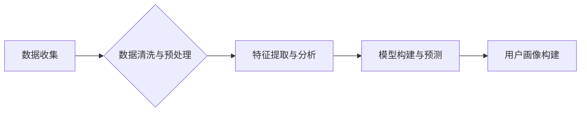

> AI创业公司,用户画像,数据分析,机器学习,深度学习,个性化推荐,市场营销

## 1. 背景介绍

在当今数据爆炸的时代，AI技术正在深刻地改变着各行各业，其中，AI创业公司正处于蓬勃发展的阶段。然而，成功打造一个成功的AI创业公司并不容易，需要对目标用户进行深入的了解和分析。用户画像构建是AI创业公司发展的重要基石，它可以帮助企业更精准地定位目标用户，制定有效的市场营销策略，提升产品和服务的竞争力。

传统的市场调研方法往往成本高、效率低，难以满足AI创业公司快速迭代的需求。而AI技术可以帮助企业从海量数据中挖掘用户画像，构建更精准、更全面的用户画像，为企业决策提供数据支持。

## 2. 核心概念与联系

**2.1 用户画像的概念**

用户画像是指对目标用户进行深入分析和描述，构建出一个虚拟的用户形象，包括用户的基本信息、行为特征、心理特征、需求特征等多方面信息。

**2.2 AI技术与用户画像构建的联系**

AI技术可以帮助企业从海量数据中挖掘用户画像，构建更精准、更全面的用户画像。

* **数据收集与清洗:** AI技术可以帮助企业从各种数据源中收集用户数据，并进行清洗和预处理，为用户画像构建提供高质量的数据基础。
* **特征提取与分析:** AI技术可以自动提取用户数据中的关键特征，并进行分析和挖掘，发现用户画像背后的潜在规律和趋势。
* **模型构建与预测:** AI技术可以构建用户画像模型，并进行预测分析，例如预测用户的购买行为、使用习惯等。

**2.3 用户画像构建流程**



## 3. 核心算法原理 & 具体操作步骤

**3.1 算法原理概述**

用户画像构建通常采用机器学习算法，例如：

* **聚类算法:** 将用户数据进行分组，将具有相似特征的用户归为一类，例如K-means聚类、DBSCAN聚类等。
* **分类算法:** 根据用户的特征，预测用户的类别，例如决策树、支持向量机、神经网络等。
* **推荐算法:** 根据用户的历史行为和偏好，推荐用户可能感兴趣的内容或产品，例如协同过滤、内容过滤、混合推荐等。

**3.2 算法步骤详解**

1. **数据收集:** 从各种数据源收集用户数据，例如用户注册信息、浏览记录、购买记录、评论信息等。
2. **数据清洗与预处理:** 对收集到的数据进行清洗和预处理，例如删除重复数据、处理缺失值、转换数据类型等。
3. **特征提取与分析:** 从用户数据中提取关键特征，例如用户年龄、性别、兴趣爱好、购买频率、消费金额等。
4. **模型构建与训练:** 选择合适的机器学习算法，构建用户画像模型，并使用训练数据对模型进行训练。
5. **模型评估与优化:** 使用测试数据对模型进行评估，并根据评估结果对模型进行优化，提高模型的准确率和性能。
6. **用户画像构建:** 将训练好的模型应用于新的用户数据，构建用户画像。

**3.3 算法优缺点**

* **聚类算法:** 优点是能够发现用户之间的潜在相似性，缺点是难以解释聚类结果，并且对数据规模和特征维度敏感。
* **分类算法:** 优点是能够对用户进行精确分类，缺点是需要大量的标注数据，并且对数据分布敏感。
* **推荐算法:** 优点是能够根据用户的兴趣和偏好推荐个性化内容，缺点是容易陷入“推荐冷启动”问题，并且需要不断更新模型以适应用户的变化。

**3.4 算法应用领域**

用户画像构建在各个领域都有广泛的应用，例如：

* **电商:** 建立用户画像，进行精准营销、个性化推荐、用户分层等。
* **金融:** 建立用户画像，进行风险评估、精准营销、个性化服务等。
* **教育:** 建立用户画像，进行个性化学习推荐、教学内容定制等。
* **医疗:** 建立用户画像，进行精准医疗、疾病预测、健康管理等。

## 4. 数学模型和公式 & 详细讲解 & 举例说明

**4.1 数学模型构建**

用户画像构建可以采用多种数学模型，例如：

* **K-means聚类算法:** 将用户数据划分为K个簇，每个簇代表一个用户类型。

**4.2 公式推导过程**

K-means聚类算法的目标是找到K个质心，使得每个用户到其所属质心的距离最小。

* **质心计算公式:**

$$
\mu_i = \frac{1}{n_i} \sum_{j=1}^{n_i} x_{ij}
$$

其中：

* $\mu_i$ 是第i个簇的质心
* $n_i$ 是第i个簇的用户数量
* $x_{ij}$ 是第j个用户在第i个特征上的值

* **距离计算公式:**

$$
d(x, \mu) = \sqrt{\sum_{i=1}^{d} (x_i - \mu_i)^2}
$$

其中：

* $x$ 是用户数据
* $\mu$ 是质心
* $d$ 是特征维度

**4.3 案例分析与讲解**

假设我们有以下用户数据：

| 用户ID | 年龄 | 性别 | 收入 |
|---|---|---|---|
| 1 | 25 | 男 | 5000 |
| 2 | 30 | 女 | 8000 |
| 3 | 28 | 男 | 6000 |
| 4 | 35 | 女 | 10000 |
| 5 | 22 | 男 | 4000 |

我们使用K-means聚类算法将用户数据划分为两个簇。

* 首先，随机选择两个质心。
* 然后，将每个用户分配到距离其最近的质心所在的簇。
* 重新计算每个簇的质心。
* 重复上述步骤，直到质心不再发生变化。

最终，我们得到以下两个簇：

* 簇1: 用户1, 3, 5
* 簇2: 用户2, 4

## 5. 项目实践：代码实例和详细解释说明

**5.1 开发环境搭建**

* Python 3.x
* Jupyter Notebook
* scikit-learn

**5.2 源代码详细实现**

```python
from sklearn.cluster import KMeans
import pandas as pd

# 加载用户数据
data = pd.read_csv('user_data.csv')

# 选择特征进行聚类
features = ['年龄', '收入']
X = data[features]

# 使用K-means聚类算法
kmeans = KMeans(n_clusters=2)
kmeans.fit(X)

# 获取聚类结果
labels = kmeans.labels_
data['cluster'] = labels

# 查看聚类结果
print(data)
```

**5.3 代码解读与分析**

* 首先，我们使用pandas库加载用户数据。
* 然后，我们选择年龄和收入作为聚类特征。
* 使用KMeans类进行聚类，指定聚类数量为2。
* 使用fit()方法训练模型。
* 使用labels_属性获取聚类结果，并将结果添加到数据框中。
* 最后，我们打印数据框，查看聚类结果。

**5.4 运行结果展示**

运行代码后，会输出一个包含用户ID、年龄、收入和聚类标签的数据框。

## 6. 实际应用场景

**6.1 电商平台**

* **精准营销:** 根据用户画像，进行精准的广告投放和促销活动，提高营销效果。
* **个性化推荐:** 根据用户的兴趣爱好和购买历史，推荐个性化的商品，提升用户体验。
* **用户分层:** 将用户分为不同的等级，提供不同的服务和优惠，提高用户粘性。

**6.2 金融机构**

* **风险评估:** 根据用户的信用记录、收入水平等信息，评估用户的信用风险，为贷款审批提供依据。
* **精准营销:** 根据用户的投资偏好和风险承受能力，推荐个性化的理财产品，提升营销效果。
* **个性化服务:** 根据用户的需求和行为习惯，提供个性化的金融服务，提升用户体验。

**6.3 教育机构**

* **个性化学习推荐:** 根据学生的学习进度、兴趣爱好和学习风格，推荐个性化的学习资源，提升学习效率。
* **教学内容定制:** 根据学生的学习水平和需求，定制个性化的教学内容，提高教学效果。
* **学生行为分析:** 分析学生的学习行为，发现学习问题，及时进行干预和帮助。

**6.4 医疗机构**

* **精准医疗:** 根据患者的基因信息、病史、生活习惯等信息，制定个性化的治疗方案，提高治疗效果。
* **疾病预测:** 根据患者的健康数据，预测患者患病风险，进行预防和干预。
* **健康管理:** 根据患者的健康状况，提供个性化的健康管理建议，帮助患者保持健康。

**6.4 未来应用展望**

随着AI技术的不断发展，用户画像构建将在更多领域得到应用，例如：

* **智能家居:** 根据用户的行为习惯，自动调节家居环境，提供个性化的服务。
* **智能交通:** 根据用户的出行需求，提供个性化的出行方案，提高出行效率。
* **智能客服:** 根据用户的咨询内容，提供个性化的服务，提高客户满意度。

## 7. 工具和资源推荐

**7.1 学习资源推荐**

* **书籍:**
    * 《机器学习》 - 周志华
    * 《深度学习》 - Ian Goodfellow
* **在线课程:**
    * Coursera: Machine Learning
    * edX: Artificial Intelligence

**7.2 开发工具推荐**

* **Python:** 
    * scikit-learn
    * TensorFlow
    * PyTorch

**7.3 相关论文推荐**

* **K-means聚类算法:**
    * Lloyd, S. (1982). Least squares quantization in PCM. IEEE Transactions on Information Theory, 28(4), 40-48.
* **推荐算法:**
    * Resnick, P., Iacovou, N., Suchak, M., Bergstrom, P., & Riedl, J. (1994). GroupLens: An open architecture for collaborative filtering of netnews. In Proceedings of the ACM conference on Computer supported cooperative work (pp. 175-186).

## 8. 总结：未来发展趋势与挑战

**8.1 研究成果总结**

用户画像构建在AI创业公司发展中扮演着越来越重要的角色，它可以帮助企业更精准地定位目标用户，制定有效的市场营销策略，提升产品和服务的竞争力。

**8.2 未来发展趋势**

* **多模态用户画像:** 将文本、图像、音频等多模态数据融合，构建更全面的用户画像。
* **动态用户画像:** 随着用户的行为和偏好不断变化，用户画像也需要不断更新和迭代。
* **个性化用户画像:** 根据用户的个性化需求，构建更精准的个性化用户画像。

**8.3 面临的挑战**

* **数据隐私保护:** 用户数据隐私保护是一个重要的伦理问题，需要企业采取有效的措施保护用户数据安全。
* **模型解释性:** 许多AI模型的决策过程难以解释，这可能会导致用户对模型结果产生 distrust。
* **数据质量:** 用户数据质量直接影响用户画像的准确性，需要企业不断提高数据质量。

**8.4 研究展望**

未来，用户画像构建的研究将更加注重数据隐私保护、模型解释性和数据质量，并探索更先进的算法和技术，构建更精准、更全面的用户画像，为AI创业公司提供更有效的决策支持。

## 9. 附录：常见问题与解答

**9.1 如何选择合适的聚类算法