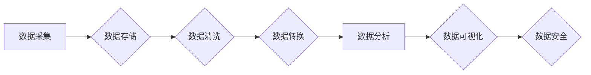

> AI创业, 数据管理, 数据架构, 数据质量, 数据安全, 数据可视化, 数据分析

## 1. 背景介绍

人工智能 (AI) 正以惊人的速度发展，并迅速渗透到各个行业，从医疗保健到金融，再到制造业。AI 创业正蓬勃发展，涌现出许多创新型公司，致力于利用 AI 技术解决各种现实问题。然而，在 AI 创业的道路上，数据管理扮演着至关重要的角色。

数据是 AI 驱动的应用的核心燃料。高质量、可靠的数据可以训练出更精准、更有效的 AI 模型，从而提升 AI 应用的价值。然而，数据管理也面临着诸多挑战，例如数据孤岛、数据质量问题、数据安全风险等。

## 2. 核心概念与联系

**数据管理** 是指规划、组织、存储、保护和利用数据的一系列活动。在 AI 创业中，数据管理的核心策略包括：

* **数据采集:** 从各种来源收集相关数据，包括结构化数据、非结构化数据和半结构化数据。
* **数据存储:** 选择合适的数据库和数据存储系统，确保数据安全、可靠和可访问。
* **数据清洗:** 识别和修复数据中的错误、缺失值和重复数据，提高数据质量。
* **数据转换:** 将数据转换为 AI 模型所需的格式，例如特征工程和数据标注。
* **数据分析:** 使用数据分析工具和技术，从数据中提取有价值的洞察和知识。
* **数据安全:** 实施数据安全措施，保护数据免受未经授权的访问、使用和披露。

**数据架构** 是指数据管理的整体设计和组织方式，它决定了数据如何被存储、访问和使用。

**数据质量** 指的是数据的准确性、完整性、一致性和及时性。高质量的数据是训练有效 AI 模型的关键。

**数据安全** 是指保护数据免受未经授权的访问、使用和披露。数据安全是 AI 创业中至关重要的考虑因素。

**数据可视化** 是指使用图表、图形和仪表板等方式，将数据可视化，以便于理解和分析。

**数据分析** 是指使用统计学、机器学习等技术，从数据中提取有价值的洞察和知识。

**Mermaid 流程图:**



## 3. 核心算法原理 & 具体操作步骤

### 3.1  算法原理概述

在 AI 创业中，许多算法被用于数据管理，例如：

* **数据清洗算法:** 用于识别和修复数据中的错误、缺失值和重复数据。常见的算法包括：
    * **缺失值填充算法:** 例如平均值填充、中位数填充、K 最近邻填充等。
    * **重复数据删除算法:** 例如基于哈希表、基于距离计算等。
* **数据转换算法:** 用于将数据转换为 AI 模型所需的格式。常见的算法包括：
    * **特征工程算法:** 例如特征选择、特征提取、特征组合等。
    * **数据标注算法:** 例如监督学习、无监督学习、半监督学习等。

### 3.2  算法步骤详解

以数据清洗算法为例，其具体操作步骤如下：

1. **数据预处理:** 对原始数据进行格式转换、编码转换等预处理操作。
2. **缺失值处理:** 使用缺失值填充算法填充缺失值。
3. **重复数据删除:** 使用重复数据删除算法删除重复数据。
4. **异常值处理:** 使用异常值检测算法识别异常值，并进行处理，例如删除异常值或进行修正。
5. **数据标准化:** 将数据转换为标准化格式，例如将数值数据转换为 0 到 1 之间的范围。

### 3.3  算法优缺点

数据清洗算法的优缺点如下：

* **优点:** 可以有效提高数据质量，为 AI 模型训练提供高质量数据。
* **缺点:** 算法的复杂度较高，需要根据具体数据情况进行调整和优化。

### 3.4  算法应用领域

数据清洗算法广泛应用于各个领域，例如：

* **金融:** 用于清洗金融数据，例如客户信息、交易记录等。
* **医疗:** 用于清洗医疗数据，例如患者病历、医疗影像等。
* **电商:** 用于清洗电商数据，例如商品信息、用户行为等。

## 4. 数学模型和公式 & 详细讲解 & 举例说明

### 4.1  数学模型构建

数据清洗算法可以基于数学模型进行构建，例如：

* **缺失值填充模型:** 可以使用统计模型，例如均值、中位数、众数等，来预测缺失值的取值。
* **重复数据检测模型:** 可以使用距离计算模型，例如欧氏距离、曼哈顿距离等，来判断数据是否重复。

### 4.2  公式推导过程

以缺失值填充为例，可以使用均值填充算法，其公式如下：

$$
\hat{x} = \frac{1}{n} \sum_{i=1}^{n} x_i
$$

其中：

* $\hat{x}$ 是填充后的缺失值。
* $x_i$ 是已知的值。
* $n$ 是已知值的个数。

### 4.3  案例分析与讲解

假设有一个数据集，其中包含一个名为 "年龄" 的特征，存在一些缺失值。可以使用均值填充算法填充这些缺失值。

首先，计算 "年龄" 特征的所有已知值的均值。然后，将该均值作为所有缺失值的填充值。

## 5. 项目实践：代码实例和详细解释说明

### 5.1  开发环境搭建

* 操作系统: Ubuntu 20.04
* Python 版本: 3.8
* 必要的库: pandas, numpy, scikit-learn

### 5.2  源代码详细实现

```python
import pandas as pd

# 加载数据
data = pd.read_csv("data.csv")

# 填充缺失值
data["年龄"].fillna(data["年龄"].mean(), inplace=True)

# 保存数据
data.to_csv("cleaned_data.csv", index=False)
```

### 5.3  代码解读与分析

* `pd.read_csv("data.csv")`: 使用 pandas 库读取 CSV 文件中的数据。
* `data["年龄"].fillna(data["年龄"].mean(), inplace=True)`: 使用均值填充算法填充 "年龄" 特征中的缺失值。
* `data.to_csv("cleaned_data.csv", index=False)`: 将处理后的数据保存到新的 CSV 文件中。

### 5.4  运行结果展示

运行上述代码后，将生成一个名为 "cleaned_data.csv" 的文件，其中 "年龄" 特征中的缺失值已被填充。

## 6. 实际应用场景

数据管理在 AI 创业中应用广泛，例如：

* **推荐系统:** 使用用户行为数据进行数据清洗和分析，训练推荐模型，为用户提供个性化的推荐。
* **欺诈检测:** 使用金融交易数据进行数据清洗和分析，识别异常交易，防止欺诈行为。
* **客户关系管理:** 使用客户数据进行数据清洗和分析，了解客户需求，提供更好的客户服务。

### 6.4  未来应用展望

随着 AI 技术的不断发展，数据管理在 AI 创业中的作用将更加重要。未来，数据管理将更加智能化、自动化和可视化，并与其他技术，例如云计算、大数据、区块链等深度融合。

## 7. 工具和资源推荐

### 7.1  学习资源推荐

* **书籍:**
    * 《数据科学实战》
    * 《数据挖掘：概念与技术》
* **在线课程:**
    * Coursera: 数据科学
    * edX: 数据分析
* **博客:**
    * Towards Data Science
    * KDnuggets

### 7.2  开发工具推荐

* **数据处理工具:**
    * pandas
    * NumPy
* **数据可视化工具:**
    * Matplotlib
    * Seaborn
* **机器学习库:**
    * scikit-learn
    * TensorFlow

### 7.3  相关论文推荐

* **数据清洗算法:**
    * "A Survey of Data Cleaning Techniques"
    * "Data Cleaning: A Comprehensive Survey"
* **数据质量评估:**
    * "Data Quality Assessment: A Survey"
    * "A Framework for Data Quality Assessment"

## 8. 总结：未来发展趋势与挑战

### 8.1  研究成果总结

数据管理在 AI 创业中扮演着至关重要的角色。通过数据采集、存储、清洗、转换、分析等一系列活动，可以为 AI 模型训练提供高质量数据，提升 AI 应用的价值。

### 8.2  未来发展趋势

未来，数据管理将更加智能化、自动化和可视化，并与其他技术，例如云计算、大数据、区块链等深度融合。

### 8.3  面临的挑战

数据管理也面临着诸多挑战，例如：

* 数据孤岛问题
* 数据质量问题
* 数据安全风险
* 数据隐私保护

### 8.4  研究展望

未来，需要进一步研究和探索新的数据管理技术和方法，以应对不断变化的数据环境和挑战。

## 9. 附录：常见问题与解答

**常见问题:**

* 如何选择合适的数据库和数据存储系统？
* 如何识别和修复数据中的错误？
* 如何保护数据免受未经授权的访问？

**解答:**

* 选择数据库和数据存储系统时，需要考虑数据类型、数据量、访问频率、安全性等因素。
* 数据错误的识别和修复需要使用数据清洗算法和工具。
* 数据安全可以通过加密、访问控制、审计等措施来保护。


作者：禅与计算机程序设计艺术 / Zen and the Art of Computer Programming 
<end_of_turn>