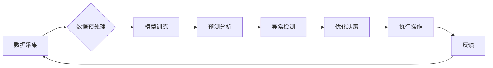

> AI, 供应链, 实时监控, 机器学习, 深度学习, 预见性分析, 优化

## 1. 背景介绍

随着电商平台的蓬勃发展，供应链管理已成为电商平台的核心竞争力之一。供应链的复杂性和动态性使得传统的管理方式难以满足实时监控和快速响应的需求。人工智能（AI）技术的快速发展为供应链管理带来了新的机遇，其强大的数据分析、预测和优化能力能够有效提升供应链的效率、透明度和可持续性。

电商平台的供应链通常包含多个环节，例如采购、生产、仓储、配送和退货等。每个环节都涉及大量的数据，包括商品信息、库存水平、运输状态、客户需求等。传统的供应链管理方式往往依赖于人工干预和报表分析，难以及时发现问题和进行优化。

AI技术能够通过对海量数据的分析，识别出隐藏的模式和趋势，从而实现对供应链的实时监控和预测。例如，AI算法可以预测商品的销售量、库存的波动、运输的延误等，帮助电商平台提前做好准备，避免库存积压、缺货等问题。

## 2. 核心概念与联系

### 2.1 供应链实时监控

供应链实时监控是指通过实时采集和分析供应链各环节的数据，及时掌握供应链的运行状态，并根据实时信息进行决策和调整。

### 2.2 AI技术在供应链中的应用

AI技术在供应链中的应用主要包括以下几个方面：

* **预测分析:** 利用机器学习算法对历史数据进行分析，预测未来需求、库存水平、运输时间等。
* **异常检测:** 利用机器学习算法识别供应链中的异常事件，例如库存短缺、运输延误、订单错误等。
* **优化决策:** 利用AI算法优化供应链各环节的决策，例如库存管理、运输路线规划、配送策略优化等。

### 2.3 架构图



## 3. 核心算法原理 & 具体操作步骤

### 3.1 算法原理概述

在AI驱动的供应链实时监控中，常用的算法包括机器学习、深度学习、强化学习等。

* **机器学习:** 通过训练模型，从数据中学习规律，并用于预测、分类、聚类等任务。
* **深度学习:** 基于多层神经网络，能够学习更复杂的特征，适用于图像识别、自然语言处理等任务。
* **强化学习:** 通过试错学习，在环境中获得奖励，并不断优化策略。

### 3.2 算法步骤详解

以预测分析为例，其具体操作步骤如下：

1. **数据采集:** 收集供应链各环节的数据，例如商品信息、库存水平、销售数据、运输信息等。
2. **数据预处理:** 对采集到的数据进行清洗、转换、特征工程等处理，使其适合模型训练。
3. **模型选择:** 根据预测任务的特点选择合适的机器学习模型，例如线性回归、决策树、支持向量机等。
4. **模型训练:** 利用训练数据训练模型，并调整模型参数，使其能够准确预测目标变量。
5. **模型评估:** 利用测试数据评估模型的预测精度，并进行模型调优。
6. **模型部署:** 将训练好的模型部署到生产环境中，用于实时预测。

### 3.3 算法优缺点

**优点:**

* 能够准确预测未来需求、库存水平、运输时间等。
* 能够识别供应链中的异常事件，及时进行干预。
* 能够优化供应链各环节的决策，提高效率和效益。

**缺点:**

* 需要大量的数据进行训练，数据质量对模型精度有很大影响。
* 模型训练需要一定的技术和资源投入。
* 模型需要定期更新，以适应不断变化的市场环境。

### 3.4 算法应用领域

AI算法在供应链管理中的应用领域非常广泛，例如：

* **库存管理:** 预测商品需求，优化库存水平，避免库存积压和缺货。
* **运输管理:** 优化运输路线，提高运输效率，降低运输成本。
* **配送管理:** 预测配送时间，优化配送路线，提高配送效率。
* **风险管理:** 识别供应链中的风险因素，制定风险应对措施。

## 4. 数学模型和公式 & 详细讲解 & 举例说明

### 4.1 数学模型构建

在供应链实时监控中，常用的数学模型包括：

* **时间序列模型:** 用于预测未来时间段的数值，例如ARIMA模型、SARIMA模型等。
* **回归模型:** 用于建立变量之间的关系，例如线性回归、逻辑回归等。
* **神经网络模型:** 用于学习复杂的数据关系，例如多层感知机、卷积神经网络等。

### 4.2 公式推导过程

以ARIMA模型为例，其预测公式如下：

$$
y_t = c + \sum_{i=1}^p \phi_i y_{t-i} + \sum_{j=1}^q \theta_j \epsilon_{t-j} + \epsilon_t
$$

其中：

* $y_t$ 是时间t的预测值。
* $c$ 是截距项。
* $\phi_i$ 是自回归系数。
* $\theta_j$ 是移动平均系数。
* $\epsilon_t$ 是随机误差项。

### 4.3 案例分析与讲解

假设我们想要预测电商平台上某商品的未来销售量。我们可以使用ARIMA模型对历史销售数据进行分析，并根据模型的结果预测未来销售量。

例如，如果模型预测未来一周的销售量为1000件，那么电商平台可以根据这个预测结果调整库存水平，避免缺货。

## 5. 项目实践：代码实例和详细解释说明

### 5.1 开发环境搭建

* 操作系统：Windows/Linux/macOS
* Python版本：3.6+
* 必要的库：pandas, numpy, scikit-learn, matplotlib等

### 5.2 源代码详细实现

```python
import pandas as pd
from sklearn.model_selection import train_test_split
from sklearn.linear_model import LinearRegression
from sklearn.metrics import mean_squared_error

# 加载数据
data = pd.read_csv('sales_data.csv')

# 数据预处理
# ...

# 划分训练集和测试集
X_train, X_test, y_train, y_test = train_test_split(data[['feature1', 'feature2']], data['sales'], test_size=0.2)

# 创建线性回归模型
model = LinearRegression()

# 训练模型
model.fit(X_train, y_train)

# 预测测试集数据
y_pred = model.predict(X_test)

# 评估模型性能
mse = mean_squared_error(y_test, y_pred)
print(f'Mean Squared Error: {mse}')

# ...
```

### 5.3 代码解读与分析

* 代码首先加载数据，并进行必要的预处理，例如缺失值处理、特征工程等。
* 然后使用`train_test_split`函数将数据划分成训练集和测试集。
* 创建线性回归模型，并使用`fit`方法训练模型。
* 使用训练好的模型预测测试集数据，并使用`mean_squared_error`函数评估模型性能。

### 5.4 运行结果展示

运行结果会显示模型的预测精度，例如Mean Squared Error的值。

## 6. 实际应用场景

### 6.1 库存管理

AI可以帮助电商平台优化库存管理，预测商品需求，避免库存积压和缺货。例如，AI算法可以分析历史销售数据、市场趋势、促销活动等因素，预测未来商品的需求量，帮助电商平台制定合理的库存采购计划。

### 6.2 运输管理

AI可以帮助电商平台优化运输管理，提高运输效率，降低运输成本。例如，AI算法可以分析运输路线、交通状况、车辆调度等因素，规划最优的运输路线，并根据实时路况调整运输计划，避免运输延误。

### 6.3 配送管理

AI可以帮助电商平台优化配送管理，提高配送效率，提升客户满意度。例如，AI算法可以预测配送时间、客户需求、配送员路线等因素，优化配送路线，并根据实时情况调整配送计划，确保及时送达客户手中。

### 6.4 未来应用展望

随着AI技术的不断发展，其在电商平台供应链实时监控中的应用场景将更加广泛。例如：

* **个性化推荐:** AI可以根据客户的购买历史、浏览记录等数据，提供个性化的商品推荐，提高客户的购物体验。
* **智能客服:** AI可以帮助电商平台提供智能客服服务，解答客户的疑问，解决客户的问题。
* **自动化的供应链管理:** AI可以实现供应链管理的自动化，例如自动生成采购订单、自动安排运输计划等，提高供应链的效率和准确性。

## 7. 工具和资源推荐

### 7.1 学习资源推荐

* **书籍:**
    * 《深度学习》
    * 《机器学习实战》
    * 《Python机器学习》
* **在线课程:**
    * Coursera
    * edX
    * Udacity

### 7.2 开发工具推荐

* **Python:** 
    * pandas
    * numpy
    * scikit-learn
    * TensorFlow
    * PyTorch
* **云平台:**
    * AWS
    * Azure
    * Google Cloud

### 7.3 相关论文推荐

* **论文:**
    * "Deep Learning for Supply Chain Management"
    * "A Survey of Machine Learning Applications in Supply Chain Management"
    * "Reinforcement Learning for Supply Chain Optimization"

## 8. 总结：未来发展趋势与挑战

### 8.1 研究成果总结

AI技术在电商平台供应链实时监控中的应用取得了显著的成果，能够有效提升供应链的效率、透明度和可持续性。

### 8.2 未来发展趋势

未来，AI技术在电商平台供应链实时监控中的应用将更加深入和广泛，主要发展趋势包括：

* **更强大的AI算法:** 随着AI技术的不断发展，将出现更强大的AI算法，能够更好地处理复杂的数据和问题。
* **更广泛的应用场景:** AI技术将应用于供应链管理的更多环节，例如采购、生产、仓储、配送等。
* **更智能的供应链:** AI技术将使供应链更加智能化，能够自动学习、优化和调整，提高供应链的效率和弹性。

### 8.3 面临的挑战

尽管AI技术在电商平台供应链实时监控中的应用前景广阔，但也面临一些挑战：

* **数据质量:** AI算法的精度依赖于数据的质量，而供应链数据往往存在不完整、不准确、格式不统一等问题。
* **模型解释性:** 许多AI算法是黑箱模型，难以解释其决策过程，这可能会导致信任问题。
* **伦理问题:** AI技术的应用可能会带来一些伦理问题，例如算法偏见、数据隐私等。

### 8.4 研究展望

未来，需要进一步研究如何提高AI算法的鲁棒性、解释性和安全性，以及如何解决AI技术应用中的伦理问题。


## 9. 附录：常见问题与解答

**Q1: AI技术在供应链实时监控中的应用有哪些优势？**

**A1:** AI技术在供应链实时监控中的应用优势主要体现在以下几个方面：

* **提高预测精度:** AI算法能够分析海量数据，识别出隐藏的模式和趋势，从而提高预测精度。
* **实时监控:** AI技术能够实时采集和分析供应链数据，及时发现问题和进行调整。
* **优化决策:** AI算法能够优化供应链各环节的决策，提高效率和效益。

**Q2: 如何评估AI模型的性能？**

**A2:** AI模型的性能可以通过多种指标进行