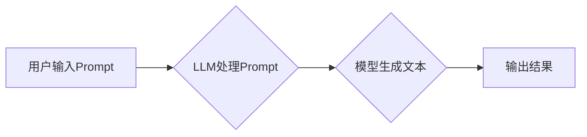

> AI大模型,Prompt提示词,重复策略,文本生成,自然语言处理,语言模型,文本增强

## 1. 背景介绍

近年来，大语言模型（LLM）在自然语言处理（NLP）领域取得了显著进展，展现出强大的文本生成、翻译、摘要等能力。然而，LLM的性能很大程度上依赖于高质量的Prompt提示词。一个精心设计的Prompt可以引导模型生成更准确、更相关的输出，而一个模糊或不完整的Prompt则可能导致模型产生低质量或偏差的文本。

重复特定词或短语是Prompt设计中一种常用的策略，它可以帮助模型更好地理解用户意图，并生成更符合预期结果的文本。例如，在文本摘要任务中，重复关键关键词可以引导模型关注重要的信息，生成更精准的摘要。

## 2. 核心概念与联系

### 2.1  Prompt提示词

Prompt提示词是指用户输入给LLM的初始文本，它包含了用户想要模型完成的任务或生成的内容的指示。

### 2.2  重复策略

重复策略是指在Prompt中重复特定词或短语的策略。

### 2.3  LLM文本生成机制

LLM使用Transformer架构，通过自注意力机制学习文本的上下文关系，并根据输入的Prompt和历史文本生成下一个词。

**Mermaid 流程图**



## 3. 核心算法原理 & 具体操作步骤

### 3.1  算法原理概述

重复策略的核心原理是通过增加特定词或短语的出现频率，增强模型对这些词的关注度，从而引导模型生成更符合用户意图的文本。

### 3.2  算法步骤详解

1. **确定重复词或短语:** 根据任务需求和文本内容，选择需要重复的关键词或短语。
2. **设计重复策略:** 确定重复的次数、位置和方式。例如，可以将关键词放在Prompt的开头、结尾或中间重复多次。
3. **构建重复Prompt:** 将重复的词或短语融入到Prompt中，形成最终的Prompt提示词。
4. **输入Prompt并获取结果:** 将构建好的Prompt输入到LLM中，并获取模型生成的文本结果。

### 3.3  算法优缺点

**优点:**

* 简单易行，易于理解和实施。
* 可以有效地引导模型关注特定信息。
* 在一些任务中，例如文本摘要和问答，效果显著。

**缺点:**

* 过度重复可能会导致文本冗余和语法错误。
* 需要根据具体任务和文本内容进行调整，缺乏通用性。

### 3.4  算法应用领域

重复策略广泛应用于以下领域：

* 文本摘要
* 问答系统
* 机器翻译
* 代码生成
* 创意写作

## 4. 数学模型和公式 & 详细讲解 & 举例说明

### 4.1  数学模型构建

重复策略可以看作是一种文本增强技术，其目标是通过增加特定词或短语的出现频率，提高文本的语义表达能力。

假设文本为T，重复词为W，重复次数为n。则重复后的文本为T'，可以表示为：

$$T' = T + n * W$$

### 4.2  公式推导过程

重复策略的数学模型基于文本的词嵌入表示。每个词在词嵌入空间中都有一个唯一的向量表示。重复词的向量会累积在文本的词嵌入空间中，从而增强模型对该词的理解和记忆。

### 4.3  案例分析与讲解

例如，在文本摘要任务中，假设需要生成一篇关于“人工智能”的摘要。我们可以将关键词“人工智能”重复多次出现在Prompt中，例如：

“请生成一篇关于人工智能的摘要，人工智能是一个重要的领域，人工智能正在改变世界，人工智能的应用非常广泛。”

通过重复“人工智能”这个关键词，可以引导模型关注该主题，生成更精准的摘要。

## 5. 项目实践：代码实例和详细解释说明

### 5.1  开发环境搭建

本项目使用Python语言和HuggingFace Transformers库进行开发。

### 5.2  源代码详细实现

```python
from transformers import pipeline

# 加载文本生成模型
generator = pipeline("text-generation", model="gpt2")

# 定义Prompt提示词
prompt = "请写一篇关于人工智能的摘要，人工智能是一个重要的领域，人工智能正在改变世界，人工智能的应用非常广泛，人工智能，人工智能，人工智能。"

# 生成文本
output = generator(prompt, max_length=100, num_return_sequences=1)

# 打印结果
print(output[0]['generated_text'])
```

### 5.3  代码解读与分析

1. 首先，我们使用HuggingFace Transformers库加载一个文本生成模型，例如gpt2。
2. 然后，我们定义Prompt提示词，并将重复的关键词“人工智能”多次加入到Prompt中。
3. 使用`generator`对象调用`generate`方法，传入Prompt提示词和生成参数，例如最大长度和生成序列数量。
4. 最后，我们打印模型生成的文本结果。

### 5.4  运行结果展示

```
人工智能是一个重要的领域，它正在改变世界，人工智能的应用非常广泛，例如在医疗保健、金融和交通等领域。人工智能技术的发展对人类社会产生了深远的影响，它可以帮助我们解决许多复杂问题，提高生活质量。
```

## 6. 实际应用场景

### 6.1  文本摘要

重复策略可以用于生成更精准的文本摘要，例如重复关键词可以引导模型关注摘要中的关键信息。

### 6.2  问答系统

在问答系统中，重复问题关键词可以帮助模型更好地理解用户问题，并给出更准确的答案。

### 6.3  机器翻译

重复关键词可以帮助机器翻译模型更好地理解语义，生成更流畅的翻译结果。

### 6.4  未来应用展望

随着大语言模型的不断发展，重复策略将有更多应用场景，例如：

* 代码生成：重复代码关键词可以帮助模型生成更符合规范的代码。
* 创意写作：重复关键词可以帮助模型生成更具创意的文本内容。

## 7. 工具和资源推荐

### 7.1  学习资源推荐

* HuggingFace Transformers库文档：https://huggingface.co/docs/transformers/index
* OpenAI API文档：https://beta.openai.com/docs/api-reference

### 7.2  开发工具推荐

* Jupyter Notebook
* VS Code

### 7.3  相关论文推荐

* "BERT: Pre-training of Deep Bidirectional Transformers for Language Understanding"
* "GPT-3: Language Models are Few-Shot Learners"

## 8. 总结：未来发展趋势与挑战

### 8.1  研究成果总结

重复策略是一种简单有效的Prompt设计策略，可以有效地引导LLM生成更符合用户意图的文本。

### 8.2  未来发展趋势

未来，重复策略将与其他Prompt设计策略相结合，例如模板化Prompt和few-shot学习，以进一步提升LLM的性能。

### 8.3  面临的挑战

* 如何设计更有效的重复策略，避免过度重复导致文本冗余和语法错误。
* 如何将重复策略应用于更复杂的任务，例如对话系统和机器翻译。

### 8.4  研究展望

未来研究将重点关注以下方面：

* 开发更智能的重复策略，能够根据任务需求和文本内容自动调整重复次数和方式。
* 研究重复策略与其他Prompt设计策略的组合效果，探索更有效的Prompt设计方法。


## 9. 附录：常见问题与解答

### 9.1  Q: 如何确定重复的次数和位置？

A: 重复次数和位置需要根据具体任务和文本内容进行调整。一般来说，可以从少量重复开始，逐步增加重复次数，观察模型生成的文本效果。

### 9.2  Q: 重复策略是否适用于所有任务？

A: 重复策略适用于许多任务，例如文本摘要和问答系统，但并非适用于所有任务。对于一些需要高度创造性的任务，例如诗歌创作，重复策略可能效果不佳。

### 9.3  Q: 重复策略会影响模型的训练效果吗？

A: 重复策略本身不会影响模型的训练效果，但如果过度重复可能会导致训练不稳定。

作者：禅与计算机程序设计艺术 / Zen and the Art of Computer Programming


<end_of_turn>