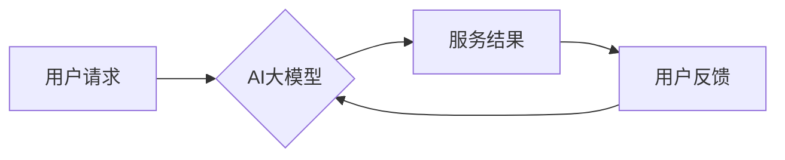

> AI大模型，创业，盈利模式，商业应用，技术趋势，市场分析，案例研究

## 1. 背景介绍

近年来，人工智能（AI）技术取得了飞速发展，特别是大规模语言模型（LLM）的出现，如GPT-3、LaMDA等，展现出强大的文本生成、理解和翻译能力，为各行各业带来了革命性的变革。 

随着AI技术的不断进步，越来越多的创业者看到了AI大模型的巨大商业潜力，纷纷涌入这个领域。然而，仅仅拥有先进的AI技术还不够，如何将AI大模型转化为可持续的盈利模式，是创业者面临的重大挑战。

## 2. 核心概念与联系

**2.1 AI大模型概述**

AI大模型是指训练规模庞大、参数数量众多的深度学习模型，通常拥有数十亿甚至数千亿个参数。它们通过学习海量数据，能够掌握复杂的语言规律和知识结构，从而实现各种高级的AI应用，例如：

* 文本生成：创作小说、诗歌、剧本等；
* 语言翻译：实现跨语言的准确翻译；
* 聊天机器人：构建智能对话系统，提供人机交互体验；
* 代码生成：自动生成代码，提高开发效率；
* 数据分析：挖掘数据中的隐藏模式和趋势。

**2.2 盈利模式概述**

AI大模型的盈利模式主要可以分为以下几类：

* **订阅服务:** 提供API接口，用户按需付费使用AI大模型的服务，例如文本生成、翻译等。
* **平台服务:** 建立AI大模型平台，为开发者提供开发工具、数据资源和应用市场，从中获取平台服务费。
* **定制服务:** 为企业提供定制化的AI解决方案，例如智能客服、个性化推荐等。
* **数据服务:** 收集和处理用户数据，为企业提供数据分析和洞察服务。

**2.3 核心架构**



## 3. 核心算法原理 & 具体操作步骤

**3.1 算法原理概述**

AI大模型的核心算法是深度学习，特别是Transformer架构。Transformer模型通过自注意力机制，能够捕捉文本序列中的长距离依赖关系，从而实现更准确的文本理解和生成。

**3.2 算法步骤详解**

1. **数据预处理:** 将原始文本数据进行清洗、分词、标记等预处理操作，使其适合模型训练。
2. **模型训练:** 使用深度学习框架（如TensorFlow、PyTorch）训练Transformer模型，通过反向传播算法不断优化模型参数。
3. **模型评估:** 使用测试数据集评估模型的性能，例如准确率、困惑度等指标。
4. **模型部署:** 将训练好的模型部署到服务器或云平台，提供API接口供用户调用。

**3.3 算法优缺点**

* **优点:** 
    * 强大的文本理解和生成能力
    * 可以处理长文本序列
    * 能够捕捉文本中的复杂关系
* **缺点:** 
    * 训练成本高，需要大量计算资源
    * 模型参数量大，部署成本高
    * 容易受到训练数据偏差的影响

**3.4 算法应用领域**

* 自然语言处理：文本分类、情感分析、问答系统等
* 机器翻译：实现跨语言的准确翻译
* 文本生成：创作小说、诗歌、剧本等
* 代码生成：自动生成代码，提高开发效率
* 数据分析：挖掘数据中的隐藏模式和趋势

## 4. 数学模型和公式 & 详细讲解 & 举例说明

**4.1 数学模型构建**

Transformer模型的核心是自注意力机制，其数学模型可以表示为：

$$
Attention(Q, K, V) = \frac{exp(Q \cdot K^T / \sqrt{d_k})}{exp(Q \cdot K^T / \sqrt{d_k})} \cdot V
$$

其中：

* $Q$：查询矩阵
* $K$：键矩阵
* $V$：值矩阵
* $d_k$：键向量的维度

**4.2 公式推导过程**

自注意力机制通过计算查询向量与键向量的点积，来衡量它们之间的相关性。点积结果经过softmax归一化，得到每个键向量的权重，然后将权重与值向量相乘，得到最终的注意力输出。

**4.3 案例分析与讲解**

假设我们有一个句子“我爱吃苹果”，将其转换为词向量表示，则查询向量、键向量和值向量分别为：

* $Q$： [0.2, 0.3, 0.1]
* $K$： [0.1, 0.2, 0.3]
* $V$： [0.4, 0.5, 0.6]

通过计算点积和softmax归一化，我们可以得到每个词向量之间的注意力权重，例如，“我”与“苹果”之间的注意力权重较高，表明它们在语义上相关。

## 5. 项目实践：代码实例和详细解释说明

**5.1 开发环境搭建**

* Python 3.7+
* TensorFlow/PyTorch
* CUDA/cuDNN

**5.2 源代码详细实现**

```python
import tensorflow as tf

# 定义Transformer模型
class Transformer(tf.keras.Model):
    def __init__(self, vocab_size, embedding_dim, num_heads, num_layers):
        super(Transformer, self).__init__()
        self.embedding = tf.keras.layers.Embedding(vocab_size, embedding_dim)
        self.transformer_layers = [
            tf.keras.layers.MultiHeadAttention(num_heads=num_heads, key_dim=embedding_dim)
            for _ in range(num_layers)
        ]
        self.dense = tf.keras.layers.Dense(vocab_size)

    def call(self, inputs):
        # Embedding
        embeddings = self.embedding(inputs)
        # Transformer layers
        for layer in self.transformer_layers:
            embeddings = layer(embeddings)
        # Output layer
        outputs = self.dense(embeddings)
        return outputs

# 实例化模型
model = Transformer(vocab_size=10000, embedding_dim=512, num_heads=8, num_layers=6)

# 训练模型
# ...

```

**5.3 代码解读与分析**

* `Transformer`类定义了Transformer模型的结构，包括嵌入层、多头注意力层和全连接层。
* `embedding`层将词向量表示为稠密的向量。
* `transformer_layers`列表包含多个多头注意力层，用于捕捉文本序列中的长距离依赖关系。
* `dense`层将最终的隐藏状态映射到输出词汇表的大小。

**5.4 运行结果展示**

训练好的模型可以用于各种文本生成任务，例如：

* 续写故事
* 翻译文本
* 回答问题

## 6. 实际应用场景

**6.1 文本生成**

* 自动创作小说、诗歌、剧本等
* 生成营销文案、广告语等
* 自动生成代码注释、文档等

**6.2 语言翻译**

* 实现跨语言的准确翻译
* 提供实时语音翻译服务
* 辅助学习外语

**6.3 聊天机器人**

* 构建智能对话系统，提供人机交互体验
* 用于客服、咨询、娱乐等场景

**6.4 数据分析**

* 挖掘数据中的隐藏模式和趋势
* 生成数据报告和可视化图表
* 辅助决策分析

**6.5 未来应用展望**

* 个性化教育：根据学生的学习情况，提供个性化的学习内容和辅导。
* 智能医疗：辅助医生诊断疾病、制定治疗方案。
* 自动驾驶：帮助车辆理解道路环境，做出安全驾驶决策。

## 7. 工具和资源推荐

**7.1 学习资源推荐**

* **书籍:**
    * 《深度学习》
    * 《自然语言处理》
    * 《Transformer模型详解》
* **在线课程:**
    * Coursera: 深度学习
    * Udacity: 自然语言处理
    * fast.ai: 深度学习

**7.2 开发工具推荐**

* **深度学习框架:** TensorFlow, PyTorch
* **文本处理工具:** NLTK, SpaCy
* **云平台:** AWS, Azure, GCP

**7.3 相关论文推荐**

* 《Attention Is All You Need》
* 《BERT: Pre-training of Deep Bidirectional Transformers for Language Understanding》
* 《GPT-3: Language Models are Few-Shot Learners》

## 8. 总结：未来发展趋势与挑战

**8.1 研究成果总结**

近年来，AI大模型取得了显著的进展，在文本生成、翻译、问答等领域展现出强大的能力。

**8.2 未来发展趋势**

* 模型规模进一步扩大，参数量达到万亿级甚至更高。
* 多模态AI模型的崛起，融合文本、图像、音频等多种数据类型。
* 更加安全、可靠、可解释的AI模型。

**8.3 面临的挑战**

* 训练成本高昂，需要大量计算资源和数据。
* 模型容易受到训练数据偏差的影响，导致结果不准确或存在偏见。
* 模型的可解释性差，难以理解模型的决策过程。

**8.4 研究展望**

* 研究更有效的训练方法，降低训练成本。
* 开发更鲁棒、更公平的AI模型。
* 加强AI模型的可解释性研究，提高模型的透明度和信任度。

## 9. 附录：常见问题与解答

**9.1 如何选择合适的AI大模型？**

选择合适的AI大模型需要根据具体的应用场景和需求进行评估，考虑模型的性能、参数量、训练成本等因素。

**9.2 如何训练自己的AI大模型？**

训练自己的AI大模型需要具备一定的深度学习知识和经验，以及强大的计算资源。

**9.3 如何部署AI大模型？**

AI大模型的部署方式多种多样，可以部署到服务器、云平台或边缘设备。

**9.4 如何评估AI大模型的性能？**

AI大模型的性能可以通过各种指标进行评估，例如准确率、困惑度、BLEU分数等。

**9.5 如何解决AI大模型的伦理问题？**

AI大模型的伦理问题需要引起全社会的关注，需要制定相应的规范和制度，确保AI技术安全、可靠、可持续发展。


作者：禅与计算机程序设计艺术 / Zen and the Art of Computer Programming 
<end_of_turn>