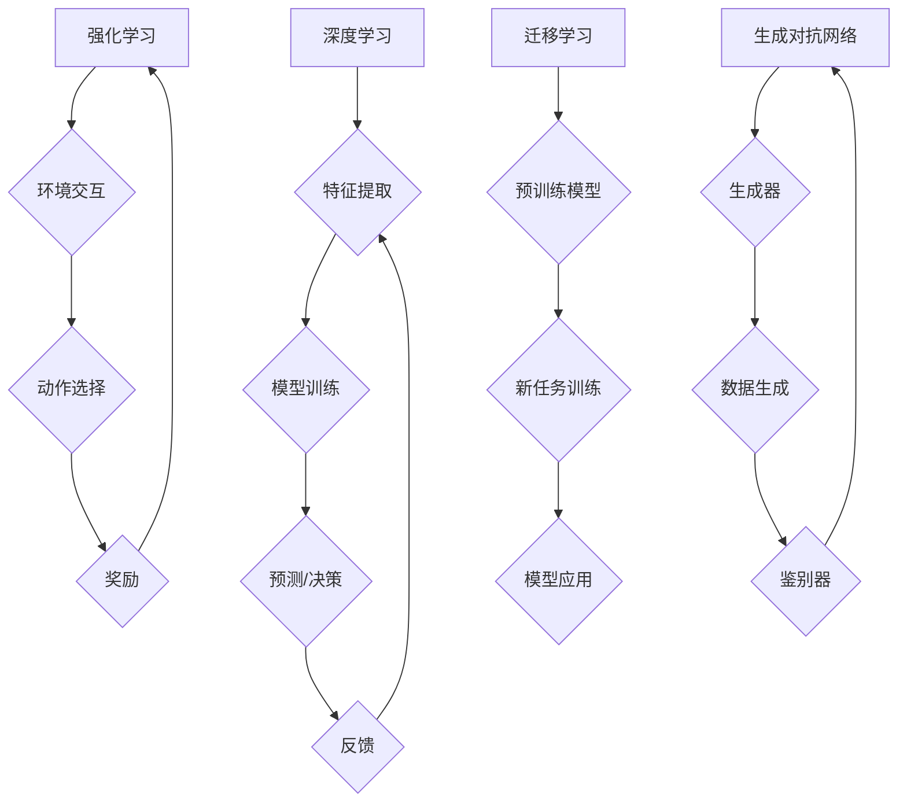

> 深度学习、强化学习、迁移学习、生成对抗网络、自然语言处理、计算机视觉、伦理问题、可解释性

## 1. 背景介绍

人工智能（AI）正以惊人的速度发展，从简单的规则系统演变为能够学习、适应和解决复杂问题的智能系统。近年来，深度学习的兴起，特别是卷积神经网络（CNN）和循环神经网络（RNN）的突破，为计算机视觉和自然语言处理等领域带来了革命性的进展。

AI技术已经渗透到我们生活的方方面面，例如智能语音助手、自动驾驶汽车、个性化推荐系统等。随着技术的不断进步，AI将对社会产生更深远的影响，改变我们的工作方式、生活方式和世界观。

## 2. 核心概念与联系

**2.1 深度学习**

深度学习是一种机器学习的子领域，它利用多层神经网络来模拟人类大脑的学习过程。深度学习模型能够从海量数据中自动提取特征，从而实现更准确的预测和决策。

**2.2 强化学习**

强化学习是一种基于奖励机制的机器学习方法。在强化学习中，智能体通过与环境交互，学习如何采取最优行动以获得最大奖励。

**2.3 迁移学习**

迁移学习是一种利用已学习知识解决新任务的方法。它可以将预先训练好的模型迁移到新的领域或任务中，从而减少训练数据和时间成本。

**2.4 生成对抗网络 (GAN)**

生成对抗网络是一种由两个神经网络组成的框架，用于生成逼真的数据样本。其中一个网络（生成器）负责生成数据样本，另一个网络（鉴别器）负责判断样本的真实性。两者相互竞争，最终生成器能够生成与真实数据相似的样本。

**2.5 自然语言处理 (NLP)**

自然语言处理是指计算机理解和处理人类语言的技术。NLP领域的研究包括文本分类、情感分析、机器翻译等。

**2.6 计算机视觉 (CV)**

计算机视觉是指计算机能够“看”和理解图像的技术。CV领域的研究包括图像识别、物体检测、图像分割等。

**2.7 伦理问题**

随着AI技术的快速发展，其伦理问题也日益受到关注。例如，AI算法的偏见、隐私保护、责任归属等问题都需要认真思考和解决。

**2.8 可解释性**

AI模型的决策过程通常是复杂的，难以理解。提高AI模型的可解释性，使人类能够理解模型的决策逻辑，对于信任和应用AI至关重要。

**Mermaid 流程图**



## 3. 核心算法原理 & 具体操作步骤

### 3.1 算法原理概述

深度学习算法的核心是多层神经网络。神经网络由多个层组成，每层包含多个神经元。每个神经元接收来自上一层的输入，并通过激活函数进行处理，然后将处理后的结果传递给下一层。

深度学习算法通过训练神经网络来学习数据中的模式和关系。训练过程 involves 使用训练数据来调整神经网络的权重和偏差，使得网络能够准确地预测或分类数据。

### 3.2 算法步骤详解

1. **数据预处理:** 将原始数据转换为深度学习模型可以理解的格式，例如归一化、编码等。
2. **网络结构设计:** 根据任务需求设计神经网络的结构，包括层数、神经元数量、激活函数等。
3. **权重初始化:** 为神经网络的权重和偏差赋予初始值。
4. **前向传播:** 将输入数据通过神经网络进行前向传播，得到输出结果。
5. **损失函数计算:** 计算模型输出与真实值的差异，即损失函数的值。
6. **反向传播:** 利用梯度下降算法反向传播损失函数的梯度，更新神经网络的权重和偏差。
7. **迭代训练:** 重复步骤4-6，直到模型的性能达到预期的水平。

### 3.3 算法优缺点

**优点:**

* 能够自动提取特征，无需人工特征工程。
* 能够处理海量数据，学习复杂模式。
* 在图像识别、自然语言处理等领域取得了突破性进展。

**缺点:**

* 训练数据量大，计算资源消耗高。
* 模型解释性差，难以理解模型的决策逻辑。
* 容易受到数据偏差的影响，导致模型偏见。

### 3.4 算法应用领域

* **计算机视觉:** 图像识别、物体检测、图像分割、人脸识别等。
* **自然语言处理:** 文本分类、情感分析、机器翻译、对话系统等。
* **语音识别:** 语音转文本、语音助手等。
* **推荐系统:** 商品推荐、内容推荐等。
* **医疗诊断:** 病情诊断、疾病预测等。

## 4. 数学模型和公式 & 详细讲解 & 举例说明

### 4.1 数学模型构建

深度学习模型的数学基础是神经网络。神经网络可以看作是一个复杂的函数，其输入是数据样本，输出是预测结果。

神经网络的输出可以通过以下公式计算：

$$
y = f(W x + b)
$$

其中：

* $y$ 是模型的输出
* $x$ 是输入数据样本
* $W$ 是权重矩阵
* $b$ 是偏差向量
* $f$ 是激活函数

### 4.2 公式推导过程

激活函数的选择对神经网络的性能有重要影响。常用的激活函数包括 sigmoid 函数、ReLU 函数、tanh 函数等。

**sigmoid 函数:**

$$
f(x) = \frac{1}{1 + e^{-x}}
$$

**ReLU 函数:**

$$
f(x) = max(0, x)
$$

**tanh 函数:**

$$
f(x) = \frac{e^x - e^{-x}}{e^x + e^{-x}}
$$

### 4.3 案例分析与讲解

**举例说明:**

假设我们有一个简单的线性回归问题，目标是预测房价。我们可以使用一个单层神经网络来解决这个问题。

输入数据包括房屋面积、房间数量等特征。输出是房价。

我们可以使用梯度下降算法来训练神经网络，调整权重和偏差，使得模型能够准确地预测房价。

## 5. 项目实践：代码实例和详细解释说明

### 5.1 开发环境搭建

* Python 3.x
* TensorFlow 或 PyTorch 等深度学习框架
* Jupyter Notebook 或 VS Code 等代码编辑器

### 5.2 源代码详细实现

```python
import tensorflow as tf

# 定义模型结构
model = tf.keras.models.Sequential([
    tf.keras.layers.Dense(64, activation='relu', input_shape=(784,)),
    tf.keras.layers.Dense(10, activation='softmax')
])

# 编译模型
model.compile(optimizer='adam',
              loss='sparse_categorical_crossentropy',
              metrics=['accuracy'])

# 训练模型
model.fit(x_train, y_train, epochs=10)

# 评估模型
loss, accuracy = model.evaluate(x_test, y_test)
print('Test loss:', loss)
print('Test accuracy:', accuracy)
```

### 5.3 代码解读与分析

* **模型结构:** 该代码定义了一个简单的多层感知机模型，包含两层全连接层。第一层有 64 个神经元，使用 ReLU 激活函数。第二层有 10 个神经元，使用 softmax 激活函数，用于分类任务。
* **模型编译:** 使用 Adam 优化器、交叉熵损失函数和准确率作为评估指标。
* **模型训练:** 使用训练数据训练模型 10 个 epochs。
* **模型评估:** 使用测试数据评估模型的性能。

### 5.4 运行结果展示

训练完成后，可以查看模型的训练和测试损失以及准确率。

## 6. 实际应用场景

### 6.1 智能语音助手

例如 Siri、Alexa 和 Google Assistant 等智能语音助手，利用自然语言处理技术理解用户的语音指令，并提供相应的服务。

### 6.2 自动驾驶汽车

自动驾驶汽车利用计算机视觉和强化学习技术感知周围环境，并做出驾驶决策。

### 6.3 个性化推荐系统

例如 Netflix、Amazon 和 Spotify 等平台，利用机器学习技术分析用户的行为数据，推荐个性化的内容。

### 6.4 医疗诊断

AI 算法可以辅助医生诊断疾病，例如分析医学影像数据，识别病灶。

### 6.5 金融风险管理

AI 算法可以分析金融数据，识别潜在的风险，帮助金融机构进行风险管理。

### 6.4 未来应用展望

AI 技术将继续发展，并应用于更多领域，例如：

* **个性化教育:** 根据学生的学习情况提供个性化的学习方案。
* **精准医疗:** 根据患者的基因信息和病史提供个性化的治疗方案。
* **智能制造:** 利用 AI 算法优化生产流程，提高生产效率。
* **城市智能化:** 利用 AI 算法管理城市交通、能源、环境等。

## 7. 工具和资源推荐

### 7.1 学习资源推荐

* **在线课程:** Coursera、edX、Udacity 等平台提供深度学习和 AI 相关的在线课程。
* **书籍:** 《深度学习》、《人工智能：一个现代方法》等书籍。
* **博客和论坛:** TensorFlow、PyTorch 等深度学习框架的官方博客和论坛。

### 7.2 开发工具推荐

* **TensorFlow:** Google 开发的开源深度学习框架。
* **PyTorch:** Facebook 开发的开源深度学习框架。
* **Keras:** TensorFlow 上的深度学习 API，易于使用。

### 7.3 相关论文推荐

* **《ImageNet Classification with Deep Convolutional Neural Networks》**
* **《Deep Learning》**
* **《Attention Is All You Need》**

## 8. 总结：未来发展趋势与挑战

### 8.1 研究成果总结

近年来，AI 技术取得了显著进展，特别是深度学习在计算机视觉、自然语言处理等领域取得了突破性进展。

### 8.2 未来发展趋势

* **模型规模和复杂度提升:** 模型参数数量和层数将继续增加，从而提高模型的性能。
* **算法创新:** 新的 AI 算法将不断涌现，例如联邦学习、自监督学习等。
* **跨模态学习:** 将不同模态的数据（例如文本、图像、音频）融合在一起，实现更全面的理解。
* **可解释性增强:** 研究如何提高 AI 模型的可解释性，使人类能够更好地理解模型的决策逻辑。

### 8.3 面临的挑战

* **数据获取和隐私保护:** AI 算法需要大量数据进行训练，如何获取高质量数据并保护用户隐私是一个挑战。
* **计算资源消耗:** 训练大型 AI 模型需要大量的计算资源，这会带来能源消耗和成本问题。
* **伦理问题:** AI 算法的偏见、透明度和责任归属等伦理问题需要认真思考和解决。

### 8.4 研究展望

未来，AI 研究将继续朝着更智能、更安全、更可解释的方向发展。


## 9. 附录：常见问题与解答

**Q1: 深度学习和机器学习有什么区别？**

**A1:** 机器学习是人工智能的一个子领域，它利用算法从数据中学习模式。深度学习是机器学习的一种特殊形式，它使用多层神经网络来模拟人类大脑的学习过程。

**Q2: 如何选择合适的深度学习框架？**

**A2:** TensorFlow 和 PyTorch 是两个流行的