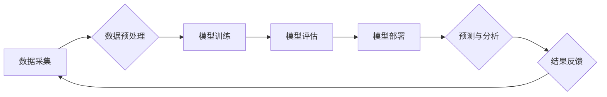

> AI计算、深度学习、神经网络、云计算、大数据、机器学习、算法优化

## 1. 背景介绍

人工智能（AI）正以惊人的速度发展，深刻地改变着我们生活的方方面面。从自动驾驶汽车到智能语音助手，从医疗诊断到金融风险评估，AI技术的应用日益广泛。而推动AI发展的关键力量之一就是AI计算。

传统的计算模型难以满足AI算法的复杂需求，而AI计算则通过专门设计的硬件和软件架构，为深度学习、机器学习等AI算法提供了强大的计算能力。随着云计算、大数据等技术的蓬勃发展，AI计算迎来了新的机遇。

## 2. 核心概念与联系

**2.1 AI计算的概念**

AI计算是指专门为人工智能算法设计的计算模型和体系结构。它不同于传统的通用计算，更侧重于处理海量数据、进行复杂的模式识别和决策推理。

**2.2 AI计算与深度学习的关系**

深度学习是AI领域最热门的研究方向之一，它利用多层神经网络来模拟人类大脑的学习过程。深度学习算法对计算资源要求极高，而AI计算正是为深度学习提供强大计算能力的基石。

**2.3 AI计算与云计算的关系**

云计算提供了弹性、可扩展的计算资源，为AI计算的发展提供了重要的基础设施支持。AI计算平台通常部署在云端，可以根据实际需求动态分配计算资源，降低成本，提高效率。

**2.4 AI计算与大数据的联系**

深度学习算法需要大量的训练数据才能达到最佳性能。大数据时代，海量数据为AI计算提供了丰富的训练素材，推动了AI算法的不断进步。

**2.5 AI计算架构**



## 3. 核心算法原理 & 具体操作步骤

### 3.1  算法原理概述

深度学习算法的核心是多层神经网络。神经网络由多个节点（神经元）组成，每个节点都连接着其他节点，并通过权重来控制信息传递。通过训练，神经网络可以学习到数据中的模式和规律，从而实现预测、分类、识别等任务。

### 3.2  算法步骤详解

1. **数据预处理:** 将原始数据清洗、转换、规范化，使其适合深度学习算法的训练。
2. **模型构建:** 根据任务需求选择合适的深度学习模型架构，例如卷积神经网络（CNN）、循环神经网络（RNN）等。
3. **模型训练:** 使用训练数据训练模型，通过调整神经网络的权重，使模型的预测结果与真实值尽可能接近。
4. **模型评估:** 使用测试数据评估模型的性能，例如准确率、召回率、F1-score等。
5. **模型部署:** 将训练好的模型部署到实际应用场景中，用于预测、分类、识别等任务。

### 3.3  算法优缺点

**优点:**

* 能够学习复杂的数据模式，实现高精度预测。
* 具有强大的泛化能力，可以应用于多种不同的任务。

**缺点:**

* 训练数据量要求高，需要大量的计算资源。
* 模型解释性较差，难以理解模型的决策过程。

### 3.4  算法应用领域

* **图像识别:** 人脸识别、物体检测、图像分类等。
* **自然语言处理:** 文本分类、机器翻译、语音识别等。
* **医疗诊断:** 疾病预测、影像分析、药物研发等。
* **金融风险评估:** 欺诈检测、信用评分、投资决策等。

## 4. 数学模型和公式 & 详细讲解 & 举例说明

### 4.1  数学模型构建

深度学习算法的核心是神经网络，其数学模型可以表示为多层感知机（MLP）。

**4.1.1  感知机模型**

感知机是一个简单的单层神经网络，其输出值可以通过以下公式计算：

$$
y = f(w^T x + b)
$$

其中：

* $x$ 是输入向量
* $w$ 是权重向量
* $b$ 是偏置项
* $f$ 是激活函数

**4.1.2  多层感知机模型**

多层感知机由多个感知机层组成，每一层的神经元都连接着上一层的输出。其输出值可以通过逐层计算得到：

$$
h_l = f(W_l h_{l-1} + b_l)
$$

其中：

* $h_l$ 是第 $l$ 层的输出向量
* $W_l$ 是第 $l$ 层的权重矩阵
* $b_l$ 是第 $l$ 层的偏置向量
* $f$ 是激活函数

### 4.2  公式推导过程

深度学习算法的训练过程是通过优化模型参数（权重和偏置）来最小化损失函数的过程。常用的优化算法包括梯度下降法、动量法、Adam算法等。

**4.2.1  梯度下降法**

梯度下降法通过计算损失函数对模型参数的梯度，并沿着梯度负方向更新参数，从而逐渐降低损失函数的值。

$$
\theta_{t+1} = \theta_t - \eta \nabla L(\theta_t)
$$

其中：

* $\theta$ 是模型参数
* $\eta$ 是学习率
* $L$ 是损失函数
* $\nabla L$ 是损失函数对模型参数的梯度

**4.2.2  动量法**

动量法在梯度下降法的基础上，引入了动量项，可以加速收敛速度，并避免局部最优解。

$$
v_t = \beta v_{t-1} + \eta \nabla L(\theta_t)
$$

$$
\theta_{t+1} = \theta_t - v_t
$$

其中：

* $v$ 是动量项
* $\beta$ 是动量系数

### 4.3  案例分析与讲解

**4.3.1  图像分类案例**

使用卷积神经网络（CNN）对图像进行分类。

**4.3.2  文本生成案例**

使用循环神经网络（RNN）生成文本。

## 5. 项目实践：代码实例和详细解释说明

### 5.1  开发环境搭建

使用Python语言和深度学习框架TensorFlow或PyTorch进行开发。

### 5.2  源代码详细实现

```python
# 使用TensorFlow构建一个简单的多层感知机模型
import tensorflow as tf

# 定义模型输入层
input_layer = tf.keras.Input(shape=(10,))

# 定义隐藏层
hidden_layer = tf.keras.layers.Dense(64, activation='relu')(input_layer)

# 定义输出层
output_layer = tf.keras.layers.Dense(10, activation='softmax')(hidden_layer)

# 创建模型
model = tf.keras.Model(inputs=input_layer, outputs=output_layer)

# 编译模型
model.compile(optimizer='adam',
              loss='sparse_categorical_crossentropy',
              metrics=['accuracy'])

# 训练模型
model.fit(x_train, y_train, epochs=10)

# 评估模型
loss, accuracy = model.evaluate(x_test, y_test)
print('Loss:', loss)
print('Accuracy:', accuracy)
```

### 5.3  代码解读与分析

* 使用TensorFlow构建了一个简单的多层感知机模型。
* 模型输入层接收10维度的输入数据。
* 模型包含一个隐藏层和一个输出层。
* 隐藏层使用ReLU激活函数，输出层使用softmax激活函数。
* 模型使用Adam优化器，损失函数为sparse_categorical_crossentropy，评估指标为准确率。
* 模型训练了10个epochs，并使用测试数据评估模型性能。

### 5.4  运行结果展示

训练完成后，可以查看模型的损失值和准确率。

## 6. 实际应用场景

### 6.1  医疗诊断

* 使用深度学习算法分析医学影像，辅助医生诊断疾病。
* 预测患者的疾病风险，进行早期干预。

### 6.2  金融风险评估

* 检测金融交易中的欺诈行为。
* 评估客户的信用风险，为贷款决策提供支持。

### 6.3  智能客服

* 使用自然语言处理技术，构建智能客服系统，自动回复客户咨询。
* 分析客户的反馈意见，改进产品和服务。

### 6.4  未来应用展望

* **更精准的个性化推荐:** 基于用户的行为数据和偏好，提供更精准的商品、服务和内容推荐。
* **更智能的自动化决策:** 在金融、医疗、交通等领域，利用AI算法进行更智能的自动化决策，提高效率和安全性。
* **更强大的创造力:** AI算法可以辅助人类进行创作，例如生成音乐、绘画、文字等。

## 7. 工具和资源推荐

### 7.1  学习资源推荐

* **在线课程:** Coursera、edX、Udacity等平台提供丰富的深度学习课程。
* **书籍:** 《深度学习》、《动手学深度学习》等书籍是深度学习学习的经典教材。
* **博客和论坛:** TensorFlow、PyTorch等深度学习框架的官方博客和论坛提供大量学习资源和技术支持。

### 7.2  开发工具推荐

* **TensorFlow:** Google开发的开源深度学习框架，功能强大，应用广泛。
* **PyTorch:** Facebook开发的开源深度学习框架，灵活易用，适合研究和开发。
* **Keras:** TensorFlow的高层API，简化了深度学习模型的构建和训练。

### 7.3  相关论文推荐

* **《ImageNet Classification with Deep Convolutional Neural Networks》**
* **《Attention Is All You Need》**
* **《Generative Adversarial Networks》**

## 8. 总结：未来发展趋势与挑战

### 8.1  研究成果总结

AI计算在过去几年取得了显著进展，深度学习算法取得了突破性的成果，在图像识别、自然语言处理、语音识别等领域取得了领先水平。

### 8.2  未来发展趋势

* **模型规模和复杂度提升:** 未来深度学习模型将更加庞大，更加复杂，能够处理更复杂的任务。
* **硬件加速:** 特化的AI芯片将进一步提升AI计算的效率和性能。
* **边缘计算:** 将AI计算部署到边缘设备，实现更低延迟、更高效率的计算。
* **联邦学习:** 保护数据隐私的同时，实现模型训练和更新的协同。

### 8.3  面临的挑战

* **数据安全和隐私保护:** AI算法依赖于大量数据，如何保证数据安全和隐私保护是一个重要的挑战。
* **算法可解释性:** 深度学习算法的决策过程难以理解，如何提高算法的可解释性是一个重要的研究方向。
* **伦理问题:** AI技术的应用可能会带来一些伦理问题，例如算法偏见、工作岗位替代等，需要引起重视和讨论。

### 8.4  研究展望

未来，AI计算将继续朝着更智能、更安全、更可解释的方向发展，并将深刻地改变我们的生活和工作方式。


## 9. 附录：常见问题与解答

**9.1  什么是深度学习？**

深度学习是一种机器学习的子领域，它利用多层神经网络来模拟人类大脑的学习过程。

**9.2  深度学习算法有哪些？**

常见的深度学习算法包括卷积神经网络（CNN）、循环神经网络（RNN）、生成对抗网络（GAN）等。

**9.3  如何选择合适的深度学习框架？**

选择深度学习框架需要考虑项目需求、开发经验、社区支持等因素。TensorFlow和PyTorch是目前最流行的深度学习框架。

**9.4  如何评估深度学习模型的性能？**

常用的评估指标包括准确率、召回率、F1-score等。

**9.5  如何解决深度学习