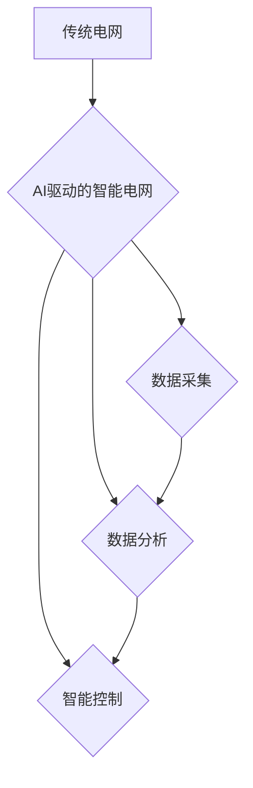

> 智能电网，AI，机器学习，预测模型，优化算法，供需平衡，能源效率

## 1. 背景介绍

随着全球能源需求的不断增长和可再生能源的快速发展，传统电网面临着越来越多的挑战。传统的电网结构是集中式供电，难以适应分布式能源的接入和负荷需求的波动性。智能电网应运而生，它利用先进的通信技术、传感器网络和数据分析技术，实现电网的自动化、智能化和可视化，从而提高电网的可靠性、效率和安全性。

人工智能（AI）作为一种新兴技术，在智能电网的建设和发展中发挥着越来越重要的作用。AI算法能够从海量电网数据中提取有价值的信息，并根据这些信息进行预测、优化和控制，从而帮助电网实现更加智能化和高效的运行。

## 2. 核心概念与联系

**2.1 智能电网的概念**

智能电网是指利用先进的通信技术、传感器网络、数据分析技术和自动化控制技术，实现电网的自动化、智能化和可视化，从而提高电网的可靠性、效率和安全性。

**2.2 AI在智能电网中的应用**

AI技术在智能电网中的应用主要集中在以下几个方面：

* **负荷预测:** 利用AI算法分析历史负荷数据、天气预报等信息，预测未来电网负荷需求。
* **电力调度优化:** 利用AI算法优化电力调度方案，提高电力系统运行效率和经济性。
* **故障诊断与预警:** 利用AI算法分析电网运行数据，识别故障模式并进行预警，提高电网的可靠性。
* **分布式能源管理:** 利用AI算法协调分布式能源的接入和运行，提高能源利用效率。
* **智能电表和用户交互:** 利用AI算法实现智能电表的功能，提供个性化的用电服务和用户交互。

**2.3 AI与智能电网的联系**

AI技术为智能电网的建设和发展提供了强大的技术支撑。AI算法能够从海量电网数据中提取有价值的信息，并根据这些信息进行预测、优化和控制，从而帮助电网实现更加智能化和高效的运行。



## 3. 核心算法原理 & 具体操作步骤

**3.1 算法原理概述**

在智能电网中，AI算法广泛应用于负荷预测、电力调度优化、故障诊断等领域。常用的AI算法包括机器学习、深度学习、强化学习等。

* **机器学习:** 通过训练模型，从数据中学习规律，并对新数据进行预测或分类。
* **深度学习:** 基于多层神经网络，能够学习更复杂的特征，适用于处理海量数据和复杂问题。
* **强化学习:** 通过试错学习，在环境中获得奖励，并不断优化策略，适用于控制和决策问题。

**3.2 算法步骤详解**

以负荷预测为例，其算法步骤如下：

1. **数据收集:** 收集历史负荷数据、天气预报数据、节日信息等相关数据。
2. **数据预处理:** 对数据进行清洗、转换、特征工程等处理，使其适合模型训练。
3. **模型选择:** 根据数据特点和预测需求，选择合适的机器学习模型，例如线性回归、支持向量机、决策树等。
4. **模型训练:** 利用训练数据训练模型，调整模型参数，使其能够准确预测负荷。
5. **模型评估:** 利用测试数据评估模型的预测精度，并进行模型调优。
6. **模型部署:** 将训练好的模型部署到生产环境中，实时预测负荷需求。

**3.3 算法优缺点**

* **优点:** 能够准确预测负荷需求，提高电力调度效率，降低运营成本。
* **缺点:** 需要大量数据进行训练，模型训练时间较长，对数据质量要求较高。

**3.4 算法应用领域**

* **电力系统规划:** 预测未来电力需求，指导电网建设和规划。
* **电力调度优化:** 根据负荷预测结果，优化电力调度方案，提高电力系统运行效率。
* **储能系统管理:** 根据负荷预测结果，优化储能系统运行策略，提高能源利用效率。

## 4. 数学模型和公式 & 详细讲解 & 举例说明

**4.1 数学模型构建**

负荷预测模型可以构建为一个回归模型，目标是预测未来时间段的负荷值。

**4.2 公式推导过程**

假设负荷预测模型为线性回归模型，其数学表达式为：

$$
P(t) = \beta_0 + \beta_1 * T(t) + \beta_2 * W(t) + \beta_3 * H(t) + \epsilon(t)
$$

其中：

* $P(t)$: 未来时间段 $t$ 的负荷值
* $\beta_0$, $\beta_1$, $\beta_2$, $\beta_3$: 模型参数
* $T(t)$: 未来时间段 $t$ 的时间特征 (例如小时、日期)
* $W(t)$: 未来时间段 $t$ 的天气特征 (例如温度、湿度)
* $H(t)$: 未来时间段 $t$ 的节日信息特征
* $\epsilon(t)$: 随机误差

**4.3 案例分析与讲解**

假设要预测未来一天的负荷值，可以收集历史负荷数据、天气预报数据和节日信息数据，并将其作为模型训练数据。通过训练模型，可以得到模型参数 $\beta_0$, $\beta_1$, $\beta_2$, $\beta_3$。然后，利用这些参数和未来一天的时间特征、天气特征和节日信息特征，可以预测未来一天的负荷值。

## 5. 项目实践：代码实例和详细解释说明

**5.1 开发环境搭建**

* 操作系统: Ubuntu 20.04
* Python 版本: 3.8
* 必要的库: pandas, numpy, scikit-learn, matplotlib

**5.2 源代码详细实现**

```python
import pandas as pd
from sklearn.linear_model import LinearRegression
from sklearn.model_selection import train_test_split
from sklearn.metrics import mean_squared_error

# 加载数据
data = pd.read_csv('load_data.csv')

# 数据预处理
# ...

# 划分训练集和测试集
X_train, X_test, y_train, y_test = train_test_split(data[['T', 'W', 'H']], data['P'], test_size=0.2)

# 创建线性回归模型
model = LinearRegression()

# 训练模型
model.fit(X_train, y_train)

# 预测测试集数据
y_pred = model.predict(X_test)

# 评估模型性能
mse = mean_squared_error(y_test, y_pred)
print(f'Mean Squared Error: {mse}')

# ...
```

**5.3 代码解读与分析**

* 代码首先加载数据，并进行数据预处理，例如缺失值处理、特征工程等。
* 然后，将数据划分成训练集和测试集，用于模型训练和评估。
* 创建线性回归模型，并使用训练集进行模型训练。
* 利用训练好的模型预测测试集数据，并计算模型性能指标，例如均方误差 (MSE)。

**5.4 运行结果展示**

运行代码后，可以得到模型的预测结果和性能指标。

## 6. 实际应用场景

**6.1 负荷预测与电力调度**

AI驱动的负荷预测模型可以帮助电力系统运营商预测未来电力需求，并根据预测结果优化电力调度方案，提高电力系统运行效率和经济性。

**6.2 分布式能源管理**

AI算法可以帮助协调分布式能源的接入和运行，提高能源利用效率。例如，可以利用AI算法预测太阳能发电量，并根据预测结果调整储能系统运行策略，提高太阳能发电的利用率。

**6.3 智能电表和用户交互**

AI技术可以实现智能电表的个性化用电服务和用户交互。例如，智能电表可以根据用户的用电习惯，提供个性化的用电建议，帮助用户降低用电成本。

**6.4 未来应用展望**

随着AI技术的不断发展，AI在智能电网中的应用将更加广泛和深入。例如，未来可以利用AI技术实现电网的自主控制，提高电网的可靠性和安全性。

## 7. 工具和资源推荐

**7.1 学习资源推荐**

* **书籍:**
    * 《深度学习》
    * 《机器学习实战》
    * 《智能电网》
* **在线课程:**
    * Coursera: 深度学习
    * edX: 机器学习
    * Udacity: AI Nanodegree

**7.2 开发工具推荐**

* **Python:** 广泛应用于AI开发，拥有丰富的库和工具。
* **TensorFlow:** 开源深度学习框架，支持多种硬件平台。
* **PyTorch:** 开源深度学习框架，灵活易用。

**7.3 相关论文推荐**

* **AI驱动的智能电网: 现状、挑战和未来展望**
* **基于机器学习的电力负荷预测方法**
* **AI在智能电网中的应用研究**

## 8. 总结：未来发展趋势与挑战

**8.1 研究成果总结**

AI技术在智能电网的建设和发展中取得了显著的成果，例如负荷预测、电力调度优化、故障诊断等领域取得了突破性进展。

**8.2 未来发展趋势**

* **模型更加复杂:** 未来AI模型将更加复杂，能够学习更复杂的特征，并解决更复杂的问题。
* **数据更加丰富:** 未来智能电网将收集更加丰富的数据，为AI模型的训练提供更充足的数据支撑。
* **应用更加广泛:** AI技术将应用于智能电网的更多领域，例如电网安全、用户交互等。

**8.3 面临的挑战**

* **数据安全:** 智能电网收集大量敏感数据，数据安全是一个重要的挑战。
* **算法解释性:** 许多AI算法是黑箱模型，难以解释其决策过程，这对于电网安全和可靠性是一个挑战。
* **技术标准:** 智能电网的标准化和互操作性是一个重要的挑战。

**8.4 研究展望**

未来研究将重点关注以下几个方面:

* **开发更加安全、可靠和可解释的AI算法。**
* **构建更加开放、共享和互操作的智能电网平台。**
* **探索AI技术在智能电网中的更多应用场景。**

## 9. 附录：常见问题与解答

**9.1 如何选择合适的AI算法？**

选择合适的AI算法取决于具体的应用场景和数据特点。例如，对于预测连续数值的负荷需求，线性回归、支持向量机等回归算法比较合适。对于分类问题，例如故障诊断，决策树、神经网络等分类算法比较合适。

**9.2 如何处理智能电网中的数据安全问题？**

智能电网中的数据安全是一个重要的挑战。可以采用以下措施来保障数据安全：

* **加密传输:** 使用加密技术保护数据在传输过程中的安全。
* **数据脱敏:** 对敏感数据进行脱敏处理，例如替换真实姓名、地址等信息。
* **访问控制:** 设置严格的访问控制机制，限制对敏感数据的访问权限。

**9.3 如何提高AI算法的解释性？**

提高AI算法的解释性是一个重要的研究方向。一些方法可以提高AI算法的解释性，例如：

* **使用可解释的机器学习模型:** 例如决策树、线性回归等模型，其决策过程相对容易理解。
* **使用模型解释技术:** 例如LIME、SHAP等技术，可以解释模型对特定输入的预测结果。


作者：禅与计算机程序设计