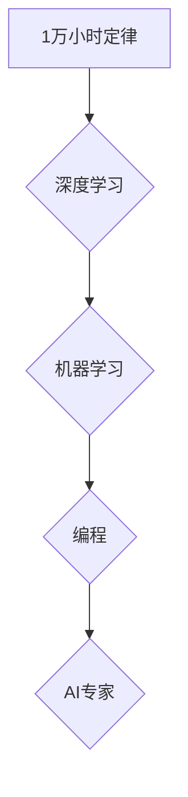

> 1. 1 万小时定律
> 2. 深度学习
> 3. 机器学习
> 4. 编程
> 5. 专家
> 6. 持续学习

## 1. 背景介绍

在当今科技飞速发展的时代，人工智能（AI）正以惊人的速度改变着我们的世界。从自动驾驶汽车到智能语音助手，AI技术无处不在，并不断拓展着新的应用领域。在这个充满机遇和挑战的领域，成为一名优秀的AI专家需要付出巨大的努力和时间。

Andrej Karpathy，一位享誉全球的AI专家，曾说过一句名言：“相信1万小时定律”。这句话源于Malcolm Gladwell的著作《出色的10000小时》，指出要达到专业水平，需要投入1万小时的刻意练习。Karpathy将这个定律应用于AI领域，强调了学习和掌握AI技术的必要性。

## 2. 核心概念与联系

**2.1 1 万小时定律**

1万小时定律的核心概念是，任何人都可以通过持续的、有针对性的练习，在任何领域达到专业水平。这个定律并非意味着仅仅积累时间，而是强调了练习的质量和专注度。

**2.2 深度学习**

深度学习是机器学习的一个子领域，它利用多层神经网络来模拟人类大脑的学习过程。深度学习算法能够从海量数据中自动提取特征，并进行复杂的模式识别和预测。

**2.3 机器学习**

机器学习是人工智能的一个重要分支，它使计算机能够从数据中学习，并根据学习到的知识进行预测或决策。机器学习算法可以分为监督学习、无监督学习和强化学习三大类。

**2.4 编程**

编程是构建AI系统的基础，它需要掌握各种编程语言和软件开发工具。Python是AI领域最常用的编程语言之一，因为它拥有丰富的AI库和框架。

**2.5 专家**

AI专家需要具备扎实的数学、统计学和计算机科学基础，并对AI算法和应用领域有深入的了解。他们能够设计、开发和部署AI系统，并解决实际问题。

**Mermaid 流程图**



## 3. 核心算法原理 & 具体操作步骤

### 3.1 算法原理概述

深度学习算法的核心是多层神经网络。神经网络由多个节点（神经元）组成，每个节点都连接着其他节点，并通过权重来传递信息。

深度学习算法通过训练神经网络来学习数据中的模式。训练过程 involves 调整神经网络的权重，使网络的输出与实际目标尽可能接近。

### 3.2 算法步骤详解

1. **数据预处理:** 将原始数据转换为深度学习算法可以理解的格式。
2. **网络结构设计:** 根据任务需求设计神经网络的结构，包括层数、节点数量和激活函数等。
3. **权重初始化:** 为神经网络的权重赋予初始值。
4. **前向传播:** 将输入数据通过神经网络传递，得到输出结果。
5. **反向传播:** 计算输出结果与目标值的误差，并根据误差调整神经网络的权重。
6. **迭代训练:** 重复前向传播和反向传播的过程，直到网络的性能达到预期的水平。

### 3.3 算法优缺点

**优点:**

* 能够从海量数据中自动提取特征，无需人工特征工程。
* 能够学习复杂模式，并进行高精度预测。

**缺点:**

* 训练深度学习模型需要大量的计算资源和时间。
* 深度学习模型的解释性较差，难以理解模型的决策过程。

### 3.4 算法应用领域

深度学习算法已广泛应用于各个领域，包括：

* **计算机视觉:** 图像识别、物体检测、图像分割等。
* **自然语言处理:** 文本分类、机器翻译、语音识别等。
* **语音合成:** 生成逼真的语音。
* **推荐系统:** 根据用户的历史行为推荐相关商品或内容。

## 4. 数学模型和公式 & 详细讲解 & 举例说明

### 4.1 数学模型构建

深度学习模型的数学基础是神经网络。神经网络由多个层组成，每层包含多个神经元。每个神经元接收来自上一层的输入信号，并通过激活函数进行处理，输出到下一层。

**4.1.1 神经元模型**

一个神经元的数学模型可以表示为：

$$
y = f(w^T x + b)
$$

其中：

* $y$ 是神经元的输出值。
* $f$ 是激活函数。
* $w$ 是神经元的权重向量。
* $x$ 是神经元的输入向量。
* $b$ 是神经元的偏置项。

**4.1.2 损失函数**

损失函数用于衡量模型的预测结果与实际目标值的差异。常用的损失函数包括均方误差（MSE）和交叉熵损失（Cross-Entropy Loss）。

**4.1.3 优化算法**

优化算法用于调整神经网络的权重，使损失函数最小化。常用的优化算法包括梯度下降（Gradient Descent）和Adam优化器（Adam Optimizer）。

### 4.2 公式推导过程

梯度下降算法的核心思想是沿着损失函数的梯度方向更新权重，直到找到损失函数的最小值。

梯度下降算法的更新公式为：

$$
w = w - \alpha \nabla L(w)
$$

其中：

* $w$ 是权重向量。
* $\alpha$ 是学习率。
* $\nabla L(w)$ 是损失函数 $L(w)$ 对权重 $w$ 的梯度。

### 4.3 案例分析与讲解

**4.3.1 图像分类**

假设我们有一个图像分类任务，目标是将图像分类为不同的类别，例如猫、狗、鸟等。我们可以使用卷积神经网络（CNN）来解决这个问题。

CNN 是一种专门用于处理图像数据的深度学习模型。它利用卷积层和池化层来提取图像特征，并使用全连接层进行分类。

**4.3.2 文本分类**

假设我们有一个文本分类任务，目标是将文本分类为不同的类别，例如正向情感、负向情感、中性情感等。我们可以使用循环神经网络（RNN）来解决这个问题。

RNN 是一种专门用于处理序列数据的深度学习模型。它能够捕获文本中的上下文信息，并根据上下文信息进行分类。

## 5. 项目实践：代码实例和详细解释说明

### 5.1 开发环境搭建

为了进行深度学习项目实践，我们需要搭建一个合适的开发环境。常用的开发环境包括：

* **Python:** 深度学习的编程语言。
* **TensorFlow/PyTorch:** 深度学习框架。
* **GPU:** 加速深度学习训练的硬件。

### 5.2 源代码详细实现

以下是一个使用 TensorFlow 实现图像分类的简单代码示例：

```python
import tensorflow as tf

# 定义模型结构
model = tf.keras.models.Sequential([
    tf.keras.layers.Conv2D(32, (3, 3), activation='relu', input_shape=(28, 28, 1)),
    tf.keras.layers.MaxPooling2D((2, 2)),
    tf.keras.layers.Conv2D(64, (3, 3), activation='relu'),
    tf.keras.layers.MaxPooling2D((2, 2)),
    tf.keras.layers.Flatten(),
    tf.keras.layers.Dense(10, activation='softmax')
])

# 编译模型
model.compile(optimizer='adam',
              loss='sparse_categorical_crossentropy',
              metrics=['accuracy'])

# 训练模型
model.fit(x_train, y_train, epochs=5)

# 评估模型
loss, accuracy = model.evaluate(x_test, y_test)
print('Test loss:', loss)
print('Test accuracy:', accuracy)
```

### 5.3 代码解读与分析

这段代码定义了一个简单的卷积神经网络模型，用于图像分类任务。

* `tf.keras.models.Sequential` 创建了一个顺序模型，其中层级依次连接。
* `tf.keras.layers.Conv2D` 定义了一个卷积层，用于提取图像特征。
* `tf.keras.layers.MaxPooling2D` 定义了一个最大池化层，用于降低特征图的大小。
* `tf.keras.layers.Flatten` 将多维特征图转换为一维向量。
* `tf.keras.layers.Dense` 定义了一个全连接层，用于分类。
* `model.compile` 编译模型，指定优化器、损失函数和评估指标。
* `model.fit` 训练模型，使用训练数据进行训练。
* `model.evaluate` 评估模型，使用测试数据进行评估。

### 5.4 运行结果展示

训练完成后，我们可以使用测试数据评估模型的性能。

## 6. 实际应用场景

### 6.1 自动驾驶

深度学习算法在自动驾驶领域发挥着重要作用，例如：

* **目标检测:** 检测道路上的车辆、行人、交通信号灯等。
* **路径规划:** 根据周围环境规划行驶路径。
* **车道保持:** 保持车辆在车道内行驶。

### 6.2 医疗诊断

深度学习算法可以辅助医生进行医疗诊断，例如：

* **图像分析:** 分析医学影像，例如X光片、CT扫描和MRI扫描，识别病变。
* **疾病预测:** 根据患者的病史和症状预测疾病风险。
* **药物研发:** 辅助药物研发，例如预测药物的疗效和副作用。

### 6.3 人工智能助手

深度学习算法是人工智能助手的核心技术，例如：

* **语音识别:** 将语音转换为文本。
* **自然语言理解:** 理解用户的自然语言输入。
* **对话系统:** 与用户进行自然语言对话。

### 6.4 未来应用展望

深度学习算法的应用前景广阔，未来将应用于更多领域，例如：

* **个性化教育:** 根据学生的学习情况提供个性化的学习方案。
* **金融风险管理:** 识别和预测金融风险。
* **智能制造:** 自动化生产过程，提高生产效率。

## 7. 工具和资源推荐

### 7.1 学习资源推荐

* **书籍:**
    * 《深度学习》
    * 《机器学习》
* **在线课程:**
    * Coursera
    * edX
    * Udacity
* **博客和网站:**
    * TensorFlow Blog
    * PyTorch Blog
    * Towards Data Science

### 7.2 开发工具推荐

* **编程语言:** Python
* **深度学习框架:** TensorFlow, PyTorch
* **数据处理工具:** Pandas, NumPy
* **可视化工具:** Matplotlib, Seaborn

### 7.3 相关论文推荐

* **AlexNet:** ImageNet Classification with Deep Convolutional Neural Networks
* **VGGNet:** Very Deep Convolutional Networks for Large-Scale Image Recognition
* **ResNet:** Deep Residual Learning for Image Recognition

## 8. 总结：未来发展趋势与挑战

### 8.1 研究成果总结

近年来，深度学习算法取得了显著的进展，在各个领域都取得了突破性的成果。

### 8.2 未来发展趋势

* **模型规模和复杂度:** 深度学习模型将继续朝着更大、更复杂的方向发展。
* **数据效率:** 研究更有效的训练方法，减少对大量数据的依赖。
* **可解释性:** 提高深度学习模型的可解释性，使模型的决策过程更加透明。
* **边缘计算:** 将深度学习模型部署到边缘设备，实现更快速的推理速度和更低的延迟。

### 8.3 面临的挑战

* **计算资源:** 训练大型深度学习模型需要大量的计算资源，这对于资源有限的机构或个人来说是一个挑战。
* **数据隐私