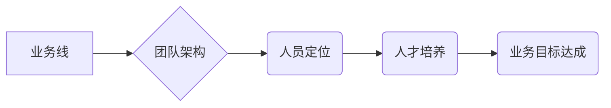

> App电商, 业务团队, 人员规划, 人员培养, 团队建设, 技术架构, 产品策略, 市场营销, 数据分析

## 1. 背景介绍

在当今数字化时代，移动电商已成为消费市场的重要组成部分。App电商作为移动互联网时代电商发展的重要形态，其发展速度迅猛，市场潜力巨大。为了更好地把握机遇，构建高效、专业的App电商业务团队至关重要。本文将从团队规划、人员规划、人员培养等方面，探讨构建高效App电商业务团队的策略和方法。

## 2. 核心概念与联系

App电商业务团队的核心概念包括：

* **业务线:** 指App电商平台的具体业务领域，例如服装、电子产品、食品等。
* **团队架构:** 指App电商业务团队的组织结构和职责划分，例如产品团队、技术团队、运营团队、市场团队等。
* **人员定位:** 指每个团队成员的职责和技能要求，例如产品经理、开发工程师、运营专员、市场专员等。
* **人才培养:** 指对App电商业务团队成员进行专业技能和业务知识的培训和提升。

**Mermaid 流程图:**



## 3. 核心算法原理 & 具体操作步骤

App电商业务团队的运营离不开数据分析和算法模型。以下介绍一些常用的算法原理和具体操作步骤：

### 3.1  算法原理概述

* **推荐算法:** 基于用户行为、商品属性等数据，推荐用户可能感兴趣的商品。常用的推荐算法包括协同过滤、内容过滤、基于知识图谱的推荐等。
* **搜索算法:** 根据用户搜索关键词，快速准确地返回相关商品信息。常用的搜索算法包括TF-IDF、BM25、深度学习等。
* **个性化算法:** 根据用户画像和行为数据，提供个性化的商品推荐、促销活动、服务体验等。

### 3.2  算法步骤详解

**推荐算法为例:**

1. **数据收集:** 收集用户行为数据、商品属性数据等。
2. **数据预处理:** 对数据进行清洗、转换、特征提取等处理。
3. **模型训练:** 选择合适的推荐算法模型，并利用训练数据进行模型训练。
4. **模型评估:** 使用测试数据评估模型的性能，例如准确率、召回率、覆盖率等。
5. **模型部署:** 将训练好的模型部署到线上环境，用于实时推荐商品。

### 3.3  算法优缺点

**推荐算法:**

* **优点:** 可以提供个性化推荐，提高用户体验，提升转化率。
* **缺点:** 需要大量数据进行训练，算法复杂度高，实时性要求高。

### 3.4  算法应用领域

推荐算法广泛应用于电商平台、社交媒体、内容平台等领域，例如：

* **商品推荐:** 根据用户历史购买记录、浏览记录等，推荐用户可能感兴趣的商品。
* **内容推荐:** 根据用户阅读习惯、点赞记录等，推荐用户可能感兴趣的内容。
* **广告推荐:** 根据用户兴趣爱好、行为特征等，推荐用户可能感兴趣的广告。

## 4. 数学模型和公式 & 详细讲解 & 举例说明

推荐算法中常用的数学模型包括协同过滤模型和内容过滤模型。

### 4.1  数学模型构建

**协同过滤模型:**

协同过滤模型基于用户之间的相似性和商品之间的相似性进行推荐。

* **用户相似度:** 计算两个用户在评分或购买行为上的相似度。常用的度量方法包括余弦相似度、皮尔逊相关系数等。
* **商品相似度:** 计算两个商品在属性、描述、评论等方面的相似度。常用的度量方法包括余弦相似度、Jaccard系数等。

**内容过滤模型:**

内容过滤模型基于商品的属性和用户偏好进行推荐。

* **商品特征向量:** 将商品的属性和描述转换为向量形式，例如商品类别、价格、品牌等。
* **用户偏好向量:** 将用户的偏好信息转换为向量形式，例如用户对不同商品类别的偏好、价格敏感度等。
* **推荐评分:** 计算商品特征向量和用户偏好向量的内积，作为推荐评分。

### 4.2  公式推导过程

**协同过滤模型的相似度计算公式:**

```latex
Sim(u_i, u_j) = \frac{\sum_{k=1}^{n} r_{i,k} * r_{j,k}}{\sqrt{\sum_{k=1}^{n} r_{i,k}^2} * \sqrt{\sum_{k=1}^{n} r_{j,k}^2}}
```

其中:

* $Sim(u_i, u_j)$ 表示用户 $u_i$ 和 $u_j$ 的相似度。
* $r_{i,k}$ 表示用户 $u_i$ 对商品 $k$ 的评分。
* $n$ 表示商品总数。

### 4.3  案例分析与讲解

假设有两个用户 $u_1$ 和 $u_2$，他们对以下三款商品进行了评分:

| 商品 | $u_1$ | $u_2$ |
|---|---|---|
| A | 5 | 4 |
| B | 3 | 5 |
| C | 4 | 3 |

使用余弦相似度计算 $u_1$ 和 $u_2$ 的相似度:

```latex
Sim(u_1, u_2) = \frac{(5 * 4) + (3 * 5) + (4 * 3)}{\sqrt{(5^2 + 3^2 + 4^2)} * \sqrt{(4^2 + 5^2 + 3^2)}} = 0.8
```

结果表明，$u_1$ 和 $u_2$ 的相似度为 0.8，说明他们具有相似的商品偏好。

## 5. 项目实践：代码实例和详细解释说明

以下是一个基于 Python 的简单推荐算法代码实例:

### 5.1  开发环境搭建

* Python 3.x
* Pandas
* Scikit-learn

### 5.2  源代码详细实现

```python
import pandas as pd
from sklearn.metrics.pairwise import cosine_similarity

# 加载用户评分数据
ratings = pd.read_csv('ratings.csv')

# 计算用户之间的余弦相似度
user_similarity = cosine_similarity(ratings)

# 获取用户 u1 的相似用户
user_id = 1
similar_users = user_similarity[user_id].argsort()[:-6:-1]

# 获取相似用户评分的商品
similar_user_ratings = ratings.iloc[similar_users, :]

# 计算相似用户评分的商品平均评分
average_ratings = similar_user_ratings.mean(axis=0)

# 推荐评分最高的商品
top_recommendations = average_ratings.sort_values(ascending=False)[:10]

print(top_recommendations)
```

### 5.3  代码解读与分析

* 代码首先加载用户评分数据，并使用 Scikit-learn 库的 `cosine_similarity` 函数计算用户之间的余弦相似度。
* 然后，根据用户 ID 获取其相似用户的索引，并从评分数据中提取相似用户的评分信息。
* 接着，计算相似用户评分的商品平均评分，并根据平均评分排序，推荐评分最高的商品。

### 5.4  运行结果展示

运行代码后，将输出用户 u1 的 top 10 推荐商品及其平均评分。

## 6. 实际应用场景

App电商业务团队的构建和运营在实际应用场景中具有广泛的意义:

* **提高用户体验:** 通过个性化推荐、精准搜索等技术，提升用户购物体验，提高用户粘性。
* **提升转化率:** 通过数据分析和算法模型，精准定位目标用户，提高广告投放效率，提升转化率。
* **优化运营策略:** 通过数据分析，了解用户行为和市场趋势，优化运营策略，提高运营效率。

### 6.4  未来应用展望

随着人工智能、大数据等技术的不断发展，App电商业务团队将更加智能化、自动化。未来，App电商业务团队将更加注重以下方面:

* **个性化定制:** 提供更加个性化的商品推荐、服务体验等。
* **智能化运营:** 利用人工智能技术，实现自动化运营，提高运营效率。
* **跨平台融合:** 打破平台壁垒，实现跨平台的商品推荐、用户服务等。

## 7. 工具和资源推荐

### 7.1  学习资源推荐

* **书籍:**
    * 《推荐系统实践》
    * 《机器学习》
    * 《数据挖掘》
* **在线课程:**
    * Coursera: 机器学习
    * edX: 数据科学
    * Udemy: 推荐系统

### 7.2  开发工具推荐

* **Python:** 
    * Pandas
    * Scikit-learn
    * TensorFlow
    * PyTorch
* **数据库:**
    * MySQL
    * PostgreSQL
    * MongoDB

### 7.3  相关论文推荐

* **协同过滤推荐算法:**
    * "Collaborative Filtering for Implicit Feedback Datasets"
    * "Matrix Factorization Techniques for Recommender Systems"
* **内容过滤推荐算法:**
    * "Content-Based Recommendation Systems"
    * "Hybrid Recommender Systems"

## 8. 总结：未来发展趋势与挑战

App电商业务团队的构建和运营是一个持续发展和完善的过程。未来，App电商业务团队将面临以下挑战:

### 8.1  研究成果总结

* **数据质量:** 确保数据准确、完整、及时，是构建高效App电商业务团队的基础。
* **算法模型:** 持续探索和改进推荐算法模型，提高推荐精准度和用户体验。
* **技术架构:** 建立灵活、可扩展的App电商平台技术架构，支持业务快速发展。

### 8.2  未来发展趋势

* **个性化定制:** 提供更加个性化的商品推荐、服务体验等。
* **智能化运营:** 利用人工智能技术，实现自动化运营，提高运营效率。
* **跨平台融合:** 打破平台壁垒，实现跨平台的商品推荐、用户服务等。

### 8.3  面临的挑战

* **数据隐私:** 确保用户数据安全和隐私保护。
* **算法公平性:** 避免算法歧视和偏见，确保推荐结果公平公正。
* **技术迭代:** 持续跟进技术发展趋势，不断更新和迭代App电商平台技术。

### 8.4  研究展望

未来，App电商业务团队将继续探索以下研究方向:

* **深度学习推荐算法:** 利用深度学习技术，构建更加智能、精准的推荐算法模型。
* **多模态推荐:** 融合文本、图像、视频等多模态数据，提供更加丰富的商品推荐体验。
* **用户行为预测:** 利用机器学习技术，预测用户未来的行为，提供更加精准的个性化服务。

## 9. 附录：常见问题与解答

### 9.1  常见问题

* 如何评估推荐算法的性能？
* 如何处理缺失数据？
* 如何避免算法冷启动问题？

### 9.2  解答

* 推荐算法的性能可以通过准确率、召回率、覆盖率等指标进行评估。
* 缺失数据可以通过平均值、中位数等方法进行填充。
* 算法冷启动问题可以通过利用用户画像、商品属性等信息进行初始化，或者采用基于内容过滤的推荐算法等方法进行解决。


作者：禅与计算机程序设计艺术 / Zen and the Art of Computer Programming 
<end_of_turn>