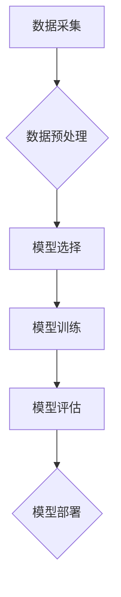

> 人工智能 (AI)
> 机器学习 (Machine Learning)
> 深度学习 (Deep Learning)
> 算法
> 模型
> 代码实战

## 1. 背景介绍

人工智能 (AI) 作为科技发展的重要方向，近年来取得了长足的进步，并在各个领域得到广泛应用。从智能语音助手到自动驾驶汽车，AI 正在改变着我们的生活方式。 

为了更好地理解和应用 AI 技术，我们需要深入了解其核心原理和算法。本篇文章将从 AI 的基本概念开始，逐步深入到具体的算法原理、代码实现以及实际应用场景，并结合案例分析，帮助读者掌握 AI 的核心知识和技能。

## 2. 核心概念与联系

**2.1  人工智能 (AI)**

人工智能是指模拟人类智能行为的计算机系统。这些行为包括学习、推理、决策、感知和语言理解等。

**2.2  机器学习 (ML)**

机器学习是 AI 的一个重要子领域，它通过算法使计算机能够从数据中学习，并根据学习到的知识进行预测或决策。

**2.3  深度学习 (DL)**

深度学习是机器学习的一种高级形式，它使用多层神经网络来模拟人类大脑的结构和功能，从而能够处理更复杂的数据和任务。

**2.4  算法与模型**

在 AI 中，算法是指解决特定问题的步骤或规则，而模型则是基于算法训练得到的，能够对数据进行预测或决策的数学表示。

**2.5  数据**

数据是 AI 训练和运行的基础。高质量的数据能够帮助 AI 模型学习到更准确的知识和规律。

**2.6  流程图**



## 3. 核心算法原理 & 具体操作步骤

### 3.1  算法原理概述

本节将介绍一种常用的机器学习算法——线性回归。线性回归是一种监督学习算法，用于预测连续变量的值。它假设数据之间存在线性关系，并通过最小化预测误差来找到最佳的回归线。

### 3.2  算法步骤详解

1. **数据准备:** 收集并预处理数据，包括清洗、转换和特征工程。
2. **模型构建:** 使用线性回归模型，定义预测变量和目标变量之间的关系。
3. **模型训练:** 使用训练数据训练模型，通过最小化预测误差来调整模型参数。
4. **模型评估:** 使用测试数据评估模型的性能，例如计算均方误差 (MSE) 或 R-squared 值。
5. **模型部署:** 将训练好的模型部署到实际应用场景中，用于预测新的数据。

### 3.3  算法优缺点

**优点:**

* 算法简单易懂，易于实现。
* 计算效率高，适合处理大规模数据。
* 可解释性强，可以直观地理解模型的预测结果。

**缺点:**

* 只能处理线性关系的数据。
* 对异常值敏感，容易受到噪声的影响。

### 3.4  算法应用领域

线性回归广泛应用于各个领域，例如：

* 房地产预测: 预测房价
* 股票预测: 预测股票价格
* 销售预测: 预测销售额
* 医疗诊断: 预测疾病风险

## 4. 数学模型和公式 & 详细讲解 & 举例说明

### 4.1  数学模型构建

线性回归模型的数学表达式为：

$$y = w_0 + w_1x_1 + w_2x_2 + ... + w_nx_n + \epsilon$$

其中：

* $y$ 是目标变量
* $x_1, x_2, ..., x_n$ 是预测变量
* $w_0, w_1, w_2, ..., w_n$ 是模型参数
* $\epsilon$ 是误差项

### 4.2  公式推导过程

模型参数的求解可以通过最小化预测误差来实现。常用的误差函数是均方误差 (MSE)：

$$MSE = \frac{1}{n}\sum_{i=1}^{n}(y_i - \hat{y}_i)^2$$

其中：

* $n$ 是样本数量
* $y_i$ 是第 $i$ 个样本的目标变量值
* $\hat{y}_i$ 是模型预测的第 $i$ 个样本的目标变量值

通过求解 MSE 的最小值，可以得到最佳的模型参数。

### 4.3  案例分析与讲解

假设我们想要预测房屋价格，已知房屋面积和房间数量等特征数据。我们可以使用线性回归模型来建立房屋价格预测模型。

通过训练模型，我们可以得到最佳的模型参数，例如：

* $w_0 = 50000$
* $w_1 = 200$ (每增加 1 平方米面积，价格增加 200 元)
* $w_2 = 10000$ (每增加 1 个房间，价格增加 10000 元)

根据这些参数，我们可以预测新房子的价格。例如，如果新房子的面积为 100 平方米，房间数量为 3 个，则预测价格为：

$$y = 50000 + 200 * 100 + 10000 * 3 = 80000$$

## 5. 项目实践：代码实例和详细解释说明

### 5.1  开发环境搭建

本项目使用 Python 语言进行开发，需要安装以下软件包：

* NumPy
* Pandas
* Scikit-learn

可以使用 pip 命令安装：

```bash
pip install numpy pandas scikit-learn
```

### 5.2  源代码详细实现

```python
import numpy as np
from sklearn.linear_model import LinearRegression
from sklearn.model_selection import train_test_split

# 准备数据
data = np.array([[100, 2], [150, 3], [200, 4], [250, 5]])
X = data[:, 0].reshape(-1, 1)  # 特征
y = data[:, 1]  # 目标变量

# 将数据分成训练集和测试集
X_train, X_test, y_train, y_test = train_test_split(X, y, test_size=0.2, random_state=42)

# 创建线性回归模型
model = LinearRegression()

# 训练模型
model.fit(X_train, y_train)

# 预测测试集数据
y_pred = model.predict(X_test)

# 评估模型性能
print("Coefficients:", model.coef_)
print("Intercept:", model.intercept_)
print("Mean Squared Error:", np.mean((y_test - y_pred)**2))
```

### 5.3  代码解读与分析

1. 准备数据：加载数据并将其转换为 NumPy 数组。
2. 分割数据：将数据分成训练集和测试集，用于训练和评估模型。
3. 创建模型：使用 Scikit-learn 库中的 LinearRegression 类创建线性回归模型。
4. 训练模型：使用训练数据训练模型，并更新模型参数。
5. 预测数据：使用训练好的模型预测测试集数据。
6. 评估模型：计算模型的性能指标，例如均方误差。

### 5.4  运行结果展示

运行代码后，会输出模型的系数、截距以及均方误差等信息。

## 6. 实际应用场景

### 6.1  金融领域

* 股票预测
* 欺诈检测
* 风险评估

### 6.2  医疗领域

* 疾病诊断
* 药物研发
* 患者个性化治疗

### 6.3  电商领域

* 商品推荐
* 销售预测
* 客户画像

### 6.4  未来应用展望

随着 AI 技术的不断发展，其应用场景将更加广泛，例如：

* 自动驾驶
* 人机交互
* 智能制造

## 7. 工具和资源推荐

### 7.1  学习资源推荐

* **书籍:**
    * 《深度学习》
    * 《机器学习实战》
    * 《Python机器学习》
* **在线课程:**
    * Coursera
    * edX
    * Udacity

### 7.2  开发工具推荐

* **Python:** 
    * Jupyter Notebook
    * PyCharm
* **机器学习库:**
    * Scikit-learn
    * TensorFlow
    * PyTorch

### 7.3  相关论文推荐

* **AlphaGo论文:** https://arxiv.org/abs/1607.02886
* **BERT论文:** https://arxiv.org/abs/1810.04805

## 8. 总结：未来发展趋势与挑战

### 8.1  研究成果总结

近年来，AI 技术取得了长足的进步，在各个领域都取得了显著的应用成果。

### 8.2  未来发展趋势

* **模型规模和复杂度提升:** 随着计算能力的提升，模型规模和复杂度将进一步提升，从而提高模型的性能。
* **跨模态学习:** 将不同模态的数据融合在一起，例如文本、图像、音频，以获得更全面的理解。
* **可解释性增强:** 研究更可解释的 AI 模型，以便更好地理解模型的决策过程。

### 8.3  面临的挑战

* **数据获取和隐私保护:** AI 模型的训练需要大量数据，如何获取高质量数据并保护用户隐私是一个挑战。
* **算法偏见:** AI 模型可能存在算法偏见，导致不公平的结果，需要研究如何解决算法偏见问题。
* **伦理问题:** AI 技术的应用可能带来伦理问题，例如自动驾驶的责任归属，需要进行深入的伦理探讨。

### 8.4  研究展望

未来，AI 研究将继续朝着更智能、更安全、更可解释的方向发展，并为人类社会带来更多福祉。

## 9. 附录：常见问题与解答

**Q1: 什么是机器学习？**

A1: 机器学习是一种人工智能技术，它通过算法使计算机能够从数据中学习，并根据学习到的知识进行预测或决策。

**Q2: 线性回归模型有什么特点？**

A2: 线性回归模型假设数据之间存在线性关系，并通过最小化预测误差来找到最佳的回归线。

**Q3: 如何评估机器学习模型的性能？**

A3: 常用的评估指标包括均方误差 (MSE)、R-squared 值等。

**作者：禅与计算机程序设计艺术 / Zen and the Art of Computer Programming**<end_of_turn>