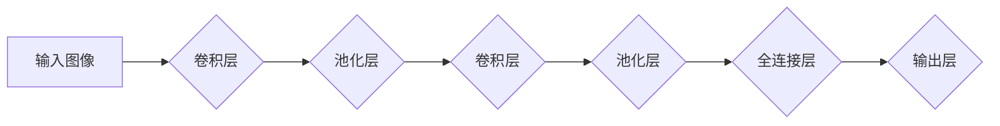

> 卷积神经网络 (CNN)，深度学习，图像识别，特征提取，卷积操作，池化操作，全连接层，代码实战

## 1. 背景介绍

深度学习作为机器学习领域的重要分支，近年来取得了令人瞩目的成就，尤其是在图像识别、自然语言处理等领域展现出强大的应用潜力。卷积神经网络 (Convolutional Neural Networks, CNN) 作为深度学习中的一种重要架构，因其在处理图像数据方面的卓越表现而备受关注。

CNN 借鉴了生物视觉系统的神经元结构和工作机制，通过卷积、池化等操作，有效地提取图像特征，并进行分类、识别等任务。其结构的特殊性使其能够自动学习图像的复杂特征，无需人工特征工程，大大提高了图像识别任务的准确率和效率。

## 2. 核心概念与联系

CNN 的核心概念包括卷积层、池化层、全连接层等。

**Mermaid 流程图：**



**核心概念解释：**

* **卷积层:**  卷积层是 CNN 的核心组成部分，通过卷积核 (Filter) 对输入图像进行卷积运算，提取图像局部特征。卷积核可以看作是学习图像特征的模板，通过滑动在图像上，提取不同位置的特征信息。
* **池化层:** 池化层用于对卷积层的输出进行降维，减少参数数量，提高模型的鲁棒性。常见的池化操作包括最大池化和平均池化。
* **全连接层:** 全连接层将池化层的输出连接到所有神经元，用于学习全局特征，并进行最终分类或预测。

## 3. 核心算法原理 & 具体操作步骤

### 3.1  算法原理概述

CNN 的核心算法原理是通过多层卷积和池化操作，逐步提取图像的特征，最终实现图像识别或分类。

**具体步骤：**

1. **输入图像预处理:** 将输入图像调整到 CNN 模型所需的尺寸和格式。
2. **卷积操作:** 使用卷积核对输入图像进行卷积运算，提取图像局部特征。
3. **激活函数:** 应用激活函数 (如 ReLU) 对卷积层的输出进行非线性变换，增强模型的表达能力。
4. **池化操作:** 对卷积层的输出进行池化操作，降低特征维度，提高模型的鲁棒性。
5. **重复步骤 2-4:**  重复卷积、激活函数和池化操作，构建多层卷积网络，逐步提取图像的抽象特征。
6. **全连接层:** 将池化层的输出连接到全连接层，学习全局特征，并进行最终分类或预测。

### 3.2  算法步骤详解

**卷积操作:**

卷积操作的核心是使用卷积核对输入图像进行滑动运算。卷积核是一个小的矩阵，包含可学习的参数。卷积核在图像上滑动，每个位置进行卷积运算，生成一个特征图。

**池化操作:**

池化操作用于对卷积层的输出进行降维，减少参数数量，提高模型的鲁棒性。常见的池化操作包括最大池化和平均池化。

* **最大池化:**  选择每个池化窗口内的最大值作为输出。
* **平均池化:**  计算每个池化窗口内的平均值作为输出。

**激活函数:**

激活函数用于引入非线性，增强模型的表达能力。常见的激活函数包括 ReLU、Sigmoid 和 Tanh。

* **ReLU (Rectified Linear Unit):**  对于正值输入，输出为输入本身；对于负值输入，输出为 0。
* **Sigmoid:**  将输入映射到 0 到 1 之间。
* **Tanh (Hyperbolic tangent):**  将输入映射到 -1 到 1 之间。

### 3.3  算法优缺点

**优点:**

* **自动特征提取:** CNN 可以自动学习图像特征，无需人工特征工程。
* **鲁棒性强:** 池化操作可以提高模型的鲁棒性，使其对图像的噪声和变形更具抵抗力。
* **参数共享:** 卷积核的参数共享机制可以有效减少模型参数数量，提高训练效率。

**缺点:**

* **计算量大:** CNN 的训练过程需要大量的计算资源。
* **参数量大:**  CNN 的参数量较大，需要大量的训练数据才能有效训练。
* **可解释性差:** CNN 的决策过程比较复杂，难以解释模型的决策结果。

### 3.4  算法应用领域

CNN 在图像识别、物体检测、图像分割、人脸识别、医疗图像分析等领域有着广泛的应用。

## 4. 数学模型和公式 & 详细讲解 & 举例说明

### 4.1  数学模型构建

CNN 的数学模型主要包括卷积操作、池化操作和激活函数。

**卷积操作:**

设输入图像为 $I \in R^{H \times W \times C}$，卷积核为 $K \in R^{F \times F \times C \times M}$，其中 $H$ 和 $W$ 分别为图像的高度和宽度，$C$ 为通道数，$F$ 为卷积核的大小，$M$ 为输出特征图的数量。卷积操作的数学表达式为：

$$
O_{i,j,m} = \sum_{p=0}^{F-1} \sum_{q=0}^{F-1} \sum_{c=0}^{C-1} I_{i+p,j+q,c} * K_{p,q,c,m}
$$

其中 $O_{i,j,m}$ 为输出特征图的第 $m$ 个特征图上的第 $(i,j)$ 个像素值。

**池化操作:**

池化操作的数学表达式取决于具体的池化操作类型。

* **最大池化:**  选择每个池化窗口内的最大值作为输出。
* **平均池化:**  计算每个池化窗口内的平均值作为输出。

**激活函数:**

激活函数的数学表达式取决于具体的激活函数类型。

* **ReLU:**  $f(x) = max(0, x)$
* **Sigmoid:**  $f(x) = \frac{1}{1 + e^{-x}}$
* **Tanh:**  $f(x) = \frac{e^x - e^{-x}}{e^x + e^{-x}}$

### 4.2  公式推导过程

卷积操作的公式推导过程可以参考相关深度学习教材或论文。

### 4.3  案例分析与讲解

以图像分类为例，假设输入图像为彩色图像，通道数为 3，卷积核大小为 3x3，输出特征图的数量为 16。

1. **卷积操作:** 使用 16 个 3x3 的卷积核对输入图像进行卷积运算，生成 16 个特征图。
2. **激活函数:** 对每个特征图的输出应用 ReLU 激活函数。
3. **池化操作:** 对每个特征图进行最大池化操作，降低特征图的尺寸。
4. **重复步骤 1-3:**  重复卷积、激活函数和池化操作，构建多层卷积网络，逐步提取图像的抽象特征。
5. **全连接层:** 将池化层的输出连接到全连接层，学习全局特征，并进行最终分类。

## 5. 项目实践：代码实例和详细解释说明

### 5.1  开发环境搭建

* **操作系统:**  Windows、macOS 或 Linux
* **编程语言:**  Python
* **深度学习框架:**  TensorFlow 或 PyTorch
* **其他依赖库:**  NumPy、Matplotlib 等

### 5.2  源代码详细实现

```python
import tensorflow as tf

# 定义 CNN 模型
model = tf.keras.models.Sequential([
    tf.keras.layers.Conv2D(32, (3, 3), activation='relu', input_shape=(28, 28, 1)),
    tf.keras.layers.MaxPooling2D((2, 2)),
    tf.keras.layers.Conv2D(64, (3, 3), activation='relu'),
    tf.keras.layers.MaxPooling2D((2, 2)),
    tf.keras.layers.Flatten(),
    tf.keras.layers.Dense(10, activation='softmax')
])

# 编译模型
model.compile(optimizer='adam',
              loss='sparse_categorical_crossentropy',
              metrics=['accuracy'])

# 训练模型
model.fit(x_train, y_train, epochs=5)

# 评估模型
loss, accuracy = model.evaluate(x_test, y_test)
print('Test loss:', loss)
print('Test accuracy:', accuracy)
```

### 5.3  代码解读与分析

* **Conv2D:** 卷积层，使用 32 个 3x3 的卷积核，激活函数为 ReLU。
* **MaxPooling2D:** 最大池化层，池化窗口大小为 2x2。
* **Flatten:** 将多维特征图转换为一维向量。
* **Dense:** 全连接层，输出 10 个类别，激活函数为 softmax。
* **compile:** 编译模型，指定优化器、损失函数和评估指标。
* **fit:** 训练模型，使用训练数据进行训练。
* **evaluate:** 评估模型，使用测试数据计算损失和准确率。

### 5.4  运行结果展示

训练完成后，可以查看模型的训练损失和准确率曲线，以及测试集的损失和准确率。

## 6. 实际应用场景

CNN 在图像识别、物体检测、图像分割、人脸识别、医疗图像分析等领域有着广泛的应用。

* **图像识别:** CNN 可以用于识别图像中的物体、场景和人物。例如，在自动驾驶汽车中，CNN 可以用于识别道路标志、行人和其他车辆。
* **物体检测:** CNN 可以用于检测图像中物体的位置和类别。例如，在安防监控系统中，CNN 可以用于检测入侵者。
* **图像分割:** CNN 可以用于将图像分割成不同的区域。例如，在医学图像分析中，CNN 可以用于分割肿瘤区域。
* **人脸识别:** CNN 可以用于识别人脸，并将其与数据库中的信息进行匹配。例如，在手机解锁和身份验证系统中，CNN 可以用于人脸识别。
* **医疗图像分析:** CNN 可以用于分析医学图像，例如 X 光片、CT 扫描和 MRI 图像，以辅助医生诊断疾病。

### 6.4  未来应用展望

随着深度学习技术的不断发展，CNN 的应用场景将会更加广泛。例如，CNN 可以用于生成图像、视频和音频，以及进行自然语言处理等任务。

## 7. 工具和资源推荐

### 7.1  学习资源推荐

* **书籍:**
    * Deep Learning by Ian Goodfellow, Yoshua Bengio, and Aaron Courville
    * Convolutional Neural Networks for Visual Recognition by Krizhevsky, Sutskever, and Hinton
* **在线课程:**
    * Deep Learning Specialization by Andrew Ng (Coursera)
    * Fast.ai Practical Deep Learning for Coders
* **博客和网站:**
    * Towards Data Science
    * Machine Learning Mastery

### 7.2  开发工具推荐

* **深度学习框架:** TensorFlow, PyTorch, Keras
* **编程语言:** Python
* **数据可视化工具:** Matplotlib, Seaborn

### 7.3  相关论文推荐

* AlexNet: ImageNet Classification with Deep Convolutional Neural Networks
* VGGNet: Very Deep Convolutional Networks for Large-Scale Image Recognition
* ResNet