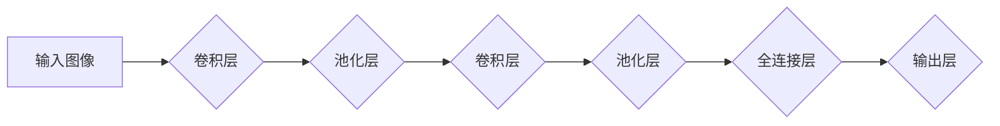

> 卷积神经网络 (CNN)，深度学习，图像识别，特征提取，卷积操作，池化操作，全连接层

## 1. 背景介绍

卷积神经网络 (Convolutional Neural Networks, CNN) 作为深度学习领域的重要分支，在图像识别、物体检测、语音识别等领域取得了显著的成就。其灵感来源于生物视觉系统，通过模拟人类视觉神经元对图像进行特征提取的过程，能够自动学习图像中的复杂特征，并实现高精度识别。

传统的机器学习方法需要人工提取图像特征，这不仅耗时费力，而且难以捕捉到图像中的复杂模式。而 CNN 则通过卷积操作和池化操作，自动学习图像的局部特征，并将其组合成全局特征，从而实现更准确的图像识别。

## 2. 核心概念与联系

CNN 的核心概念包括卷积层、池化层、全连接层等。

**Mermaid 流程图：**



**核心概念解释：**

* **卷积层:**  卷积层是 CNN 的核心，通过卷积核 (Filter) 对输入图像进行卷积运算，提取图像的局部特征。卷积核可以看作是学习到的特征模板，通过滑动在图像上，提取不同位置的特征。
* **池化层:** 池化层用于对卷积层的输出进行降维，减少计算量，同时提高网络的鲁棒性。常见的池化操作包括最大池化和平均池化。
* **全连接层:** 全连接层将卷积层和池化层的输出进行连接，并进行分类或回归。

## 3. 核心算法原理 & 具体操作步骤

### 3.1  算法原理概述

CNN 的核心算法原理是通过多层卷积和池化操作，逐步提取图像的特征，最终实现图像识别。

**具体步骤：**

1. **输入图像预处理:** 将输入图像调整到 CNN 网络的输入尺寸，并进行归一化处理。
2. **卷积操作:** 使用卷积核对输入图像进行卷积运算，提取图像的局部特征。
3. **激活函数:** 将卷积层的输出通过激活函数 (如 ReLU) 进行非线性变换，提高网络的表达能力。
4. **池化操作:** 对卷积层的输出进行池化操作，减少计算量，提高网络的鲁棒性。
5. **重复步骤 2-4:** 将卷积层和池化层堆叠在一起，形成多层网络，逐步提取图像的特征。
6. **全连接层:** 将卷积层和池化层的输出连接到全连接层，进行分类或回归。

### 3.2  算法步骤详解

**卷积操作:**

卷积操作是指将卷积核滑动在图像上，计算每个位置的卷积结果。卷积结果可以看作是图像的特征图。

**池化操作:**

池化操作是指对特征图进行降维，常用的池化操作包括最大池化和平均池化。

**激活函数:**

激活函数用于引入非线性，提高网络的表达能力。常用的激活函数包括 ReLU、Sigmoid 和 Tanh。

### 3.3  算法优缺点

**优点:**

* 自动学习图像特征，无需人工提取特征。
* 能够处理高维数据，适用于图像识别等任务。
* 具有较高的识别精度。

**缺点:**

* 训练时间长，需要大量的训练数据。
* 参数量大，计算量大。
* 对数据噪声敏感。

### 3.4  算法应用领域

CNN 在图像识别、物体检测、语音识别、自然语言处理等领域都有广泛的应用。

## 4. 数学模型和公式 & 详细讲解 & 举例说明

### 4.1  数学模型构建

CNN 的数学模型主要包括卷积操作、池化操作和激活函数。

**卷积操作:**

$$
y_{i,j} = \sum_{m=0}^{M-1} \sum_{n=0}^{N-1} x_{i+m,j+n} * w_{m,n} + b
$$

其中：

* $y_{i,j}$ 是卷积层的输出值。
* $x_{i+m,j+n}$ 是输入图像的像素值。
* $w_{m,n}$ 是卷积核的权值。
* $b$ 是偏置项。

**池化操作:**

池化操作的数学模型取决于具体的池化操作类型。

**激活函数:**

激活函数的数学模型取决于具体的激活函数类型。

### 4.2  公式推导过程

卷积操作的公式推导过程可以参考相关文献。

### 4.3  案例分析与讲解

以卷积操作为例，假设输入图像大小为 3x3，卷积核大小为 2x2，则卷积操作的结果为 2x2。

## 5. 项目实践：代码实例和详细解释说明

### 5.1  开发环境搭建

使用 Python 语言和 TensorFlow 或 PyTorch 深度学习框架进行开发。

### 5.2  源代码详细实现

```python
import tensorflow as tf

# 定义卷积层
conv1 = tf.keras.layers.Conv2D(32, (3, 3), activation='relu', input_shape=(28, 28, 1))

# 定义池化层
pool1 = tf.keras.layers.MaxPooling2D((2, 2))

# 定义全连接层
dense1 = tf.keras.layers.Dense(10, activation='softmax')

# 定义模型
model = tf.keras.models.Sequential([conv1, pool1, dense1])

# 编译模型
model.compile(optimizer='adam',
              loss='sparse_categorical_crossentropy',
              metrics=['accuracy'])

# 训练模型
model.fit(x_train, y_train, epochs=10)

# 评估模型
loss, accuracy = model.evaluate(x_test, y_test)
print('Test loss:', loss)
print('Test accuracy:', accuracy)
```

### 5.3  代码解读与分析

* 代码首先定义了卷积层、池化层和全连接层。
* 然后将这些层组合成一个顺序模型。
* 接着编译模型，指定优化器、损失函数和评价指标。
* 最后训练模型，并评估模型的性能。

### 5.4  运行结果展示

训练完成后，可以查看模型的训练损失和准确率曲线，以及测试集的损失和准确率。

## 6. 实际应用场景

CNN 在图像识别、物体检测、语音识别、自然语言处理等领域都有广泛的应用。

### 6.1  图像识别

CNN 可以用于识别图像中的物体、场景和人物。例如，在自动驾驶汽车中，CNN 可以用于识别道路上的车辆、行人和其他物体。

### 6.2  物体检测

CNN 可以用于检测图像中物体的位置和类别。例如，在安防监控系统中，CNN 可以用于检测图像中的人脸、车辆和其他物体。

### 6.3  语音识别

CNN 可以用于识别语音中的单词和句子。例如，在智能语音助手中，CNN 可以用于识别用户的语音指令。

### 6.4  未来应用展望

CNN 的应用前景广阔，未来将应用于更多领域，例如医疗诊断、金融风险评估、个性化推荐等。

## 7. 工具和资源推荐

### 7.1  学习资源推荐

* **书籍:**
    * 《Deep Learning》 by Ian Goodfellow, Yoshua Bengio, and Aaron Courville
    * 《Hands-On Machine Learning with Scikit-Learn, Keras & TensorFlow》 by Aurélien Géron
* **在线课程:**
    * Coursera: Deep Learning Specialization
    * Udacity: Deep Learning Nanodegree

### 7.2  开发工具推荐

* **TensorFlow:** https://www.tensorflow.org/
* **PyTorch:** https://pytorch.org/

### 7.3  相关论文推荐

* **AlexNet:** http://papers.nips.cc/paper/4824-imagenet-classification-with-deep-convolutional-neural-networks.pdf
* **VGGNet:** http://arxiv.org/abs/1409.1556
* **ResNet:** http://arxiv.org/abs/1512.03385

## 8. 总结：未来发展趋势与挑战

### 8.1  研究成果总结

CNN 在图像识别等领域取得了显著的成果，但仍存在一些挑战。

### 8.2  未来发展趋势

* **模型效率:** 提高 CNN 模型的效率，降低计算量和内存消耗。
* **数据效率:** 降低 CNN 模型对训练数据的依赖，提高数据利用率。
* **可解释性:** 提高 CNN 模型的可解释性，帮助人们理解模型的决策过程。

### 8.3  面临的挑战

* **数据标注:** 高质量的图像数据标注成本高昂。
* **模型复杂度:** CNN 模型参数量大，训练复杂。
* **泛化能力:** CNN 模型在不同数据集上的泛化能力有限。

### 8.4  研究展望

未来将继续研究 CNN 的新算法、新架构和新应用，以解决上述挑战，推动 CNN 技术的进一步发展。

## 9. 附录：常见问题与解答

* **Q: CNN 的卷积核是如何学习的？**
* **A:** 卷积核的权值通过训练过程学习，训练过程的目标是使 CNN 模型的输出与真实标签尽可能接近。

* **Q: CNN 的池化操作有什么作用？**
* **A:** 池化操作可以减少计算量，提高网络的鲁棒性。

* **Q: CNN 的激活函数有什么作用？**
* **A:** 激活函数用于引入非线性，提高网络的表达能力。


作者：禅与计算机程序设计艺术 / Zen and the Art of Computer Programming 
<end_of_turn>