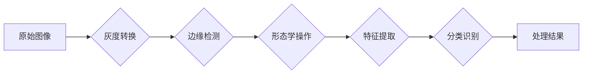

> 图像处理，算法原理，代码实现，opencv，python，图像识别，计算机视觉

## 1. 背景介绍

图像处理作为计算机视觉领域的核心技术，在各个领域都扮演着越来越重要的角色。从医疗影像诊断、自动驾驶、人脸识别到增强现实、视频监控等，图像处理技术无处不在。随着深度学习技术的兴起，图像处理领域迎来了新的发展机遇，也带来了新的挑战。

本篇文章将深入浅出地讲解图像处理的基本原理和算法，并结合实际案例，使用 Python 和 OpenCV 库进行代码实现，帮助读者理解图像处理的本质，并掌握基本的图像处理技能。

## 2. 核心概念与联系

图像处理的核心是将图像数据转换为可理解和操作的数字信号，并通过一系列算法进行处理，最终达到预期的效果。

**图像处理流程:**



**核心概念:**

* **像素:** 图像的基本单位，每个像素代表图像中一个点的颜色或亮度值。
* **灰度图像:** 将彩色图像转换为单通道图像，每个像素只包含亮度值。
* **边缘检测:** 识别图像中的边缘，突出图像的轮廓和结构。
* **形态学操作:** 通过膨胀、腐蚀等操作改变图像的形状和结构。
* **特征提取:** 从图像中提取关键特征，用于识别和分类。
* **分类识别:** 根据提取的特征，将图像分类或识别出目标。

## 3. 核心算法原理 & 具体操作步骤

### 3.1  算法原理概述

本节将介绍几种常用的图像处理算法，包括灰度转换、边缘检测、形态学操作等。

**3.1.1 灰度转换**

灰度转换将彩色图像转换为灰度图像，可以简化图像处理过程，并减少计算量。常用的灰度转换方法包括：

* **平均法:** 将每个像素的 RGB 值平均计算得到灰度值。
* **加权平均法:** 对 RGB 值赋予不同的权重，计算得到灰度值。
* **最大值法:** 选择 RGB 值最大的分量作为灰度值。

**3.1.2 边缘检测**

边缘检测是图像处理中非常重要的步骤，可以突出图像的轮廓和结构。常用的边缘检测算法包括：

* **Sobel 算子:** 使用两个方向的卷积核计算图像的梯度，检测边缘。
* **Prewitt 算子:** 与 Sobel 算子类似，但使用不同的卷积核。
* **Canny 算子:** 采用多步骤算法，包括高斯滤波、梯度计算、非极大值抑制和双阈值连接，检测边缘。

**3.1.3 形态学操作**

形态学操作是通过结构元素与图像进行卷积运算，改变图像的形状和结构。常用的形态学操作包括：

* **膨胀:** 将图像的边界向外扩展。
* **腐蚀:** 将图像的边界向内收缩。
* **开运算:** 先腐蚀，再膨胀。
* **闭运算:** 先膨胀，再腐蚀。

### 3.2  算法步骤详解

**3.2.1 灰度转换步骤**

1. 读取彩色图像。
2. 对于每个像素，计算灰度值。可以使用平均法、加权平均法或最大值法。
3. 创建新的灰度图像，并将计算得到的灰度值存储到图像中。

**3.2.2 边缘检测步骤**

1. 读取图像。
2. 使用高斯滤波平滑图像，减少噪声。
3. 使用 Sobel 算子或其他边缘检测算法计算图像的梯度。
4. 阈值化梯度图像，保留边缘像素。

**3.2.3 形态学操作步骤**

1. 读取图像。
2. 定义结构元素，例如矩形或圆形。
3. 使用膨胀或腐蚀操作对图像进行处理。
4. 保存处理后的图像。

### 3.3  算法优缺点

**3.3.1 灰度转换**

* **优点:** 简化图像处理过程，减少计算量。
* **缺点:** 丢失了图像的彩色信息。

**3.3.2 边缘检测**

* **优点:** 可以突出图像的轮廓和结构，用于目标检测和图像分割。
* **缺点:** 对噪声敏感，可能检测到虚假边缘。

**3.3.3 形态学操作**

* **优点:** 可以有效地去除噪声、填充空洞和连接断裂部分。
* **缺点:** 需要选择合适的结构元素，否则可能导致图像变形。

### 3.4  算法应用领域

* **图像识别:** 用于识别物体、人脸、文字等。
* **图像分割:** 将图像分割成不同的区域，例如前景和背景。
* **目标跟踪:** 跟踪图像中的目标运动。
* **医学影像分析:** 用于诊断疾病、分析病灶。
* **遥感图像处理:** 用于土地利用规划、环境监测。

## 4. 数学模型和公式 & 详细讲解 & 举例说明

### 4.1  数学模型构建

图像处理算法通常基于数学模型，例如灰度转换、边缘检测、形态学操作等。

**4.1.1 灰度转换模型:**

$$
G = 0.299R + 0.587G + 0.114B
$$

其中，G 是灰度值，R、G、B 分别是图像像素的红色、绿色、蓝色分量。

**4.1.2 Sobel 算子模型:**

$$
G_x = \begin{bmatrix} -1 & 0 & 1 \\ -2 & 0 & 2 \\ -1 & 0 & 1 \end{bmatrix} * I
$$

$$
G_y = \begin{bmatrix} -1 & -2 & -1 \\ 0 & 0 & 0 \\ 1 & 2 & 1 \end{bmatrix} * I
$$

其中，$G_x$ 和 $G_y$ 分别是图像在 x 和 y 方向的梯度，I 是图像像素矩阵。

### 4.2  公式推导过程

**4.2.1 灰度转换公式推导:**

灰度转换公式的推导基于人眼对不同颜色分量的感知差异。

**4.2.2 Sobel 算子公式推导:**

Sobel 算子通过卷积运算计算图像的梯度，其公式推导基于微积分的偏导数概念。

### 4.3  案例分析与讲解

**4.3.1 灰度转换案例:**

将彩色图像转换为灰度图像，可以减少图像的存储空间和处理时间。

**4.3.2 边缘检测案例:**

使用 Sobel 算子检测图像的边缘，可以用于目标识别和图像分割。

## 5. 项目实践：代码实例和详细解释说明

### 5.1  开发环境搭建

本项目使用 Python 语言和 OpenCV 库进行开发。

* 安装 Python：https://www.python.org/downloads/
* 安装 OpenCV：pip install opencv-python

### 5.2  源代码详细实现

```python
import cv2

# 读取图像
image = cv2.imread('input.jpg')

# 灰度转换
gray_image = cv2.cvtColor(image, cv2.COLOR_BGR2GRAY)

# 边缘检测
edges = cv2.Canny(gray_image, 100, 200)

# 显示图像
cv2.imshow('Original Image', image)
cv2.imshow('Gray Image', gray_image)
cv2.imshow('Edges', edges)
cv2.waitKey(0)
cv2.destroyAllWindows()
```

### 5.3  代码解读与分析

* `cv2.imread('input.jpg')`: 读取名为 'input.jpg' 的图像文件。
* `cv2.cvtColor(image, cv2.COLOR_BGR2GRAY)`: 将图像从 BGR 颜色空间转换为灰度空间。
* `cv2.Canny(gray_image, 100, 200)`: 使用 Canny 算法检测图像的边缘，阈值分别设置为 100 和 200。
* `cv2.imshow()`: 显示图像窗口。
* `cv2.waitKey(0)`: 等待用户按下任意键。
* `cv2.destroyAllWindows()`: 关闭所有窗口。

### 5.4  运行结果展示

运行代码后，将显示三个窗口：原始图像、灰度图像和边缘检测结果。

## 6. 实际应用场景

### 6.1  医学影像分析

图像处理技术在医学影像分析中应用广泛，例如：

* **肿瘤检测:** 使用图像处理算法识别肿瘤区域，辅助医生诊断。
* **骨骼骨折检测:** 分析 X 光片，识别骨折部位。
* **血管造影:** 使用图像处理算法增强血管图像，辅助医生进行血管手术。

### 6.2  自动驾驶

自动驾驶系统依赖于图像处理技术来感知周围环境，例如：

* **道路识别:** 使用图像处理算法识别道路边界、车道线和交通信号灯。
* **障碍物检测:** 使用图像处理算法检测行人、车辆和其他障碍物。
* **车道保持:** 使用图像处理算法判断车辆是否偏离车道，并进行自动修正。

### 6.3  人脸识别

人脸识别技术广泛应用于安全监控、身份验证等领域，例如：

* **人脸识别门禁:** 使用人脸识别技术控制门禁系统，实现身份验证。
* **人脸识别支付:** 使用人脸识别技术进行支付，提高支付效率和安全性。
* **人脸搜索:** 使用人脸识别技术搜索图像库，找到指定的人脸。

### 6.4  未来应用展望

随着人工智能技术的不断发展，图像处理技术将有更广泛的应用场景，例如：

* **虚拟现实和增强现实:** 使用图像处理技术创建逼真的虚拟环境和增强现实体验。
* **机器人视觉:** 使用图像处理技术赋予机器人视觉感知能力，使其能够自主导航和交互。
* **医疗诊断辅助:** 使用图像处理技术辅助医生进行更精准的诊断。

## 7. 工具和资源推荐

### 7.1  学习资源推荐

* **书籍:**
    * 图像处理与分析 (Gonzalez & Woods)
    * 数字图像处理 (Jain)
* **在线课程:**
    * Coursera: Computer Vision
    * edX: Image Processing

### 7.2  开发工具推荐

* **OpenCV:** 强大的开源计算机视觉库。
* **Scikit-image:** Python 的图像处理库。
* **PIL (Pillow):** Python 的图像处理库。

### 7.3  相关论文推荐

* **Canny Edge Detection:** https://ieeexplore.ieee.org/document/1092478
* **SIFT Feature Detection:** https://ieeexplore.ieee.org/document/1212609

## 8. 总结：未来发展趋势与挑战

### 8.1  研究成果总结

图像处理技术取得了长足的进步，在各个领域都发挥着重要作用。

### 8.2  未来发展趋势

* **深度学习:** 深度学习技术将进一步推动图像处理算法的进步，例如目标检测、图像分割和图像生成。
* **边缘计算:** 将图像处理算法部署到边缘设备，实现实时处理和低延迟。
* **跨模态融合:** 将图像处理与其他模态数据融合，例如语音、文本和传感器数据，实现更全面的感知和理解。

### 8.3  面临的挑战

* **数据标注:** 深度学习算法需要大量的标注数据，数据标注成本高昂。
* **算法解释性:** 深度学习算法