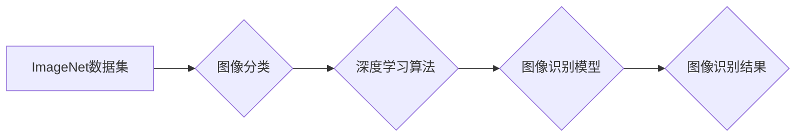

> ImageNet, 深度学习, 计算机视觉, 迁移学习, 人工智能发展

## 1. 背景介绍

20世纪90年代末，随着互联网的快速发展，海量图像数据开始涌现。然而，传统的计算机视觉算法在处理如此庞大的图像数据时遇到了瓶颈。为了解决这一问题，斯坦福大学的研究人员于2009年发起了一个名为ImageNet的项目，旨在构建一个包含超过1400万张图像的巨型图像数据集，并举办每年一次的ImageNet图像识别挑战赛。

ImageNet的出现标志着计算机视觉领域进入了一个新的时代。它为深度学习算法提供了充足的训练数据，促进了深度学习算法的快速发展，并推动了人工智能的整体进步。

## 2. 核心概念与联系

ImageNet是一个大型的图像识别数据集，包含来自不同类别的大量图像。它包含了超过20,000个类别，涵盖了从动物到物体、场景到人物等各种主题。

**ImageNet与深度学习的关系:**

深度学习是一种机器学习方法，它利用多层神经网络来学习数据中的复杂模式。ImageNet提供了大量的训练数据，使得深度学习算法能够学习到更复杂的图像特征，从而提高图像识别精度。

**ImageNet与迁移学习的关系:**

迁移学习是一种机器学习方法，它利用预训练模型的知识来解决新的任务。由于ImageNet数据集庞大，预训练的ImageNet模型能够学习到通用的图像特征，这些特征可以迁移到其他图像识别任务中，从而提高效率和性能。

**ImageNet的架构:**



## 3. 核心算法原理 & 具体操作步骤

### 3.1  算法原理概述

ImageNet图像识别挑战赛中，常用的算法是卷积神经网络（CNN）。CNN是一种专门用于处理图像数据的深度学习算法，它利用卷积层、池化层和全连接层来提取图像特征。

**卷积层:** 卷积层使用卷积核对图像进行卷积运算，提取图像局部特征。

**池化层:** 池化层对卷积层的输出进行降维，减少计算量并提高模型鲁棒性。

**全连接层:** 全连接层将池化层的输出连接起来，进行分类预测。

### 3.2  算法步骤详解

1. **数据预处理:** 将图像数据进行裁剪、缩放、归一化等预处理操作，使其符合模型输入要求。
2. **模型训练:** 使用训练数据训练CNN模型，调整模型参数，使模型能够准确识别图像类别。
3. **模型评估:** 使用测试数据评估模型性能，计算模型的准确率、召回率等指标。
4. **模型调优:** 根据评估结果，调整模型结构、超参数等，提高模型性能。
5. **模型部署:** 将训练好的模型部署到实际应用场景中，用于图像识别任务。

### 3.3  算法优缺点

**优点:**

* 能够学习到复杂的图像特征。
* 性能优于传统的计算机视觉算法。
* 迁移学习能力强，可以应用于其他图像识别任务。

**缺点:**

* 训练数据量大，需要大量的计算资源。
* 模型参数多，容易过拟合。
* 对数据质量要求高，数据噪声会影响模型性能。

### 3.4  算法应用领域

CNN算法在图像识别领域有着广泛的应用，例如：

* **人脸识别:** 用于识别和验证用户的身份。
* **物体检测:** 用于检测图像中存在的物体，并进行定位和分类。
* **图像分类:** 用于将图像归类到特定的类别。
* **医疗图像分析:** 用于辅助医生诊断疾病。
* **自动驾驶:** 用于识别道路上的障碍物和交通信号。

## 4. 数学模型和公式 & 详细讲解 & 举例说明

### 4.1  数学模型构建

CNN模型的数学模型主要包括卷积层、池化层和全连接层。

**卷积层:**

卷积层使用卷积核对图像进行卷积运算，卷积核是一个小的矩阵，它会滑动在图像上，并与图像局部区域进行点乘运算。卷积运算的结果是一个特征图，它包含了图像局部特征的信息。

**池化层:**

池化层对卷积层的输出进行降维，常用的池化方法是最大池化和平均池化。最大池化选择每个池化窗口中的最大值，平均池化则计算每个池化窗口的平均值。

**全连接层:**

全连接层将池化层的输出连接起来，每个神经元都与前一层的所有神经元连接。全连接层用于进行分类预测。

### 4.2  公式推导过程

**卷积运算公式:**

$$
y_{i,j} = \sum_{m=0}^{M-1} \sum_{n=0}^{N-1} x_{i+m,j+n} * w_{m,n}
$$

其中:

* $y_{i,j}$ 是卷积核输出的像素值。
* $x_{i+m,j+n}$ 是输入图像的像素值。
* $w_{m,n}$ 是卷积核的权值。
* $M$ 和 $N$ 是卷积核的大小。

**最大池化公式:**

$$
y_{i,j} = \max_{m=0}^{k-1} \max_{n=0}^{l-1} x_{i+m,j+n}
$$

其中:

* $y_{i,j}$ 是最大池化层的输出像素值。
* $x_{i+m,j+n}$ 是输入图像的像素值。
* $k$ 和 $l$ 是池化窗口的大小。

### 4.3  案例分析与讲解

**图像分类案例:**

假设我们有一个包含猫和狗的图像数据集，我们使用CNN模型进行图像分类。

1. **数据预处理:** 将图像数据进行裁剪、缩放、归一化等预处理操作。
2. **模型训练:** 使用训练数据训练CNN模型，调整模型参数，使模型能够准确识别猫和狗。
3. **模型评估:** 使用测试数据评估模型性能，计算模型的准确率、召回率等指标。
4. **模型调优:** 根据评估结果，调整模型结构、超参数等，提高模型性能。

## 5. 项目实践：代码实例和详细解释说明

### 5.1  开发环境搭建

* 操作系统: Ubuntu 18.04
* Python 版本: 3.6
* 深度学习框架: TensorFlow 2.0

### 5.2  源代码详细实现

```python
import tensorflow as tf

# 定义卷积神经网络模型
model = tf.keras.models.Sequential([
    tf.keras.layers.Conv2D(32, (3, 3), activation='relu', input_shape=(224, 224, 3)),
    tf.keras.layers.MaxPooling2D((2, 2)),
    tf.keras.layers.Conv2D(64, (3, 3), activation='relu'),
    tf.keras.layers.MaxPooling2D((2, 2)),
    tf.keras.layers.Flatten(),
    tf.keras.layers.Dense(10, activation='softmax')
])

# 编译模型
model.compile(optimizer='adam',
              loss='sparse_categorical_crossentropy',
              metrics=['accuracy'])

# 训练模型
model.fit(x_train, y_train, epochs=10)

# 评估模型
loss, accuracy = model.evaluate(x_test, y_test)
print('Test loss:', loss)
print('Test accuracy:', accuracy)
```

### 5.3  代码解读与分析

* **定义模型结构:** 使用`tf.keras.models.Sequential`定义一个顺序模型，并添加卷积层、池化层和全连接层。
* **编译模型:** 使用`model.compile`方法编译模型，指定优化器、损失函数和评价指标。
* **训练模型:** 使用`model.fit`方法训练模型，传入训练数据和训练轮数。
* **评估模型:** 使用`model.evaluate`方法评估模型性能，传入测试数据。

### 5.4  运行结果展示

训练完成后，模型会输出测试集上的损失值和准确率。

## 6. 实际应用场景

ImageNet图像识别挑战赛的成果在各个领域都有广泛的应用，例如：

* **自动驾驶:** 用于识别道路上的障碍物和交通信号，提高自动驾驶系统的安全性。
* **医疗诊断:** 用于辅助医生诊断疾病，例如识别肿瘤、骨折等。
* **人脸识别:** 用于识别和验证用户的身份，例如在手机解锁、支付等场景中。
* **图像搜索:** 用于根据图像内容进行搜索，例如查找类似的图片或产品。

### 6.4  未来应用展望

随着深度学习技术的不断发展，ImageNet图像识别挑战赛的成果将在未来发挥更重要的作用。例如:

* **更精准的图像识别:** 随着模型的不断改进，图像识别精度将进一步提高，能够识别更细致的图像特征。
* **更广泛的应用场景:** ImageNet图像识别技术将应用于更多领域，例如智能家居、机器人等。
* **更智能的图像理解:** 未来，图像识别技术将不仅仅是识别图像内容，还会能够理解图像的语义和上下文信息。

## 7. 工具和资源推荐

### 7.1  学习资源推荐

* **斯坦福大学CS231n课程:** https://cs231n.stanford.edu/
* **Deep Learning Book:** https://www.deeplearningbook.org/
* **TensorFlow官方文档:** https://www.tensorflow.org/

### 7.2  开发工具推荐

* **TensorFlow:** https://www.tensorflow.org/
* **PyTorch:** https://pytorch.org/
* **Keras:** https://keras.io/

### 7.3  相关论文推荐

* **ImageNet Classification with Deep Convolutional Neural Networks:** https://arxiv.org/abs/1202.1409
* **Deep Residual Learning for Image Recognition:** https://arxiv.org/abs/1512.03385
* **Attention Is All You Need:** https://arxiv.org/abs/1706.03762

## 8. 总结：未来发展趋势与挑战

### 8.1  研究成果总结

ImageNet图像识别挑战赛促进了深度学习算法的快速发展，并推动了人工智能的整体进步。CNN算法在图像识别领域取得了显著的成果，并在各个领域都有广泛的应用。

### 8.2  未来发展趋势

* **模型更深更广:** 未来深度学习模型将更加深层、更加广阔，能够学习到更复杂的图像特征。
* **迁移学习更强:** 迁移学习技术将更加成熟，能够将预训练模型的知识迁移到更多新的任务中。
* **解释性更强:** 深度学习模型的解释性将更加强，能够更好地理解模型的决策过程。

### 8.3  面临的挑战

* **数据获取和标注:** 深度学习模型需要大量的训练数据，数据获取和标注仍然是一个挑战。
* **模型可解释性:** 深度学习模型的决策过程难以解释，这限制了模型在一些安全关键领域中的应用。
* **计算资源:** 训练大型深度学习模型需要大量的计算资源，这对于一些资源有限的机构来说是一个挑战。

### 8.4  研究展望

未来，研究人员将继续探索新的深度学习算法和模型架构，提高图像识别精度和效率。同时，也将致力于解决深度学习模型的可解释性和公平性问题，使其能够更好地服务于人类社会。

## 9. 附录：常见问题与解答

**Q1: ImageNet数据集包含哪些类别？**

A1: ImageNet数据集包含超过20,000个类别，涵盖了从动物到物体、场景