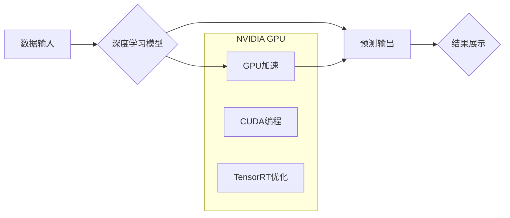

> NVIDIA, AI, 算力, GPU, 深度学习, 异构计算, CUDA, TensorRT, AIoT

## 1. 背景介绍

人工智能（AI）正以惊人的速度发展，其应用领域不断扩展，从自动驾驶到医疗诊断，再到金融分析，AI正在深刻地改变着我们的生活。然而，AI的发展离不开强大的算力支撑。作为全球领先的GPU厂商，NVIDIA在AI算力领域扮演着至关重要的角色。

近年来，NVIDIA持续加大对AI算力的投入，推出了多款高性能GPU，并开发了一系列AI软件工具和平台，为AI开发者和研究者提供了强大的硬件和软件支持。

## 2. 核心概念与联系

**2.1 核心概念**

* **GPU (Graphics Processing Unit):**  GPU最初设计用于处理图形渲染，但其并行计算能力使其也成为AI训练和推理的理想选择。
* **深度学习 (Deep Learning):** 深度学习是一种机器学习的子集，利用多层神经网络来模拟人类大脑的学习过程，能够从海量数据中学习复杂的模式和特征。
* **算力 (Compute Power):** 算力是指计算机系统执行计算任务的速度和效率，是AI训练和推理的关键因素。

**2.2 联系**

NVIDIA的GPU凭借其强大的并行计算能力，为深度学习算法提供了高效的执行环境。深度学习算法通过训练大量的样本数据，学习复杂的模式和特征，从而实现各种AI应用。

**2.3 架构流程图**



## 3. 核心算法原理 & 具体操作步骤

**3.1 算法原理概述**

深度学习算法的核心是多层神经网络，它由多个神经元组成的层级结构组成。每个神经元接收来自上一层的输入信号，并通过激活函数进行处理，输出到下一层。通过训练，神经网络的参数会不断调整，以最小化预测误差，从而实现对数据的学习和模式识别。

**3.2 算法步骤详解**

1. **数据预处理:** 将原始数据转换为深度学习模型可以理解的格式，例如归一化、编码等。
2. **模型构建:** 根据任务需求选择合适的深度学习模型架构，例如卷积神经网络 (CNN)、循环神经网络 (RNN) 等。
3. **模型训练:** 使用训练数据训练模型，通过反向传播算法调整模型参数，以最小化预测误差。
4. **模型评估:** 使用测试数据评估模型的性能，例如准确率、召回率等。
5. **模型部署:** 将训练好的模型部署到实际应用场景中，用于预测或推理。

**3.3 算法优缺点**

**优点:**

* 能够学习复杂的模式和特征。
* 性能优于传统机器学习算法。
* 应用领域广泛。

**缺点:**

* 训练数据量大，需要大量计算资源。
* 模型解释性差，难以理解模型的决策过程。
* 对数据质量要求高，数据噪声会影响模型性能。

**3.4 算法应用领域**

* **计算机视觉:** 图像识别、物体检测、图像分割等。
* **自然语言处理:** 文本分类、机器翻译、语音识别等。
* **医疗诊断:** 病理图像分析、疾病预测等。
* **金融分析:** 风险评估、欺诈检测等。

## 4. 数学模型和公式 & 详细讲解 & 举例说明

**4.1 数学模型构建**

深度学习模型的核心是神经网络，其数学模型可以表示为一系列的矩阵运算和激活函数。

**4.2 公式推导过程**

* **前向传播:**

$$
y = f(W^L x^L + b^L)
$$

其中：

* $y$ 是输出向量。
* $f$ 是激活函数。
* $W^L$ 是第 $L$ 层的权重矩阵。
* $x^L$ 是第 $L$ 层的输入向量。
* $b^L$ 是第 $L$ 层的偏置向量。

* **反向传播:**

$$
\frac{\partial Loss}{\partial W^L} = \frac{\partial Loss}{\partial y} \cdot \frac{\partial y}{\partial W^L}
$$

其中：

* $Loss$ 是损失函数。

**4.3 案例分析与讲解**

假设我们有一个简单的线性回归问题，目标是预测房价。我们可以使用一个单层神经网络模型，输入特征包括房屋面积和房间数量，输出房价。

通过训练数据，模型会学习到权重和偏置，使得预测的房价与实际房价的误差最小化。

## 5. 项目实践：代码实例和详细解释说明

**5.1 开发环境搭建**

* 操作系统: Ubuntu 20.04
* CUDA Toolkit: 11.4
* cuDNN: 8.1
* Python: 3.8
* 深度学习框架: TensorFlow 2.x

**5.2 源代码详细实现**

```python
import tensorflow as tf

# 定义模型
model = tf.keras.models.Sequential([
    tf.keras.layers.Dense(64, activation='relu', input_shape=(2,)),
    tf.keras.layers.Dense(1)
])

# 编译模型
model.compile(optimizer='adam', loss='mse')

# 训练模型
model.fit(x_train, y_train, epochs=10)

# 评估模型
loss = model.evaluate(x_test, y_test)
print('Loss:', loss)

# 预测房价
new_house = [[100, 2]]
prediction = model.predict(new_house)
print('Predicted price:', prediction)
```

**5.3 代码解读与分析**

* 代码首先定义了一个简单的线性回归模型，包含两层全连接神经网络。
* 然后，模型被编译，指定了优化器、损失函数等参数。
* 接着，模型使用训练数据进行训练，训练过程会不断调整模型参数，以最小化预测误差。
* 最后，模型被评估，并使用新的数据进行预测。

**5.4 运行结果展示**

运行代码后，会输出模型的训练损失和预测结果。

## 6. 实际应用场景

**6.1 自动驾驶**

NVIDIA的GPU在自动驾驶领域发挥着至关重要的作用，用于处理车辆周围环境的感知数据，例如摄像头、雷达和激光雷达的输出。

**6.2 医疗诊断**

NVIDIA的AI平台可以帮助医生更快、更准确地诊断疾病，例如癌症、心血管疾病等。

**6.3 金融分析**

NVIDIA的GPU可以加速金融分析任务，例如风险评估、欺诈检测等。

**6.4 未来应用展望**

随着AI技术的不断发展，NVIDIA的GPU将在更多领域发挥作用，例如：

* **工业自动化:** 智能机器人、预测性维护等。
* **智慧城市:** 交通管理、环境监测等。
* **教育:** 个性化学习、智能辅导等。

## 7. 工具和资源推荐

**7.1 学习资源推荐**

* **NVIDIA Deep Learning Institute (DLI):** 提供各种深度学习课程和培训资源。
* **TensorFlow官方文档:** https://www.tensorflow.org/
* **PyTorch官方文档:** https://pytorch.org/

**7.2 开发工具推荐**

* **CUDA Toolkit:** NVIDIA的GPU编程平台。
* **cuDNN:** NVIDIA的深度学习库。
* **TensorFlow:** 开源深度学习框架。
* **PyTorch:** 开源深度学习框架。

**7.3 相关论文推荐**

* **ImageNet Classification with Deep Convolutional Neural Networks:** https://arxiv.org/abs/1202.1444
* **Attention Is All You Need:** https://arxiv.org/abs/1706.03762

## 8. 总结：未来发展趋势与挑战

**8.1 研究成果总结**

NVIDIA在AI算力领域取得了显著的成就，其GPU和软件工具为AI发展提供了强大的支持。深度学习算法在各个领域取得了突破性进展，推动了AI技术的快速发展。

**8.2 未来发展趋势**

* **异构计算:** 将CPU、GPU、FPGA等多种计算资源整合在一起，以提高计算效率。
* **边缘计算:** 将AI计算能力部署到边缘设备，实现实时数据处理和决策。
* **AIoT:** 将AI技术与物联网技术结合，构建智能感知和控制系统。

**8.3 面临的挑战**

* **算力需求:** AI模型的训练和推理需要大量的算力，如何满足不断增长的算力需求是一个挑战。
* **数据隐私:** AI模型的训练需要大量数据，如何保护数据隐私是一个重要问题。
* **模型可解释性:** 深度学习模型的决策过程难以理解，如何提高模型的可解释性是一个研究方向。

**8.4 研究展望**

未来，AI算力将继续发展，新的算法、架构和硬件将不断涌现。AI技术将更加深入地融入到我们的生活，为人类社会带来更多福祉。

## 9. 附录：常见问题与解答

**9.1 如何选择合适的GPU？**

选择合适的GPU取决于具体的应用场景和算力需求。NVIDIA提供了一系列GPU产品，从入门级到高端，可以满足不同用户的需求。

**9.2 如何使用CUDA编程？**

NVIDIA提供CUDA Toolkit，包含了开发和调试CUDA程序所需的工具和库。

**9.3 如何优化深度学习模型的性能？**

可以通过多种方法优化深度学习模型的性能，例如：

* 使用更有效的激活函数。
* 调整模型的架构。
* 使用数据增强技术。
* 利用GPU加速。


作者：禅与计算机程序设计艺术 / Zen and the Art of Computer Programming 
<end_of_turn>