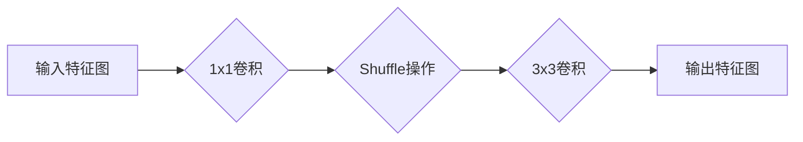

> ShuffleNet,深度学习,卷积神经网络,移动端,高效算法,压缩模型

## 1. 背景介绍

随着深度学习技术的蓬勃发展，卷积神经网络（CNN）在图像识别、目标检测、语义分割等领域取得了显著的成果。然而，传统的CNN模型通常具有参数量大、计算复杂度高的问题，难以在资源受限的移动设备上高效运行。为了解决这一难题，近年来，研究者们提出了许多轻量级CNN模型，例如MobileNet、EfficientNet、ShuffleNet等。

ShuffleNet作为一种高效的轻量级CNN模型，在保持较高准确率的同时，显著降低了模型参数量和计算复杂度。它通过引入“Shuffle操作”来重构网络结构，有效提升了模型的效率。本文将详细介绍ShuffleNet的原理、算法步骤、数学模型以及代码实例，并探讨其在实际应用场景中的优势和挑战。

## 2. 核心概念与联系

ShuffleNet的核心思想是通过“Shuffle操作”来重构网络结构，有效提升模型的效率。

**2.1 Shuffle操作**

Shuffle操作是一种特殊的卷积操作，它将特征图的通道进行重新排列，并将其分组进行卷积。具体来说，Shuffle操作分为以下几个步骤：

1. 将输入特征图的通道划分为若干组。
2. 对每组通道进行1x1卷积，将通道维度压缩。
3. 将压缩后的通道进行排列，形成新的特征图。
4. 对新的特征图进行分组卷积，提升特征提取能力。

**2.2 ShuffleNet架构**

ShuffleNet的网络架构由多个“ShuffleBlock”组成，每个ShuffleBlock包含以下几个部分：

1. **输入层:** 接收上一层的输出特征图。
2. **1x1卷积层:** 将通道维度压缩，减少参数量。
3. **Shuffle操作:** 对通道进行重新排列和分组卷积。
4. **3x3卷积层:** 提取特征，提升模型表达能力。
5. **输出层:** 输出经过Shuffle操作和卷积后的特征图。

**2.3 Mermaid 流程图**



## 3. 核心算法原理 & 具体操作步骤

### 3.1  算法原理概述

ShuffleNet的核心算法原理是通过Shuffle操作来重构网络结构，有效提升模型的效率。Shuffle操作通过通道重新排列和分组卷积，可以有效减少模型参数量和计算复杂度，同时保持较高的准确率。

### 3.2  算法步骤详解

1. **输入特征图:** 将上一层的输出特征图作为输入。
2. **1x1卷积:** 对输入特征图进行1x1卷积，将通道维度压缩，减少参数量。
3. **Shuffle操作:** 对压缩后的通道进行重新排列，并将其分组进行卷积。
4. **3x3卷积:** 对Shuffle操作后的特征图进行3x3卷积，提取特征，提升模型表达能力。
5. **输出特征图:** 将经过Shuffle操作和卷积后的特征图作为输出，传递给下一层。

### 3.3  算法优缺点

**优点:**

* **高效性:** Shuffle操作有效减少了模型参数量和计算复杂度，提升了模型的效率。
* **准确率:** ShuffleNet在保持较高准确率的同时，显著降低了模型参数量和计算复杂度。
* **可扩展性:** ShuffleNet的网络结构可以根据实际需求进行调整，例如增加或减少ShuffleBlock的数量。

**缺点:**

* **复杂度:** Shuffle操作的实现相对复杂，需要一定的编程经验。
* **参数调优:** ShuffleNet的超参数需要进行仔细的调优，才能达到最佳的性能。

### 3.4  算法应用领域

ShuffleNet由于其高效性和准确性，在以下领域具有广泛的应用前景:

* **移动设备图像识别:** ShuffleNet可以用于在移动设备上进行图像识别、物体检测、人脸识别等任务。
* **嵌入式系统视觉处理:** ShuffleNet可以用于嵌入式系统进行图像处理、视频分析等任务。
* **边缘计算:** ShuffleNet可以用于边缘计算平台进行图像识别、物体检测等任务。

## 4. 数学模型和公式 & 详细讲解 & 举例说明

### 4.1  数学模型构建

ShuffleNet的数学模型主要包括以下几个部分:

* **1x1卷积:** 使用卷积核大小为1x1的卷积操作，将通道维度压缩。
* **Shuffle操作:** 将通道进行重新排列，并将其分组进行卷积。
* **3x3卷积:** 使用卷积核大小为3x3的卷积操作，提取特征。

### 4.2  公式推导过程

**1x1卷积:**

$$
y_{i,j,k} = \sum_{l=0}^{C-1} w_{i,j,k,l} x_{i,j,l} + b_{k}
$$

其中:

* $y_{i,j,k}$ 是输出特征图的第k个通道，位置(i,j)上的值。
* $x_{i,j,l}$ 是输入特征图的第l个通道，位置(i,j)上的值。
* $w_{i,j,k,l}$ 是卷积核的第k个通道，位置(i,j)上的权重。
* $b_{k}$ 是第k个通道的偏置项。

**Shuffle操作:**

Shuffle操作的数学模型较为复杂，需要根据具体的实现方式进行描述。

**3x3卷积:**

$$
y_{i,j,k} = \sum_{m=-1}^{1} \sum_{n=-1}^{1} w_{i,j,k,m,n} x_{i+m,j+n,l} + b_{k}
$$

其中:

* $y_{i,j,k}$ 是输出特征图的第k个通道，位置(i,j)上的值。
* $x_{i+m,j+n,l}$ 是输入特征图的第l个通道，位置(i+m,j+n)上的值。
* $w_{i,j,k,m,n}$ 是卷积核的第k个通道，位置(i,j)上的权重。
* $b_{k}$ 是第k个通道的偏置项。

### 4.3  案例分析与讲解

假设输入特征图的大小为32x32x16，通道数为16。

1. **1x1卷积:** 将通道维度压缩为8，输出特征图的大小为32x32x8。
2. **Shuffle操作:** 将8个通道进行重新排列，并将其分组进行卷积，例如将通道分组为4组，每组2个通道。
3. **3x3卷积:** 对Shuffle操作后的特征图进行3x3卷积，提取特征，输出特征图的大小为32x32x16。

## 5. 项目实践：代码实例和详细解释说明

### 5.1  开发环境搭建

* Python 3.6+
* TensorFlow 2.0+
* CUDA 10.0+ (可选)

### 5.2  源代码详细实现

```python
import tensorflow as tf

def shuffle_block(inputs, num_channels, groups):
    # 1x1卷积
    x = tf.keras.layers.Conv2D(num_channels, 1, padding='same')(inputs)
    # Shuffle操作
    x = tf.keras.layers.Permute((2, 1, 3))(x)  # 重新排列通道维度
    x = tf.keras.layers.Reshape((-1, num_channels // groups))(x)  # 分组
    x = tf.keras.layers.Conv2D(num_channels, 3, padding='same', groups=groups)(x)
    x = tf.keras.layers.Reshape((inputs.shape[1], inputs.shape[2], num_channels))(x)  # 还原形状
    # 3x3卷积
    x = tf.keras.layers.Conv2D(num_channels, 3, padding='same')(x)
    return x

# 定义ShuffleNet模型
def shuffle_net(input_shape, num_classes):
    inputs = tf.keras.Input(shape=input_shape)
    x = shuffle_block(inputs, 24, 3)
    x = shuffle_block(x, 48, 3)
    x = shuffle_block(x, 96, 3)
    x = tf.keras.layers.GlobalAveragePooling2D()(x)
    outputs = tf.keras.layers.Dense(num_classes, activation='softmax')(x)
    model = tf.keras.Model(inputs=inputs, outputs=outputs)
    return model

# 实例化模型
model = shuffle_net(input_shape=(224, 224, 3), num_classes=10)
model.summary()
```

### 5.3  代码解读与分析

* **shuffle_block函数:** 定义了ShuffleNet的基本构建单元，包含1x1卷积、Shuffle操作和3x3卷积。
* **shuffle_net函数:** 定义了完整的ShuffleNet模型，包含多个ShuffleBlock和全连接层。
* **实例化模型:** 实例化ShuffleNet模型，并打印模型结构。

### 5.4  运行结果展示

运行代码后，可以得到ShuffleNet模型的结构信息，并根据实际需求进行训练和测试。

## 6. 实际应用场景

ShuffleNet在移动设备图像识别、嵌入式系统视觉处理、边缘计算等领域具有广泛的应用前景。

### 6.1  移动设备图像识别

ShuffleNet可以用于在移动设备上进行图像识别、物体检测、人脸识别等任务。由于其高效性，可以保证在移动设备上实现实时识别。

### 6.2  嵌入式系统视觉处理

ShuffleNet可以用于嵌入式系统进行图像处理、视频分析等任务。由于其轻量级特性，可以满足嵌入式系统的资源限制。

### 6.3  边缘计算

ShuffleNet可以用于边缘计算平台进行图像识别、物体检测等任务。由于其高效性，可以降低边缘计算平台的功耗和延迟。

### 6.4  未来应用展望

随着深度学习技术的不断发展，ShuffleNet的应用场景将会更加广泛。例如，可以将其应用于自动驾驶、医疗诊断、智能家居等领域。

## 7. 工具和资源推荐

### 7.1  学习资源推荐

* **论文:** ShuffleNet: An Extremely Efficient Convolutional Neural Network for Mobile Devices
* **博客:** https://blog.tensorflow.org/
* **在线课程:** https://www.coursera.org/

### 7.2  开发工具推荐

* **TensorFlow:** https://www.tensorflow.org/
* **PyTorch:** https://pytorch.org/

### 7.3  相关论文推荐

* MobileNetV2: Inverted Residuals and Linear Bottlenecks
* EfficientNet: Rethinking Model Scaling for Convolutional Neural Networks

## 8. 总结：未来发展趋势与挑战

### 8.1  研究成果总结

ShuffleNet作为一种高效的轻量级CNN模型，在保持较高准确率的同时，显著降低了模型参数量和计算复杂度。它通过Shuffle操作重构网络结构，有效提升了模型的效率。

### 8.2  未来发展趋势

未来，ShuffleNet的研究方向将主要集中在以下几个方面:

* **模型压缩:** 进一步压缩模型参数量，降低模型的存储和计算成本。
* **性能提升:** 提升模型的准确率，使其在更广泛的应用场景中发挥作用。
* **硬件加速:** 利用硬件加速技术，提升模型的运行速度。

### 8.3  面临的挑战

ShuffleNet的研究也面临着一些挑战:

*