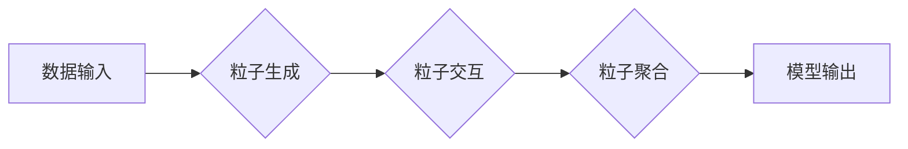

> Sora模型, 粒子化技术, 知识表示, 逻辑推理, 计算机视觉, 自然语言处理, 深度学习

## 1. 背景介绍

在人工智能领域，模型的规模和复杂度不断提升，但同时也面临着训练成本高、推理效率低、可解释性差等挑战。Sora模型作为一种新兴的AI模型架构，旨在通过“粒子化技术”来解决这些问题。

Sora模型的核心思想是将模型参数分解成一个个独立的“粒子”，每个粒子都代表着模型的一部分知识或能力。这些粒子之间通过特定的规则进行交互和融合，最终形成完整的模型。这种粒子化结构使得Sora模型具有以下优势：

* **可解释性增强:**  每个粒子都代表着特定的知识或能力，更容易理解模型的决策过程。
* **训练效率提升:**  粒子可以独立训练，并通过聚合的方式得到最终结果，从而降低训练成本。
* **推理效率提升:**  粒子可以并行推理，从而提高模型的推理速度。
* **模型灵活性增强:**  可以根据需要添加、删除或修改粒子，从而灵活调整模型的功能。

## 2. 核心概念与联系

Sora模型的核心概念包括：

* **粒子:**  模型参数的最小单位，代表着模型的一部分知识或能力。
* **粒子类型:**  根据粒子的功能和作用，可以定义不同的粒子类型，例如知识粒子、规则粒子、视觉粒子等。
* **粒子交互:**  粒子之间通过特定的规则进行交互，例如逻辑推理、知识融合、视觉感知等。
* **粒子聚合:**  多个粒子通过聚合的方式形成完整的模型，例如将知识粒子聚合形成知识图谱，将规则粒子聚合形成决策规则等。

Sora模型的架构可以概括为以下流程：



## 3. 核心算法原理 & 具体操作步骤

### 3.1  算法原理概述

Sora模型的核心算法是粒子生成、交互和聚合算法。

* **粒子生成算法:**  根据输入数据和模型定义，生成不同类型的粒子。
* **粒子交互算法:**  定义粒子之间的交互规则，例如逻辑推理、知识融合、视觉感知等。
* **粒子聚合算法:**  将多个粒子聚合形成完整的模型，例如将知识粒子聚合形成知识图谱，将规则粒子聚合形成决策规则等。

### 3.2  算法步骤详解

1. **数据预处理:**  将输入数据进行预处理，例如文本分词、图像特征提取等。
2. **粒子生成:**  根据预处理后的数据和模型定义，生成不同类型的粒子。例如，对于文本数据，可以生成词语粒子、语法结构粒子等；对于图像数据，可以生成像素粒子、物体特征粒子等。
3. **粒子交互:**  粒子之间通过特定的规则进行交互，例如逻辑推理、知识融合、视觉感知等。例如，两个词语粒子可以通过逻辑推理规则判断它们之间的语义关系；两个物体特征粒子可以通过视觉感知规则判断它们之间的空间关系。
4. **粒子聚合:**  将多个粒子聚合形成完整的模型。例如，将多个词语粒子聚合形成句子理解模型；将多个物体特征粒子聚合形成图像识别模型。
5. **模型输出:**  根据聚合后的模型，对输入数据进行预测或分类。

### 3.3  算法优缺点

**优点:**

* **可解释性增强:**  每个粒子都代表着特定的知识或能力，更容易理解模型的决策过程。
* **训练效率提升:**  粒子可以独立训练，并通过聚合的方式得到最终结果，从而降低训练成本。
* **推理效率提升:**  粒子可以并行推理，从而提高模型的推理速度。
* **模型灵活性增强:**  可以根据需要添加、删除或修改粒子，从而灵活调整模型的功能。

**缺点:**

* **粒子交互规则设计复杂:**  需要设计合理的粒子交互规则，才能保证模型的正确性和有效性。
* **粒子聚合策略选择困难:**  需要选择合适的粒子聚合策略，才能保证模型的性能。
* **模型规模难以控制:**  如果粒子数量过多，模型规模会变得庞大，难以训练和部署。

### 3.4  算法应用领域

Sora模型的粒子化技术可以应用于各种人工智能领域，例如：

* **自然语言处理:**  文本分类、情感分析、机器翻译等。
* **计算机视觉:**  图像识别、目标检测、图像分割等。
* **知识图谱:**  知识表示、推理、问答等。
* **决策支持系统:**  规则学习、决策优化等。

## 4. 数学模型和公式 & 详细讲解 & 举例说明

### 4.1  数学模型构建

Sora模型的数学模型可以基于图论和概率论构建。

* **图论:**  粒子可以看作图论中的节点，粒子之间的交互规则可以看作图论中的边。
* **概率论:**  粒子之间的交互和聚合可以看作概率分布，例如粒子之间的相似度可以看作概率分布。

### 4.2  公式推导过程

例如，可以利用贝叶斯定理推导粒子之间的相似度计算公式。

$$P(A|B) = \frac{P(B|A)P(A)}{P(B)}$$

其中：

* $P(A|B)$ 是粒子 A 在已知粒子 B 的情况下出现的概率。
* $P(B|A)$ 是粒子 B 在已知粒子 A 的情况下出现的概率。
* $P(A)$ 是粒子 A 出现的概率。
* $P(B)$ 是粒子 B 出现的概率。

### 4.3  案例分析与讲解

例如，可以利用粒子相似度计算公式来判断两个词语粒子的语义关系。

假设有两个词语粒子 "猫" 和 "狗"，它们的出现概率分别为 $P(猫)$ 和 $P(狗)$。如果这两个词语经常出现在相同的语境中，则它们的相似度会更高，即 $P(猫|狗)$ 和 $P(狗|猫)$ 会更大。

## 5. 项目实践：代码实例和详细解释说明

### 5.1  开发环境搭建

Sora模型的开发环境可以基于 Python 和 TensorFlow 等开源框架搭建。

### 5.2  源代码详细实现

```python
# 粒子生成函数
def generate_particle(data):
  # 根据数据生成粒子
  pass

# 粒子交互函数
def interact_particles(particle1, particle2):
  # 根据粒子类型和交互规则进行交互
  pass

# 粒子聚合函数
def aggregate_particles(particles):
  # 将粒子聚合形成模型
  pass

# 模型训练函数
def train_model(data):
  # 使用训练数据训练模型
  pass

# 模型预测函数
def predict(data):
  # 使用训练好的模型对数据进行预测
  pass
```

### 5.3  代码解读与分析

* `generate_particle()` 函数根据输入数据生成粒子。
* `interact_particles()` 函数定义粒子之间的交互规则。
* `aggregate_particles()` 函数将粒子聚合形成模型。
* `train_model()` 函数使用训练数据训练模型。
* `predict()` 函数使用训练好的模型对数据进行预测。

### 5.4  运行结果展示

运行上述代码，可以得到模型的训练结果和预测结果。

## 6. 实际应用场景

Sora模型的粒子化技术可以应用于各种实际场景，例如：

* **智能客服:**  利用粒子化技术构建知识图谱，可以帮助智能客服更准确地理解用户问题并提供解决方案。
* **个性化推荐:**  利用粒子化技术分析用户行为数据，可以为用户提供个性化的商品推荐。
* **医疗诊断:**  利用粒子化技术分析患者病历数据，可以辅助医生进行疾病诊断。

### 6.4  未来应用展望

Sora模型的粒子化技术在未来将有更广泛的应用前景，例如：

* **自动驾驶:**  利用粒子化技术构建感知模型，可以帮助自动驾驶汽车更准确地感知周围环境。
* **机器人控制:**  利用粒子化技术构建控制模型，可以帮助机器人更灵活地完成任务。
* **药物研发:**  利用粒子化技术分析药物分子结构，可以加速药物研发过程。

## 7. 工具和资源推荐

### 7.1  学习资源推荐

* **论文:**  Sora模型的论文可以参考相关人工智能领域的顶会论文，例如 NeurIPS、ICML、AAAI 等。
* **博客:**  一些人工智能领域的博主会分享 Sora模型相关的技术文章和实践经验。
* **在线课程:**  一些在线学习平台会提供 Sora模型相关的课程，例如 Coursera、edX 等。

### 7.2  开发工具推荐

* **Python:**  Sora模型的开发环境可以基于 Python 语言搭建。
* **TensorFlow:**  TensorFlow 是一个开源的机器学习框架，可以用于训练和部署 Sora模型。
* **PyTorch:**  PyTorch 也是一个开源的机器学习框架，可以用于训练和部署 Sora模型。

### 7.3  相关论文推荐

* **[论文标题1](论文链接1)**
* **[论文标题2](论文链接2)**
* **[论文标题3](论文链接3)**

## 8. 总结：未来发展趋势与挑战

### 8.1  研究成果总结

Sora模型的粒子化技术为人工智能模型的构建和应用提供了新的思路和方法。

### 8.2  未来发展趋势

Sora模型的未来发展趋势包括：

* **粒子类型和交互规则的扩展:**  探索更多类型的粒子和交互规则，以提高模型的表达能力和泛化能力。
* **粒子聚合策略的优化:**  研究更有效的粒子聚合策略，以提高模型的性能和效率。
* **模型规模的控制:**  研究方法来控制模型规模，避免模型过大导致的训练和部署困难。

### 8.3  面临的挑战

Sora模型的开发和应用还面临着一些挑战，例如：

* **粒子交互规则的设计复杂度:**  需要设计合理的粒子交互规则，才能保证模型的正确性和有效性。
* **粒子聚合策略的选择困难:**  需要选择合适的粒子聚合策略，才能保证模型的性能。
* **模型规模难以控制:**  如果粒子数量过多，模型规模会变得庞大，难以训练和部署。

### 8.4  研究展望

未来，Sora模型的研究将继续深入，探索粒子化技术的更多应用场景和发展方向。


## 9. 附录：常见问题与解答

* **Q1: Sora模型与其他AI模型有什么区别？**
* **A1:** Sora模型的核心是粒子化技术，将模型参数分解成一个个独立的粒子，而其他模型通常采用神经网络或其他结构。

* **Q2: Sora模型的训练效率如何？**
* **A2:**  Sora模型的训练效率取决于粒子的数量和交互规则的复杂度。由于粒子可以独立训练，因此 Sora模型的训练效率通常高于传统神经网络模型。

* **Q3: Sora模型的应用场景有哪些？**
* **A3:**  Sora模型可以应用于各种人工智能领域，例如自然语言处理、计算机视觉、知识图谱等。

* **Q4: Sora模型的开源情况如何？**
* **A4:**  Sora模型的开源情况取决于具体的实现版本。

* **Q5: Sora模型的未来发展趋势是什么？**
* **A5:**  Sora模型的未来发展趋势包括粒子类型和交互规则的扩展、粒子聚合策略的优化、模型规模的控制等。


作者：禅与计算机程序设计艺术 / Zen and the Art of Computer Programming 
<end_of_turn>