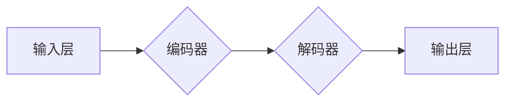

> Sora模型, 
> 大语言模型, 
> Transformer, 
> 深度学习, 
> 自然语言处理, 
> 计算机视觉, 
> 知识图谱

## 1. 背景介绍

近年来，深度学习技术取得了飞速发展，特别是Transformer模型的出现，为自然语言处理（NLP）领域带来了革命性的变革。Sora模型作为一款基于Transformer架构的大语言模型，在文本生成、机器翻译、问答系统等领域展现出强大的能力。本文将深入解析Sora模型的技术栈，包括其核心概念、算法原理、数学模型、代码实现以及实际应用场景等，帮助读者全面了解Sora模型的架构和工作机制。

## 2. 核心概念与联系

Sora模型的核心概念是Transformer架构，它是一种基于注意力机制的序列到序列模型。与传统的循环神经网络（RNN）相比，Transformer具有以下优势：

* **并行计算能力强:** Transformer可以并行处理输入序列中的所有元素，而RNN则需要逐个处理，效率较低。
* **长距离依赖关系处理能力强:** Transformer通过注意力机制可以捕捉到输入序列中任意两个元素之间的关系，即使它们相隔很远，也能有效地处理长距离依赖关系。

**Sora模型的架构图:**

**核心概念关系:**

* **输入层:** 将文本序列转换为向量表示。
* **编码器:** 对输入序列进行编码，提取其语义信息。
* **解码器:** 根据编码后的语义信息生成输出序列。
* **输出层:** 将向量表示转换为文本序列。

## 3. 核心算法原理 & 具体操作步骤

### 3.1  算法原理概述

Sora模型的核心算法是Transformer架构，它主要由以下几个模块组成：

* **多头注意力机制:** 可以同时关注输入序列中的多个位置，捕捉到不同层次的语义信息。
* **前馈神经网络:** 对每个位置的隐藏状态进行非线性变换，进一步提取语义特征。
* **位置编码:** 由于Transformer模型没有循环结构，无法捕捉到输入序列中的位置信息，因此需要使用位置编码来弥补这一缺陷。

### 3.2  算法步骤详解

1. **输入层:** 将文本序列转换为向量表示，每个单词对应一个词向量。
2. **编码器:** 对输入序列进行编码，每个编码器层包含多头注意力机制和前馈神经网络。
3. **解码器:** 根据编码后的语义信息生成输出序列，每个解码器层也包含多头注意力机制和前馈神经网络。
4. **输出层:** 将解码器的输出向量转换为文本序列。

### 3.3  算法优缺点

**优点:**

* 并行计算能力强，训练速度快。
* 长距离依赖关系处理能力强。
* 表现出强大的文本生成、机器翻译、问答系统等能力。

**缺点:**

* 参数量大，训练成本高。
* 对训练数据要求较高。

### 3.4  算法应用领域

* 文本生成：小说、诗歌、剧本等。
* 机器翻译：将一种语言翻译成另一种语言。
* 问答系统：根据给定的问题，从知识库中找到答案。
* 对话系统：与用户进行自然语言对话。

## 4. 数学模型和公式 & 详细讲解 & 举例说明

### 4.1  数学模型构建

Sora模型的核心数学模型是Transformer架构，它基于以下几个关键公式：

* **注意力机制:**

$$
Attention(Q, K, V) = \frac{exp(Q \cdot K^T / \sqrt{d_k})}{exp(Q \cdot K^T / \sqrt{d_k})} \cdot V
$$

其中，Q、K、V分别代表查询矩阵、键矩阵和值矩阵，$d_k$代表键向量的维度。

* **多头注意力机制:**

$$
MultiHead(Q, K, V) = Concat(head_1, head_2, ..., head_h) \cdot W_o
$$

其中，$head_1, head_2, ..., head_h$分别代表h个独立的注意力头，$W_o$代表一个线性变换矩阵。

* **前馈神经网络:**

$$
FFN(x) = \max(0, xW_1 + b_1)W_2 + b_2
$$

其中，$W_1$、$b_1$、$W_2$、$b_2$分别代表前馈神经网络中的权重和偏置。

### 4.2  公式推导过程

注意力机制的公式推导过程可以参考相关文献，例如Vaswani et al. (2017)的论文《Attention Is All You Need》。

### 4.3  案例分析与讲解

例如，在机器翻译任务中，输入句子为“The cat sat on the mat”，输出句子为“Le chat s'est assis sur le tapis”。

通过注意力机制，模型可以将“cat”与“Le chat”联系起来，将“sat”与“s'est assis”联系起来，从而准确地翻译句子。

## 5. 项目实践：代码实例和详细解释说明

### 5.1  开发环境搭建

Sora模型的开发环境需要包含以下软件：

* Python 3.x
* PyTorch 或 TensorFlow
* CUDA 和 cuDNN

### 5.2  源代码详细实现

Sora模型的源代码可以参考HuggingFace的开源项目，例如：

* https://huggingface.co/sorahq/sora-base

### 5.3  代码解读与分析

Sora模型的源代码主要包含以下几个部分：

* 模型架构定义
* 数据加载和预处理
* 模型训练和评估
* 模型推理

### 5.4  运行结果展示

Sora模型的运行结果可以根据具体的任务和数据集进行评估，例如：

* 机器翻译任务：使用BLEU指标评估翻译质量。
* 文本生成任务：使用ROUGE指标评估生成文本的质量。

## 6. 实际应用场景

Sora模型在以下实际应用场景中展现出强大的能力：

* **聊天机器人:** 可以与用户进行自然语言对话，提供信息和服务。
* **文本摘要:** 可以自动生成文本的摘要，节省用户阅读时间。
* **代码生成:** 可以根据自然语言描述生成代码，提高开发效率。

### 6.4  未来应用展望

Sora模型在未来还将应用于更多领域，例如：

* **教育:** 提供个性化学习辅导和智能答疑。
* **医疗:** 辅助医生诊断疾病和制定治疗方案。
* **金融:** 进行风险评估和欺诈检测。

## 7. 工具和资源推荐

### 7.1  学习资源推荐

* **论文:**

* Attention Is All You Need (Vaswani et al., 2017)
* The Illustrated Transformer (Jay Alammar)

* **博客:**

* The Blog of Jay Alammar
* Distill.pub

### 7.2  开发工具推荐

* **PyTorch:** https://pytorch.org/
* **TensorFlow:** https://www.tensorflow.org/

### 7.3  相关论文推荐

* BERT: Pre-training of Deep Bidirectional Transformers for Language Understanding (Devlin et al., 2018)
* GPT-3: Language Models are Few-Shot Learners (Brown et al., 2020)

## 8. 总结：未来发展趋势与挑战

### 8.1  研究成果总结

Sora模型的成功开发标志着深度学习技术在自然语言处理领域的进一步突破。

### 8.2  未来发展趋势

未来，Sora模型将朝着以下方向发展：

* **模型规模更大:** 训练更大的模型，提高模型的性能。
* **多模态理解:** 将文本、图像、音频等多种模态信息融合在一起，实现更全面的理解。
* **可解释性增强:** 提高模型的可解释性，帮助用户更好地理解模型的决策过程。

### 8.3  面临的挑战

Sora模型的发展也面临着一些挑战：

* **训练成本高:** 训练大型语言模型需要大量的计算资源和时间。
* **数据安全和隐私:** 大型语言模型需要大量的训练数据，如何保证数据安全和隐私是一个重要问题。
* **模型偏见:** 大型语言模型可能存在偏见，需要采取措施来 mitigate 偏见。

### 8.4  研究展望

未来，我们将继续致力于Sora模型的研发和应用，希望能够将其应用于更多领域，为人类社会带来更多价值。

## 9. 附录：常见问题与解答

**Q1: Sora模型的训练数据是什么？**

**A1:** Sora模型的训练数据包括大量的文本数据，例如书籍、文章、网站等。

**Q2: Sora模型的开源代码在哪里可以找到？**

**A2:** Sora模型的开源代码可以参考HuggingFace的开源项目，例如：https://huggingface.co/sorahq/sora-base

**Q3: 如何使用Sora模型进行文本生成？**

**A3:** 可以使用Sora模型的开源代码，并根据具体的文本生成任务进行调整。

作者：禅与计算机程序设计艺术 / Zen and the Art of Computer Programming

<end_of_turn>