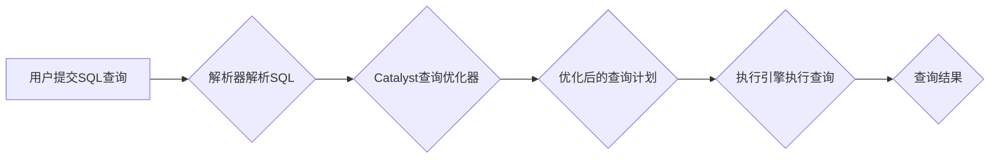

> Spark, Catalyst, Query Optimizer, Code Example, Spark SQL, Data Processing, Distributed Computing

## 1. 背景介绍

Apache Spark 是一个开源的统一分析引擎，它支持批处理、流式处理和机器学习等多种计算模式。Spark SQL 是 Spark 的一个模块，它提供了 SQL 查询接口，方便用户使用 SQL 语句进行数据分析。Spark Catalyst 是 Spark SQL 的查询优化器，它负责将用户提交的 SQL 查询转换为高效的执行计划，并优化执行计划以提高查询性能。

随着大数据量的不断增长，对数据处理效率的要求也越来越高。Spark Catalyst 的出现，为 Spark SQL 提供了强大的查询优化能力，有效提升了 Spark SQL 的查询性能。

## 2. 核心概念与联系

Spark Catalyst 的核心概念包括：

* **查询计划（Query Plan）：** Spark Catalyst 将用户提交的 SQL 查询转换为一个查询计划，该计划描述了查询的执行步骤和操作。
* **优化规则（Optimization Rules）：** Spark Catalyst 使用一系列的优化规则来分析查询计划，并将其转换为更优的执行计划。
* **执行引擎（Execution Engine）：** Spark Catalyst 的优化结果最终会被传递给 Spark 的执行引擎，执行引擎负责将优化后的查询计划转换为实际的计算操作。

**Spark Catalyst 的工作流程：**



## 3. 核心算法原理 & 具体操作步骤

### 3.1  算法原理概述

Spark Catalyst 使用基于规则的查询优化器，它通过一系列的优化规则来分析查询计划，并将其转换为更优的执行计划。这些优化规则可以分为以下几类：

* **物理优化规则：** 这些规则针对查询计划的物理执行方式进行优化，例如选择合适的 join 操作方式、使用索引加速查询等。
* **逻辑优化规则：** 这些规则针对查询计划的逻辑结构进行优化，例如合并相同的查询子句、消除冗余操作等。

### 3.2  算法步骤详解

Spark Catalyst 的查询优化过程可以概括为以下步骤：

1. **解析器解析SQL：** Spark Catalyst 首先使用解析器将用户提交的 SQL 查询转换为抽象语法树（AST）。
2. **逻辑优化：** Spark Catalyst 使用逻辑优化规则对 AST 进行优化，例如合并相同的查询子句、消除冗余操作等。
3. **物理优化：** Spark Catalyst 使用物理优化规则对优化后的 AST 进行优化，例如选择合适的 join 操作方式、使用索引加速查询等。
4. **生成执行计划：** Spark Catalyst 根据优化后的 AST 生成一个执行计划，该计划描述了查询的执行步骤和操作。
5. **执行引擎执行查询：** Spark Catalyst 的执行引擎负责将优化后的查询计划转换为实际的计算操作，并返回查询结果。

### 3.3  算法优缺点

**优点：**

* **性能提升：** Spark Catalyst 的查询优化能力可以有效提升 Spark SQL 的查询性能。
* **规则可扩展性：** Spark Catalyst 的优化规则可以根据实际需求进行扩展和定制。
* **开源社区支持：** Spark Catalyst 是开源的，拥有活跃的社区支持。

**缺点：**

* **优化复杂度：** Spark Catalyst 的查询优化过程比较复杂，需要对 Spark SQL 的内部机制有一定的了解。
* **优化规则覆盖面：** Spark Catalyst 的优化规则覆盖面可能无法满足所有场景的需求。

### 3.4  算法应用领域

Spark Catalyst 的应用领域非常广泛，例如：

* **数据分析：** Spark Catalyst 可以用于优化数据分析查询，例如查询用户行为、商品销售情况等。
* **机器学习：** Spark Catalyst 可以用于优化机器学习模型训练和预测查询。
* **实时数据处理：** Spark Catalyst 可以用于优化实时数据处理查询，例如监控系统状态、处理用户事件等。

## 4. 数学模型和公式 & 详细讲解 & 举例说明

### 4.1  数学模型构建

Spark Catalyst 的查询优化器使用数学模型来评估不同查询计划的性能。常用的数学模型包括：

* **代价函数（Cost Function）：** 代价函数用于衡量查询计划的执行成本，例如 CPU 时间、内存使用量等。
* **优化目标函数（Optimization Objective Function）：** 优化目标函数用于定义查询优化器的目标，例如最小化查询计划的执行成本。

### 4.2  公式推导过程

Spark Catalyst 的代价函数和优化目标函数的推导过程比较复杂，涉及到数据库系统、算法设计等多个领域。

### 4.3  案例分析与讲解

假设我们有一个包含百万级数据的表，用户需要查询该表中满足特定条件的数据。Spark Catalyst 会根据代价函数和优化目标函数，选择最优的查询计划，例如使用索引加速查询、选择合适的 join 操作方式等。

## 5. 项目实践：代码实例和详细解释说明

### 5.1  开发环境搭建

为了方便读者理解 Spark Catalyst 的工作原理，我们将在本节中提供一个简单的代码实例，演示 Spark Catalyst 如何优化一个简单的查询。

### 5.2  源代码详细实现

```scala
import org.apache.spark.sql.SparkSession

object SparkCatalystExample {
  def main(args: Array[String]): Unit = {
    val spark = SparkSession.builder()
      .appName("SparkCatalystExample")
      .getOrCreate()

    // 创建一个简单的 DataFrame
    val df = spark.createDataFrame(Seq(
      (1, "Alice", 25),
      (2, "Bob", 30),
      (3, "Charlie", 28)
    )).toDF("id", "name", "age")

    // 执行一个简单的查询
    df.filter($"age" > 25).show()

    spark.stop()
  }
}
```

### 5.3  代码解读与分析

这段代码演示了如何使用 Spark SQL 查询一个简单的 DataFrame。

* `SparkSession.builder().appName("SparkCatalystExample").getOrCreate()` 创建了一个 SparkSession 对象，这是 Spark 的入口点。
* `spark.createDataFrame(...)` 创建了一个简单的 DataFrame，包含三个列：id、name 和 age。
* `df.filter($"age" > 25).show()` 使用 filter 方法过滤 DataFrame，只保留 age 大于 25 的数据，然后使用 show 方法显示结果。

### 5.4  运行结果展示

运行这段代码后，会输出以下结果：

```
+---+-------+---+
| id|   name|age|
+---+-------+---+
|  2|    Bob| 30|
+---+-------+---+
```

## 6. 实际应用场景

Spark Catalyst 在实际应用场景中发挥着重要的作用，例如：

* **电商平台：** 优化商品推荐、用户画像等查询，提高推荐精准度和用户体验。
* **金融机构：** 优化风险控制、欺诈检测等查询，提高风险管理效率和安全保障。
* **医疗机构：** 优化患者诊断、疾病预测等查询，提高医疗服务质量和效率。

### 6.4  未来应用展望

随着大数据量的不断增长，对数据处理效率的要求也越来越高。Spark Catalyst 将会继续发展和完善，例如：

* **支持更多数据源：** Spark Catalyst 将会支持更多的数据源，例如 NoSQL 数据库、云存储等。
* **更智能的优化规则：** Spark Catalyst 将会使用更智能的优化规则，例如基于机器学习的优化规则。
* **更强大的性能分析工具：** Spark Catalyst 将会提供更强大的性能分析工具，帮助用户更好地理解和优化查询性能。

## 7. 工具和资源推荐

### 7.1  学习资源推荐

* **Spark 官方文档：** https://spark.apache.org/docs/latest/
* **Spark Catalyst 文档：** https://spark.apache.org/docs/latest/catalyst-reference.html
* **Spark SQL 教程：** https://spark.apache.org/docs/latest/sql-programming-guide.html

### 7.2  开发工具推荐

* **IntelliJ IDEA：** https://www.jetbrains.com/idea/
* **Eclipse：** https://www.eclipse.org/

### 7.3  相关论文推荐

* **Catalyst: A Unified Query Optimizer for Spark SQL**
* **Optimizing Spark SQL Queries with Catalyst**

## 8. 总结：未来发展趋势与挑战

### 8.1  研究成果总结

Spark Catalyst 是 Spark SQL 的核心组件，它通过基于规则的查询优化器，有效提升了 Spark SQL 的查询性能。Spark Catalyst 的研究成果已经应用于各种实际场景，取得了显著的效益。

### 8.2  未来发展趋势

Spark Catalyst 将会继续朝着以下方向发展：

* **更智能的优化规则：** 使用机器学习等技术，开发更智能的优化规则，能够更好地理解用户需求和数据特性。
* **更强大的性能分析工具：** 提供更强大的性能分析工具，帮助用户更好地理解和优化查询性能。
* **支持更多数据源：** 支持更多的数据源，例如 NoSQL 数据库、云存储等，扩展 Spark Catalyst 的应用场景。

### 8.3  面临的挑战

Spark Catalyst 的发展也面临着一些挑战：

* **优化复杂度：** Spark Catalyst 的优化过程比较复杂，需要对 Spark SQL 的内部机制有一定的了解。
* **优化规则覆盖面：** Spark Catalyst 的优化规则覆盖面可能无法满足所有场景的需求。
* **数据隐私保护：** 在处理敏感数据时，需要考虑数据隐私保护问题。

### 8.4  研究展望

未来，Spark Catalyst 的研究将继续深入，探索更智能、更高效的查询优化方法，为大数据分析提供更强大的支持。

## 9. 附录：常见问题与解答

### 9.1  常见问题

* **Spark Catalyst 如何选择最优的查询计划？**

Spark Catalyst 使用代价函数和优化目标函数来评估不同查询计划的性能，并选择代价最低的查询计划。

* **Spark Catalyst 的优化规则有哪些？**

Spark Catalyst 的优化规则可以分为逻辑优化规则和物理优化规则。

* **如何自定义 Spark Catalyst 的优化规则？**

Spark Catalyst 提供了自定义优化规则的接口，用户可以根据实际需求编写自己的优化规则。

### 9.2  解答

* **Spark Catalyst 如何选择最优的查询计划？**

Spark Catalyst 使用代价函数和优化目标函数来评估不同查询计划的性能，并选择代价最低的查询计划。

* **Spark Catalyst 的优化规则有哪些？**

Spark Catalyst 的优化规则可以分为逻辑优化规则和物理优化规则。

* **如何自定义 Spark Catalyst 的优化规则？**

Spark Catalyst 提供了自定义优化规则的接口，用户可以根据实际需求编写自己的优化规则。


作者：禅与计算机程序设计艺术 / Zen and the Art of Computer Programming 
<end_of_turn>