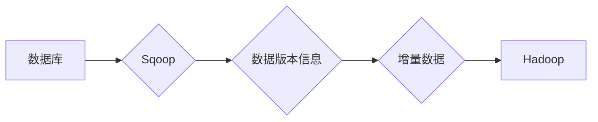

> Sqoop,增量导入,数据迁移,Hadoop,Hive,数据仓库,数据湖

## 1. 背景介绍

随着大数据时代的到来，海量数据的存储和处理成为越来越重要的挑战。Hadoop作为分布式存储和处理框架，为大数据提供了强大的处理能力。Hive作为Hadoop上运行的SQL查询语言，提供了方便的数据查询和分析功能。然而，将大量数据从传统关系型数据库迁移到Hadoop生态系统中，往往需要耗费大量时间和资源。

Sqoop是一个开源工具，专门用于将数据从关系型数据库导入到Hadoop生态系统中。它提供了多种数据导入方式，包括全量导入和增量导入。增量导入是指只导入数据库中自上次导入以来新增或修改的数据，相比全量导入，增量导入可以显著提高数据导入效率，降低数据冗余，节省存储空间和处理时间。

## 2. 核心概念与联系

Sqoop增量导入的核心概念是**数据版本控制**。Sqoop通过记录数据库表中的数据版本信息，来识别自上次导入以来新增或修改的数据。

**Sqoop增量导入流程:**



**核心概念:**

* **数据版本控制:** Sqoop通过记录数据库表中的数据版本信息，来识别自上次导入以来新增或修改的数据。
* **数据分片:** Sqoop将数据按照一定的规则进行分片，以便于并行处理。
* **数据格式转换:** Sqoop可以将数据从关系型数据库的格式转换为Hadoop生态系统中支持的格式，例如ORC、Parquet等。

## 3. 核心算法原理 & 具体操作步骤

### 3.1  算法原理概述

Sqoop增量导入的核心算法是基于**数据版本号**的增量更新算法。

**算法步骤:**

1. **获取数据库表数据版本号:** Sqoop首先从数据库中获取表的数据版本号。
2. **扫描数据库表数据:** Sqoop扫描数据库表数据，并根据版本号筛选出自上次导入以来新增或修改的数据。
3. **数据格式转换:** Sqoop将筛选出的数据转换为Hadoop生态系统中支持的格式。
4. **数据分片:** Sqoop将数据按照一定的规则进行分片，以便于并行处理。
5. **数据导入Hadoop:** Sqoop将数据分片导入到Hadoop生态系统中。

### 3.2  算法步骤详解

1. **获取数据库表数据版本号:** Sqoop可以使用数据库提供的内置功能，例如`ROWID`、`TIMESTAMP`等，来获取表的数据版本号。
2. **扫描数据库表数据:** Sqoop可以使用数据库提供的查询语句，例如`WHERE`子句，来筛选出自上次导入以来新增或修改的数据。
3. **数据格式转换:** Sqoop可以使用JDBC驱动程序，将数据库表中的数据转换为Hadoop生态系统中支持的格式，例如ORC、Parquet等。
4. **数据分片:** Sqoop可以使用多种数据分片策略，例如哈希分片、范围分片等，将数据按照一定的规则进行分片，以便于并行处理。
5. **数据导入Hadoop:** Sqoop可以使用Hadoop提供的API，将数据分片导入到Hadoop生态系统中。

### 3.3  算法优缺点

**优点:**

* **提高数据导入效率:** 只导入新增或修改的数据，可以显著提高数据导入效率。
* **降低数据冗余:** 只导入新增或修改的数据，可以降低数据冗余，节省存储空间。
* **简化数据管理:** 通过数据版本控制，可以更方便地管理数据版本。

**缺点:**

* **依赖数据库版本控制:** 需要数据库支持数据版本控制功能。
* **复杂性增加:** 相比全量导入，增量导入的实现更加复杂。

### 3.4  算法应用领域

Sqoop增量导入算法广泛应用于以下领域:

* **数据仓库建设:** 将数据从运营数据库导入到数据仓库中。
* **数据湖建设:** 将数据从各种数据源导入到数据湖中。
* **实时数据处理:** 将实时数据从数据库导入到Hadoop生态系统中进行实时处理。

## 4. 数学模型和公式 & 详细讲解 & 举例说明

### 4.1  数学模型构建

假设数据库表中数据版本号为`v`，上次导入的数据版本号为`v_last`，则增量数据版本号为`v_increment = v - v_last`。

### 4.2  公式推导过程

增量数据版本号的计算公式为:

$$v_{increment} = v - v_{last}$$

其中:

* `v`：当前数据库表数据版本号
* `v_last`：上次导入的数据版本号

### 4.3  案例分析与讲解

假设数据库表中数据版本号为`10`，上次导入的数据版本号为`5`，则增量数据版本号为`5`。

$$v_{increment} = 10 - 5 = 5$$

这意味着自上次导入以来，数据库表中新增了`5`条数据。

## 5. 项目实践：代码实例和详细解释说明

### 5.1  开发环境搭建

* **Hadoop环境:** 安装并配置Hadoop集群。
* **Sqoop环境:** 下载并安装Sqoop工具。
* **数据库环境:** 安装并配置关系型数据库，例如MySQL、PostgreSQL等。

### 5.2  源代码详细实现

```bash
# 使用Sqoop进行增量导入
sqoop import \
  --connect jdbc:mysql://localhost:3306/mydatabase \
  --username root \
  --password mypassword \
  --table mytable \
  --target-dir /user/hive/warehouse/mydatabase.db \
  --incremental \
  --incremental-query "SELECT * FROM mytable WHERE id > 10" \
  --map-column-java "id:long" \
  --map-column-java "name:string"
```

### 5.3  代码解读与分析

* `--connect`: 连接数据库的URL。
* `--username`: 数据库用户名。
* `--password`: 数据库密码。
* `--table`: 要导入的数据库表名。
* `--target-dir`: 导入数据的目标目录。
* `--incremental`: 开启增量导入模式。
* `--incremental-query`: 增量导入的查询语句，用于筛选自上次导入以来新增或修改的数据。
* `--map-column-java`: 指定数据列的Java类型。

### 5.4  运行结果展示

Sqoop将根据指定的增量查询语句，从数据库中筛选出自上次导入以来新增或修改的数据，并将其导入到Hadoop生态系统中指定的目录。

## 6. 实际应用场景

Sqoop增量导入在实际应用场景中具有广泛的应用价值。

### 6.1  数据仓库建设

Sqoop可以将运营数据库中的数据增量导入到数据仓库中，实现实时数据更新，保证数据仓库数据的时效性。

### 6.2  数据湖建设

Sqoop可以将来自各种数据源的数据增量导入到数据湖中，实现数据湖的实时更新，保证数据湖数据的完整性和一致性。

### 6.3  实时数据处理

Sqoop可以将实时数据从数据库增量导入到Hadoop生态系统中，实现实时数据处理，例如实时分析、实时告警等。

### 6.4  未来应用展望

随着大数据技术的不断发展，Sqoop增量导入将会有更广泛的应用场景。例如，可以用于实时数据流的处理，可以用于云计算环境的数据迁移，可以用于人工智能领域的训练数据更新等。

## 7. 工具和资源推荐

### 7.1  学习资源推荐

* **Sqoop官方文档:** https://sqoop.apache.org/docs/
* **Hadoop官方文档:** https://hadoop.apache.org/docs/
* **Hive官方文档:** https://hive.apache.org/docs/

### 7.2  开发工具推荐

* **Sqoop命令行工具:** 用于执行Sqoop命令。
* **Sqoop Web UI:** 用于图形化操作Sqoop。

### 7.3  相关论文推荐

* **Sqoop: A Tool for Efficiently Transferring Data Between Relational Databases and Hadoop:** https://www.usenix.org/system/files/conference/osdi10/osdi10-paper-chen.pdf

## 8. 总结：未来发展趋势与挑战

### 8.1  研究成果总结

Sqoop增量导入算法为大数据迁移提供了高效的解决方案，显著提高了数据导入效率，降低了数据冗余，简化了数据管理。

### 8.2  未来发展趋势

* **支持更多数据源:** Sqoop将支持更多类型的数据库和数据源，例如NoSQL数据库、云存储等。
* **提高数据处理效率:** Sqoop将采用更先进的算法和技术，提高数据处理效率。
* **增强数据安全:** Sqoop将加强数据安全机制，保障数据传输和存储的安全。

### 8.3  面临的挑战

* **数据格式转换:** 不同数据源的数据格式可能不同，需要开发更灵活的数据格式转换机制。
* **数据一致性:** 确保数据在迁移过程中的一致性是一个重要的挑战。
* **数据安全:** 数据迁移过程中需要保障数据安全，防止数据泄露。

### 8.4  研究展望

未来，Sqoop增量导入算法将继续发展，朝着更智能、更高效、更安全的方向发展。


## 9. 附录：常见问题与解答

**常见问题:**

* **Sqoop增量导入如何设置数据版本号?**

**解答:**

Sqoop增量导入可以通过数据库提供的内置功能，例如`ROWID`、`TIMESTAMP`等，来获取表的数据版本号。

* **Sqoop增量导入如何设置增量查询语句?**

**解答:**

Sqoop增量导入可以通过`--incremental-query`参数设置增量查询语句，用于筛选自上次导入以来新增或修改的数据。

* **Sqoop增量导入如何解决数据一致性问题?**

**解答:**

Sqoop增量导入可以通过使用乐观锁机制或悲观锁机制，来解决数据一致性问题。

* **Sqoop增量导入如何保障数据安全?**

**解答:**

Sqoop增量导入可以通过加密传输数据、使用安全认证机制等方式，来保障数据安全。


作者：禅与计算机程序设计艺术 / Zen and the Art of Computer Programming 
<end_of_turn>