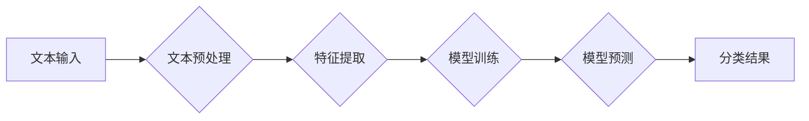

> Text Classification, 自然语言处理, 机器学习, 算法原理, 代码实现, 案例分析, 应用场景

## 1. 背景介绍

在当今数据爆炸的时代，文本数据已成为重要的信息资源。如何有效地理解和利用这些文本数据至关重要。文本分类作为自然语言处理 (NLP) 的核心任务之一，旨在将文本自动地归类到预定义的类别中。它在信息检索、情感分析、垃圾邮件过滤、主题分类等众多领域有着广泛的应用。

文本分类技术的发展离不开机器学习算法的进步。随着深度学习的兴起，基于深度学习的文本分类模型取得了显著的成果，在准确率、效率等方面都表现出色。

## 2. 核心概念与联系

文本分类的核心是将文本映射到一个向量空间，然后利用分类算法对文本进行分类。

**流程图：**



**核心概念：**

* **文本预处理:**  对文本进行清洗、格式化、分词等操作，以去除噪声和提高模型的训练效率。
* **特征提取:**  将文本转换为机器可理解的特征向量，常用的特征包括词频、TF-IDF、词嵌入等。
* **模型训练:**  利用训练数据训练分类模型，例如逻辑回归、支持向量机、决策树、神经网络等。
* **模型预测:**  将新文本输入到训练好的模型中，预测其所属类别。

## 3. 核心算法原理 & 具体操作步骤

### 3.1  算法原理概述

文本分类算法主要分为两类：传统机器学习算法和深度学习算法。

* **传统机器学习算法:**  例如逻辑回归、支持向量机、朴素贝叶斯等，这些算法基于统计学原理，通过学习训练数据中的模式来预测文本类别。
* **深度学习算法:**  例如卷积神经网络 (CNN)、循环神经网络 (RNN)、Transformer等，这些算法利用多层神经网络结构，能够学习更复杂的文本表示，从而提高分类精度。

### 3.2  算法步骤详解

以逻辑回归为例，详细说明其文本分类步骤：

1. **文本预处理:**  对文本进行分词、去停用词、词干提取等操作。
2. **特征提取:**  将文本转换为词频向量，例如每个词在文本中出现的次数。
3. **模型训练:**  利用训练数据训练逻辑回归模型，学习文本特征与类别之间的关系。
4. **模型预测:**  将新文本输入到训练好的模型中，根据模型输出的概率值预测其所属类别。

### 3.3  算法优缺点

| 算法 | 优点 | 缺点 |
|---|---|---|
| 逻辑回归 | 简单易实现，训练速度快 | 难以处理高维特征，分类效果有限 |
| 支持向量机 | 能够处理高维特征，分类效果较好 | 训练时间较长，参数选择较复杂 |
| 朴素贝叶斯 | 训练速度快，参数少 | 依赖于特征独立性假设，分类效果可能较差 |
| CNN | 能够学习文本局部特征，分类效果较好 | 参数量大，训练时间较长 |
| RNN | 能够学习文本序列特征，分类效果较好 | 训练时间较长，梯度消失问题 |
| Transformer | 能够学习长距离依赖关系，分类效果最好 | 参数量非常大，训练资源要求高 |

### 3.4  算法应用领域

文本分类算法广泛应用于以下领域：

* **信息检索:**  根据用户查询，从海量文本数据中检索出相关信息。
* **情感分析:**  分析文本中的情感倾向，例如正面、负面、中性等。
* **垃圾邮件过滤:**  识别并过滤垃圾邮件。
* **主题分类:**  将文本自动地归类到不同的主题类别中。
* **文本摘要:**  自动生成文本的摘要。

## 4. 数学模型和公式 & 详细讲解 & 举例说明

### 4.1  数学模型构建

逻辑回归模型是一种线性分类模型，其核心思想是将文本特征线性组合后，通过sigmoid函数将其映射到0到1之间，表示文本属于某个类别的概率。

**模型公式:**

$$
p(y=1|x) = \frac{1}{1 + e^{-(w^T x + b)}}
$$

其中：

* $p(y=1|x)$ 表示文本 $x$ 属于类别 1 的概率。
* $w$ 是模型参数，代表每个特征的权重。
* $x$ 是文本特征向量。
* $b$ 是模型偏置项。

### 4.2  公式推导过程

逻辑回归模型的损失函数是交叉熵损失函数，其目标是最小化模型预测结果与真实标签之间的差异。

**交叉熵损失函数:**

$$
L(w,b) = -\frac{1}{N} \sum_{i=1}^{N} [y_i \log(p(y_i=1|x_i)) + (1-y_i) \log(1-p(y_i=1|x_i))]
$$

其中：

* $N$ 是训练样本数量。
* $y_i$ 是第 $i$ 个样本的真实标签。

通过梯度下降算法，不断更新模型参数 $w$ 和 $b$，使得损失函数最小化。

### 4.3  案例分析与讲解

假设我们有一个文本分类任务，需要将新闻文章分类为体育、财经、娱乐等类别。我们可以使用逻辑回归模型进行分类。

首先，我们需要对新闻文章进行预处理，例如分词、去停用词等。然后，我们可以使用词频向量作为文本特征。

训练完成后，我们可以将新文章输入到模型中，根据模型输出的概率值预测其所属类别。例如，如果模型输出的概率值为：体育：0.7，财经：0.2，娱乐：0.1，则可以预测该文章属于体育类别。

## 5. 项目实践：代码实例和详细解释说明

### 5.1  开发环境搭建

* Python 3.x
* scikit-learn
* NLTK
* pandas

### 5.2  源代码详细实现

```python
from sklearn.linear_model import LogisticRegression
from sklearn.model_selection import train_test_split
from sklearn.metrics import accuracy_score
import nltk
from nltk.corpus import stopwords
from nltk.tokenize import word_tokenize

# 下载停用词列表
nltk.download('stopwords')

# 加载文本数据
data = ...

# 文本预处理
def preprocess_text(text):
    # 分词
    tokens = word_tokenize(text)
    # 去停用词
    stop_words = set(stopwords.words('english'))
    tokens = [word for word in tokens if word.lower() not in stop_words]
    # 返回预处理后的文本
    return tokens

# 特征提取
def extract_features(text):
    # 使用词频向量作为特征
    # ...

# 训练模型
X_train, X_test, y_train, y_test = train_test_split(data['features'], data['labels'], test_size=0.2)
model = LogisticRegression()
model.fit(X_train, y_train)

# 预测结果
y_pred = model.predict(X_test)

# 计算准确率
accuracy = accuracy_score(y_test, y_pred)
print(f'Accuracy: {accuracy}')

```

### 5.3  代码解读与分析

* 文本预处理部分：对文本进行分词、去停用词等操作，以去除噪声和提高模型的训练效率。
* 特征提取部分：将文本转换为机器可理解的特征向量，例如词频向量。
* 模型训练部分：使用逻辑回归模型训练分类模型，学习文本特征与类别之间的关系。
* 预测结果部分：将新文本输入到训练好的模型中，根据模型输出的概率值预测其所属类别。
* 准确率计算部分：计算模型预测结果与真实标签之间的准确率。

### 5.4  运行结果展示

运行代码后，会输出模型的准确率。

## 6. 实际应用场景

文本分类算法在各个领域都有广泛的应用场景：

* **搜索引擎:**  根据用户查询，从海量网页中检索出相关结果。
* **社交媒体:**  自动识别用户发帖的主题，进行分类和推荐。
* **客服系统:**  自动识别用户咨询的问题类型，并进行智能回复。
* **医疗诊断:**  分析患者的病历和症状，辅助医生进行诊断。
* **金融风险控制:**  识别潜在的金融风险，进行风险评估和控制。

### 6.4  未来应用展望

随着人工智能技术的不断发展，文本分类算法将会有更广泛的应用场景：

* **个性化推荐:**  根据用户的阅读习惯和兴趣爱好，推荐个性化的内容。
* **自动写作:**  根据给定的主题和关键词，自动生成文本内容。
* **跨语言文本分类:**  实现不同语言文本的分类，打破语言的障碍。
* **多模态文本分类:**  结合文本和图像、音频等多模态数据进行分类，提高分类精度。

## 7. 工具和资源推荐

### 7.1  学习资源推荐

* **书籍:**
    * "Speech and Language Processing" by Jurafsky and Martin
    * "Natural Language Processing with Python" by Bird, Klein, and Loper
* **在线课程:**
    * Coursera: Natural Language Processing Specialization
    * edX: Artificial Intelligence
* **博客和网站:**
    * Towards Data Science
    * Analytics Vidhya
    * Machine Learning Mastery

### 7.2  开发工具推荐

* **Python:**  主流的机器学习编程语言。
* **scikit-learn:**  Python机器学习库，提供各种分类算法和工具。
* **NLTK:**  Python自然语言处理库，提供文本预处理和特征提取工具。
* **spaCy:**  高效的Python自然语言处理库，提供预训练模型和API。

### 7.3  相关论文推荐

* "A Survey of Text Classification Algorithms" by Liu, B. (2012)
* "Deep Learning for Text Classification" by Zhang, Y., et al. (2015)
* "BERT: Pre-training of Deep Bidirectional Transformers for Language Understanding" by Devlin, J., et al. (2018)

## 8. 总结：未来发展趋势与挑战

### 8.1  研究成果总结

文本分类算法取得了显著的成果，在准确率、效率等方面都表现出色。深度学习算法的应用，特别是Transformer模型的出现，进一步提高了文本分类的性能。

### 8.2  未来发展趋势

* **更强大的模型:**  研究更深、更复杂的深度学习模型，提高文本分类的精度和鲁棒性。
* **跨语言文本分类:**  突破语言障碍，实现不同语言文本的分类。
* **多模态文本分类:**  结合文本和图像、音频等多模态数据进行分类，提高分类的准确性和泛化能力。
* **可解释性:**  提高文本分类模型的可解释性，帮助用户理解模型的决策过程。

### 8.3  面临的挑战

* **数据标注:**  高质量的文本数据标注是训练文本分类模型的关键，但数据标注成本高昂且耗时。
* **模型复杂度:**  深度学习模型参数量大，训练和部署成本高。
* **公平性:**  文本分类模型可能存在偏见，导致不公平的结果。

### 8.4  研究展望

未来，文本分类研究将继续朝着更强大、更智能、更公平的方向发展。

## 9. 附录：常见问题与解答

* **Q: 文本