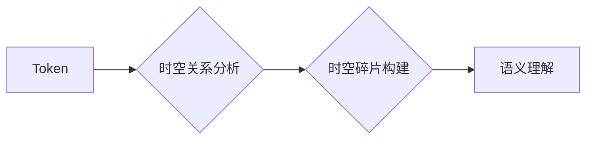

> Token, 时空碎片, 自然语言处理, 深度学习, Transformer, 知识图谱, 计算机视觉

## 1. 背景介绍

在当今数据爆炸的时代，信息处理和理解能力成为人工智能领域的核心挑战。自然语言处理 (NLP) 和计算机视觉 (CV) 作为人工智能的两大支柱，在处理文本和图像数据方面取得了显著进展。然而，无论是 NLP 还是 CV，都面临着如何有效地捕捉和利用数据中的语义和结构信息的问题。

Token，作为文本处理的基本单位，被广泛应用于 NLP 任务中。它可以是单个单词、子词或字符，用于将文本序列分解成更小的、可处理的片段。时空碎片则是一种更抽象的概念，它试图捕捉文本或图像中时间和空间关系的信息。

## 2. 核心概念与联系

### 2.1 Token

Token 是 NLP 中的基本单位，用于将文本序列分解成更小的片段。常见的 Token 化方法包括：

* **Word Tokenization:** 将文本序列分割成单词。
* **Subword Tokenization:** 将单词分割成更小的子词，例如 Byte Pair Encoding (BPE)。
* **Character Tokenization:** 将文本序列分割成单个字符。

Token 化可以帮助 NLP 模型更好地理解文本结构和语义。

### 2.2 时空碎片

时空碎片是一种更抽象的概念，它试图捕捉文本或图像中时间和空间关系的信息。

* **文本中的时空碎片:** 可以指代事件的时间顺序、人物之间的关系、场景的描述等。
* **图像中的时空碎片:** 可以指代物体的位置、运动轨迹、场景的构成等。

时空碎片的捕捉和利用可以帮助模型更好地理解文本或图像的语义和上下文。

### 2.3 Token 与时空碎片的联系

Token 和时空碎片之间存在着密切的联系。

* Token 可以作为时空碎片的基本构建块。例如，一个事件可以由多个 Token 组成，这些 Token 描述了事件发生的时间、地点、人物等信息。
* 时空碎片的捕捉可以帮助 Token 化过程更好地理解文本结构和语义。例如，在分词时，如果知道两个词语之间存在时间关系，可以将它们组合成一个更大的 Token。

**Mermaid 流程图**



## 3. 核心算法原理 & 具体操作步骤

### 3.1 算法原理概述

时空碎片的捕捉和利用通常依赖于深度学习算法。常见的算法包括：

* **Transformer:** Transformer 模型通过自注意力机制，可以捕捉文本序列中长距离的依赖关系，从而更好地理解时空关系。
* **Graph Neural Networks (GNN):** GNN 可以将文本或图像表示为图结构，并利用图神经网络的传播机制，捕捉节点之间的关系，从而识别时空碎片。

### 3.2 算法步骤详解

**以 Transformer 模型为例，其时空碎片捕捉的步骤如下：**

1. **Token 化:** 将文本序列分解成 Token。
2. **嵌入:** 将 Token 映射到低维向量空间。
3. **自注意力:** 利用自注意力机制，捕捉 Token 之间的依赖关系，识别时空关系。
4. **前馈网络:** 对自注意力输出进行处理，提取时空碎片的特征。
5. **输出:** 生成时空碎片的表示，用于后续任务。

### 3.3 算法优缺点

**Transformer 模型的优点:**

* 可以捕捉长距离依赖关系。
* 性能优异，在许多 NLP 任务中取得了 state-of-the-art 的结果。

**Transformer 模型的缺点:**

* 计算复杂度高，训练成本高。
* 对长文本序列的处理能力有限。

### 3.4 算法应用领域

时空碎片的捕捉和利用在许多领域都有应用，例如：

* **自然语言理解:** 识别事件、关系、人物等信息。
* **机器翻译:** 捕捉文本中的语义和上下文关系，提高翻译质量。
* **问答系统:** 理解用户的问题，并从文本中找到答案。
* **计算机视觉:** 识别物体的位置、运动轨迹、场景的构成等。

## 4. 数学模型和公式 & 详细讲解 & 举例说明

### 4.1 数学模型构建

**Transformer 模型的数学模型可以概括为以下公式:**

$$
\mathbf{H} = \text{MultiHeadAttention}(\mathbf{X}, \mathbf{X}, \mathbf{W_a}) + \mathbf{X}
$$

其中:

* $\mathbf{H}$ 是经过自注意力机制处理后的隐藏状态。
* $\mathbf{X}$ 是输入的 Token 嵌入向量。
* $\mathbf{W_a}$ 是自注意力机制的参数矩阵。

### 4.2 公式推导过程

自注意力机制的计算过程可以分为以下步骤:

1. **查询 (Query)、键 (Key) 和值 (Value) 计算:** 将输入向量 $\mathbf{X}$ 映射到查询向量 $\mathbf{Q}$, 键向量 $\mathbf{K}$ 和值向量 $\mathbf{V}$。

$$
\mathbf{Q} = \mathbf{X} \mathbf{W_q}
$$

$$
\mathbf{K} = \mathbf{X} \mathbf{W_k}
$$

$$
\mathbf{V} = \mathbf{X} \mathbf{W_v}
$$

2. **注意力权重计算:** 计算查询向量 $\mathbf{Q}$ 与键向量 $\mathbf{K}$ 之间的相似度，得到注意力权重 $\mathbf{A}$。

$$
\mathbf{A} = \text{softmax}(\frac{\mathbf{Q} \mathbf{K}^T}{\sqrt{d_k}})
$$

3. **加权求和:** 将注意力权重 $\mathbf{A}$ 与值向量 $\mathbf{V}$ 进行加权求和，得到输出向量 $\mathbf{O}$。

$$
\mathbf{O} = \mathbf{A} \mathbf{V}
$$

### 4.3 案例分析与讲解

**举例说明:**

假设我们有一个句子 "The cat sat on the mat"，将其 Token 化后得到 [The, cat, sat, on, the, mat]。

使用 Transformer 模型，我们可以计算每个 Token 之间的注意力权重，从而捕捉句子中的语义关系。例如，"cat" 和 "sat" 之间的注意力权重较高，表明它们之间存在语义上的依赖关系。

## 5. 项目实践：代码实例和详细解释说明

### 5.1 开发环境搭建

* Python 3.7+
* PyTorch 1.7+
* Transformers 库

### 5.2 源代码详细实现

```python
from transformers import AutoModelForSequenceClassification, AutoTokenizer

# 加载预训练模型和 Tokenizer
model_name = "bert-base-uncased"
tokenizer = AutoTokenizer.from_pretrained(model_name)
model = AutoModelForSequenceClassification.from_pretrained(model_name)

# 输入文本
text = "The cat sat on the mat"

# Token 化
inputs = tokenizer(text, return_tensors="pt")

# 前向传播
outputs = model(**inputs)

# 获取预测结果
predicted_class = outputs.logits.argmax().item()
```

### 5.3 代码解读与分析

* 使用 `transformers` 库加载预训练的 BERT 模型和 Tokenizer。
* 将输入文本 Token 化，并转换为 PyTorch 张量。
* 使用模型进行前向传播，得到预测结果。
* 获取预测结果并进行解码。

### 5.4 运行结果展示

运行上述代码，可以得到 BERT 模型对输入文本的分类结果。

## 6. 实际应用场景

### 6.1 文本摘要

利用时空碎片的捕捉能力，可以对文本进行更精准的摘要，保留关键信息和语义关系。

### 6.2 情感分析

通过分析文本中的时空碎片，可以更准确地识别文本的情感倾向，例如积极、消极、中性等。

### 6.3 事件抽取

可以利用时空碎片识别文本中的事件，并提取事件的相关信息，例如时间、地点、人物等。

### 6.4 未来应用展望

时空碎片的捕捉和利用在未来将有更广泛的应用，例如：

* **智能问答:** 理解用户问题，并从文本中找到更精准的答案。
* **个性化推荐:** 根据用户的兴趣和行为，推荐更相关的商品或服务。
* **自动写作:** 生成更自然、更流畅的文本。

## 7. 工具和资源推荐

### 7.1 学习资源推荐

* **论文:**
    * "Attention Is All You Need"
    * "Graph Convolutional Networks"
* **书籍:**
    * "Deep Learning"
    * "Natural Language Processing with Python"

### 7.2 开发工具推荐

* **PyTorch:** 深度学习框架
* **Transformers:** 预训练模型库
* **Hugging Face:** 预训练模型和数据集平台

### 7.3 相关论文推荐

* "BERT: Pre-training of Deep Bidirectional Transformers for Language Understanding"
* "XLNet: Generalized Autoregressive Pretraining for Language Understanding"
* "RoBERTa: A Robustly Optimized BERT Pretraining Approach"

## 8. 总结：未来发展趋势与挑战

### 8.1 研究成果总结

时空碎片的捕捉和利用是人工智能领域的重要研究方向，取得了显著进展。

### 8.2 未来发展趋势

* **更强大的模型:** 开发更强大的深度学习模型，能够更好地捕捉和利用时空碎片信息。
* **跨模态理解:** 将时空碎片的捕捉应用于跨模态理解任务，例如文本-图像对齐、文本-音频对齐等。
* **可解释性:** 提高时空碎片捕捉模型的可解释性，帮助人类更好地理解模型的决策过程。

### 8.3 面临的挑战

* **数据标注:** 高质量的时空碎片标注数据是模型训练的关键，但标注成本高昂。
* **计算资源:** 训练大型深度学习模型需要大量的计算资源。
* **模型泛化能力:** 现有的模型在处理新的数据和场景时，泛化能力有限。

### 8.4 研究展望

未来，时空碎片的捕捉和利用将继续是人工智能领域的重要研究方向，并将在更多领域得到应用。


## 9. 附录：常见问题与解答

### 9.1 什么是时空碎片？

时空碎片是指文本或图像中捕捉到的时间和空间关系的信息。

### 9.2 如何捕捉时空碎片？

常用的方法是利用深度学习算法，例如 Transformer 和 Graph Neural Networks。

### 9.3 时空碎片的应用场景有哪些？

时空碎片的应用场景包括文本摘要、情感分析、事件抽取等。

### 9.4 未来时空碎片的研究方向有哪些？

未来的研究方向包括开发更强大的模型、跨模态理解、提高模型可解释性等。


作者：禅与计算机程序设计艺术 / Zen and the Art of Computer Programming 
<end_of_turn>