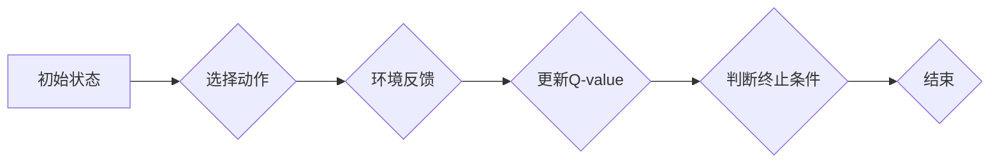

> Q-learning,气候预测,强化学习,机器学习,深度学习,时间序列分析

## 1. 背景介绍

气候变化是当今世界面临的最严峻挑战之一。准确预测气候变化趋势对于制定应对措施、减缓环境灾害、保障人类安全至关重要。传统的气候预测模型主要依赖于物理定律和统计分析，但这些模型往往难以捕捉气候系统复杂性和非线性特征。近年来，人工智能技术，特别是强化学习（Reinforcement Learning，RL）的兴起，为气候预测领域带来了新的希望。

强化学习是一种模仿人类学习过程的机器学习方法。它通过在环境中与环境交互，学习最优策略来最大化奖励。Q-learning是RL领域最经典的算法之一，它通过学习状态-动作价值函数（Q-value），指导智能体选择最优动作。

## 2. 核心概念与联系

### 2.1 强化学习

强化学习的核心概念是“智能体-环境-奖励”三者之间的交互。智能体在环境中采取行动，环境会根据智能体的行动产生相应的状态变化和奖励信号。智能体的目标是通过不断学习，找到最优策略，使得在长期内获得最大的总奖励。

### 2.2 Q-learning

Q-learning是一种基于价值函数的强化学习算法。它通过学习状态-动作价值函数（Q-value），来指导智能体选择最优动作。Q-value表示在特定状态下采取特定动作的期望长期奖励。

**Q-learning算法流程图:**



### 2.3 气候预测与Q-learning

将Q-learning应用于气候预测，可以将气候系统视为环境，气候模型视为智能体。智能体通过学习历史气候数据，预测未来气候变化趋势。

**气候预测与Q-learning的联系:**

* **环境:** 气候系统，包括大气、海洋、陆地等因素。
* **智能体:** 气候模型，例如数值天气预报模型。
* **状态:** 气候系统当前的状态，例如温度、湿度、气压等。
* **动作:** 气候模型采取的行动，例如调整预测参数、选择预测方法等。
* **奖励:** 气候模型预测准确性的指标，例如平均绝对误差（MAE）、均方根误差（RMSE）等。

## 3. 核心算法原理 & 具体操作步骤

### 3.1 算法原理概述

Q-learning算法的核心思想是通过迭代更新状态-动作价值函数（Q-value），来学习最优策略。Q-value表示在特定状态下采取特定动作的期望长期奖励。

Q-learning算法的更新规则如下：

$$Q(s, a) = Q(s, a) + \alpha [r + \gamma \max_{a'} Q(s', a') - Q(s, a)]$$

其中：

* $Q(s, a)$ 表示在状态 $s$ 下采取动作 $a$ 的Q-value。
* $\alpha$ 是学习率，控制着学习速度。
* $r$ 是环境反馈的奖励。
* $\gamma$ 是折扣因子，控制着未来奖励的权重。
* $s'$ 是采取动作 $a$ 后进入的下一个状态。
* $a'$ 是在下一个状态 $s'$ 中选择的最优动作。

### 3.2 算法步骤详解

1. 初始化状态-动作价值函数 $Q(s, a)$，通常设置为0。
2. 选择一个初始状态 $s$。
3. 在状态 $s$ 下选择一个动作 $a$，可以随机选择或使用ε-贪婪策略。
4. 执行动作 $a$，进入下一个状态 $s'$。
5. 环境反馈奖励 $r$。
6. 更新状态-动作价值函数 $Q(s, a)$，使用公式 (1)。
7. 重复步骤 2-6，直到达到终止条件。

### 3.3 算法优缺点

**优点:**

* 能够学习复杂环境中的最优策略。
* 不需要事先知道环境模型。
* 可以处理离散和连续状态空间。

**缺点:**

* 训练时间较长，尤其是在高维状态空间中。
* 需要大量的训练数据。
* 容易陷入局部最优解。

### 3.4 算法应用领域

Q-learning算法广泛应用于各种领域，例如：

* 机器人控制
* 游戏人工智能
* 自动驾驶
* 医疗诊断
* 金融投资

## 4. 数学模型和公式 & 详细讲解 & 举例说明

### 4.1 数学模型构建

在气候预测中，我们可以将气候系统建模为马尔可夫决策过程（Markov Decision Process，MDP）。MDP由以下几个组成部分组成：

* 状态空间 $S$：表示气候系统的所有可能状态，例如温度、湿度、气压等。
* 动作空间 $A$：表示气候模型可以采取的所有动作，例如调整预测参数、选择预测方法等。
* 转移概率 $P(s', r | s, a)$：表示从状态 $s$ 执行动作 $a$ 后，进入状态 $s'$ 的概率，以及获得奖励 $r$ 的概率。
* 奖励函数 $R(s, a)$：表示在状态 $s$ 执行动作 $a$ 后获得的奖励。

### 4.2 公式推导过程

Q-learning算法的目标是学习状态-动作价值函数 $Q(s, a)$，它表示在状态 $s$ 下采取动作 $a$ 的期望长期奖励。

Q-learning算法的更新规则如下：

$$Q(s, a) = Q(s, a) + \alpha [r + \gamma \max_{a'} Q(s', a') - Q(s, a)]$$

其中：

* $Q(s, a)$ 表示在状态 $s$ 下采取动作 $a$ 的Q-value。
* $\alpha$ 是学习率，控制着学习速度。
* $r$ 是环境反馈的奖励。
* $\gamma$ 是折扣因子，控制着未来奖励的权重。
* $s'$ 是采取动作 $a$ 后进入的下一个状态。
* $a'$ 是在下一个状态 $s'$ 中选择的最优动作。

### 4.3 案例分析与讲解

假设我们有一个简单的气候预测模型，它可以预测未来一周的温度。

* 状态空间 $S$：一周的温度数据。
* 动作空间 $A$：调整预测参数。
* 转移概率 $P(s', r | s, a)$：根据历史数据，我们可以估计不同状态下调整不同参数的转移概率和奖励。
* 奖励函数 $R(s, a)$：可以根据预测准确度计算奖励，例如平均绝对误差（MAE）越小，奖励越大。

我们可以使用Q-learning算法训练这个气候预测模型，让它学习最优的预测参数调整策略。

## 5. 项目实践：代码实例和详细解释说明

### 5.1 开发环境搭建

* Python 3.x
* TensorFlow 或 PyTorch
* NumPy
* Matplotlib

### 5.2 源代码详细实现

```python
import numpy as np
from tensorflow.keras.models import Sequential
from tensorflow.keras.layers import Dense

# 定义Q-learning算法
class QLearningAgent:
    def __init__(self, state_size, action_size, learning_rate=0.1, discount_factor=0.9):
        self.state_size = state_size
        self.action_size = action_size
        self.learning_rate = learning_rate
        self.discount_factor = discount_factor
        self.q_table = np.zeros((state_size, action_size))

    def choose_action(self, state):
        # 使用ε-贪婪策略选择动作
        if np.random.rand() < 0.1:
            return np.random.randint(self.action_size)
        else:
            return np.argmax(self.q_table[state])

    def update_q_table(self, state, action, reward, next_state):
        # 更新Q-table
        self.q_table[state, action] = self.q_table[state, action] + self.learning_rate * (
            reward + self.discount_factor * np.max(self.q_table[next_state]) - self.q_table[state, action]
        )

# 定义气候预测模型
class ClimatePredictor:
    def __init__(self):
        self.model = Sequential()
        self.model.add(Dense(128, activation='relu', input_shape=(7,)))
        self.model.add(Dense(64, activation='relu'))
        self.model.add(Dense(1))

    def predict(self, temperature_data):
        # 使用模型预测未来温度
        return self.model.predict(temperature_data)

# 主程序
if __name__ == '__main__':
    # 初始化
    state_size = 7  # 一周的温度数据
    action_size = 10  # 调整预测参数的个数
    learning_rate = 0.1
    discount_factor = 0.9
    agent = QLearningAgent(state_size, action_size, learning_rate, discount_factor)
    predictor = ClimatePredictor()

    # 训练循环
    for episode in range(1000):
        # 初始化状态
        state = np.random.rand(state_size)

        # 训练循环
        while True:
            # 选择动作
            action = agent.choose_action(state)

            # 执行动作
            # ...

            # 获取奖励
            reward = ...

            # 获取下一个状态
            next_state = ...

            # 更新Q-table
            agent.update_q_table(state, action, reward, next_state)

            # 更新状态
            state = next_state

            # 判断终止条件
            if ...:
                break

```

### 5.3 代码解读与分析

* **QLearningAgent类:** 实现Q-learning算法的核心逻辑，包括选择动作、更新Q-table等。
* **ClimatePredictor类:** 定义气候预测模型，可以使用神经网络或其他模型。
* **主程序:** 初始化环境、创建智能体和预测模型，进行训练循环。

### 5.4 运行结果展示

训练完成后，我们可以使用训练好的Q-learning智能体预测未来气候变化趋势。

## 6. 实际应用场景

### 6.1 气候变化趋势预测

Q-learning可以用于预测未来气候变化趋势，例如温度、降水、海平面上升等。

### 6.2 极端天气事件预警

Q-learning可以用于预测极端天气事件，例如热浪、洪水、干旱等，帮助人们做好防灾准备。

### 6.3 碳排放量预测

Q-learning可以用于预测碳排放量，帮助制定减排政策。

### 6.4 未来应用展望

Q-learning在气候预测领域还有很多应用潜力，例如：

* 更精准的预测模型
* 更有效的应对措施
* 更可持续的能源利用

## 7. 工具和资源推荐

### 7.1 学习资源推荐

* **强化学习书籍:**
    * Reinforcement Learning: An Introduction by Sutton and Barto
    * Deep Reinforcement Learning Hands-On by Maxim Lapan
* **在线课程:**
    * Coursera: Reinforcement Learning Specialization
    * Udacity: Deep Reinforcement Learning Nanodegree

### 7.2 开发工具推荐

* **Python:** 广泛用于机器学习和深度学习开发。
* **TensorFlow:** 开源深度学习框架。
* **PyTorch:** 开源深度学习框架。
* **NumPy:** 科学计算库。
* **Matplotlib:** 数据可视化库。

### 7.3 相关