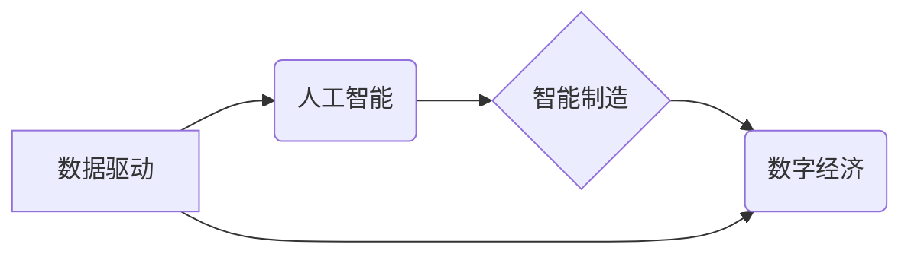

> 新质生产力、人工智能、数据驱动、智能制造、数字经济、算法优化、自动化、可持续发展

## 1. 背景介绍

中国正处于一个重要的历史转折点，从制造大国向创新强国转变的目标日益清晰。在这个过程中，新质生产力作为推动中国现代化进程的关键引擎，发挥着越来越重要的作用。新质生产力是指以数据为基础、以人工智能为驱动的生产方式，它打破了传统生产模式的局限，赋予生产过程以智能化、自动化和可持续发展的特性。

## 2. 核心概念与联系

新质生产力并非一个孤立的概念，它与人工智能、数据驱动、智能制造、数字经济等多个领域紧密相连。

**2.1  人工智能 (AI)**

人工智能作为新质生产力的核心驱动力，通过机器学习、深度学习等算法，赋予机器以类似人类的智能，例如感知、学习、决策和创造。AI技术在生产过程中可以实现自动化、智能化和个性化，提高生产效率和产品质量。

**2.2  数据驱动**

数据是新质生产力的基础，通过收集、分析和利用海量数据，可以洞察生产过程中的规律和趋势，优化生产流程和产品设计。数据驱动决策，可以帮助企业更加精准地把握市场需求，提高生产效率和产品竞争力。

**2.3  智能制造**

智能制造是新质生产力的具体体现，它通过将人工智能、物联网、云计算等技术应用于制造业，实现生产过程的智能化、自动化和可视化。智能制造可以提高生产效率、降低生产成本、提升产品质量和服务水平。

**2.4  数字经济**

数字经济是新质生产力的应用场景，它以数字技术为基础，构建全新的经济模式和商业生态。数字经济的蓬勃发展，为新质生产力的应用提供了广阔的市场空间。

**2.5  核心概念关系图**



## 3. 核心算法原理 & 具体操作步骤

**3.1  算法原理概述**

新质生产力中常用的核心算法包括机器学习、深度学习、强化学习等。这些算法通过训练模型，学习数据中的规律和模式，从而实现智能化决策和预测。

**3.2  算法步骤详解**

**机器学习算法**

1. 数据收集和预处理：收集相关数据，并进行清洗、转换和特征工程等预处理操作。
2. 模型选择：根据任务需求选择合适的机器学习模型，例如线性回归、逻辑回归、决策树、支持向量机等。
3. 模型训练：使用训练数据训练模型，调整模型参数，使模型能够准确地预测或分类数据。
4. 模型评估：使用测试数据评估模型的性能，例如准确率、召回率、F1-score等指标。
5. 模型部署：将训练好的模型部署到实际应用场景中，用于预测或分类新的数据。

**深度学习算法**

深度学习算法是机器学习算法的升级版，它使用多层神经网络结构，能够学习更复杂的特征和模式。深度学习算法的训练过程与机器学习算法类似，但需要更多的计算资源和数据。

**强化学习算法**

强化学习算法是一种通过试错学习的算法，它通过与环境交互，学习最优的策略，以获得最大的奖励。强化学习算法在机器人控制、游戏 AI 等领域有广泛的应用。

**3.3  算法优缺点**

**机器学习算法**

优点：易于理解和实现，训练速度相对较快。
缺点：对数据质量要求较高，难以学习复杂特征。

**深度学习算法**

优点：能够学习更复杂的特征，性能优于传统机器学习算法。
缺点：训练速度慢，对数据量和计算资源要求高。

**强化学习算法**

优点：能够学习最优策略，适用于复杂环境下的决策问题。
缺点：训练过程复杂，需要大量的试错学习。

**3.4  算法应用领域**

新质生产力中的核心算法在各个领域都有广泛的应用，例如：

* **智能制造:** 自动化生产线、智能机器人、预测性维护
* **医疗保健:** 疾病诊断、药物研发、个性化医疗
* **金融服务:** 风险管理、欺诈检测、投资决策
* **交通运输:** 自动驾驶、交通流量优化、物流管理

## 4. 数学模型和公式 & 详细讲解 & 举例说明

**4.1  数学模型构建**

新质生产力中的核心算法通常基于数学模型，例如线性回归模型、逻辑回归模型、神经网络模型等。这些模型通过数学公式来描述数据之间的关系，并通过训练参数来优化模型的预测能力。

**4.2  公式推导过程**

例如，线性回归模型的预测公式如下：

$$
y = \beta_0 + \beta_1 x_1 + \beta_2 x_2 + ... + \beta_n x_n + \epsilon
$$

其中：

* $y$ 是预测值
* $\beta_0, \beta_1, ..., \beta_n$ 是模型参数
* $x_1, x_2, ..., x_n$ 是输入特征
* $\epsilon$ 是误差项

模型参数可以通过最小二乘法等算法进行优化，以使预测值与实际值之间的误差最小。

**4.3  案例分析与讲解**

例如，假设我们想要预测房屋价格，我们可以使用线性回归模型，将房屋面积、房间数量、地理位置等特征作为输入，预测房屋价格。通过训练模型，我们可以得到模型参数，并使用这些参数预测新房子的价格。

## 5. 项目实践：代码实例和详细解释说明

**5.1  开发环境搭建**

为了实现新质生产力中的算法应用，需要搭建相应的开发环境。常用的开发环境包括：

* **Python:** Python 是机器学习和深度学习领域最常用的编程语言，拥有丰富的库和框架，例如 TensorFlow、PyTorch、Scikit-learn 等。
* **云计算平台:** 云计算平台，例如 AWS、Azure、Google Cloud 等，提供强大的计算资源和数据存储服务，可以加速算法训练和部署。

**5.2  源代码详细实现**

以下是一个使用 Python 和 Scikit-learn 库实现线性回归模型的代码示例：

```python
from sklearn.linear_model import LinearRegression
from sklearn.model_selection import train_test_split
from sklearn.metrics import mean_squared_error

# 加载数据
data = ...

# 将数据分为训练集和测试集
X_train, X_test, y_train, y_test = train_test_split(data[:, :-1], data[:, -1], test_size=0.2)

# 创建线性回归模型
model = LinearRegression()

# 训练模型
model.fit(X_train, y_train)

# 预测测试集数据
y_pred = model.predict(X_test)

# 计算模型性能
mse = mean_squared_error(y_test, y_pred)
print(f"Mean Squared Error: {mse}")
```

**5.3  代码解读与分析**

这段代码首先加载数据，然后将数据分为训练集和测试集。接着，创建线性回归模型，并使用训练集训练模型。最后，使用测试集数据预测结果，并计算模型性能。

**5.4  运行结果展示**

运行代码后，会输出模型的平均平方误差 (MSE) 值，该值可以用来评估模型的性能。MSE 值越小，模型的预测能力越强。

## 6. 实际应用场景

**6.1  智能制造**

在智能制造领域，新质生产力可以实现自动化生产线、智能机器人、预测性维护等应用。例如，通过机器学习算法，可以预测设备故障，提前进行维护，降低设备停机时间和维修成本。

**6.2  医疗保健**

在医疗保健领域，新质生产力可以用于疾病诊断、药物研发、个性化医疗等。例如，通过深度学习算法，可以分析医学影像数据，辅助医生诊断疾病。

**6.3  金融服务**

在金融服务领域，新质生产力可以用于风险管理、欺诈检测、投资决策等。例如，通过强化学习算法，可以训练智能机器人进行股票交易，提高投资收益。

**6.4  未来应用展望**

随着人工智能、数据驱动等技术的不断发展，新质生产力将在未来更加广泛地应用于各个领域，例如：

* **个性化定制:** 根据用户的需求，定制个性化的产品和服务。
* **可持续发展:** 通过优化生产流程和资源利用，实现可持续发展。
* **新兴产业:** 推动新兴产业的兴起，例如自动驾驶、机器人服务等。

## 7. 工具和资源推荐

**7.1  学习资源推荐**

* **在线课程:** Coursera、edX、Udacity 等平台提供丰富的机器学习和深度学习课程。
* **书籍:** 《深度学习》、《机器学习实战》等书籍是学习人工智能的经典教材。
* **开源项目:** TensorFlow、PyTorch 等开源项目可以帮助开发者学习和实践人工智能算法。

**7.2  开发工具推荐**

* **Python:** Python 是机器学习和深度学习领域最常用的编程语言。
* **Jupyter Notebook:** Jupyter Notebook 是一个交互式编程环境，方便进行机器学习和深度学习的开发和调试。
* **云计算平台:** AWS、Azure、Google Cloud 等云计算平台提供强大的计算资源和数据存储服务。

**7.3  相关论文推荐**

* **《ImageNet Classification with Deep Convolutional Neural Networks》**
* **《Attention Is All You Need》**
* **《Deep Reinforcement Learning》**

## 8. 总结：未来发展趋势与挑战

**8.1  研究成果总结**

新质生产力在各个领域取得了显著的成果，例如智能制造、医疗保健、金融服务等。人工智能、数据驱动等技术的不断发展，为新质生产力的应用提供了强大的技术支撑。

**8.2  未来发展趋势**

未来，新质生产力将朝着以下方向发展：

* **更加智能化:** 人工智能技术将更加智能化，能够更好地理解和处理复杂数据，实现更精准的决策和预测。
* **更加个性化:** 新质生产力将更加注重个性化定制，根据用户的需求，提供更加个性化的产品和服务。
* **更加可持续发展:** 新质生产力将更加注重资源利用效率和环境保护，实现更加可持续的发展。

**8.3  面临的挑战**

新质生产力发展也面临着一些挑战，例如：

* **数据安全和隐私保护:** 数据是新质生产力的基础，如何保障数据安全和隐私保护是一个重要的挑战。
* **算法伦理:** 人工智能算法的决策可能会存在偏差，如何确保算法的公平性和伦理性是一个重要的议题。
* **人才短缺:** 新质生产力需要大量的技术人才，人才短缺是一个制约发展的瓶颈。

**8.4  研究展望**

未来，我们需要继续加强对新质生产力的研究，探索其更深层次的应用潜力，并解决其面临的挑战，推动新质生产力成为推动中国现代化进程的重要引擎。

## 9. 附录：常见问题与解答

**9.1  什么是新质生产力？**

新质生产力是指以数据为基础、以人工智能为驱动的生产方式，它打破了传统生产模式的局限，赋予生产过程以智能化、自动化和可持续发展的特性。

**9.2  新质生产力有哪些核心技术？**

新质生产力的核心技术包括人工智能、数据驱动、智能制造、数字经济等。

**9.3  新质生产力有哪些应用场景？**

新质生产力在各个领域都有广泛的应用，例如智能制造、医疗保健、金融服务等。

**9.4  新质生产力有哪些挑战？**

新质生产力发展也面临着一些挑战，例如数据安全和隐私保护、算法伦理、人才短缺等。


作者：禅与计算机程序设计艺术 / Zen and the Art of Computer Programming 
<end_of_turn>