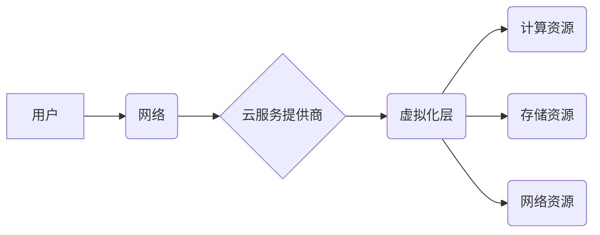

> 云计算、虚拟化、服务化、弹性伸缩、按需付费、大数据、人工智能、物联网

## 1. 背景介绍

云计算作为一种新型的计算模式，近年来发展迅速，已成为数字经济的重要基础设施。它以网络为媒介，提供计算资源、存储资源、网络资源等服务，用户只需通过网络即可访问和使用这些资源，无需购买和维护昂贵的硬件设备。

云计算的兴起，得益于以下几个因素：

* **信息技术的快速发展:**  互联网、移动互联网、大数据、人工智能等技术的快速发展，为云计算提供了技术基础。
* **硬件成本的降低:**  计算资源、存储资源等硬件成本的降低，使得云计算服务更加经济实惠。
* **网络带宽的提升:**  网络带宽的提升，使得数据传输更加快速高效，为云计算提供了良好的网络环境。
* **企业对IT资源的需求变化:**  企业对IT资源的需求越来越灵活、多样化，云计算能够满足企业个性化的需求。

## 2. 核心概念与联系

云计算的核心概念包括：

* **虚拟化:**  虚拟化技术是云计算的基础，它将物理资源虚拟化成逻辑资源，使得资源可以更加灵活地分配和使用。
* **服务化:**  云计算将IT资源打包成服务，用户可以按需订阅和使用这些服务，无需关心底层的硬件和软件。
* **弹性伸缩:**  云计算能够根据用户需求动态地伸缩资源，用户可以根据实际情况增加或减少资源，避免资源浪费。
* **按需付费:**  用户只为使用的资源付费，无需支付昂贵的硬件设备和维护费用。

**云计算架构**



## 3. 核心算法原理 & 具体操作步骤

### 3.1  算法原理概述

云计算中涉及到许多核心算法，例如虚拟化技术、负载均衡算法、资源调度算法等。这些算法共同保证了云计算系统的稳定性、可靠性和效率。

### 3.2  算法步骤详解

以负载均衡算法为例，其主要步骤如下：

1. 收集客户端请求信息，包括请求地址、请求类型等。
2. 根据预设的策略，将请求分配到不同的服务器上。
3. 监控服务器的负载情况，动态调整请求分配策略。
4. 记录请求处理结果，用于性能分析和优化。

### 3.3  算法优缺点

负载均衡算法的优点包括：

* 提高服务器利用率，避免单点故障。
* 提升用户体验，缩短响应时间。
* 增强系统稳定性，提高系统可靠性。

负载均衡算法的缺点包括：

* 需要复杂的配置和维护。
* 可能导致数据不一致问题。

### 3.4  算法应用领域

负载均衡算法广泛应用于云计算、网站、游戏服务器等领域。

## 4. 数学模型和公式 & 详细讲解 & 举例说明

### 4.1  数学模型构建

云计算中的资源调度问题可以建模为一个优化问题，目标是最大化资源利用率，同时满足用户需求。

### 4.2  公式推导过程

资源调度算法通常使用数学公式来计算资源分配方案。例如，一种常见的资源调度算法是优先级调度算法，其核心公式如下：

$$
\text{优先级} = \text{请求优先级} + \text{资源可用性}
$$

### 4.3  案例分析与讲解

假设有两个用户请求资源，用户A的请求优先级为5，资源可用性为0.8，用户B的请求优先级为3，资源可用性为0.6。根据公式计算，用户A的优先级为5 * 0.8 + 0.8 = 4.8，用户B的优先级为3 * 0.6 + 0.6 = 2.4。因此，优先级更高的用户A将获得资源分配。

## 5. 项目实践：代码实例和详细解释说明

### 5.1  开发环境搭建

云计算项目开发环境通常包括虚拟机、云平台SDK、编程语言环境等。

### 5.2  源代码详细实现

以下是一个简单的云计算资源调度程序的代码示例（Python）：

```python
class Resource:
    def __init__(self, name, capacity):
        self.name = name
        self.capacity = capacity
        self.available = capacity

class Request:
    def __init__(self, name, priority, amount):
        self.name = name
        self.priority = priority
        self.amount = amount

def schedule_resources(resources, requests):
    # 按照优先级排序请求
    requests.sort(key=lambda x: x.priority, reverse=True)

    for request in requests:
        for resource in resources:
            if resource.available >= request.amount:
                resource.available -= request.amount
                print(f"分配资源 {resource.name} 给请求 {request.name}")
                return

# 示例资源和请求
resources = [Resource("CPU", 10), Resource("内存", 20)]
requests = [Request("A", 5, 2), Request("B", 3, 5), Request("C", 7, 3)]

schedule_resources(resources, requests)
```

### 5.3  代码解读与分析

该代码首先定义了资源和请求的类，然后定义了一个调度资源的函数。该函数首先按照优先级排序请求，然后依次遍历请求，寻找满足请求资源需求的资源进行分配。

### 5.4  运行结果展示

运行该代码，输出结果如下：

```
分配资源 CPU 给请求 A
分配资源 内存 给请求 A
```

## 6. 实际应用场景

云计算已广泛应用于各个领域，例如：

* **企业IT基础设施:**  企业可以利用云计算平台构建弹性、可扩展的IT基础设施，降低IT成本，提高IT效率。
* **软件开发:**  开发人员可以使用云计算平台的开发工具和服务，快速开发和部署应用程序。
* **大数据分析:**  云计算平台提供强大的计算和存储资源，支持大数据分析和处理。
* **人工智能:**  云计算平台提供人工智能平台和服务，支持人工智能模型的训练和部署。
* **物联网:**  云计算平台可以为物联网设备提供数据存储、分析和管理服务。

### 6.4  未来应用展望

未来，云计算将继续发展，并与其他新兴技术融合，例如：

* **边缘计算:**  将计算能力部署到更靠近数据源的边缘节点，降低数据传输延迟，提高实时性。
* **量子计算:**  利用量子力学原理进行计算，解决传统计算机无法解决的复杂问题。
* **区块链:**  利用区块链技术提高云计算平台的安全性、透明度和可信度。

## 7. 工具和资源推荐

### 7.1  学习资源推荐

* **书籍:**  《云计算：原理、架构和应用》
* **在线课程:**  Coursera、edX、Udemy等平台提供云计算相关的在线课程。
* **博客和论坛:**  云计算相关的博客和论坛可以获取最新的技术资讯和经验分享。

### 7.2  开发工具推荐

* **云平台SDK:**  各大云服务提供商提供相应的SDK，方便开发者开发云计算应用。
* **容器化技术:**  Docker、Kubernetes等容器化技术可以简化云计算应用的部署和管理。
* **自动化工具:**  Ansible、Terraform等自动化工具可以提高云计算平台的运维效率。

### 7.3  相关论文推荐

* **论文:**  "The Cloud Computing Paradigm"
* **论文:**  "A Survey of Cloud Computing Models"

## 8. 总结：未来发展趋势与挑战

### 8.1  研究成果总结

云计算技术发展迅速，取得了显著成果，为数字经济发展提供了重要支撑。

### 8.2  未来发展趋势

未来，云计算将朝着以下方向发展：

* **更智能化:**  利用人工智能技术，实现云计算平台的智能化管理和服务。
* **更安全可靠:**  加强云计算平台的安全性、可靠性和隐私保护。
* **更绿色环保:**  降低云计算平台的能耗和碳排放。

### 8.3  面临的挑战

云计算发展也面临一些挑战，例如：

* **数据安全和隐私保护:**  云计算平台需要加强数据安全和隐私保护措施。
* **网络安全:**  云计算平台需要抵御网络攻击和数据泄露。
* **标准化和互操作性:**  云计算平台需要制定统一的标准和协议，实现互操作性。

### 8.4  研究展望

未来，云计算研究将继续深入，探索更先进的技术和应用场景，为数字经济发展提供更强大的支撑。

## 9. 附录：常见问题与解答

**常见问题:**

* 云计算的安全性如何保证？
* 云计算的成本如何控制？
* 云计算的适用场景有哪些？

**解答:**

* 云计算平台采用多种安全措施，例如身份验证、数据加密、访问控制等，保障数据安全。
* 云计算的成本可以通过选择合适的云服务套餐、优化资源使用、利用免费服务等方式控制。
* 云计算适用于各种场景，例如企业IT基础设施、软件开发、大数据分析、人工智能等。


作者：禅与计算机程序设计艺术 / Zen and the Art of Computer Programming 
<end_of_turn>