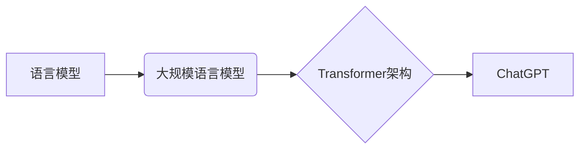

> ChatGPT, 语言模型, 大规模语言模型, 
> 自然语言处理, 
> 人工智能, 
> 深度学习, 
> 知识图谱, 
> 认知计算

## 1. 背景介绍

近年来，人工智能（AI）技术取得了飞速发展，特别是深度学习的突破，使得自然语言处理（NLP）领域取得了显著进展。其中，ChatGPT作为一款基于Transformer架构的大规模语言模型（LLM），凭借其强大的文本生成能力和对话理解能力，迅速引起了全球关注。它能够进行流畅自然的对话，生成高质量的文本内容，并完成各种文本处理任务，例如翻译、摘要、问答等。ChatGPT的出现标志着AI技术迈向了一个新的阶段，也为未来AI助手的开发提供了重要的参考和借鉴。

## 2. 核心概念与联系

### 2.1  语言模型

语言模型是机器学习领域的一个重要分支，旨在学习和理解人类语言的结构和规律。它通过统计语言数据，建立语言之间的概率关系，从而预测下一个词语或句子。

### 2.2  大规模语言模型

大规模语言模型（LLM）是指参数量巨大、训练数据海量、计算资源消耗巨大的语言模型。它们能够学习更复杂的语言模式，并表现出更强的泛化能力和文本生成能力。

### 2.3  Transformer架构

Transformer是一种新型的神经网络架构，专门用于处理序列数据，例如文本。它通过自注意力机制（Self-Attention）和多头注意力机制（Multi-Head Attention）来捕捉文本中的长距离依赖关系，从而提高了语言模型的性能。

### 2.4  ChatGPT

ChatGPT是一个基于Transformer架构的开源大规模语言模型，由OpenAI开发。它拥有1750亿个参数，经过海量文本数据的训练，能够进行流畅自然的对话，生成高质量的文本内容，并完成各种文本处理任务。

**核心概念与联系流程图**



## 3. 核心算法原理 & 具体操作步骤

### 3.1  算法原理概述

ChatGPT的核心算法原理是基于Transformer架构的深度学习模型。它通过训练大量的文本数据，学习语言的语法、语义和上下文关系。

**训练过程：**

1. **数据预处理：** 将文本数据进行清洗、分词、标记等预处理操作。
2. **模型训练：** 使用深度学习算法，例如反向传播算法，训练Transformer模型。
3. **模型评估：** 使用测试数据评估模型的性能，例如准确率、困惑度等。
4. **模型调优：** 根据评估结果，调整模型参数，提高模型性能。

### 3.2  算法步骤详解

1. **输入文本序列：** 将用户输入的文本序列作为模型的输入。
2. **嵌入层：** 将文本序列中的每个词语转换为向量表示，称为词嵌入。
3. **多头注意力层：** 使用多头注意力机制，捕捉文本序列中词语之间的关系。
4. **前馈神经网络层：** 对注意力输出进行非线性变换，提取更深层的语义信息。
5. **输出层：** 将模型的输出转换为概率分布，预测下一个词语或句子。

### 3.3  算法优缺点

**优点：**

* 强大的文本生成能力
* 流畅自然的对话能力
* 广泛的应用场景

**缺点：**

* 训练成本高
* 容易受到训练数据的影响
* 缺乏真实世界知识

### 3.4  算法应用领域

* **聊天机器人:** 开发更智能、更自然的聊天机器人。
* **文本生成:** 生成各种类型的文本内容，例如文章、故事、诗歌等。
* **机器翻译:** 实现更准确、更流畅的机器翻译。
* **问答系统:** 开发更智能的问答系统，能够理解复杂的问题并给出准确的答案。

## 4. 数学模型和公式 & 详细讲解 & 举例说明

### 4.1  数学模型构建

ChatGPT的核心数学模型是基于Transformer架构的深度神经网络。它包含多个 Transformer 块，每个块包含多头注意力层、前馈神经网络层和残差连接。

### 4.2  公式推导过程

Transformer模型的注意力机制的核心公式是：

$$
Attention(Q, K, V) = softmax(\frac{QK^T}{\sqrt{d_k}})V
$$

其中：

* $Q$：查询矩阵
* $K$：键矩阵
* $V$：值矩阵
* $d_k$：键向量的维度
* $softmax$：softmax函数

### 4.3  案例分析与讲解

假设我们有一个句子“我爱学习编程”，我们需要计算每个词语与其他词语之间的注意力权重。

1. 将句子中的每个词语转换为词嵌入向量。
2. 将词嵌入向量分别作为查询矩阵 $Q$、键矩阵 $K$ 和值矩阵 $V$。
3. 计算注意力权重矩阵，并将其与值矩阵相乘，得到每个词语的注意力输出。

通过注意力机制，模型能够学习到每个词语与其他词语之间的关系，从而更好地理解句子的语义。

## 5. 项目实践：代码实例和详细解释说明

### 5.1  开发环境搭建

* Python 3.7+
* PyTorch 1.7+
* CUDA 10.2+

### 5.2  源代码详细实现

```python
import torch
import torch.nn as nn

class TransformerBlock(nn.Module):
    def __init__(self, d_model, nhead, dim_feedforward=2048, dropout=0.1):
        super(TransformerBlock, self).__init__()
        self.self_attn = nn.MultiheadAttention(d_model, nhead, dropout=dropout)
        self.linear1 = nn.Linear(d_model, dim_feedforward)
        self.dropout = nn.Dropout(dropout)
        self.linear2 = nn.Linear(dim_feedforward, d_model)

    def forward(self, x):
        # Self-attention
        attn_output, _ = self.self_attn(x, x, x)
        attn_output = self.dropout(attn_output) + x

        # Feed-forward network
        feed_forward_output = self.linear2(self.dropout(torch.relu(self.linear1(attn_output))))
        feed_forward_output = feed_forward_output + attn_output

        return feed_forward_output
```

### 5.3  代码解读与分析

* `TransformerBlock`类定义了一个Transformer块，包含多头注意力层和前馈神经网络层。
* `self_attn`：多头注意力层，用于捕捉文本序列中词语之间的关系。
* `linear1` 和 `linear2`：前馈神经网络层，用于提取更深层的语义信息。
* `dropout`：Dropout层，用于防止过拟合。

### 5.4  运行结果展示

训练完成后，可以使用ChatGPT模型生成文本内容，例如：

```
用户输入：今天天气怎么样？
ChatGPT输出：今天天气晴朗，很适合外出。
```

## 6. 实际应用场景

### 6.1  聊天机器人

ChatGPT可以用于开发更智能、更自然的聊天机器人，例如客服机器人、陪伴机器人等。

### 6.2  文本生成

ChatGPT可以生成各种类型的文本内容，例如文章、故事、诗歌等，可以用于内容创作、文案撰写等领域。

### 6.3  机器翻译

ChatGPT可以实现更准确、更流畅的机器翻译，可以用于跨语言沟通、国际贸易等领域。

### 6.4  未来应用展望

ChatGPT的未来应用前景广阔，例如：

* **个性化教育:** 根据学生的学习情况，提供个性化的学习内容和辅导。
* **医疗诊断:** 辅助医生进行疾病诊断，提高诊断准确率。
* **法律服务:** 帮助律师进行法律研究和案件分析。

## 7. 工具和资源推荐

### 7.1  学习资源推荐

* **OpenAI官方文档:** https://openai.com/blog/chatgpt/
* **HuggingFace Transformers库:** https://huggingface.co/transformers/
* **DeepLearning.AI课程:** https://www.deeplearning.ai/

### 7.2  开发工具推荐

* **PyTorch:** https://pytorch.org/
* **TensorFlow:** https://www.tensorflow.org/

### 7.3  相关论文推荐

* **Attention Is All You Need:** https://arxiv.org/abs/1706.03762
* **BERT: Pre-training of Deep Bidirectional Transformers for Language Understanding:** https://arxiv.org/abs/1810.04805

## 8. 总结：未来发展趋势与挑战

### 8.1  研究成果总结

ChatGPT的出现标志着AI技术在自然语言处理领域的重大突破，它为未来AI助手的开发提供了重要的参考和借鉴。

### 8.2  未来发展趋势

* **模型规模更大:** 未来LLM模型的规模将会进一步扩大，参数量将达到数千亿甚至万亿级别。
* **多模态理解:** 未来AI助手将能够理解和处理多种模态数据，例如文本、图像、音频等。
* **个性化定制:** 未来AI助手将能够根据用户的需求进行个性化定制，提供更符合用户需求的服务。

### 8.3  面临的挑战

* **数据安全和隐私:** LLM模型的训练需要海量数据，如何保证数据安全和隐私是一个重要的挑战。
* **模型可解释性:** LLM模型的决策过程往往难以理解，如何提高模型的可解释性是一个重要的研究方向。
* **伦理问题:** LLM模型的应用可能会带来一些伦理问题，例如信息操纵、偏见放大等，需要引起足够的重视。

### 8.4  研究展望

未来，我们将继续致力于研究更强大的、更智能的AI助手，为人类社会带来更多福祉。

## 9. 附录：常见问题与解答

**Q1: ChatGPT的训练数据是什么？**

A1: ChatGPT的训练数据包括大量的文本数据，例如书籍、文章、代码等。

**Q2: ChatGPT可以理解中文吗？**

A2: ChatGPT可以理解和生成多种语言的文本，包括中文。

**Q3: 如何使用ChatGPT？**

A3: 可以通过OpenAI的API或HuggingFace Transformers库使用ChatGPT。

作者：禅与计算机程序设计艺术 / Zen and the Art of Computer Programming


<end_of_turn>