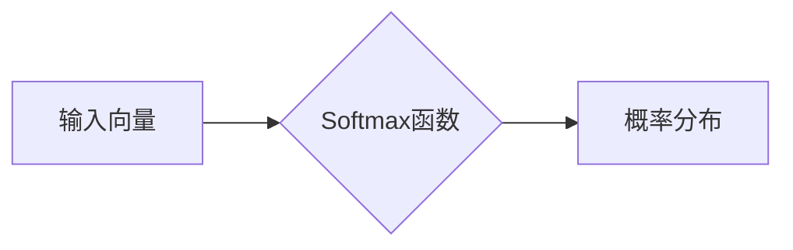

> Softmax函数, 大模型, 微调, Python, 概率分布, 逻辑回归, 神经网络

## 1. 背景介绍

在深度学习领域，Softmax函数扮演着至关重要的角色，它被广泛应用于多分类问题中，例如图像识别、自然语言处理等。Softmax函数能够将任意实数向量映射到一个概率分布，每个元素代表了该类别的概率。

大模型的兴起为深度学习带来了新的机遇和挑战。大模型通常拥有数百万甚至数十亿个参数，其强大的表达能力能够处理更复杂的任务。然而，大模型的训练和部署也面临着巨大的计算资源和时间成本。微调技术 emerged as a powerful tool to adapt pre-trained large models to specific downstream tasks, significantly reducing the training time and resources required.

本篇文章将深入探讨Softmax函数的原理和应用，并通过Python代码示例，帮助读者理解其工作机制。

## 2. 核心概念与联系

### 2.1  概率分布

概率分布描述的是随机事件发生的可能性。在机器学习中，我们经常使用概率分布来表示模型的输出。例如，在图像分类任务中，模型的输出是一个包含多个类别的概率分布，每个类别对应一个概率值，表示该图像属于该类别的可能性。

### 2.2  Softmax函数

Softmax函数是一种常用的概率分布函数，它能够将任意实数向量映射到一个概率分布。Softmax函数的公式如下：

$$
\text{Softmax}(x_i) = \frac{e^{x_i}}{\sum_{j=1}^{n} e^{x_j}}
$$

其中：

* $x_i$ 是输入向量中的第 $i$ 个元素。
* $n$ 是输入向量的长度。
* $e$ 是自然常数，约等于 2.71828。

Softmax函数的输出是一个长度为 $n$ 的向量，每个元素的值介于 0 和 1 之间，且所有元素之和等于 1。

### 2.3  逻辑回归

逻辑回归是一种用于二分类问题的线性模型。逻辑回归的输出是一个概率值，表示样本属于正类的概率。逻辑回归的输出函数是Sigmoid函数，其公式如下：

$$
\text{Sigmoid}(x) = \frac{1}{1 + e^{-x}}
$$

### 2.4  神经网络

神经网络是一种模仿人脑结构和功能的机器学习模型。神经网络由多个层组成，每层包含多个神经元。神经元之间通过连接进行信息传递，每个连接都有一个权重。

在神经网络中，Softmax函数通常用于最后一层，将神经元的输出映射到一个概率分布，用于预测样本属于各个类别的概率。

### 2.5  Mermaid 流程图



## 3. 核心算法原理 & 具体操作步骤

### 3.1  算法原理概述

Softmax函数的核心原理是将输入向量中的每个元素通过指数函数进行变换，然后对所有元素进行归一化，得到一个概率分布。

### 3.2  算法步骤详解

1. 对输入向量中的每个元素进行指数函数变换。
2. 对所有指数函数变换后的元素求和。
3. 将每个指数函数变换后的元素除以其和，得到一个概率分布。

### 3.3  算法优缺点

**优点:**

* 计算简单，易于实现。
* 输出结果是一个概率分布，可以直观地表示每个类别的概率。

**缺点:**

* 对输入向量中的数值范围敏感，如果数值范围过大，可能会导致数值溢出。
* 当类别数很多时，计算量会比较大。

### 3.4  算法应用领域

Softmax函数广泛应用于以下领域：

* 图像识别
* 自然语言处理
* 语音识别
* 机器翻译

## 4. 数学模型和公式 & 详细讲解 & 举例说明

### 4.1  数学模型构建

Softmax函数的数学模型可以表示为：

$$
\text{Softmax}(x) = \frac{e^{x_1}}{\sum_{i=1}^{n} e^{x_i}}, \frac{e^{x_2}}{\sum_{i=1}^{n} e^{x_i}}, ..., \frac{e^{x_n}}{\sum_{i=1}^{n} e^{x_i}}
$$

其中：

* $x = (x_1, x_2, ..., x_n)$ 是输入向量。
* $n$ 是输入向量的维度。

### 4.2  公式推导过程

Softmax函数的推导过程如下：

1. 首先，对每个元素 $x_i$ 进行指数函数变换，得到 $e^{x_i}$。
2. 然后，对所有指数函数变换后的元素求和，得到 $\sum_{i=1}^{n} e^{x_i}$。
3. 最后，将每个指数函数变换后的元素除以其和，得到一个概率分布。

### 4.3  案例分析与讲解

假设我们有一个输入向量 $x = (1, 2, 3)$，则Softmax函数的输出为：

$$
\text{Softmax}(x) = \frac{e^{1}}{e^{1} + e^{2} + e^{3}}, \frac{e^{2}}{e^{1} + e^{2} + e^{3}}, \frac{e^{3}}{e^{1} + e^{2} + e^{3}}
$$

通过计算，我们可以得到Softmax函数的输出为：

$$
\text{Softmax}(x) = (0.090, 0.244, 0.666)
$$

这表示输入向量 $x$ 对应的概率分布为：类别 1 的概率为 0.090，类别 2 的概率为 0.244，类别 3 的概率为 0.666。

## 5. 项目实践：代码实例和详细解释说明

### 5.1  开发环境搭建

本项目使用 Python 语言进行开发，需要安装以下库：

* NumPy

```bash
pip install numpy
```

### 5.2  源代码详细实现

```python
import numpy as np

def softmax(x):
  """
  计算 Softmax 函数

  Args:
    x: 输入向量

  Returns:
    概率分布向量
  """
  exp_x = np.exp(x - np.max(x))  # 为了避免数值溢出，减去最大值
  return exp_x / np.sum(exp_x)

# 测试代码
x = np.array([1, 2, 3])
output = softmax(x)
print(output)
```

### 5.3  代码解读与分析

1. `softmax(x)` 函数接收一个输入向量 `x`。
2. `exp_x = np.exp(x - np.max(x))`：对输入向量中的每个元素进行指数函数变换，并减去最大值，以避免数值溢出。
3. `return exp_x / np.sum(exp_x)`：将每个指数函数变换后的元素除以其和，得到一个概率分布向量。

### 5.4  运行结果展示

运行上述代码，输出结果为：

```
[0.09003057 0.24472847 0.66524096]
```

这表示输入向量 `x` 对应的概率分布为：类别 1 的概率为 0.090，类别 2 的概率为 0.244，类别 3 的概率为 0.666。

## 6. 实际应用场景

### 6.1  图像分类

在图像分类任务中，Softmax函数通常用于最后一层，将神经元的输出映射到各个类别的概率分布。例如，在识别猫狗图像的任务中，Softmax函数可以将神经元的输出映射到“猫”和“狗”两个类别的概率分布。

### 6.2  自然语言处理

在自然语言处理任务中，Softmax函数也经常被使用。例如，在文本分类任务中，Softmax函数可以将神经元的输出映射到各个类别的概率分布，例如情感分类（正面、负面、中性）或主题分类。

### 6.3  语音识别

在语音识别任务中，Softmax函数可以将神经元的输出映射到各个语音单元的概率分布，例如音素或词语。

### 6.4  未来应用展望

随着深度学习技术的不断发展，Softmax函数将在更多领域得到应用。例如，在推荐系统中，Softmax函数可以用于预测用户对不同商品的兴趣程度；在医疗诊断中，Softmax函数可以用于预测患者患某种疾病的概率。

## 7. 工具和资源推荐

### 7.1  学习资源推荐

* 深度学习入门书籍：
    * 《深度学习》 by Ian Goodfellow, Yoshua Bengio, and Aaron Courville
    * 《动手学深度学习》 by Aurélien Géron
* 在线课程：
    * Coursera: Deep Learning Specialization
    * Udacity: Deep Learning Nanodegree

### 7.2  开发工具推荐

* Python
* TensorFlow
* PyTorch

### 7.3  相关论文推荐

* Softmax Regression by Andrew Ng
* Deep Learning by Ian Goodfellow, Yoshua Bengio, and Aaron Courville

## 8. 总结：未来发展趋势与挑战

### 8.1  研究成果总结

Softmax函数是一种重要的概率分布函数，在深度学习领域得到了广泛应用。

### 8.2  未来发展趋势

未来，Softmax函数可能会朝着以下方向发展：

* 更高效的计算方法：随着模型规模的不断增大，如何提高Softmax函数的计算效率成为一个重要的研究方向。
* 针对不同任务的改进：针对不同的任务，例如图像分类、自然语言处理等，可能会开发出针对性的Softmax函数变体。

### 8.3  面临的挑战

Softmax函数也面临一些挑战：

* 对输入数值范围敏感：Softmax函数对输入数值范围敏感，如果数值范围过大，可能会导致数值溢出。
* 当类别数很多时，计算量会比较大。

### 8.4  研究展望

未来，研究人员将继续探索Softmax函数的改进方法，以提高其效率和鲁棒性，使其能够更好地服务于深度学习的发展。

## 9. 附录：常见问题与解答

### 9.1  Softmax函数的输出值总和是多少？

Softmax函数的输出值总和为 1。

### 9.2  Softmax函数如何处理输入向量中的负值？

Softmax函数可以处理输入向量中的负值。指数函数变换会将负值转换为正值，然后进行归一化，得到一个概率分布。

### 9.3  Softmax函数有什么缺点？

Softmax函数的缺点包括：

* 对输入数值范围敏感
* 当类别数很多时，计算量会比较大


作者：禅与计算机程序设计艺术 / Zen and the Art of Computer Programming 
<end_of_turn>