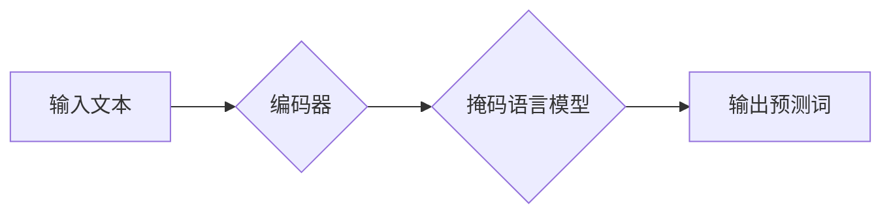

> 大模型、预训练模型、BERT、微调、自然语言处理、深度学习、Transformer

## 1. 背景介绍

近年来，深度学习在人工智能领域取得了突破性进展，其中自然语言处理（NLP）领域尤为突出。传统的机器学习方法依赖于大量人工标注数据，而深度学习模型则能够从海量文本数据中自动学习语言特征，从而实现更精准、更智能的文本理解和生成。

BERT（Bidirectional Encoder Representations from Transformers）是谷歌于2018年发布的一款基于Transformer架构的预训练语言模型，它在多个NLP任务上取得了显著的成绩，并迅速成为NLP领域的研究热点和应用基础。BERT的出现标志着预训练模型在NLP领域的兴起，也为开发者提供了更便捷、更高效的NLP解决方案。

## 2. 核心概念与联系

### 2.1 预训练模型

预训练模型是指在大量通用文本数据上进行预训练的深度学习模型，它已经学习了语言的语法、语义和上下文关系等知识。预训练模型可以用于各种下游任务，例如文本分类、情感分析、机器翻译等，无需从头开始训练，可以显著提高训练效率和模型性能。

### 2.2 Transformer

Transformer是一种新型的深度学习架构，它通过自注意力机制（Self-Attention）有效地捕捉文本序列中的长距离依赖关系，并能够并行处理文本数据，从而实现更快的训练速度和更高的模型容量。BERT正是基于Transformer架构构建的。

### 2.3 BERT架构

BERT模型由两部分组成：编码器（Encoder）和掩码语言模型（Masked Language Model）。

* **编码器:** 编码器由多层Transformer模块组成，它将输入的文本序列编码成固定长度的向量表示，每个词的向量表示包含了其上下文信息。
* **掩码语言模型:** 掩码语言模型的目标是预测被掩盖的词，它通过随机掩盖输入文本中的部分词，并根据上下文信息预测被掩盖的词，从而学习语言的上下文关系和语义理解能力。

**BERT架构流程图:**



## 3. 核心算法原理 & 具体操作步骤

### 3.1 算法原理概述

BERT模型的核心算法是基于Transformer架构的编码器和掩码语言模型。

* **Transformer:** Transformer通过自注意力机制和多头注意力机制有效地捕捉文本序列中的长距离依赖关系，并能够并行处理文本数据。
* **掩码语言模型:** 掩码语言模型通过随机掩盖输入文本中的部分词，并根据上下文信息预测被掩盖的词，从而学习语言的上下文关系和语义理解能力。

### 3.2 算法步骤详解

1. **预训练阶段:**

* 将大量的通用文本数据作为训练数据。
* 使用BERT模型的编码器和掩码语言模型进行预训练，训练目标是预测被掩盖的词。
* 预训练完成后，BERT模型已经学习了语言的语法、语义和上下文关系等知识。

2. **微调阶段:**

* 将预训练好的BERT模型用于特定下游任务。
* 对BERT模型进行微调，训练目标是完成特定下游任务。
* 微调阶段通常只需要使用少量特定任务的数据，可以显著提高模型性能。

### 3.3 算法优缺点

**优点:**

* 强大的语言理解能力：BERT模型通过预训练和微调，能够学习到丰富的语言知识，从而实现更精准的文本理解。
* 高效的训练方法：预训练模型可以显著提高训练效率，无需从头开始训练。
* 广泛的应用场景：BERT模型可以应用于各种NLP任务，例如文本分类、情感分析、机器翻译等。

**缺点:**

* 计算资源需求高：BERT模型参数量较大，训练和推理需要较高的计算资源。
* 数据依赖性强：BERT模型的性能依赖于预训练数据的质量和数量。

### 3.4 算法应用领域

BERT模型在NLP领域有着广泛的应用，例如：

* **文本分类:** 识别文本的类别，例如情感分析、主题分类等。
* **问答系统:** 回答用户提出的问题，例如搜索引擎、聊天机器人等。
* **机器翻译:** 将文本从一种语言翻译成另一种语言。
* **文本摘要:** 生成文本的简短摘要。
* **文本生成:** 生成新的文本内容，例如故事创作、诗歌生成等。

## 4. 数学模型和公式 & 详细讲解 & 举例说明

### 4.1 数学模型构建

BERT模型的数学模型主要基于Transformer架构，其核心是自注意力机制和多头注意力机制。

**自注意力机制:**

自注意力机制允许模型关注输入序列中的不同位置，并计算每个词与其他词之间的相关性。

**公式:**

$$
Attention(Q, K, V) = softmax(\frac{QK^T}{\sqrt{d_k}})V
$$

其中：

* $Q$：查询矩阵
* $K$：键矩阵
* $V$：值矩阵
* $d_k$：键向量的维度
* $softmax$：softmax函数

**多头注意力机制:**

多头注意力机制将自注意力机制应用于多个不同的子空间，从而学习到更丰富的上下文信息。

**公式:**

$$
MultiHeadAttention(Q, K, V) = Concat(head_1, head_2, ..., head_h)W^O
$$

其中：

* $head_i$：第 $i$ 个子空间的注意力输出
* $h$：注意力头的数量
* $W^O$：最终输出层的权重矩阵

### 4.2 公式推导过程

自注意力机制的公式推导过程如下：

1. 将输入序列 $X$ 转换为查询矩阵 $Q$、键矩阵 $K$ 和值矩阵 $V$。
2. 计算每个词与其他词之间的相关性，使用 $QK^T$ 矩阵乘法。
3. 对相关性矩阵进行归一化，使用 softmax 函数。
4. 将归一化后的相关性矩阵与值矩阵 $V$ 相乘，得到每个词的注意力输出。

### 4.3 案例分析与讲解

假设我们有一个句子 "The cat sat on the mat"，我们使用自注意力机制来计算每个词与其他词之间的相关性。

* "The" 与 "cat" 的相关性较高，因为它们是主语和谓语。
* "sat" 与 "on" 的相关性较高，因为它们是动词和介词。
* "mat" 与 "on" 的相关性较高，因为它们是宾语和介词。

通过自注意力机制，BERT模型能够捕捉到这些词之间的语义关系，从而更好地理解句子的含义。

## 5. 项目实践：代码实例和详细解释说明

### 5.1 开发环境搭建

* Python 3.6+
* TensorFlow 2.0+
* PyTorch 1.0+
* CUDA 10.0+ (可选)

### 5.2 源代码详细实现

```python
# 导入必要的库
import tensorflow as tf

# 定义BERT模型
class BERT(tf.keras.Model):
    def __init__(self, vocab_size, embedding_dim, num_heads, num_layers):
        super(BERT, self).__init__()
        self.embedding = tf.keras.layers.Embedding(vocab_size, embedding_dim)
        self.transformer_layers = [
            tf.keras.layers.Transformer(num_heads, num_layers)
            for _ in range(num_layers)
        ]

    def call(self, inputs):
        # 将输入序列嵌入到词向量空间
        embeddings = self.embedding(inputs)
        # 将嵌入向量通过Transformer层进行编码
        for transformer_layer in self.transformer_layers:
            embeddings = transformer_layer(embeddings)
        return embeddings

# 实例化BERT模型
bert = BERT(vocab_size=30000, embedding_dim=128, num_heads=8, num_layers=6)

# 定义训练数据
train_data = ...

# 训练模型
bert.compile(optimizer='adam', loss='mse')
bert.fit(train_data, epochs=10)
```

### 5.3 代码解读与分析

* **BERT模型定义:**

```python
class BERT(tf.keras.Model):
    # ...
```

定义了一个BERT模型类，继承自`tf.keras.Model`。

* **嵌入层:**

```python
self.embedding = tf.keras.layers.Embedding(vocab_size, embedding_dim)
```

定义了一个嵌入层，将输入的词索引映射到词向量空间。

* **Transformer层:**

```python
self.transformer_layers = [
    tf.keras.layers.Transformer(num_heads, num_layers)
    for _ in range(num_layers)
]
```

定义了多个Transformer层，用于编码输入序列。

* **模型调用:**

```python
embeddings = self.embedding(inputs)
for transformer_layer in self.transformer_layers:
    embeddings = transformer_layer(embeddings)
```

将输入序列嵌入到词向量空间，然后通过Transformer层进行编码，得到最终的输出。

### 5.4 运行结果展示

训练完成后，可以使用BERT模型进行文本分类、情感分析、机器翻译等任务。

## 6. 实际应用场景

BERT模型在NLP领域有着广泛的应用场景，例如：

### 6.1 文本分类

BERT模型可以用于识别文本的类别，例如情感分析、主题分类等。

### 6.2 问答系统

BERT模型可以用于回答用户提出的问题，例如搜索引擎、聊天机器人等。

### 6.3 机器翻译

BERT模型可以用于将文本从一种语言翻译成另一种语言。

### 6.4 文本摘要

BERT模型可以用于生成文本的简短摘要。

### 6.5 文本生成

BERT模型可以用于生成新的文本内容，例如故事创作、诗歌生成等。

### 6.6 未来应用展望

BERT模型的应用前景十分广阔，未来可能在以下领域得到更广泛的应用：

* **对话系统:** BERT模型可以用于构建更自然、更智能的对话系统。
* **个性化推荐:** BERT模型可以用于分析用户的兴趣偏好，提供更个性化的推荐。
* **代码生成:** BERT模型可以用于生成代码，提高软件开发效率。
* **医疗诊断:** BERT模型可以用于分析医疗记录，辅助医生进行诊断。

## 7. 工具和资源推荐

### 7.1 学习资源推荐

* **BERT论文:** https://arxiv.org/abs/1810.04805
* **HuggingFace Transformers库:** https://huggingface.co/transformers/
* **TensorFlow官方文档:** https://www.tensorflow.org/
* **PyTorch官方文档:** https://pytorch.org/

### 7.2 开发工具推荐

* **Jupyter Notebook:** https://jupyter.org/
* **VS Code:** https://code.visualstudio.com/
* **PyCharm:** https://www.jetbrains.com/pycharm/

### 7.3 相关论文推荐

* **XLNet:** https://arxiv.org/abs/1906.08237
* **RoBERTa:** https://arxiv.org/abs/1907.11692
* **GPT-3:** https://openai.com/blog/gpt-3/

## 8. 总结：未来发展趋势与挑战

### 8.1 研究成果总结

BERT模型的出现标志着预训练模型在NLP领域的兴起，它为开发者提供了更便捷、更高效的NLP解决方案。BERT模型在多个NLP任务上取得了显著的成绩，并迅速成为NLP领域的研究热点和应用基础。

### 8.2 未来发展趋势

* **模型规模更大:** 未来预训练模型的规模将会进一步