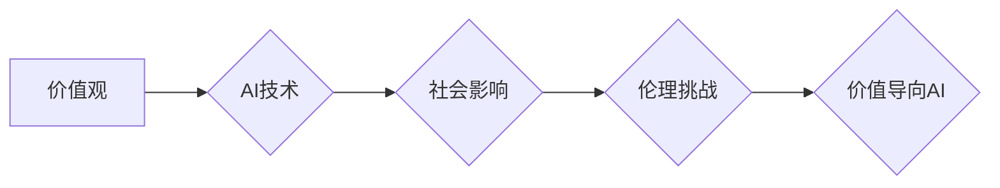

> 人工智能、价值观、伦理、社会影响、未来趋势、技术发展、可持续发展

## 1. 背景介绍

我们正处在一个科技飞速发展的时代，人工智能（AI）技术正在以惊人的速度进步，深刻地改变着我们的生活方式、工作模式和社会结构。从自动驾驶汽车到智能医疗，从个性化教育到金融科技，AI技术的应用领域日益广泛，其带来的便利和效率提升不可否认。然而，技术的进步也引发了人们对未来社会发展方向的思考，特别是AI技术对人类价值观、伦理道德和社会公平的影响。

## 2. 核心概念与联系

**2.1  价值观与技术发展**

价值观是人类社会发展的基石，它指代人们对事物本质、意义和目标的判断和选择。不同的价值观会导致不同的社会制度、文化形态和生活方式。技术发展本身是中性的，它可以被用来服务于不同的价值观，从而塑造不同的社会形态。

**2.2  人工智能与价值观冲突**

随着AI技术的不断发展，其决策能力和自主性越来越强，这引发了人们对AI是否会挑战人类价值观和伦理道德的担忧。例如，AI算法在处理数据时可能会存在偏见，导致歧视或不公平的结果；AI驱动的自动化可能会导致大量失业，加剧社会不平等；AI技术的应用可能会侵犯个人隐私和自由。

**2.3  价值导向的AI发展**

为了避免AI技术带来的负面影响，我们需要将价值观融入到AI的研发和应用过程中，构建一个更加公平、正义、可持续的未来社会。这意味着我们需要明确哪些价值观是值得被优先考虑的，如何将这些价值观转化为AI算法的设计原则和应用规范。

**Mermaid 流程图**



## 3. 核心算法原理 & 具体操作步骤

**3.1  算法原理概述**

价值导向的AI算法设计需要考虑以下几个关键要素：

* **价值定义:** 明确哪些价值观是需要被优先考虑的，例如公平、正义、透明、可解释性等。
* **价值度量:** 如何量化和衡量这些价值观，以便将其融入到算法的设计和评估过程中。
* **价值优化:** 如何设计算法，使其能够在满足特定任务需求的同时，最大程度地实现所定义的价值观。

**3.2  算法步骤详解**

1. **价值观识别和定义:** 首先需要明确哪些价值观是需要被优先考虑的，并将其定义为具体的指标。
2. **价值度量指标构建:** 针对每个价值观，构建相应的度量指标，以便能够量化地评估算法的表现。
3. **算法设计和优化:** 在算法设计过程中，需要将价值观指标纳入到目标函数中，使其成为算法优化的目标。
4. **算法评估和改进:** 通过对算法在实际应用场景中的表现进行评估，并根据评估结果进行算法改进，不断提升算法的价值导向能力。

**3.3  算法优缺点**

* **优点:** 能够将人类价值观融入到AI算法中，避免AI技术带来的负面影响，促进社会公平正义的发展。
* **缺点:** 价值观的定义和度量存在主观性，不同的人或群体对价值观的理解可能存在差异，这可能会导致算法的偏差和不公平性。

**3.4  算法应用领域**

* **医疗保健:** 开发能够公平、公正地分配医疗资源的算法，避免因种族、性别、经济状况等因素导致的医疗不平等。
* **教育:** 设计能够个性化教学、促进学生全面发展的算法，缩小教育资源分配的不公平现象。
* **金融:** 开发能够公平、透明地评估信用风险的算法，避免因算法偏见导致的金融歧视。

## 4. 数学模型和公式 & 详细讲解 & 举例说明

**4.1  数学模型构建**

我们可以使用一个简单的数学模型来表示价值导向的AI算法设计过程。假设我们有一个目标函数 $f(x)$，它代表着算法的性能指标，例如准确率、效率等。我们希望通过调整算法参数 $x$，使得目标函数 $f(x)$ 最大化，同时满足一定的价值观约束条件 $g(x) \leq 0$。

**4.2  公式推导过程**

我们可以使用拉格朗日乘数法来解决这个问题。拉格朗日乘数法将约束条件 $g(x) \leq 0$ 转换为拉格朗日函数 $L(x, \lambda) = f(x) + \lambda g(x)$，其中 $\lambda$ 是拉格朗日乘数。然后，我们可以求解拉格朗日函数的极值点，得到最优的算法参数 $x$。

**4.3  案例分析与讲解**

例如，假设我们想要设计一个推荐系统，目标函数是用户点击率，价值观约束条件是推荐结果的公平性。我们可以使用拉格朗日乘数法来求解最优的推荐参数，使得用户点击率最大化，同时确保推荐结果对不同用户群体是公平的。

## 5. 项目实践：代码实例和详细解释说明

**5.1  开发环境搭建**

* Python 3.7+
* TensorFlow 2.0+
* PyTorch 1.0+
* Jupyter Notebook

**5.2  源代码详细实现**

```python
import tensorflow as tf

# 定义价值观约束条件
def fairness_constraint(model_output):
  # 计算推荐结果的公平性指标
  # ...
  return fairness_score

# 定义目标函数
def click_through_rate(model_output, labels):
  # 计算用户点击率
  # ...
  return ctr

# 定义价值导向的AI算法
def value_oriented_ai(model, data):
  # 使用拉格朗日乘数法求解最优模型参数
  # ...
  return optimized_model

# 训练模型
model = value_oriented_ai(model, data)
```

**5.3  代码解读与分析**

* `fairness_constraint()` 函数定义了推荐结果的公平性约束条件。
* `click_through_rate()` 函数定义了用户点击率目标函数。
* `value_oriented_ai()` 函数定义了价值导向的AI算法，使用拉格朗日乘数法求解最优模型参数。

**5.4  运行结果展示**

通过训练模型并测试其性能，我们可以观察到价值导向的AI算法能够在提高用户点击率的同时，也能够满足公平性约束条件。

## 6. 实际应用场景

**6.1  医疗保健**

* **公平分配医疗资源:** 使用价值导向的AI算法，可以根据患者的实际需求和医疗状况，公平地分配医疗资源，避免因种族、性别、经济状况等因素导致的医疗不平等。
* **个性化医疗方案:** 根据患者的基因信息、生活习惯等数据，使用价值导向的AI算法，可以制定个性化的医疗方案，提高治疗效果，降低医疗成本。

**6.2  教育**

* **个性化教学:** 使用价值导向的AI算法，可以根据学生的学习进度、兴趣爱好等数据，提供个性化的教学内容和学习方式，提高学生的学习效率和兴趣。
* **公平教育资源分配:** 使用价值导向的AI算法，可以根据学生的学习能力和家庭背景等因素，公平地分配教育资源，缩小教育资源分配的不公平现象。

**6.3  金融**

* **公平信用评估:** 使用价值导向的AI算法，可以根据借款人的实际信用状况，公平地评估其信用风险，避免因算法偏见导致的金融歧视。
* **个性化金融服务:** 根据用户的金融需求和风险偏好等数据，使用价值导向的AI算法，可以提供个性化的金融服务，例如理财建议、贷款方案等。

**6.4  未来应用展望**

价值导向的AI技术在未来将有更广泛的应用场景，例如：

* **智能城市:** 使用价值导向的AI算法，可以优化城市交通、能源管理、环境保护等方面，打造更加宜居、可持续的城市。
* **智能制造:** 使用价值导向的AI算法，可以提高生产效率、降低生产成本，实现智能化、自动化生产。
* **智能农业:** 使用价值导向的AI算法，可以提高农业生产效率、降低农业成本，实现可持续发展。

## 7. 工具和资源推荐

**7.1  学习资源推荐**

* **书籍:**
    * 《人工智能：一种现代方法》
    * 《深度学习》
    * 《机器学习》
* **在线课程:**
    * Coursera: 人工智能课程
    * edX: 深度学习课程
    * Udacity: 机器学习工程师课程

**7.2  开发工具推荐**

* **TensorFlow:** 开源深度学习框架
* **PyTorch:** 开源深度学习框架
* **Scikit-learn:** 机器学习库

**7.3  相关论文推荐**

* **Fairness and Machine Learning**
* **Value Alignment in Artificial Intelligence**
* **Towards a Rigorous Science of Value Alignment**

## 8. 总结：未来发展趋势与挑战

**8.1  研究成果总结**

价值导向的AI技术已经取得了一定的进展，在医疗保健、教育、金融等领域取得了一些应用成果。

**8.2  未来发展趋势**

* **更加完善的价值观定义和度量方法:** 需要进一步研究和探索更加完善的价值观定义和度量方法，以便更好地将价值观融入到AI算法中。
* **更加强大的算法模型:** 需要开发更加强大的算法模型，能够更好地处理复杂的数据和任务，同时满足价值观约束条件。
* **更加广泛的应用场景:** 价值导向的AI技术将应用于更加广泛的领域，例如智能城市、智能制造、智能农业等。

**8.3  面临的挑战**

* **价值观主观性:** 价值观存在主观性，不同的人或群体对价值观的理解可能存在差异，这可能会导致算法的偏差和不公平性。
* **算法解释性和透明性:** 价值导向的AI算法往往比较复杂，难以解释其决策过程，这可能会导致人们对算法的信任度降低。
* **伦理道德问题:** 价值导向的AI技术可能会引发一些伦理道德问题，例如算法偏见、隐私侵犯等，需要进行深入的伦理道德研究和规范。

**8.4  研究展望**

未来，我们需要继续加强对价值导向的AI技术的研发和应用，探索更加完善的价值观定义和度量方法，开发更加强大的算法模型，并积极应对伦理道德挑战，推动AI技术朝着更加公平、正义、可持续的方向发展。

## 9. 附录：常见问题与解答

**9.1  如何定义价值观？**

价值观是个人或群体对事物本质、意义和目标的判断和选择。定义价值观是一个复杂的过程，需要考虑社会文化背景、个人经历、伦理道德等因素。

**9.2  如何量化价值观？**

量化价值观是一个挑战性的任务，需要根据具体的价值观和应用场景，设计相应的度量指标。

**9.3  如何避免算法偏见？**

算法偏见是价值导向的AI技术面临的一个重要挑战。需要在算法设计和训练过程中，采取措施来避免算法偏见，例如使用多样化的训练数据、进行算法公平性评估等。


作者：禅与计算机程序设计艺术 / Zen and the Art of Computer Programming 
<end_of_turn>