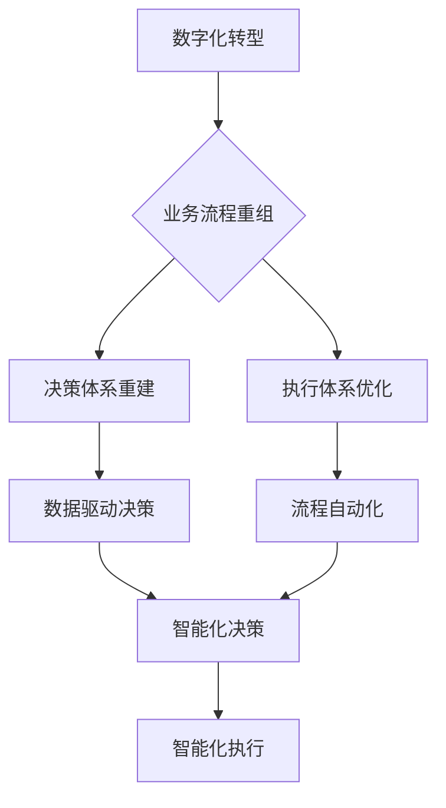

> 数字化转型，智能化建设，业务流程重组，决策体系，执行体系，数据驱动，人工智能，机器学习，流程自动化

## 1. 背景介绍

在当今数字化时代，企业面临着前所未有的机遇和挑战。数字化转型已成为企业发展的必然趋势，而智能化建设则是数字化转型的升级和延伸。企业需要通过业务流程重组、重建决策体系和执行体系，才能在激烈的市场竞争中立于不败之地。

传统企业往往存在着业务流程冗长、决策效率低、执行力不足等问题，这些问题严重制约了企业的创新能力和发展速度。数字化转型和智能化建设可以帮助企业解决这些问题，提升企业的核心竞争力。

## 2. 核心概念与联系

**2.1 数字化转型**

数字化转型是指企业利用数字化技术和方法，重构业务模式、运营模式和组织架构，实现业务流程的优化、数据资源的整合和价值的提升。

**2.2 智能化建设**

智能化建设是指企业利用人工智能、机器学习等先进技术，赋予企业系统和流程智能化能力，实现自动化、智能化决策和执行。

**2.3 业务流程重组**

业务流程重组是指企业根据数字化转型和智能化建设的目标，对现有业务流程进行梳理、优化和重构，以提高流程效率、降低成本和提升客户体验。

**2.4 决策体系重建**

决策体系重建是指企业利用数据分析、预测模型等技术，构建更加科学、高效的决策体系，实现数据驱动决策。

**2.5 执行体系优化**

执行体系优化是指企业利用自动化、流程管理等技术，构建更加高效、透明的执行体系，实现业务流程的自动化执行。

**2.6 流程图**



## 3. 核心算法原理 & 具体操作步骤

**3.1 算法原理概述**

在企业业务数字化和智能化建设中，需要应用多种算法原理，例如：

* **机器学习算法**: 用于数据分析、预测和模式识别，例如回归分析、分类算法、聚类算法等。
* **深度学习算法**: 用于处理复杂数据，例如图像识别、自然语言处理等。
* **流程自动化算法**: 用于自动执行业务流程，例如规则引擎、流程引擎等。

**3.2 算法步骤详解**

具体算法步骤根据不同的算法类型而有所不同，例如：

* **机器学习算法**: 通常包括数据预处理、特征工程、模型训练、模型评估和模型部署等步骤。
* **深度学习算法**: 通常包括数据预处理、网络结构设计、模型训练、模型评估和模型部署等步骤。
* **流程自动化算法**: 通常包括流程建模、规则定义、流程执行和流程监控等步骤。

**3.3 算法优缺点**

不同的算法具有不同的优缺点，需要根据实际应用场景选择合适的算法。例如：

* **机器学习算法**: 优点是能够自动学习数据模式，缺点是需要大量的训练数据。
* **深度学习算法**: 优点是能够处理复杂数据，缺点是训练成本高，需要强大的计算资源。
* **流程自动化算法**: 优点是能够提高效率，降低成本，缺点是需要对流程进行详细建模。

**3.4 算法应用领域**

算法在企业业务数字化和智能化建设中应用广泛，例如：

* **客户关系管理 (CRM)**: 利用机器学习算法进行客户画像、预测客户行为、个性化营销等。
* **供应链管理 (SCM)**: 利用机器学习算法进行库存预测、物流优化、风险控制等。
* **财务管理 (FM)**: 利用机器学习算法进行财务分析、欺诈检测、风险评估等。

## 4. 数学模型和公式 & 详细讲解 & 举例说明

**4.1 数学模型构建**

在企业业务数字化和智能化建设中，需要构建数学模型来描述业务流程、决策过程和执行过程。例如：

* **业务流程模型**: 可以使用 Petri 网、状态机等模型来描述业务流程。
* **决策模型**: 可以使用决策树、贝叶斯网络等模型来描述决策过程。
* **执行模型**: 可以使用状态转移模型、强化学习模型等模型来描述执行过程。

**4.2 公式推导过程**

数学模型的构建需要推导相应的公式，例如：

* **业务流程模型**: 可以推导出流程执行时间、资源消耗等公式。
* **决策模型**: 可以推导出决策概率、风险评估等公式。
* **执行模型**: 可以推导出执行效率、成本控制等公式。

**4.3 案例分析与讲解**

例如，在客户关系管理 (CRM) 中，可以使用贝叶斯网络模型来预测客户流失概率。

贝叶斯网络模型可以将客户流失因素表示为节点，并将这些因素之间的依赖关系表示为边。通过收集客户数据，可以训练贝叶斯网络模型，并根据客户的特征，预测其流失概率。

$$P(流失|特征) = \frac{P(特征|流失) * P(流失)}{P(特征)}$$

其中：

* $P(流失|特征)$: 给定特征情况下客户流失的概率。
* $P(特征|流失)$: 给定客户流失情况下特征出现的概率。
* $P(流失)$: 客户流失的概率。
* $P(特征)$: 特征出现的概率。

## 5. 项目实践：代码实例和详细解释说明

**5.1 开发环境搭建**

* 操作系统: Ubuntu 20.04
* Python 版本: 3.8
* 必要的库: pandas, numpy, scikit-learn, TensorFlow

**5.2 源代码详细实现**

```python
# 导入必要的库
import pandas as pd
from sklearn.model_selection import train_test_split
from sklearn.linear_model import LogisticRegression

# 加载数据
data = pd.read_csv('customer_data.csv')

# 划分训练集和测试集
X_train, X_test, y_train, y_test = train_test_split(data.drop('churn', axis=1), data['churn'], test_size=0.2, random_state=42)

# 创建逻辑回归模型
model = LogisticRegression()

# 训练模型
model.fit(X_train, y_train)

# 评估模型
accuracy = model.score(X_test, y_test)
print(f'模型准确率: {accuracy}')

# 预测新客户的流失概率
new_customer_data = pd.DataFrame({
    'feature1': [1],
    'feature2': [2],
    'feature3': [3]
})
churn_probability = model.predict_proba(new_customer_data)[:, 1]
print(f'新客户流失概率: {churn_probability}')
```

**5.3 代码解读与分析**

* 代码首先导入必要的库，然后加载客户数据。
* 然后将数据划分成训练集和测试集。
* 创建逻辑回归模型，并使用训练集训练模型。
* 最后使用测试集评估模型的准确率，并预测新客户的流失概率。

**5.4 运行结果展示**

运行代码后，会输出模型的准确率和新客户的流失概率。

## 6. 实际应用场景

**6.1 客户关系管理 (CRM)**

* **客户画像**: 利用机器学习算法分析客户数据，构建客户画像，了解客户的特征、需求和行为模式。
* **客户流失预测**: 利用机器学习算法预测客户流失概率，及时采取措施挽留客户。
* **个性化营销**: 根据客户画像和行为数据，进行个性化营销，提高营销效果。

**6.2 供应链管理 (SCM)**

* **库存预测**: 利用机器学习算法预测库存需求，优化库存管理，降低库存成本。
* **物流优化**: 利用机器学习算法优化物流路线，提高物流效率，降低物流成本。
* **风险控制**: 利用机器学习算法识别供应链风险，采取措施降低风险。

**6.3 财务管理 (FM)**

* **财务分析**: 利用机器学习算法分析财务数据，识别财务风险，提供财务决策支持。
* **欺诈检测**: 利用机器学习算法识别财务欺诈行为，降低财务损失。
* **风险评估**: 利用机器学习算法评估财务风险，制定风险控制策略。

**6.4 未来应用展望**

随着人工智能技术的不断发展，企业业务数字化和智能化建设将更加深入，应用场景也将更加广泛。例如：

* **智能客服**: 利用自然语言处理技术，构建智能客服系统，提供24小时在线服务。
* **智能生产**: 利用机器视觉、机器人等技术，实现智能生产，提高生产效率和产品质量。
* **智能营销**: 利用大数据分析、个性化推荐等技术，实现智能营销，提高营销效果。

## 7. 工具和资源推荐

**7.1 学习资源推荐**

* **在线课程**: Coursera, edX, Udemy等平台提供丰富的机器学习、深度学习等课程。
* **书籍**: 《深度学习》、《机器学习实战》等书籍是学习人工智能技术的经典教材。
* **开源项目**: TensorFlow, PyTorch等开源项目提供了丰富的代码示例和学习资源。

**7.2 开发工具推荐**

* **Python**: Python是机器学习和深度学习的常用编程语言。
* **Jupyter Notebook**: Jupyter Notebook是交互式编程环境，方便进行机器学习和深度学习的开发和调试。
* **云计算平台**: AWS, Azure, GCP等云计算平台提供了丰富的机器学习和深度学习服务。

**7.3 相关论文推荐**

* **《ImageNet Classification with Deep Convolutional Neural Networks》**: 介绍了AlexNet模型，标志着深度学习在图像识别领域的突破。
* **《Attention Is All You Need》**: 介绍了Transformer模型，在自然语言处理领域取得了突破性进展。
* **《Generative Adversarial Networks》**: 介绍了生成对抗网络，在图像生成、文本生成等领域取得了成功应用。

## 8. 总结：未来发展趋势与挑战

**8.1 研究成果总结**

近年来，人工智能技术取得了长足的进步，在企业业务数字化和智能化建设中发挥着越来越重要的作用。

**8.2 未来发展趋势**

* **模型更加智能化**: 未来人工智能模型将更加智能化，能够更好地理解和处理复杂数据。
* **应用场景更加广泛**: 人工智能技术将应用于更多领域，例如医疗、教育、金融等。
* **技术更加融合**: 人工智能技术将与其他技术更加融合，例如物联网、大数据等。

**8.3 面临的挑战**

* **数据安全**: 人工智能技术依赖于大量数据，数据安全问题需要得到重视。
* **算法可解释性**: 许多人工智能模型是黑箱模型，其决策过程难以解释，这可能会导致信任问题。
* **伦理问题**: 人工智能技术的发展也带来了伦理问题，例如算法偏见、工作岗位替代等。

**8.4 研究展望**

未来，人工智能技术将继续发展，为企业业务数字化和智能化建设提供更强大的支持。我们需要加强对人工智能技术的研究，解决技术挑战，并关注人工智能技术的伦理问题，确保人工智能技术能够更好地服务于人类社会。

## 9. 附录：常见问题与解答

**9.1 如何选择合适的算法？**

选择合适的算法需要根据实际应用场景和数据特点进行选择。例如，如果需要预测连续数值，可以使用回归算法；如果需要分类数据，可以使用分类算法。

**9.2 如何处理不完整的数据？**

处理不完整的数据可以使用多种方法，例如：删除缺失值、填充