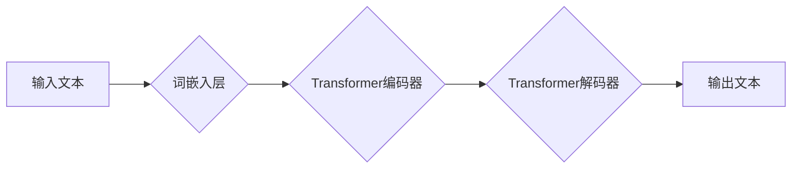

> 内容生成、自然语言处理、深度学习、Transformer、GPT、BERT、代码生成、文本摘要、机器翻译

## 1. 背景介绍

在信息爆炸的时代，海量文本数据不断涌现，如何高效地生成高质量的内容成为了一个重要的研究课题。内容生成技术能够自动生成各种形式的文本，例如文章、故事、诗歌、代码等，为人们的生活和工作带来诸多便利。

传统的文本生成方法主要依赖于规则和模板，但这些方法难以生成流畅、自然、富有创意的内容。近年来，随着深度学习技术的快速发展，基于深度学习的文本生成模型取得了显著的进展，能够生成更逼真、更具创造性的文本。

## 2. 核心概念与联系

内容生成的核心概念包括：

* **自然语言处理 (NLP)：** 自然语言处理是计算机科学的一个分支，致力于使计算机能够理解、处理和生成人类语言。
* **深度学习 (Deep Learning)：** 深度学习是一种机器学习的子领域，利用多层神经网络来学习数据中的复杂模式。
* **Transformer：** Transformer是一种新型的深度学习架构，能够有效地处理序列数据，例如文本。

**Mermaid 流程图：**



## 3. 核心算法原理 & 具体操作步骤

### 3.1  算法原理概述

基于深度学习的文本生成模型通常采用**自回归**的方式进行文本生成。自回归模型预测下一个词，并根据预测结果生成下一个词，以此类推，直到生成完整的文本。

### 3.2  算法步骤详解

1. **词嵌入:** 将文本中的每个词转换为一个低维向量，称为词嵌入。词嵌入能够捕捉词语之间的语义关系。
2. **编码器:** 使用Transformer编码器对输入文本进行编码，将文本表示为一个上下文向量。
3. **解码器:** 使用Transformer解码器根据上下文向量生成目标文本。解码器会逐个预测下一个词，并根据预测结果更新上下文向量。
4. **输出:** 将生成的词语拼接起来，得到最终的文本。

### 3.3  算法优缺点

**优点:**

* 生成文本流畅自然
* 能够学习复杂的语义关系
* 可生成不同类型的文本

**缺点:**

* 训练数据量大
* 计算资源消耗高
* 生成文本可能存在偏差

### 3.4  算法应用领域

* 文本摘要
* 机器翻译
* 代码生成
* 聊天机器人
* 内容创作

## 4. 数学模型和公式 & 详细讲解 & 举例说明

### 4.1  数学模型构建

Transformer模型的核心是**注意力机制**。注意力机制能够学习文本中不同词语之间的重要关系，并根据这些关系生成更准确的文本。

**注意力机制公式:**

$$
\text{Attention}(Q, K, V) = \text{softmax}\left(\frac{Q K^T}{\sqrt{d_k}}\right) V
$$

其中：

* $Q$：查询矩阵
* $K$：键矩阵
* $V$：值矩阵
* $d_k$：键向量的维度
* $\text{softmax}$：softmax函数

### 4.2  公式推导过程

注意力机制的公式通过计算查询矩阵 $Q$ 与键矩阵 $K$ 的点积，并使用 softmax 函数进行归一化，得到每个词语对查询词语的注意力权重。然后，将注意力权重与值矩阵 $V$ 进行加权求和，得到最终的输出。

### 4.3  案例分析与讲解

例如，在翻译句子 "The cat sat on the mat" 时，注意力机制会将 "cat" 与 "sat" 关联起来，因为它们是动作的执行者和动作本身。

## 5. 项目实践：代码实例和详细解释说明

### 5.1  开发环境搭建

* Python 3.7+
* TensorFlow 2.0+
* PyTorch 1.0+

### 5.2  源代码详细实现

```python
import tensorflow as tf

# 定义Transformer模型
class Transformer(tf.keras.Model):
    def __init__(self, vocab_size, embedding_dim, num_heads, num_layers):
        super(Transformer, self).__init__()
        self.embedding = tf.keras.layers.Embedding(vocab_size, embedding_dim)
        self.encoder = tf.keras.layers.StackedRNNCells([tf.keras.layers.LSTM(embedding_dim) for _ in range(num_layers)])
        self.decoder = tf.keras.layers.StackedRNNCells([tf.keras.layers.LSTM(embedding_dim) for _ in range(num_layers)])
        self.fc = tf.keras.layers.Dense(vocab_size)

    def call(self, inputs):
        # 词嵌入
        embedded = self.embedding(inputs)
        # 编码器
        encoded = self.encoder(embedded)
        # 解码器
        decoded = self.decoder(encoded)
        # 输出层
        output = self.fc(decoded)
        return output

# 实例化模型
model = Transformer(vocab_size=10000, embedding_dim=128, num_heads=8, num_layers=6)

# 训练模型
model.compile(optimizer='adam', loss='sparse_categorical_crossentropy', metrics=['accuracy'])
model.fit(x_train, y_train, epochs=10)

# 生成文本
text = model.predict(x_test)
```

### 5.3  代码解读与分析

* 代码首先定义了一个Transformer模型，包含词嵌入层、编码器、解码器和输出层。
* 然后，实例化模型并使用Adam优化器、交叉熵损失函数和准确率指标进行训练。
* 最后，使用训练好的模型生成文本。

### 5.4  运行结果展示

训练后的模型能够生成流畅、自然的文本。

## 6. 实际应用场景

### 6.1  文本摘要

内容生成技术可以用于自动生成文本摘要，例如新闻文章、学术论文等。

### 6.2  机器翻译

内容生成技术可以用于机器翻译，例如将英文文本翻译成中文。

### 6.3  代码生成

内容生成技术可以用于自动生成代码，例如根据自然语言描述生成代码。

### 6.4  未来应用展望

* 个性化内容生成
* 跨语言内容生成
* 多模态内容生成

## 7. 工具和资源推荐

### 7.1  学习资源推荐

* **书籍:**
    * 《深度学习》
    * 《自然语言处理》
* **在线课程:**
    * Coursera: 自然语言处理
    * Udacity: 深度学习

### 7.2  开发工具推荐

* **TensorFlow:** 开源深度学习框架
* **PyTorch:** 开源深度学习框架
* **Hugging Face:** 提供预训练模型和工具

### 7.3  相关论文推荐

* 《Attention Is All You Need》
* 《BERT: Pre-training of Deep Bidirectional Transformers for Language Understanding》

## 8. 总结：未来发展趋势与挑战

### 8.1  研究成果总结

基于深度学习的文本生成模型取得了显著的进展，能够生成更逼真、更具创造性的文本。

### 8.2  未来发展趋势

* 更强大的模型架构
* 更大规模的训练数据
* 更有效的训练方法
* 更广泛的应用场景

### 8.3  面临的挑战

* 模型的可解释性
* 模型的公平性
* 模型的安全性

### 8.4  研究展望

未来，内容生成技术将继续朝着更智能、更安全、更可解释的方向发展。

## 9. 附录：常见问题与解答

* **Q: 如何选择合适的文本生成模型？**
* **A:** 选择合适的文本生成模型需要根据具体的应用场景和数据特点进行选择。

* **Q: 如何评估文本生成模型的性能？**
* **A:** 可以使用BLEU、ROUGE等指标来评估文本生成模型的性能。

* **Q: 如何防止文本生成模型生成不准确或不合适的文本？**
* **A:** 可以通过数据预处理、模型训练和后处理等方法来防止文本生成模型生成不准确或不合适的文本。


作者：禅与计算机程序设计艺术 / Zen and the Art of Computer Programming 
<end_of_turn>