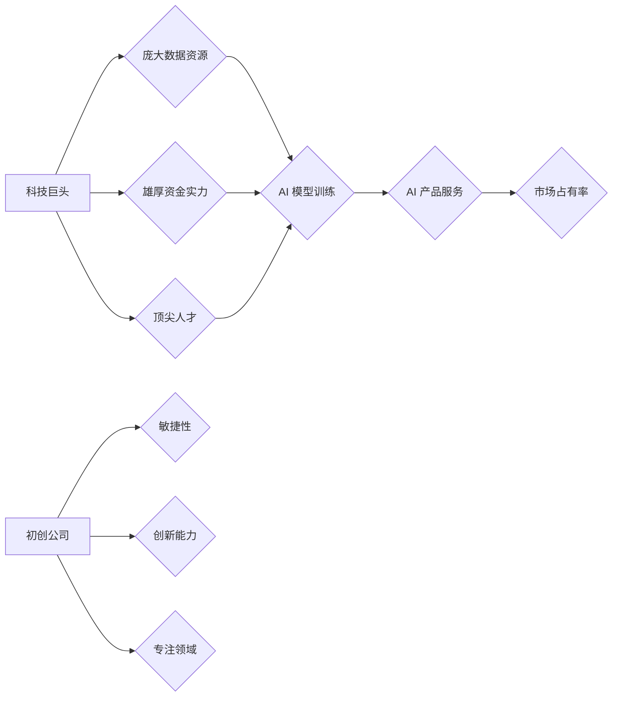

> 初创公司, AI, 科技巨头, 竞争策略, 差异化, 专注领域, 协同创新, 数据驱动, 敏捷开发, 人才培养

## 1. 背景介绍

人工智能（AI）正以惊人的速度发展，深刻地改变着各行各业。科技巨头凭借雄厚的资金、庞大的数据资源和顶尖人才，在AI领域占据着主导地位。然而，对于初创公司来说，如何在AI领域与这些巨头竞争，并最终取得成功，是一个充满挑战但也充满机遇的课题。

## 2. 核心概念与联系

**2.1 AI 核心概念**

人工智能（AI）是指模拟人类智能行为的计算机系统。它涵盖了多个子领域，例如机器学习、深度学习、自然语言处理、计算机视觉等。

**2.2 AI 与初创公司竞争**

初创公司在与科技巨头竞争时，需要充分利用自身的优势，例如：

* **敏捷性:** 初创公司通常拥有更灵活的组织结构和决策机制，能够更快地响应市场变化和技术发展。
* **创新能力:** 初创公司往往更注重创新，能够开发出更具颠覆性的产品和服务。
* **专注领域:** 初创公司通常专注于某个特定的领域，能够深入研究和掌握该领域的知识和技术。

**2.3 AI 竞争架构**




## 3. 核心算法原理 & 具体操作步骤

**3.1 算法原理概述**

深度学习是AI领域的重要分支，其核心算法是多层神经网络。神经网络模仿人脑的神经元结构，通过层层传递信息，学习数据中的模式和规律。

**3.2 算法步骤详解**

1. **数据预处理:** 将原始数据清洗、转换和格式化，使其适合深度学习模型的训练。
2. **网络结构设计:** 根据任务需求设计多层神经网络的结构，包括神经元数量、连接方式和激活函数等。
3. **模型训练:** 使用训练数据训练神经网络模型，通过调整模型参数，使模型的预测结果与真实值尽可能接近。
4. **模型评估:** 使用测试数据评估模型的性能，例如准确率、召回率和F1-score等。
5. **模型部署:** 将训练好的模型部署到实际应用场景中，用于预测或决策。

**3.3 算法优缺点**

* **优点:** 深度学习算法能够学习复杂的数据模式，具有强大的泛化能力。
* **缺点:** 深度学习算法需要大量的训练数据和计算资源，训练时间较长。

**3.4 算法应用领域**

深度学习算法广泛应用于图像识别、自然语言处理、语音识别、机器翻译等领域。

## 4. 数学模型和公式 & 详细讲解 & 举例说明

**4.1 数学模型构建**

深度学习模型可以看作是一个复杂的函数映射，将输入数据映射到输出结果。

**4.2 公式推导过程**

深度学习模型的训练过程基于梯度下降算法，其核心公式为：

$$
\theta = \theta - \alpha \nabla L(\theta)
$$

其中：

* $\theta$ 是模型参数
* $\alpha$ 是学习率
* $L(\theta)$ 是损失函数

**4.3 案例分析与讲解**

假设我们训练一个图像分类模型，目标是将图像分类为猫或狗。损失函数可以定义为交叉熵损失函数，其公式为：

$$
L(\theta) = - \sum_{i=1}^{N} y_i \log(p_i)
$$

其中：

* $N$ 是图像数量
* $y_i$ 是真实标签
* $p_i$ 是模型预测的概率

通过梯度下降算法，不断更新模型参数 $\theta$，使损失函数最小化，从而提高模型的分类准确率。

## 5. 项目实践：代码实例和详细解释说明

**5.1 开发环境搭建**

使用 Python 语言和 TensorFlow 或 PyTorch 深度学习框架进行开发。

**5.2 源代码详细实现**

```python
import tensorflow as tf

# 定义模型结构
model = tf.keras.models.Sequential([
    tf.keras.layers.Conv2D(32, (3, 3), activation='relu', input_shape=(28, 28, 1)),
    tf.keras.layers.MaxPooling2D((2, 2)),
    tf.keras.layers.Conv2D(64, (3, 3), activation='relu'),
    tf.keras.layers.MaxPooling2D((2, 2)),
    tf.keras.layers.Flatten(),
    tf.keras.layers.Dense(10, activation='softmax')
])

# 编译模型
model.compile(optimizer='adam',
              loss='sparse_categorical_crossentropy',
              metrics=['accuracy'])

# 训练模型
model.fit(x_train, y_train, epochs=10)

# 评估模型
loss, accuracy = model.evaluate(x_test, y_test)
print('Test loss:', loss)
print('Test accuracy:', accuracy)
```

**5.3 代码解读与分析**

这段代码定义了一个简单的卷积神经网络模型，用于图像分类任务。模型包含两层卷积层、两层最大池化层、一层全连接层和一层softmax输出层。

**5.4 运行结果展示**

训练完成后，模型的准确率可以达到较高的水平。

## 6. 实际应用场景

**6.1 医疗诊断**

深度学习算法可以用于分析医学图像，辅助医生诊断疾病。

**6.2 金融风险控制**

深度学习算法可以用于识别金融欺诈和评估风险。

**6.3 自动驾驶**

深度学习算法可以用于训练自动驾驶汽车的感知和决策系统。

**6.4 未来应用展望**

随着AI技术的不断发展，深度学习算法将在更多领域得到应用，例如个性化教育、智能家居、机器人等。

## 7. 工具和资源推荐

**7.1 学习资源推荐**

* 深度学习课程：Coursera、edX、Udacity 等平台提供丰富的深度学习课程。
* 深度学习书籍：
    * 《深度学习》
    * 《动手学深度学习》

**7.2 开发工具推荐**

* TensorFlow：开源深度学习框架。
* PyTorch：开源深度学习框架。
* Keras：高层深度学习API，可以用于 TensorFlow 和 Theano。

**7.3 相关论文推荐**

* 《ImageNet Classification with Deep Convolutional Neural Networks》
* 《Attention Is All You Need》

## 8. 总结：未来发展趋势与挑战

**8.1 研究成果总结**

深度学习算法取得了显著的成果，在图像识别、自然语言处理等领域取得了突破性进展。

**8.2 未来发展趋势**

* **模型规模和复杂度提升:** 未来深度学习模型将更加庞大复杂，能够学习更复杂的知识和模式。
* **数据驱动和自动化:** 数据将成为深度学习发展的关键要素，自动化数据标注和模型训练将更加重要。
* **跨模态学习:** 深度学习模型将能够处理多种模态数据，例如文本、图像、音频等。

**8.3 面临的挑战**

* **数据隐私和安全:** 深度学习算法需要大量数据进行训练，如何保护数据隐私和安全是一个重要挑战。
* **算法可解释性和信任度:** 深度学习模型的决策过程往往难以解释，如何提高算法的可解释性和信任度是一个关键问题。
* **伦理和社会影响:** 深度学习算法的应用可能带来伦理和社会问题，例如算法偏见、就业失业等，需要引起重视和关注。

**8.4 研究展望**

未来研究将集中在解决上述挑战，提高深度学习算法的鲁棒性、安全性、可解释性和伦理性，使其更好地服务于人类社会。

## 9. 附录：常见问题与解答

**9.1 如何选择合适的深度学习框架？**

选择深度学习框架需要根据具体项目需求和个人偏好。TensorFlow 和 PyTorch 是两个主流框架，各有优缺点。

**9.2 如何处理数据不平衡问题？**

数据不平衡问题可以通过数据增强、权重调整等方法进行解决。

**9.3 如何评估深度学习模型的性能？**

常用的评估指标包括准确率、召回率、F1-score、AUC 等。

作者：禅与计算机程序设计艺术 / Zen and the Art of Computer Programming


<end_of_turn>