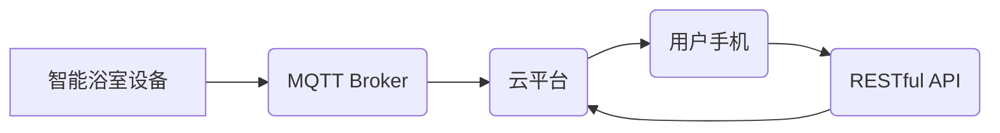

> MQTT, RESTful API, 智能浴室, 物联网, 数据采集, 控制系统, 安全性, 可扩展性

## 1. 背景介绍

随着物联网技术的快速发展，智能家居已成为人们生活的重要组成部分。浴室作为家庭中使用频率较高且功能多样的空间，也逐渐成为智能家居的重点关注领域。传统的浴室管理系统缺乏智能化和便捷性，无法满足现代用户对个性化、舒适化和安全性的需求。

基于此背景，本文将探讨基于MQTT协议和RESTful API的智能浴室管理系统的设计与实现。该系统旨在通过传感器数据采集、云平台数据处理和智能设备控制，实现对浴室环境的智能化管理，提升用户体验和生活品质。

## 2. 核心概念与联系

### 2.1 MQTT协议

MQTT（Message Queuing Telemetry Transport）是一种轻量级、可扩展的机器对机器（M2M）通信协议，特别适用于物联网场景。其特点包括：

* **轻量级：** MQTT协议本身非常简洁，占用资源少，适合资源受限的设备。
* **可扩展性：** MQTT协议支持多种传输方式，可以适应不同的网络环境。
* **可靠性：** MQTT协议提供消息确认机制，确保消息的可靠传输。
* **主题订阅：** MQTT协议支持主题订阅机制，允许设备根据兴趣订阅特定主题的消息。

### 2.2 RESTful API

RESTful API（Representational State Transfer Application Programming Interface）是一种基于HTTP协议的软件架构风格，用于构建Web服务。其特点包括：

* **资源导向：** RESTful API将数据视为资源，并使用统一的资源标识符（URI）进行访问。
* **状态转移：** RESTful API通过HTTP方法（如GET、POST、PUT、DELETE）进行状态转移，操作资源的状态。
* **缓存机制：** RESTful API支持缓存机制，提高响应速度。
* **可扩展性：** RESTful API可以轻松扩展，支持多个客户端和服务端。

### 2.3 系统架构

智能浴室管理系统采用MQTT协议和RESTful API构建，其架构如下：



**系统架构说明：**

* 智能浴室设备（如温度传感器、湿度传感器、灯光控制模块等）通过MQTT协议与MQTT Broker进行通信。
* MQTT Broker负责消息的转发和路由，将设备发送的消息转发到云平台。
* 云平台负责数据处理、存储和分析，并通过RESTful API提供数据和控制接口给用户手机。
* 用户手机通过RESTful API与云平台交互，获取浴室环境信息和控制智能设备。

## 3. 核心算法原理 & 具体操作步骤

### 3.1 算法原理概述

智能浴室管理系统的核心算法主要包括：

* **数据采集算法：** 用于从智能浴室设备采集环境数据，如温度、湿度、光照强度等。
* **数据处理算法：** 用于对采集到的数据进行预处理、分析和处理，提取有价值的信息。
* **控制算法：** 用于根据用户需求和环境数据，控制智能浴室设备，实现自动化控制和个性化定制。

### 3.2 算法步骤详解

**数据采集算法步骤：**

1. 智能浴室设备通过传感器采集环境数据。
2. 设备将采集到的数据转换为数字信号。
3. 设备通过MQTT协议将数据发送到MQTT Broker。

**数据处理算法步骤：**

1. MQTT Broker将设备发送的消息转发到云平台。
2. 云平台接收消息后，对数据进行预处理，去除噪声和异常值。
3. 云平台对数据进行分析，提取趋势、模式和异常情况。
4. 云平台将处理后的数据存储到数据库中。

**控制算法步骤：**

1. 用户通过手机APP或其他接口向云平台发送控制指令。
2. 云平台接收指令后，根据指令内容和环境数据，计算控制参数。
3. 云平台将控制参数发送到智能浴室设备。
4. 设备根据控制参数调整工作状态，实现自动化控制。

### 3.3 算法优缺点

**优点：**

* **实时性：** MQTT协议的低延迟特性保证了数据的实时采集和处理。
* **可靠性：** MQTT协议的消息确认机制确保了数据的可靠传输。
* **可扩展性：** RESTful API和MQTT协议的灵活性和可扩展性，支持系统规模的扩展。

**缺点：**

* **安全性：** MQTT协议和RESTful API都需要采取相应的安全措施，防止数据泄露和攻击。
* **复杂度：** 系统的开发和维护需要一定的技术复杂度。

### 3.4 算法应用领域

智能浴室管理系统中的核心算法可以应用于其他物联网场景，例如：

* 智能家居：控制灯光、空调、窗帘等设备。
* 智能农业：监测土壤湿度、温度、光照等环境参数，控制灌溉和施肥。
* 智能医疗：监测患者体温、血压、心率等数据，提供远程医疗服务。

## 4. 数学模型和公式 & 详细讲解 & 举例说明

### 4.1 数学模型构建

智能浴室管理系统中，可以构建以下数学模型：

* **温度控制模型：**

$$T(t) = T_a + K_t (T_d - T_a) $$

其中：

* $T(t)$：浴室温度在时间t时的值。
* $T_a$：浴室环境温度。
* $T_d$：用户设定的目标温度。
* $K_t$：温度控制系数。

* **湿度控制模型：**

$$H(t) = H_a + K_h (H_d - H_a) $$

其中：

* $H(t)$：浴室湿度在时间t时的值。
* $H_a$：浴室环境湿度。
* $H_d$：用户设定的目标湿度。
* $K_h$：湿度控制系数。

### 4.2 公式推导过程

温度控制模型和湿度控制模型分别基于PID控制算法推导而来。PID控制算法通过比例、积分和微分三个环节，调节控制量，使系统输出逼近设定值。

### 4.3 案例分析与讲解

假设用户设定目标温度为25℃，浴室环境温度为20℃，温度控制系数为0.1。根据温度控制模型，可以计算出浴室温度在一段时间内的变化趋势。

$$T(t) = 20 + 0.1 (25 - 20) = 21.5℃$$

## 5. 项目实践：代码实例和详细解释说明

### 5.1 开发环境搭建

* 操作系统：Ubuntu 20.04 LTS
* 编程语言：Python 3.8
* MQTT Broker：Mosquitto 1.6
* 云平台：阿里云 IoT Platform

### 5.2 源代码详细实现

```python
# 导入必要的库
import paho.mqtt.client as mqtt
import json

# MQTT Broker地址和端口
MQTT_BROKER_ADDRESS = "mqtt.example.com"
MQTT_BROKER_PORT = 1883

# 云平台API地址
API_URL = "https://api.example.com/v1"

# 设备ID
DEVICE_ID = "smart_bathroom"

# 连接MQTT Broker
def connect_mqtt():
    client = mqtt.Client(DEVICE_ID)
    client.connect(MQTT_BROKER_ADDRESS, MQTT_BROKER_PORT)
    return client

# 发送数据到MQTT Broker
def publish_data(client, topic, payload):
    client.publish(topic, payload)

# 处理来自云平台的指令
def handle_command(command):
    # 根据指令内容执行相应的操作
    if command == "turn_on_light":
        # 打开灯光
        print("灯光已打开")
    elif command == "turn_off_light":
        # 关闭灯光
        print("灯光已关闭")
    # ...

# 主程序
if __name__ == "__main__":
    client = connect_mqtt()
    client.loop_start()

    # 订阅主题
    client.subscribe("smart_bathroom/data")

    # 接收数据并处理
    while True:
        # 接收MQTT消息
        message = client.recv()
        data = json.loads(message.payload.decode())

        # 处理数据
        print(f"Received data: {data}")

        # 发送数据到云平台
        # ...

        # 处理来自云平台的指令
        # ...

    client.loop_stop()
```

### 5.3 代码解读与分析

* 代码首先连接到MQTT Broker，并订阅主题“smart_bathroom/data”。
* 当设备收到来自云平台的指令时，会调用`handle_command()`函数进行处理。
* 设备可以根据指令内容控制智能设备，例如打开或关闭灯光。
* 设备可以将采集到的环境数据发送到云平台，供云平台进行数据处理和分析。

### 5.4 运行结果展示

当设备运行时，会连接到MQTT Broker，并订阅主题“smart_bathroom/data”。当设备采集到环境数据时，会将数据转换为JSON格式，并发送到MQTT Broker。云平台会接收设备发送的数据，并进行数据处理和分析。

## 6. 实际应用场景

### 6.1 智能浴室场景

* **温度控制：** 根据用户设定，自动调节浴室温度，保持舒适的沐浴环境。
* **湿度控制：** 自动调节浴室湿度，防止过干或过湿，提升用户舒适度。
* **灯光控制：** 根据用户需求，自动调节浴室灯光亮度和颜色，营造舒适的氛围。
* **安全监测：** 监测浴室环境，例如水位、气味等，及时提醒用户潜在的安全隐患。

### 6.2 其他应用场景

* **酒店浴室：** 提供个性化沐浴体验，提升酒店服务质量。
* **公共浴室：** 实现智能管理，提高卫生和安全水平。
* **医疗机构：** 用于患者康复训练和护理，提供更精准的治疗方案。

### 6.4 未来应用展望

随着物联网技术的不断发展，智能浴室管理系统将更加智能化、个性化和安全化。未来，智能浴室管理系统可能具备以下功能：

* **语音控制：** 通过语音指令控制浴室设备。
* **场景模式：** 设置不同的场景模式，例如“泡澡模式”、“淋浴模式”等，自动调节设备工作状态。
* **远程控制：** 通过手机APP远程控制浴室设备，即使不在家也能管理浴室环境。
* **数据分析：** 分析用户使用习惯，提供个性化建议和服务。

## 7. 工具和资源推荐

### 7.1 学习资源推荐

* **MQTT协议：** https://mqtt.org/
* **RESTful API：** https://restfulapi.net/
* **物联网平台：** https://www.aliyun.com/product/iot

### 7.2 开发工具推荐

* **MQTT Broker：** Mosquitto, HiveMQ
* **云平台：** 阿里云 IoT Platform, AWS IoT Core
* **编程语言：** Python, Node.js

### 7.3 相关论文推荐

* **MQTT协议的应用研究**
* **基于RESTful API的物联网服务架构设计**
* **智能浴室管理系统的研究与实现**

## 8. 总结：未来发展趋势与挑战

### 8.1 研究成果总结

本文探讨了基于MQTT协议和RESTful API的智能浴室管理系统的设计与实现。该系统通过数据采集、数据处理和控制算法，实现对浴室环境的智能化管理，提升用户体验和生活品质。

### 8.2 未来发展趋势

智能浴室管理系统将朝着以下方向发展：

* **更加智能化：** 利用人工智能技术，实现更精准的控制和个性化服务。
* **更加安全化：** 加强