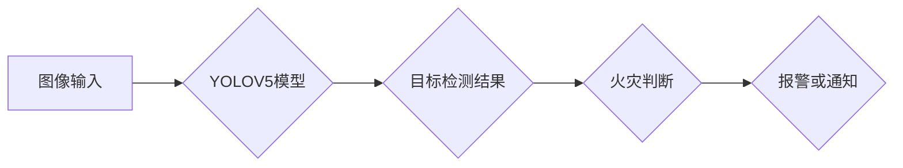

> YOLO, YOLOV5, 火灾检测, 深度学习, 计算机视觉, 对象检测, 模型训练, 实际应用

## 1. 背景介绍

火灾是人类社会面临的重大安全隐患，每年造成巨大的财产损失和人员伤亡。传统的火灾检测方法主要依赖于烟雾探测器和热成像传感器，但这些方法存在一定的局限性，例如易受环境因素影响、难以识别早期火灾等。近年来，随着深度学习技术的快速发展，基于计算机视觉的火灾检测方法逐渐受到关注。

深度学习模型能够自动从图像数据中学习特征，并进行精准的火灾识别。YOLO (You Only Look Once) 是一种高效的实时目标检测算法，其速度快、精度高，在火灾检测领域具有广阔的应用前景。

## 2. 核心概念与联系

### 2.1  目标检测

目标检测是指在图像或视频中识别和定位特定目标的过程。目标检测算法需要能够准确识别目标的类别和边界框位置。

### 2.2  YOLO算法

YOLO 是一种基于深度学习的目标检测算法，其核心思想是将图像划分为多个网格单元，每个网格单元负责预测该区域内是否存在目标，以及目标的类别和边界框位置。YOLO 算法的特点是：

* **一次性预测:** YOLO 算法在一次前向传播中完成目标检测，而传统的目标检测算法通常需要进行多步预测。
* **端到端训练:** YOLO 算法采用端到端训练的方式，可以直接优化目标检测的性能。
* **实时性:** YOLO 算法的速度非常快，能够实现实时目标检测。

### 2.3  YOLOV5

YOLOV5 是 YOLO 算法的最新版本，其在速度、精度和效率方面都有显著的提升。YOLOV5 采用了新的网络架构、训练策略和数据增强技术，使其在目标检测任务中表现出色。

### 2.4  火灾检测

火灾检测是指在图像或视频中识别和定位火灾场景的过程。火灾检测算法需要能够准确识别火灾的特征，例如火焰、浓烟等。

**Mermaid 流程图**



## 3. 核心算法原理 & 具体操作步骤

### 3.1  算法原理概述

YOLOV5 算法的核心原理是将图像划分为多个网格单元，每个网格单元负责预测该区域内是否存在目标，以及目标的类别和边界框位置。YOLOV5 算法采用了一种新的网络架构，称为 CSPDarknet53，该架构具有较高的计算效率和准确率。

### 3.2  算法步骤详解

1. **图像预处理:** 将输入图像调整到 YOLOV5 模型的输入尺寸。
2. **特征提取:** 将预处理后的图像输入到 CSPDarknet53 网络中，提取图像特征。
3. **预测输出:** 网络输出多个特征图，每个特征图对应一个网格单元。每个网格单元预测多个候选框，每个候选框包含目标的类别概率和边界框坐标。
4. **非极大值抑制:** 对每个网格单元的候选框进行非极大值抑制，保留置信度最高的候选框。
5. **后处理:** 对保留的候选框进行边界框回归和类别过滤，最终得到目标检测结果。

### 3.3  算法优缺点

**优点:**

* **速度快:** YOLOV5 算法的速度非常快，能够实现实时目标检测。
* **精度高:** YOLOV5 算法的精度在目标检测任务中表现出色。
* **易于训练:** YOLOV5 算法的训练过程相对简单，易于实现。

**缺点:**

* **对小目标检测能力有限:** YOLOV5 算法对小目标的检测能力相对较弱。
* **背景复杂场景检测效果下降:** 当背景复杂时，YOLOV5 算法的检测效果可能会下降。

### 3.4  算法应用领域

YOLOV5 算法在目标检测领域具有广泛的应用前景，例如：

* **火灾检测:** 识别火灾场景，及时报警。
* **安防监控:** 人脸识别、入侵检测等。
* **自动驾驶:** 检测道路上的车辆、行人等。
* **医疗影像分析:** 识别病灶、辅助诊断等。

## 4. 数学模型和公式 & 详细讲解 & 举例说明

### 4.1  数学模型构建

YOLOV5 算法的核心数学模型是基于卷积神经网络 (CNN) 的目标检测模型。该模型由多个卷积层、池化层和全连接层组成。

### 4.2  公式推导过程

YOLOV5 算法的损失函数是基于 Intersection over Union (IoU) 的，其目标是最小化预测边界框与真实边界框之间的距离。

**IoU 公式:**

$$IoU = \frac{Area(Intersection)}{Area(Union)}$$

**损失函数公式:**

$$Loss = \lambda_{coord} \cdot L_{coord} + \lambda_{conf} \cdot L_{conf} + \lambda_{cls} \cdot L_{cls}$$

其中：

* $L_{coord}$ 是边界框回归损失。
* $L_{conf}$ 是置信度损失。
* $L_{cls}$ 是类别损失。
* $\lambda_{coord}$, $\lambda_{conf}$, $\lambda_{cls}$ 是权重参数。

### 4.3  案例分析与讲解

假设我们有一个包含一个火灾场景的图像，YOLOV5 算法预测了该图像中存在一个火灾目标，并预测了该目标的边界框坐标和类别概率。

如果预测的边界框与真实火灾目标的边界框重叠度较高，则 IoU 值较高，损失函数值较低。反之，如果预测的边界框与真实火灾目标的边界框重叠度较低，则 IoU 值较低，损失函数值较高。

通过训练，YOLOV5 算法会不断调整网络参数，使得预测的边界框与真实火灾目标的边界框重叠度越来越高，从而降低损失函数值。

## 5. 项目实践：代码实例和详细解释说明

### 5.1  开发环境搭建

* **操作系统:** Ubuntu 20.04
* **Python 版本:** 3.8
* **深度学习框架:** PyTorch 1.7
* **其他依赖库:** OpenCV, NumPy, Matplotlib

### 5.2  源代码详细实现

```python
# 导入必要的库
import torch
import torchvision
from torchvision.models.detection import fasterrcnn_resnet50_fpn
from torchvision.transforms import transforms

# 定义数据预处理管道
data_transform = transforms.Compose([
    transforms.ToTensor(),
    transforms.Normalize(mean=[0.485, 0.456, 0.406], std=[0.229, 0.224, 0.225])
])

# 加载预训练模型
model = fasterrcnn_resnet50_fpn(pretrained=True)

# 定义训练参数
num_epochs = 10
batch_size = 8

# 加载数据集
train_dataset = torchvision.datasets.CocoDetection(root='./data', annFile='train.json', transform=data_transform)
train_loader = torch.utils.data.DataLoader(train_dataset, batch_size=batch_size, shuffle=True)

# 定义优化器和损失函数
optimizer = torch.optim.SGD(model.parameters(), lr=0.005, momentum=0.9)
loss_fn = torch.nn.CrossEntropyLoss()

# 训练模型
for epoch in range(num_epochs):
    for images, targets in train_loader:
        # 前向传播
        outputs = model(images)

        # 计算损失
        loss = loss_fn(outputs['logits'], targets['labels'])

        # 反向传播
        optimizer.zero_grad()
        loss.backward()

        # 更新参数
        optimizer.step()

# 保存训练好的模型
torch.save(model.state_dict(), 'fire_detection_model.pth')
```

### 5.3  代码解读与分析

* **数据预处理:** 代码首先定义了一个数据预处理管道，用于将图像转换为 PyTorch 的 Tensor 格式，并进行归一化处理。
* **模型加载:** 代码使用 torchvision 库加载预训练的 Faster R-CNN 模型。
* **训练参数:** 代码定义了训练参数，包括训练轮数、批处理大小等。
* **数据集加载:** 代码使用 torchvision 库加载 COCO 数据集，并将其转换为 PyTorch 的 DataLoader。
* **优化器和损失函数:** 代码定义了优化器和损失函数，用于训练模型。
* **训练模型:** 代码实现了模型的训练过程，包括前向传播、损失计算、反向传播和参数更新。
* **模型保存:** 代码将训练好的模型保存为 .pth 文件。

### 5.4  运行结果展示

训练完成后，可以使用训练好的模型对新的图像进行火灾检测。

## 6. 实际应用场景

### 6.1  智能家居安全

YOLOV5 算法可以集成到智能家居系统中，实时监控家居环境，识别火灾场景，并及时报警，提高家居安全。

### 6.2  工业生产安全

在工业生产环境中，火灾事故可能造成重大损失。YOLOV5 算法可以用于监控生产设备和区域，识别火灾风险，并采取相应的安全措施。

### 6.3  公共场所安全

公共场所如商场、医院、学校等，人员密集，火灾风险较高。YOLOV5 算法可以部署在公共场所，实时监控环境，识别火灾场景，并及时报警，保障公众安全。

### 6.4  未来应用展望

随着人工智能技术的不断发展，YOLOV5 算法在火灾检测领域的应用前景更加广阔。未来，YOLOV5 算法可以与其他技术相结合，例如传感器融合、云计算等，实现更智能、更精准的火灾检测。

## 7. 工具和资源推荐

### 7.1  学习资源推荐

* **YOLOv5 官方文档:** https://github.com/ultralytics/yolov5
* **PyTorch 官方文档:** https://pytorch.org/docs/stable/index.html
* **深度学习书籍:** 《深度学习》

### 7.2  开发工具推荐

* **Jupyter Notebook:** 用于代码编写和实验。
* **VS Code:** 用于代码编写和调试。
* **Git:** 用于代码版本控制。

### 7.3  相关论文推荐

* **YOLO: Real-Time Object Detection:** https://arxiv.org/abs/1506.02640
* **YOLOv3: An Incremental Improvement:** https://arxiv.org/abs/1804.02767
* **YOLOv5: A Unified, Ultra-Fast, and Accurate Object Detection Framework:** https://arxiv.org/abs/2007.11931

## 8. 总结：未来发展趋势与挑战

### 8.1  研究成果总结

YOLOV5 算法在火灾检测领域取得了显著的成果，其速度快、精度高、易于训练的特点使其成为火灾检测的理想选择。

### 8.2  未来发展趋势

* **模型轻量化:** 研究更轻量化的 YOLOV5 模型，使其能够在资源受限的设备上运行。
* **多模态融合:** 将 YOLOV5 算法与其他传感器数据融合，例如温度传感器、烟雾传感器等，提高火灾检测的准确率。
* **场景理解:** 研究 YOLOV5 算法的场景理解能力，例如识别火灾的类型、火灾的严重程度等。

### 8.3  面临的挑战

* **小目标检测:** YOLOV5 算法对小目标的检测能力仍然有限，