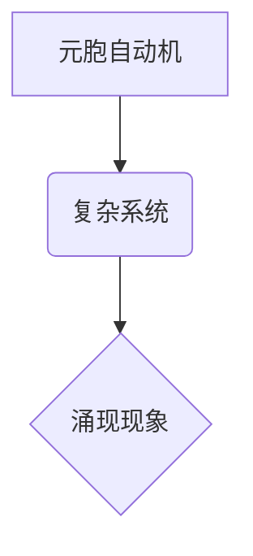

> 元胞自动机，复杂系统，涌现现象，分类方法，数学模型，代码实现

## 1. 背景介绍

复杂系统是构成自然界和社会的重要组成部分，其行为往往呈现出非线性、自组织和涌现等特征。涌现现象是指复杂系统中由简单规则的相互作用产生出复杂、不可预测的行为模式。元胞自动机（Cellular Automata，CA）作为一种模拟复杂系统演化的数学模型，能够有效地捕捉涌现现象的本质。

近年来，基于元胞自动机的复杂系统涌现现象研究取得了显著进展。许多学者利用CA模型成功模拟了各种自然现象，例如：

* **生态系统演化**: 模拟物种竞争、协同和灭绝等过程。
* **交通流量**: 研究交通拥堵的形成机制和缓解策略。
* **城市发展**: 模拟城市扩张、人口流动和社会结构演化。
* **疾病传播**: 研究传染病的传播规律和控制方法。

然而，现有的CA模型大多针对特定现象进行设计，缺乏统一的分类方法。因此，如何对基于CA的复杂系统涌现现象进行有效分类，成为一个重要的研究课题。

## 2. 核心概念与联系

**2.1 元胞自动机 (Cellular Automata)**

元胞自动机是一种离散动力系统，由以下三个基本要素组成：

* **元胞**: 空间中的每个点称为元胞，每个元胞都具有一个状态。
* **状态集**: 元胞可以取的有限个状态，例如：0和1。
* **规则**: 规则决定了元胞状态的演化方式，通常根据相邻元胞的状态进行更新。

**2.2 复杂系统**

复杂系统是指由许多相互作用的个体组成的系统，其整体行为比个体行为更加复杂。复杂系统具有以下特征：

* **非线性**: 系统的输出与输入之间存在非线性的关系。
* **自组织**: 系统能够自发地组织成某种结构或模式。
* **涌现**: 系统中出现新的、不可预测的行为模式。

**2.3 涌现现象**

涌现现象是指复杂系统中由简单规则的相互作用产生出复杂、不可预测的行为模式。涌现现象是复杂系统研究的核心问题之一。

**2.4 核心概念关系图**



## 3. 核心算法原理 & 具体操作步骤

### 3.1 算法原理概述

基于元胞自动机的复杂系统涌现现象分类方法主要基于以下原理：

* **状态空间分析**: 通过分析元胞自动机的状态空间结构，可以识别不同类型的涌现现象。
* **规则分析**: 通过分析元胞自动机的规则，可以理解涌现现象的形成机制。
* **时空演化分析**: 通过分析元胞自动机的时空演化过程，可以识别涌现现象的特征和规律。

### 3.2 算法步骤详解

1. **构建元胞自动机模型**: 根据研究对象的特点，构建相应的元胞自动机模型，包括元胞状态集、规则和初始状态。
2. **模拟元胞自动机演化**: 使用计算机程序模拟元胞自动机的演化过程，记录每个时间步的元胞状态。
3. **分析状态空间结构**: 对模拟结果进行分析，识别元胞自动机的状态空间结构，例如：稳定状态、周期状态、混沌状态等。
4. **分析规则**: 分析元胞自动机的规则，理解涌现现象的形成机制，例如：反馈机制、自组织机制等。
5. **分析时空演化**: 分析元胞自动机的时空演化过程，识别涌现现象的特征和规律，例如：空间模式、时间周期等。
6. **分类涌现现象**: 根据状态空间结构、规则分析和时空演化分析的结果，将涌现现象进行分类。

### 3.3 算法优缺点

**优点**:

* **简单易懂**: 元胞自动机模型的原理简单易懂，易于理解和应用。
* **计算效率高**: 元胞自动机的模拟过程相对简单，计算效率较高。
* **可视化性强**: 元胞自动机的模拟结果易于可视化，方便观察和分析。

**缺点**:

* **模型简化**: 元胞自动机模型的简化可能会导致一些复杂现象的丢失。
* **参数选择**: 元胞自动机的参数选择对模拟结果有很大影响，需要进行仔细的调优。
* **分类标准**: 现有的涌现现象分类标准缺乏统一性，需要进一步完善。

### 3.4 算法应用领域

基于元胞自动机的复杂系统涌现现象分类方法在以下领域具有广泛的应用前景：

* **自然科学**: 模拟生态系统演化、气候变化、疾病传播等自然现象。
* **社会科学**: 研究社会群体行为、城市发展、经济波动等社会现象。
* **工程技术**: 设计智能控制系统、优化交通流量、预测故障发生等。

## 4. 数学模型和公式 & 详细讲解 & 举例说明

### 4.1 数学模型构建

元胞自动机的数学模型可以表示为一个状态转移函数，该函数将当前时刻的元胞状态映射到下一个时刻的元胞状态。

假设一个二维元胞自动机，每个元胞的状态为0或1，则状态转移函数可以表示为：

$$
S(t+1) = f(S(t), N(t))
$$

其中：

* $S(t)$ 表示当前时刻的元胞状态矩阵。
* $N(t)$ 表示当前时刻每个元胞的邻居状态矩阵。
* $f$ 表示状态转移函数。

### 4.2 公式推导过程

状态转移函数 $f$ 的具体形式取决于元胞自动机的规则。常见的规则包括：

* **规则30**: 每个元胞的状态取决于其当前状态和两个邻居状态。
* **规则110**: 每个元胞的状态取决于其当前状态和两个邻居状态。

这些规则可以被表示为逻辑表达式或布尔函数，并通过数学推导得到具体的状态转移函数。

### 4.3 案例分析与讲解

**规则30**:

规则30 的状态转移函数可以表示为：

$$
S(t+1)_i = \begin{cases}
1 & \text{if } N(t)_i = 010 \text{ or } 011 \text{ or } 110 \\
0 & \text{otherwise}
\end{cases}
$$

其中：

* $S(t+1)_i$ 表示下一个时刻第 $i$ 个元胞的状态。
* $N(t)_i$ 表示当前时刻第 $i$ 个元胞的邻居状态。

**举例说明**:

假设一个元胞自动机初始状态为：

```
0 0 0 0 0
0 1 0 0 0
0 0 1 0 0
0 0 0 1 0
0 0 0 0 0
```

根据规则30 的状态转移函数，可以模拟元胞自动机的演化过程，观察涌现现象的出现。

## 5. 项目实践：代码实例和详细解释说明

### 5.1 开发环境搭建

本项目使用 Python 语言进行开发，所需的库包括：

* NumPy: 用于数值计算和数组操作。
* Matplotlib: 用于数据可视化。

### 5.2 源代码详细实现

```python
import numpy as np
import matplotlib.pyplot as plt

# 定义元胞自动机规则
def rule30(state, neighbors):
    return np.array([1 if (neighbors == 010) or (neighbors == 011) or (neighbors == 110) else 0 for neighbors in neighbors])

# 初始化元胞自动机状态
size = 5
state = np.random.randint(2, size=(size, size))

# 模拟元胞自动机演化
for i in range(100):
    # 计算每个元胞的邻居状态
    neighbors = np.roll(state, 1, axis=0) + np.roll(state, -1, axis=0) + np.roll(state, 1, axis=1) + np.roll(state, -1, axis=1) - state
    # 更新元胞状态
    state = rule30(state, neighbors)

# 可视化元胞自动机状态
plt.imshow(state, cmap='gray')
plt.show()
```

### 5.3 代码解读与分析

* **规则定义**: `rule30` 函数定义了规则30 的状态转移函数。
* **状态初始化**: `state` 变量初始化为一个随机的二值矩阵，表示元胞自动机的初始状态。
* **演化模拟**: 循环迭代模拟元胞自动机的演化过程，每次迭代更新每个元胞的状态。
* **可视化**: 使用 `matplotlib` 库可视化元胞自动机的状态。

### 5.4 运行结果展示

运行代码后，将显示一个动态变化的图像，展示元胞自动机演化的过程。

## 6. 实际应用场景

### 6.1 自然科学

* **生态系统模拟**: 模拟物种竞争、协同和灭绝等过程，研究生态系统稳定性和变化规律。
* **气候变化预测**: 模拟大气环流和海洋温度变化，预测气候变化趋势和影响。
* **疾病传播模型**: 研究传染病的传播规律和控制方法，为疫情防控提供参考。

### 6.2 社会科学

* **社会群体行为**: 研究人群聚集、谣言传播、社会运动等社会群体行为的形成机制。
* **城市发展规划**: 模拟城市扩张、人口流动和社会结构演化，为城市规划提供参考。
* **经济波动预测**: 研究经济周期、金融市场波动等经济现象的形成机制，预测经济发展趋势。

### 6.3 工程技术

* **智能控制系统**: 设计基于元胞自动机的智能控制系统，用于无人驾驶、机器人控制等领域。
* **交通流量优化**: 研究交通拥堵的形成机制，设计交通信号灯控制策略，优化交通流量。
* **故障预测**: 模拟设备运行状态，预测设备故障发生，提高设备维护效率。

### 6.4 未来应用展望

随着计算机技术的发展和元胞自动机理论的深入研究，基于元胞自动机的复杂系统涌现现象分类方法将有更广泛的应用前景，例如：

* **生物医学**: 模拟细胞生长、组织发育、疾病诊断等生物医学过程。
* **材料科学**: 设计新型材料，研究材料的结构和性能。
* **人工智能**: 研究智能体行为、认知机制等人工智能领域问题。

## 7. 工具和资源推荐

### 7.1 学习资源推荐

* **书籍**:
    * 《元胞自动机》 - Stephen Wolfram
    * 《复杂系统》 - John Holland
* **在线课程**:
    * Coursera: Complex Systems
    * edX: Introduction to Cellular Automata

### 7.2 开发工具推荐

* **Python**: 语言简洁易学，拥有丰富的科学计算库。
* **NumPy**: 用于数值计算和数组操作。
* **Matplotlib**: 用于数据可视化。
* **Scikit-learn**: 用于机器学习和数据挖掘。

### 7.3 相关论文推荐

* **Conway's Game of Life**: John Conway
* **Emergence**: Steven Johnson
* **Complexity: A Guided Tour**: Melanie Mitchell

## 8. 总结：未来发展趋势与挑战

### 8.1 研究成果总结

基于元胞自动机的复杂系统涌现现象分类方法取得了显著进展，为理解复杂系统行为提供了新的视角和工具。

### 8.2 未来发展趋势

* **多尺度分析**: 将元胞自动机与其他复杂系统模型相结合，进行多尺度分析，研究复杂系统在不同尺度上的行为。
* **数据驱动**: 利用大数据和机器学习技术，构建数据驱动的元胞自动机模型，提高模型的预测精度和应用范围。
* **跨学科研究**: 将元胞