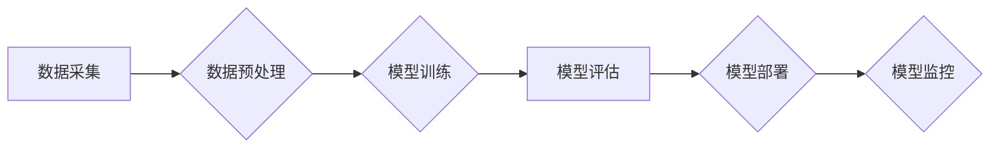

> 基础模型、专业规范、科学精神、人工智能、深度学习、模型训练、模型评估、伦理规范、可解释性、可控性

## 1. 背景介绍

基础模型（Foundation Model）作为人工智能领域的新兴研究方向，近年来取得了令人瞩目的进展。这些模型通常拥有庞大的参数规模和广泛的知识储备，能够在多种下游任务中表现出卓越的性能。然而，随着基础模型的规模和复杂性不断增加，其专业规范和科学精神也日益受到关注。

基础模型的快速发展带来了诸多机遇，但也存在一些挑战和风险。例如，模型的训练成本高昂，数据安全和隐私问题日益突出，模型的决策过程缺乏透明度，容易受到恶意攻击和操纵。因此，建立完善的基础模型专业规范和科学精神，对于推动基础模型的健康发展至关重要。

## 2. 核心概念与联系

**2.1 基础模型的概念**

基础模型是指在海量数据上预训练的通用人工智能模型，能够在多种下游任务中进行微调，并表现出强大的泛化能力。

**2.2 基础模型的特性**

* **规模庞大:** 基础模型通常拥有数亿甚至数十亿个参数，使其能够学习到更复杂的知识和模式。
* **通用性强:** 基础模型能够在多种下游任务中进行微调，例如自然语言处理、计算机视觉、语音识别等。
* **预训练能力:** 基础模型在海量数据上进行预训练，能够学习到通用的语言表示和知识结构。

**2.3 基础模型的架构**

基础模型的架构通常基于深度学习网络，例如 Transformer、BERT、GPT 等。这些网络结构能够有效地捕捉语言和图像中的复杂关系。

**2.4 基础模型与传统机器学习模型的对比**

传统机器学习模型通常需要针对特定的任务进行训练，而基础模型则能够在预训练的基础上进行微调，从而降低了模型训练的成本和时间。

**2.5 基础模型的应用场景**

基础模型在各个领域都有广泛的应用，例如：

* **自然语言处理:** 文本生成、机器翻译、问答系统等。
* **计算机视觉:** 图像识别、物体检测、图像分割等。
* **语音识别:** 语音转文本、语音合成等。
* **推荐系统:** 商品推荐、内容推荐等。

**Mermaid 流程图**



## 3. 核心算法原理 & 具体操作步骤

**3.1 算法原理概述**

基础模型的训练主要基于深度学习算法，例如 Transformer、BERT、GPT 等。这些算法通过多层神经网络结构，学习到语言和图像中的复杂关系。

**3.2 算法步骤详解**

1. **数据预处理:** 将原始数据进行清洗、格式化和编码，使其能够被模型理解。
2. **模型构建:** 根据具体的任务需求，选择合适的深度学习网络架构，并设置模型参数。
3. **模型训练:** 使用训练数据对模型进行训练，通过调整模型参数，使模型能够准确地预测目标输出。
4. **模型评估:** 使用测试数据对模型进行评估，并根据评估指标，调整模型参数或架构。
5. **模型部署:** 将训练好的模型部署到实际应用场景中，用于进行预测或其他任务。

**3.3 算法优缺点**

**优点:**

* 泛化能力强: 基于海量数据的预训练，基础模型能够在多种下游任务中表现出良好的泛化能力。
* 效率高: 基于预训练模型的微调，可以显著降低模型训练的时间和成本。

**缺点:**

* 训练成本高: 基础模型的训练需要大量的计算资源和时间。
* 数据依赖性强: 模型的性能取决于训练数据的质量和数量。
* 可解释性差: 深度学习模型的决策过程较为复杂，难以解释模型的决策结果。

**3.4 算法应用领域**

基础模型在各个领域都有广泛的应用，例如：

* 自然语言处理: 文本生成、机器翻译、问答系统等。
* 计算机视觉: 图像识别、物体检测、图像分割等。
* 语音识别: 语音转文本、语音合成等。
* 推荐系统: 商品推荐、内容推荐等。

## 4. 数学模型和公式 & 详细讲解 & 举例说明

**4.1 数学模型构建**

基础模型的训练过程可以看作是一个优化问题，目标是找到最优的模型参数，使得模型在训练数据上的损失函数最小。

**损失函数:** 衡量模型预测结果与真实值的差距。常用的损失函数包括交叉熵损失、均方误差损失等。

**优化算法:** 用于更新模型参数，使其朝着损失函数最小化的方向进行调整。常用的优化算法包括梯度下降、Adam 等。

**4.2 公式推导过程**

损失函数的最小化可以通过梯度下降算法实现。梯度下降算法的基本思想是：

1. 计算损失函数对模型参数的梯度。
2. 根据梯度方向更新模型参数。
3. 重复步骤 1 和 2，直到损失函数达到最小值。

**梯度下降公式:**

$$
\theta = \theta - \alpha \nabla L(\theta)
$$

其中：

* $\theta$ 是模型参数。
* $\alpha$ 是学习率。
* $\nabla L(\theta)$ 是损失函数对模型参数的梯度。

**4.3 案例分析与讲解**

例如，在自然语言处理任务中，可以使用交叉熵损失函数来衡量模型预测结果与真实标签之间的差距。

**交叉熵损失函数公式:**

$$
L = -\sum_{i=1}^{N} y_i \log p_i
$$

其中：

* $N$ 是样本数量。
* $y_i$ 是真实标签。
* $p_i$ 是模型预测的概率。

通过梯度下降算法，可以更新模型参数，使得交叉熵损失函数最小化，从而提高模型的预测准确率。

## 5. 项目实践：代码实例和详细解释说明

**5.1 开发环境搭建**

* 操作系统: Ubuntu 20.04
* Python 版本: 3.8
* 深度学习框架: PyTorch 1.8

**5.2 源代码详细实现**

```python
import torch
import torch.nn as nn

class Transformer(nn.Module):
    def __init__(self, vocab_size, embedding_dim, num_heads, num_layers):
        super(Transformer, self).__init__()
        self.embedding = nn.Embedding(vocab_size, embedding_dim)
        self.transformer_layers = nn.ModuleList([
            nn.TransformerEncoderLayer(embedding_dim, num_heads)
            for _ in range(num_layers)
        ])
        self.linear = nn.Linear(embedding_dim, vocab_size)

    def forward(self, x):
        x = self.embedding(x)
        for layer in self.transformer_layers:
            x = layer(x)
        x = self.linear(x)
        return x

# 实例化模型
model = Transformer(vocab_size=10000, embedding_dim=512, num_heads=8, num_layers=6)

# 定义损失函数和优化器
criterion = nn.CrossEntropyLoss()
optimizer = torch.optim.Adam(model.parameters(), lr=0.001)

# 训练模型
for epoch in range(10):
    # ... 训练过程 ...
    loss = criterion(outputs, targets)
    optimizer.zero_grad()
    loss.backward()
    optimizer.step()

```

**5.3 代码解读与分析**

* 代码实现了基于 Transformer 架构的基础模型。
* 模型包含嵌入层、Transformer 层和线性层。
* 训练过程使用交叉熵损失函数和 Adam 优化器。

**5.4 运行结果展示**

训练完成后，可以将模型部署到实际应用场景中，例如用于文本生成、机器翻译等任务。

## 6. 实际应用场景

基础模型在各个领域都有广泛的应用，例如：

* **自然语言处理:** 文本生成、机器翻译、问答系统、文本摘要、情感分析等。
* **计算机视觉:** 图像识别、物体检测、图像分割、图像生成、视频分析等。
* **语音识别:** 语音转文本、语音合成、语音识别等。
* **推荐系统:** 商品推荐、内容推荐、个性化服务等。

**6.4 未来应用展望**

基础模型的应用前景十分广阔，未来可能在以下领域发挥更大的作用：

* **科学研究:** 基于基础模型的知识图谱构建、科学发现辅助等。
* **医疗保健:** 基于基础模型的疾病诊断、药物研发等。
* **教育:** 基于基础模型的个性化学习、智能辅导等。

## 7. 工具和资源推荐

**7.1 学习资源推荐**

* **书籍:**
    * 《深度学习》
    * 《自然语言处理》
    * 《计算机视觉》
* **在线课程:**
    * Coursera
    * edX
    * Udacity

**7.2 开发工具推荐**

* **深度学习框架:** PyTorch, TensorFlow, Keras
* **编程语言:** Python
* **云计算平台:** AWS, Azure, Google Cloud

**7.3 相关论文推荐**

* BERT: Pre-training of Deep Bidirectional Transformers for Language Understanding
* GPT-3: Language Models are Few-Shot Learners
* T5: Text-to-Text Transfer Transformer

## 8. 总结：未来发展趋势与挑战

**8.1 研究成果总结**

基础模型在近年来取得了显著的进展，在多个领域展现出强大的应用潜力。

**8.2 未来发展趋势**

* 模型规模的进一步扩大
* 模型训练效率的提升
* 模型可解释性和可控性的增强
* 模型的跨模态学习能力

**8.3 面临的挑战**

* 训练成本高昂
* 数据安全和隐私问题
* 模型的偏见和歧视问题
* 模型的安全性与鲁棒性

**8.4 研究展望**

未来研究将重点关注解决基础模型面临的挑战，并探索其在更多领域的新应用。

## 9. 附录：常见问题与解答

**9.1 如何选择合适的基础模型？**

选择合适的基础模型需要根据具体的应用场景和任务需求进行考虑。例如，对于文本生成任务，可以选择 GPT-3 等文本生成模型；对于图像识别任务，可以选择 Vision Transformer 等图像识别模型。

**9.2 如何进行基础模型的微调？**

基础模型的微调通常需要使用少量的数据进行训练，并调整模型的某些参数。可以使用预训练模型的API进行微调。

**9.3 如何评估基础模型的性能？**

基础模型的性能可以通过在测试数据上进行评估，并使用相应的指标进行衡量。常用的指标包括准确率、召回率、F1-score 等。


作者：禅与计算机程序设计艺术 / Zen and the Art of Computer Programming 
<end_of_turn>