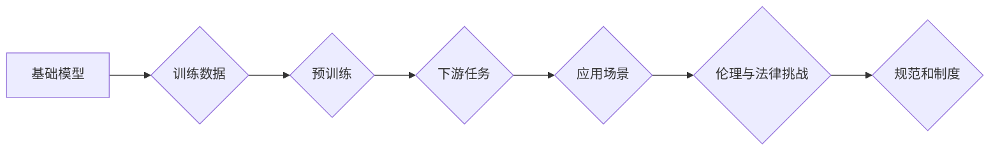

> 基础模型，人工智能，伦理，法律，偏见，公平性，透明度，可解释性，责任

## 1. 背景介绍

近年来，基础模型（Foundation Models）在人工智能领域取得了令人瞩目的进展。这些模型通常是训练于海量数据上的强大通用模型，能够执行各种任务，例如文本生成、图像识别、机器翻译等。基础模型的出现标志着人工智能发展进入了一个新的阶段，但也带来了新的伦理和法律挑战。

基础模型的强大能力使其在各个领域都具有广泛的应用前景，例如医疗保健、教育、金融等。然而，这些模型也可能被用于恶意目的，例如生成虚假信息、进行网络攻击、侵犯隐私等。此外，基础模型本身可能存在偏见和歧视，导致不公平的结果。因此，我们需要认真思考基础模型的伦理和法律影响，并制定相应的规范和制度，以确保其安全、公平、可持续地发展。

## 2. 核心概念与联系

**2.1 基础模型概述**

基础模型是指在海量数据上进行预训练的强大通用模型，能够执行多种下游任务。它们通常具有以下特点：

* **规模庞大:** 基础模型通常拥有数十亿甚至数千亿个参数。
* **通用性强:** 基础模型能够适应多种下游任务，无需针对每个任务进行专门训练。
* **迁移学习能力强:** 基础模型可以将预训练知识迁移到新的任务中，提高学习效率。

**2.2 伦理与法律挑战**

基础模型的强大能力带来了以下伦理和法律挑战：

* **偏见和歧视:** 基础模型可能从训练数据中学习到社会偏见和歧视，导致不公平的结果。
* **隐私侵犯:** 基础模型可能用于识别和追踪个人信息，侵犯隐私权。
* **虚假信息生成:** 基础模型可以生成逼真的虚假信息，导致信息混乱和社会动荡。
* **责任归属:** 当基础模型导致负面后果时，责任应该归属谁？

**2.3 相关法律法规**

目前，各国政府正在制定相关法律法规来规范基础模型的开发和使用。例如，欧盟的《通用数据保护条例》（GDPR）规定了个人数据处理的规则，美国加州的《消费者隐私法》（CCPA）赋予消费者对个人数据的控制权。

**2.4 伦理原则**

为了应对基础模型带来的伦理挑战，我们需要遵循以下伦理原则：

* **公平性:** 基础模型应该公平地对待所有用户，避免产生偏见和歧视。
* **透明度:** 基础模型的决策过程应该透明可解释，用户应该了解模型是如何做出决定的。
* **可控性:** 基础模型的使用应该受到控制，避免其被用于恶意目的。
* **责任:** 开发和使用基础模型的各方都应该承担相应的责任。

**2.5 Mermaid 流程图**

## 3. 核心算法原理 & 具体操作步骤

**3.1 算法原理概述**

基础模型通常基于深度学习算法，例如 Transformer 模型。这些模型通过学习数据中的模式和关系，能够生成文本、图像、音频等各种类型的数据。

**3.2 算法步骤详解**

1. **数据收集和预处理:** 收集大量数据并进行预处理，例如文本清洗、图像裁剪等。
2. **模型架构设计:** 设计模型的架构，例如 Transformer 的编码器和解码器结构。
3. **模型训练:** 使用训练数据训练模型，调整模型参数以最小化损失函数。
4. **模型评估:** 使用测试数据评估模型的性能，例如准确率、召回率等。
5. **模型部署:** 将训练好的模型部署到实际应用场景中。

**3.3 算法优缺点**

**优点:**

* **通用性强:** 基础模型能够适应多种下游任务。
* **迁移学习能力强:** 基础模型可以将预训练知识迁移到新的任务中。
* **性能优异:** 基于深度学习的算法在许多任务上取得了优异的性能。

**缺点:**

* **训练成本高:** 基础模型的训练需要大量的计算资源和时间。
* **数据依赖性强:** 基础模型的性能取决于训练数据的质量和数量。
* **可解释性差:** 深度学习模型的决策过程难以解释。

**3.4 算法应用领域**

基础模型在各个领域都具有广泛的应用前景，例如：

* **自然语言处理:** 文本生成、机器翻译、问答系统等。
* **计算机视觉:** 图像识别、物体检测、图像生成等。
* **语音识别:** 语音转文本、语音合成等。
* **医疗保健:** 疾病诊断、药物研发等。
* **金融:** 风险评估、欺诈检测等。

## 4. 数学模型和公式 & 详细讲解 & 举例说明

**4.1 数学模型构建**

基础模型通常使用神经网络作为数学模型。神经网络由多个层组成，每层包含多个神经元。神经元之间通过权重连接，权重决定了神经元之间的传递强度。

**4.2 公式推导过程**

神经网络的训练过程是通过优化权重来最小化损失函数。损失函数衡量模型预测结果与真实结果之间的差异。常用的损失函数包括均方误差（MSE）和交叉熵损失（Cross-Entropy Loss）。

**4.3 案例分析与讲解**

例如，在文本生成任务中，可以使用 Transformer 模型作为基础模型。Transformer 模型使用注意力机制来捕捉文本中的长距离依赖关系。

**4.3.1 注意力机制**

注意力机制允许模型关注输入序列中与当前任务最相关的部分。注意力权重表示模型对不同输入元素的关注程度。

**4.3.2 公式示例**

注意力权重的计算公式如下：

$$
\text{Attention}(Q, K, V) = \text{softmax}\left(\frac{Q K^T}{\sqrt{d_k}}\right) V
$$

其中，Q、K、V 分别代表查询矩阵、键矩阵和值矩阵。$d_k$ 是键向量的维度。

## 5. 项目实践：代码实例和详细解释说明

**5.1 开发环境搭建**

使用 Python 语言和深度学习框架 TensorFlow 或 PyTorch 开发基础模型。

**5.2 源代码详细实现**

使用代码实现 Transformer 模型的架构和训练过程。

**5.3 代码解读与分析**

解释代码中的关键部分，例如注意力机制的实现、损失函数的计算、模型训练的流程等。

**5.4 运行结果展示**

展示模型在文本生成任务上的运行结果，例如生成的文本质量、流畅度等。

## 6. 实际应用场景

**6.1 文本生成**

使用基础模型生成各种类型的文本，例如新闻文章、小说、诗歌等。

**6.2 图像识别**

使用基础模型识别图像中的物体、场景、人物等。

**6.3 机器翻译**

使用基础模型将文本从一种语言翻译成另一种语言。

**6.4 聊天机器人**

使用基础模型构建聊天机器人，能够与用户进行自然语言对话。

**6.5 未来应用展望**

基础模型在未来将应用于更多领域，例如医疗诊断、药物研发、教育等。

## 7. 工具和资源推荐

**7.1 学习资源推荐**

* 深度学习书籍：
    * 《深度学习》
    * 《动手学深度学习》
* 在线课程：
    * Coursera 的深度学习课程
    * fast.ai 的深度学习课程

**7.2 开发工具推荐**

* 深度学习框架：
    * TensorFlow
    * PyTorch
* 代码编辑器：
    * VS Code
    * PyCharm

**7.3 相关论文推荐**

* 《Attention Is All You Need》
* 《BERT: Pre-training of Deep Bidirectional Transformers for Language Understanding》
* 《GPT-3: Language Models are Few-Shot Learners》

## 8. 总结：未来发展趋势与挑战

**8.1 研究成果总结**

基础模型在人工智能领域取得了显著的进展，展现出强大的能力和广阔的应用前景。

**8.2 未来发展趋势**

* 模型规模进一步扩大
* 模型训练效率提升
* 模型可解释性增强
* 模型安全性与可靠性提高

**8.3 面临的挑战**

* 伦理与法律挑战
* 数据获取与隐私保护
* 计算资源需求
* 模型偏见与歧视

**8.4 研究展望**

未来研究将重点关注基础模型的伦理、法律、安全、可解释性等方面，以确保其安全、公平、可持续地发展。

## 9. 附录：常见问题与解答

**9.1 如何评估基础模型的性能？**

可以使用各种指标来评估基础模型的性能，例如准确率、召回率、F1-score等。

**9.2 如何解决基础模型的偏见问题？**

可以通过多种方法来解决基础模型的偏见问题，例如使用去偏见的数据集、调整模型的训练过程、引入公平性约束等。

**9.3 如何确保基础模型的安全性和可靠性？**

可以通过多种方法来确保基础模型的安全性和可靠性，例如进行安全审计、使用对抗训练等技术、制定相应的安全策略等。

作者：禅与计算机程序设计艺术 / Zen and the Art of Computer Programming 
<end_of_turn>