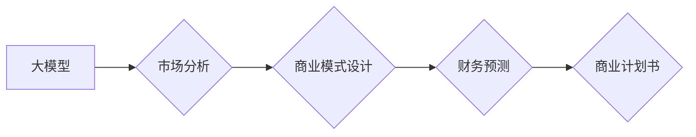

> 大模型、创业、商业计划书、市场分析、商业模式、财务预测、人工智能、深度学习、自然语言处理

## 1. 背景介绍

近年来，人工智能（AI）技术取得了飞速发展，特别是大模型的出现，为各行各业带来了革命性的变革。大模型是指参数规模庞大、训练数据海量的人工智能模型，具备强大的泛化能力和学习能力，能够在自然语言处理、计算机视觉、语音识别等领域取得突破性进展。

大模型的涌现为创业者提供了前所未有的机遇。基于大模型的创新应用层出不穷，涵盖了教育、医疗、金融、娱乐等多个领域。然而，创业者在利用大模型进行商业化开发时，需要进行深入的市场分析、商业模式设计和财务预测，才能确保项目的成功。

## 2. 核心概念与联系

### 2.1 大模型

大模型是指参数规模庞大、训练数据海量的人工智能模型，通常拥有数十亿甚至数千亿个参数。其强大的学习能力使其能够在各种复杂任务中表现出色，例如：

* **自然语言处理 (NLP)：** 文本生成、机器翻译、问答系统、情感分析等。
* **计算机视觉 (CV)：** 图像识别、物体检测、图像分割、视频分析等。
* **语音识别 (ASR)：** 语音转文本、语音合成等。

### 2.2 商业模式

商业模式是指企业为创造、传递和捕获价值而采取的策略和方法。在利用大模型进行商业化开发时，创业者需要选择合适的商业模式，以确保项目的盈利能力和可持续发展。常见的商业模式包括：

* **订阅制：** 用户按月或年付费使用大模型提供的服务。
* **按需付费：** 用户根据实际使用量付费，例如每条文本生成的费用。
* **平台模式：** 建立一个平台，连接大模型开发者和用户，从中获取佣金。
* **数据驱动：** 利用大模型分析用户数据，提供个性化服务或精准广告。

### 2.3 财务预测

财务预测是指根据历史数据和未来预期，预测企业的收入、成本、利润等财务指标。在撰写商业计划书时，创业者需要进行详细的财务预测，以评估项目的盈利能力和风险。

**Mermaid 流程图**



## 3. 核心算法原理 & 具体操作步骤

### 3.1 算法原理概述

大模型的训练主要基于深度学习算法，例如 Transformer。Transformer 是一种基于注意力机制的神经网络架构，能够有效地捕捉文本序列中的长距离依赖关系。

### 3.2 算法步骤详解

1. **数据预处理:** 将原始文本数据进行清洗、分词、标记等预处理操作，使其能够被模型理解。
2. **模型训练:** 使用深度学习框架（例如 TensorFlow 或 PyTorch）训练 Transformer 模型，通过调整模型参数，使其能够准确地预测文本序列的下一个词。
3. **模型评估:** 使用测试集评估模型的性能，例如准确率、困惑度等指标。
4. **模型调优:** 根据评估结果，调整模型参数、训练数据或训练策略，以提高模型性能。
5. **模型部署:** 将训练好的模型部署到服务器或云平台，提供服务给用户。

### 3.3 算法优缺点

**优点:**

* 强大的泛化能力：能够在未见过的文本数据上表现出色。
* 优秀的文本理解能力：能够捕捉文本序列中的长距离依赖关系。
* 可扩展性强：参数规模可以根据需求进行调整。

**缺点:**

* 训练成本高：需要大量的计算资源和训练数据。
* 训练时间长：训练大型模型可能需要数天甚至数周的时间。
* 可解释性差：模型的决策过程难以理解。

### 3.4 算法应用领域

* **自然语言处理:** 文本生成、机器翻译、问答系统、情感分析、文本摘要等。
* **计算机视觉:** 图像识别、物体检测、图像分割、视频分析等。
* **语音识别:** 语音转文本、语音合成等。
* **其他领域:** 代码生成、药物研发、金融预测等。

## 4. 数学模型和公式 & 详细讲解 & 举例说明

### 4.1 数学模型构建

大模型的训练基于深度学习算法，其核心是构建复杂的数学模型，通过调整模型参数，使其能够学习数据中的规律。

**Transformer 模型**

Transformer 模型的核心是注意力机制，它能够有效地捕捉文本序列中的长距离依赖关系。注意力机制的数学公式如下：

$$
Attention(Q, K, V) = softmax(\frac{QK^T}{\sqrt{d_k}})V
$$

其中：

* $Q$：查询矩阵
* $K$：键矩阵
* $V$：值矩阵
* $d_k$：键向量的维度
* $softmax$：softmax 函数

### 4.2 公式推导过程

注意力机制的公式推导过程较为复杂，涉及到线性变换、矩阵乘法、softmax 函数等操作。

### 4.3 案例分析与讲解

**文本生成任务**

假设我们想要使用 Transformer 模型生成一段文本。首先，我们将输入文本序列转换为词嵌入向量。然后，我们将这些向量输入到 Transformer 模型中，模型会通过注意力机制和多层感知机，学习到文本序列之间的关系，并生成下一个词的概率分布。

## 5. 项目实践：代码实例和详细解释说明

### 5.1 开发环境搭建

* Python 3.x
* TensorFlow 或 PyTorch
* CUDA 和 cuDNN

### 5.2 源代码详细实现

```python
# 使用 TensorFlow 实现简单的 Transformer 模型

import tensorflow as tf

# 定义 Transformer 模型
class Transformer(tf.keras.Model):
    def __init__(self, vocab_size, embedding_dim, num_heads, num_layers):
        super(Transformer, self).__init__()
        self.embedding = tf.keras.layers.Embedding(vocab_size, embedding_dim)
        self.transformer_layers = [
            tf.keras.layers.MultiHeadAttention(num_heads=num_heads, key_dim=embedding_dim)
            for _ in range(num_layers)
        ]
        self.dense = tf.keras.layers.Dense(vocab_size)

    def call(self, inputs):
        # ...
```

### 5.3 代码解读与分析

* `embedding` 层将词索引转换为词嵌入向量。
* `transformer_layers` 包含多个 Transformer 层，每个层包含多头注意力机制和前馈神经网络。
* `dense` 层将 Transformer 输出转换为词的概率分布。

### 5.4 运行结果展示

训练好的 Transformer 模型可以用于文本生成、机器翻译等任务。

## 6. 实际应用场景

### 6.1 教育领域

* **智能辅导系统:** 利用大模型分析学生的学习情况，提供个性化的学习建议和辅导。
* **自动批改系统:** 利用大模型自动批改学生的作业，提高效率。
* **在线学习平台:** 利用大模型提供个性化的学习内容和互动体验。

### 6.2 医疗领域

* **疾病诊断:** 利用大模型分析患者的症状和病史，辅助医生进行疾病诊断。
* **药物研发:** 利用大模型分析药物分子结构和生物活性，加速药物研发过程。
* **医疗影像分析:** 利用大模型分析医学影像，辅助医生进行疾病诊断和治疗方案制定。

### 6.3 金融领域

* **风险评估:** 利用大模型分析客户的信用风险，帮助金融机构进行风险评估和控制。
* **欺诈检测:** 利用大模型分析交易数据，识别和预防金融欺诈行为。
* **投资决策:** 利用大模型分析市场数据，提供投资建议。

### 6.4 未来应用展望

大模型的应用场景还在不断扩展，未来将应用于更多领域，例如：

* **自动驾驶:** 利用大模型分析道路环境，辅助车辆进行自动驾驶。
* **机器人:** 利用大模型赋予机器人更强的认知能力和交互能力。
* **个性化推荐:** 利用大模型分析用户的兴趣和偏好，提供更精准的个性化推荐。

## 7. 工具和资源推荐

### 7.1 学习资源推荐

* **书籍:**
    * 《深度学习》
    * 《自然语言处理》
    * 《Transformer 详解》
* **在线课程:**
    * Coursera: 深度学习
    * Udacity: 自然语言处理
    * fast.ai: 深度学习

### 7.2 开发工具推荐

* **深度学习框架:** TensorFlow, PyTorch
* **文本处理工具:** NLTK, spaCy
* **云平台:** AWS, Azure, Google Cloud

### 7.3 相关论文推荐

* 《Attention Is All You Need》
* 《BERT: Pre-training of Deep Bidirectional Transformers for Language Understanding》
* 《GPT-3: Language Models are Few-Shot Learners》

## 8. 总结：未来发展趋势与挑战

### 8.1 研究成果总结

大模型技术取得了显著进展，在自然语言处理、计算机视觉等领域取得了突破性成果。

### 8.2 未来发展趋势

* **模型规模进一步扩大:** 参数规模将继续增长，模型能力将进一步提升。
* **多模态学习:** 将文本、图像、音频等多种模态数据融合在一起，构建更强大的多模态模型。
* **可解释性增强:** 研究更有效的模型解释方法，提高模型的可解释性和可信度。

### 8.3 面临的挑战

* **训练成本高:** 大型模型的训练成本非常高，需要大量的计算资源和数据。
* **数据安全和隐私:** 大模型的训练需要大量数据，如何保证数据安全和隐私是一个重要挑战。
* **伦理问题:** 大模型的应用可能带来一些伦理问题，例如算法偏见、信息操纵等，需要引起重视。

### 8.4 研究展望

未来，大模型技术将继续发展，在更多领域发挥重要作用。需要加强基础研究，解决技术瓶颈，并关注大模型的伦理和社会影响。

## 9. 附录：常见问题与解答

**Q1: 如何选择合适的商业模式？**

**A1:** 选择商业模式需要根据项目的具体情况，例如目标用户、产品特性、市场竞争等因素进行综合考虑。

**Q2: 如何进行财务预测？**

**A2:** 财务预测需要收集相关数据，例如市场规模、用户增长率、成本结构等，并使用财务模型进行分析。

**Q3: 如何应对大模型的伦理挑战？**

**A3:** 需要制定相应的伦理规范，加强模型的解释性和可控性，并进行社会公众的教育和引导。


作者：禅与计算机程序设计艺术 / Zen and the Art of Computer Programming 
<end_of_turn>