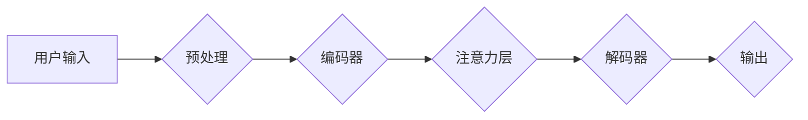

> 大模型、问答机器人、上下文理解、Transformer、注意力机制、BERT、GPT

## 1. 背景介绍

问答机器人作为人工智能领域的重要应用之一，旨在通过理解用户的问题并从知识库或文本语料中获取答案，从而与用户进行自然流畅的对话。然而，问答机器人的核心挑战之一是如何有效地处理上下文信息。

传统的基于规则或模板的问答系统难以捕捉长文本中的复杂语义关系，而深度学习技术的兴起为问答机器人带来了新的机遇。大模型，特别是基于Transformer架构的模型，凭借其强大的上下文理解能力，在问答任务中取得了显著的进展。

## 2. 核心概念与联系

**2.1 核心概念**

* **上下文理解:** 指的是模型能够理解文本中各个词语之间的语义关系，并根据上下文信息来预测下一个词语或整个句子的含义。
* **Transformer:**  一种新型的深度学习架构，其核心是注意力机制，能够有效地捕捉长距离依赖关系，从而提升上下文理解能力。
* **注意力机制:**  一种机制，允许模型关注输入序列中特定部分的信息，并根据其重要性赋予不同的权重。

**2.2 架构图**



**2.3 联系**

大模型问答机器人通过将用户输入进行预处理后，将其编码成向量表示，然后利用Transformer架构中的编码器和解码器进行上下文理解和文本生成。注意力机制在编码器和解码器中发挥着关键作用，帮助模型关注重要信息并生成更准确的答案。

## 3. 核心算法原理 & 具体操作步骤

**3.1 算法原理概述**

Transformer模型的核心是注意力机制，它允许模型关注输入序列中不同位置的词语之间的关系，从而更好地理解上下文信息。

**3.2 算法步骤详解**

1. **词嵌入:** 将每个词语映射到一个低维向量空间中，每个词语都有一个唯一的向量表示。
2. **编码器:** 将输入序列中的每个词语向量通过多层Transformer编码器进行处理，每个编码器层包含多头注意力机制和前馈神经网络。
3. **注意力机制:**  注意力机制计算每个词语与其他词语之间的相关性，并根据相关性赋予不同的权重。
4. **解码器:** 将编码器输出的上下文向量作为输入，通过多层Transformer解码器生成答案序列。
5. **输出层:** 将解码器输出的向量映射到词汇表中，生成最终的答案。

**3.3 算法优缺点**

* **优点:**
    * 能够有效地捕捉长距离依赖关系。
    * 训练效率高，可以处理大量数据。
    * 在各种自然语言处理任务中取得了优异的性能。
* **缺点:**
    * 计算复杂度高，需要大量的计算资源。
    * 训练数据量大，需要大量的标注数据。
    * 对训练数据质量要求高，容易受到噪声数据的影响。

**3.4 算法应用领域**

* 问答系统
* 机器翻译
* 文本摘要
* 情感分析
* 代码生成

## 4. 数学模型和公式 & 详细讲解 & 举例说明

**4.1 数学模型构建**

Transformer模型的数学模型主要包括以下几个部分:

* **词嵌入层:** 将每个词语映射到一个低维向量空间中。
* **编码器层:** 包含多层Transformer编码器，每个编码器层包含多头注意力机制和前馈神经网络。
* **解码器层:** 包含多层Transformer解码器，每个解码器层包含多头注意力机制和前馈神经网络。
* **输出层:** 将解码器输出的向量映射到词汇表中，生成最终的答案。

**4.2 公式推导过程**

* **注意力机制:**  注意力机制的计算公式如下:

$$
Attention(Q, K, V) = softmax(\frac{QK^T}{\sqrt{d_k}})V
$$

其中:

* $Q$ 是查询矩阵
* $K$ 是键矩阵
* $V$ 是值矩阵
* $d_k$ 是键向量的维度
* $softmax$ 是softmax函数

* **多头注意力机制:** 多头注意力机制将注意力机制应用于多个不同的子空间，并通过拼接和线性变换将结果融合在一起。

**4.3 案例分析与讲解**

假设我们有一个句子 "The cat sat on the mat."，我们想要理解 "cat" 的上下文信息。

使用注意力机制，模型可以计算 "cat" 与其他词语之间的相关性，例如 "sat" 和 "on" 与 "cat" 的相关性较高，因此模型会关注这些词语，并根据它们的语义关系来理解 "cat" 的含义。

## 5. 项目实践：代码实例和详细解释说明

**5.1 开发环境搭建**

* Python 3.6+
* PyTorch 或 TensorFlow
* CUDA 和 cuDNN

**5.2 源代码详细实现**

```python
import torch
import torch.nn as nn

class Transformer(nn.Module):
    def __init__(self, vocab_size, embedding_dim, num_heads, num_layers):
        super(Transformer, self).__init__()
        self.embedding = nn.Embedding(vocab_size, embedding_dim)
        self.encoder = nn.TransformerEncoder(nn.TransformerEncoderLayer(embedding_dim, num_heads), num_layers)
        self.decoder = nn.TransformerDecoder(nn.TransformerDecoderLayer(embedding_dim, num_heads), num_layers)
        self.linear = nn.Linear(embedding_dim, vocab_size)

    def forward(self, src, tgt):
        src = self.embedding(src)
        tgt = self.embedding(tgt)
        src = self.encoder(src)
        tgt = self.decoder(tgt, src)
        output = self.linear(tgt)
        return output
```

**5.3 代码解读与分析**

* `__init__` 方法初始化模型参数，包括词嵌入层、编码器和解码器。
* `forward` 方法定义模型的正向传播过程，将输入序列编码并解码生成输出序列。

**5.4 运行结果展示**

通过训练模型并输入用户问题，模型可以生成相应的答案。

## 6. 实际应用场景

大模型问答机器人已经在许多实际应用场景中得到应用，例如:

* **客服机器人:**  自动回答用户常见问题，提高客服效率。
* **搜索引擎:**  理解用户搜索意图，提供更精准的搜索结果。
* **教育机器人:**  提供个性化学习辅导，帮助学生理解知识。

**6.4 未来应用展望**

随着大模型技术的不断发展，问答机器人的应用场景将更加广泛，例如:

* **医疗诊断:**  辅助医生诊断疾病，提高诊断准确率。
* **法律咨询:**  提供法律咨询服务，帮助用户解决法律问题。
* **金融分析:**  分析金融数据，提供投资建议。

## 7. 工具和资源推荐

**7.1 学习资源推荐**

* **论文:**
    * "Attention Is All You Need"
    * "BERT: Pre-training of Deep Bidirectional Transformers for Language Understanding"
    * "GPT-3: Language Models are Few-Shot Learners"
* **博客:**
    * Jay Alammar's Blog
    * Hugging Face Blog

**7.2 开发工具推荐**

* **PyTorch:**  一个开源的深度学习框架。
* **TensorFlow:**  另一个开源的深度学习框架。
* **Hugging Face Transformers:**  一个用于加载和使用预训练 Transformer 模型的库。

**7.3 相关论文推荐**

* "BERT: Pre-training of Deep Bidirectional Transformers for Language Understanding"
* "GPT-3: Language Models are Few-Shot Learners"
* "T5: Text-to-Text Transfer Transformer"

## 8. 总结：未来发展趋势与挑战

**8.1 研究成果总结**

大模型问答机器人取得了显著的进展，能够有效地处理上下文信息，并在各种问答任务中取得了优异的性能。

**8.2 未来发展趋势**

* **模型规模的进一步扩大:**  更大的模型能够学习更复杂的语言模式，从而提升问答性能。
* **多模态问答:**  结合文本、图像、音频等多模态信息，实现更全面的理解和回答。
* **个性化问答:**  根据用户的偏好和需求，提供个性化的问答服务。

**8.3 面临的挑战**

* **数据标注成本:**  高质量的标注数据是训练大模型的关键，但标注成本较高。
* **模型解释性:**  大模型的决策过程难以解释，这限制了其在一些安全敏感领域中的应用。
* **伦理问题:**  大模型可能被用于生成虚假信息或进行恶意攻击，需要关注其伦理问题。

**8.4 研究展望**

未来，大模型问答机器人将朝着更智能、更安全、更可靠的方向发展，并将在更多领域发挥重要作用。


## 9. 附录：常见问题与解答

**9.1 如何选择合适的预训练模型？**

选择预训练模型需要根据具体的应用场景和任务需求进行选择。例如，对于问答任务，可以考虑使用BERT、GPT-3等预训练语言模型。

**9.2 如何进行模型 fine-tuning？**

模型 fine-tuning 是将预训练模型应用到特定任务上的过程。需要使用少量标注数据对模型进行微调，使其能够更好地适应目标任务。

**9.3 如何评估模型性能？**

模型性能可以通过各种指标进行评估，例如准确率、召回率、F1-score等。

作者：禅与计算机程序设计艺术 / Zen and the Art of Computer Programming 


<end_of_turn>