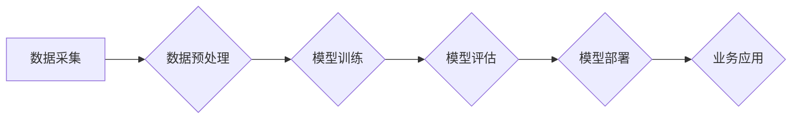

> 大模型、深度学习、自然语言处理、计算机视觉、推荐系统、数据挖掘、商业价值

## 1. 背景介绍

近年来，人工智能（AI）技术取得了飞速发展，其中大模型作为AI领域的重要突破口，展现出强大的学习和推理能力，在自然语言处理、计算机视觉、语音识别等领域取得了令人瞩目的成就。大模型是指参数规模庞大、训练数据海量的人工智能模型，其强大的能力源于海量数据的训练和复杂的模型架构。

大模型的出现，标志着人工智能进入了一个新的时代，它不仅推动了人工智能技术的进步，也为各行各业带来了巨大的商业价值。从智能客服、自动翻译到个性化推荐、药物研发，大模型正在改变着我们的生活和工作方式。

## 2. 核心概念与联系

大模型的核心概念包括：

* **深度学习:** 大模型的训练基于深度学习算法，通过多层神经网络学习数据中的复杂模式和关系。
* **Transformer:** Transformer是一种新型的神经网络架构，其自注意力机制能够有效捕捉长距离依赖关系，成为大模型训练的基石。
* **预训练:** 大模型通常采用预训练的方式进行训练，先在海量文本或图像数据上进行预训练，然后在特定任务上进行微调，提高模型的性能。
* **参数规模:** 大模型的参数规模通常在数十亿甚至数千亿级别，庞大的参数量使得模型能够学习更复杂的知识和模式。

**大模型架构流程图:**



## 3. 核心算法原理 & 具体操作步骤

### 3.1  算法原理概述

大模型的训练主要基于深度学习算法，其中Transformer架构是目前主流的模型架构。Transformer通过自注意力机制能够有效捕捉文本中的长距离依赖关系，提高模型的理解能力。

### 3.2  算法步骤详解

1. **数据预处理:** 将原始数据进行清洗、格式化和编码，使其能够被模型理解。
2. **模型构建:** 根据任务需求选择合适的模型架构，例如BERT、GPT-3等。
3. **模型训练:** 使用训练数据训练模型，通过反向传播算法不断调整模型参数，使其能够准确预测目标输出。
4. **模型评估:** 使用测试数据评估模型的性能，例如准确率、召回率等指标。
5. **模型部署:** 将训练好的模型部署到生产环境中，用于实际应用。

### 3.3  算法优缺点

**优点:**

* 强大的学习能力：大模型能够学习海量数据中的复杂模式和关系，从而实现更精准的预测和理解。
* 泛化能力强：预训练的模型能够在不同任务上进行微调，具有较强的泛化能力。
* 持续发展：大模型技术不断发展，模型规模和性能不断提升。

**缺点:**

* 计算资源需求高：训练大模型需要大量的计算资源和时间。
* 数据依赖性强：大模型的性能取决于训练数据的质量和数量。
* 可解释性差：大模型的决策过程较为复杂，难以解释其背后的逻辑。

### 3.4  算法应用领域

大模型在各个领域都有广泛的应用，例如：

* **自然语言处理:** 文本分类、情感分析、机器翻译、对话系统等。
* **计算机视觉:** 图像识别、物体检测、图像生成等。
* **语音识别:** 语音转文本、语音合成等。
* **推荐系统:** 商品推荐、内容推荐等。
* **药物研发:** 药物发现、药物设计等。

## 4. 数学模型和公式 & 详细讲解 & 举例说明

### 4.1  数学模型构建

大模型的训练基于深度学习算法，其核心是神经网络模型。神经网络模型由多个层组成，每层包含多个神经元。神经元之间通过权重连接，传递信息。

**神经网络模型数学表示:**

$$
y = f(W_L \cdot a_{L-1} + b_L)
$$

其中：

* $y$：输出值
* $W_L$：第L层的权重矩阵
* $a_{L-1}$：第L-1层的激活值
* $b_L$：第L层的偏置项
* $f$：激活函数

### 4.2  公式推导过程

深度学习算法的核心是反向传播算法，其目的是通过调整模型参数，使得模型的输出与真实值之间的误差最小化。

反向传播算法的推导过程较为复杂，涉及到微积分和线性代数的知识。

### 4.3  案例分析与讲解

**举例说明：**

假设我们训练一个简单的线性回归模型，其目标是预测房价。

模型输入特征包括房屋面积、房间数量等，模型输出房价。

通过训练数据，我们可以使用反向传播算法调整模型参数，使得模型能够准确预测房价。

## 5. 项目实践：代码实例和详细解释说明

### 5.1  开发环境搭建

大模型的开发环境通常需要强大的计算资源，例如GPU。

可以使用云平台提供的GPU实例进行开发。

### 5.2  源代码详细实现

```python
# 导入必要的库
import tensorflow as tf

# 定义模型架构
model = tf.keras.Sequential([
    tf.keras.layers.Dense(64, activation='relu', input_shape=(10,)),
    tf.keras.layers.Dense(32, activation='relu'),
    tf.keras.layers.Dense(1)
])

# 编译模型
model.compile(optimizer='adam', loss='mse')

# 训练模型
model.fit(x_train, y_train, epochs=10)

# 评估模型
loss = model.evaluate(x_test, y_test)
```

### 5.3  代码解读与分析

* 首先，我们导入必要的库，例如TensorFlow。
* 然后，我们定义模型架构，使用多层神经网络。
* 接着，我们编译模型，选择优化器和损失函数。
* 接下来，我们训练模型，使用训练数据进行训练。
* 最后，我们评估模型，使用测试数据计算模型的损失值。

### 5.4  运行结果展示

训练完成后，我们可以使用测试数据预测房价，并与真实房价进行比较。

## 6. 实际应用场景

### 6.1  智能客服

大模型可以用于构建智能客服系统，能够理解用户的自然语言问题，并提供准确的回复。

### 6.2  自动翻译

大模型可以用于机器翻译，能够将文本从一种语言翻译成另一种语言。

### 6.3  个性化推荐

大模型可以用于个性化推荐，根据用户的兴趣和行为，推荐相关的商品或内容。

### 6.4  未来应用展望

大模型的应用场景还在不断扩展，未来将应用于更多领域，例如：

* **医疗诊断:** 大模型可以辅助医生进行疾病诊断，提高诊断准确率。
* **教育教学:** 大模型可以个性化教学，根据学生的学习进度和能力提供定制化的学习内容。
* **科学研究:** 大模型可以帮助科学家分析海量数据，发现新的科学规律。

## 7. 工具和资源推荐

### 7.1  学习资源推荐

* **书籍:**
    * 《深度学习》
    * 《自然语言处理》
* **在线课程:**
    * Coursera
    * edX
* **博客和论坛:**
    * TensorFlow Blog
    * PyTorch Forum

### 7.2  开发工具推荐

* **TensorFlow:** 开源深度学习框架
* **PyTorch:** 开源深度学习框架
* **Hugging Face:** 大模型库和工具平台

### 7.3  相关论文推荐

* **BERT: Pre-training of Deep Bidirectional Transformers for Language Understanding**
* **GPT-3: Language Models are Few-Shot Learners**
* **Transformer: Attention Is All You Need**

## 8. 总结：未来发展趋势与挑战

### 8.1  研究成果总结

大模型技术取得了显著的进展，在各个领域都展现出强大的应用潜力。

### 8.2  未来发展趋势

* **模型规模继续扩大:** 模型参数规模将继续扩大，从而提升模型的性能。
* **多模态学习:** 大模型将融合文本、图像、音频等多模态数据，实现更全面的理解和交互。
* **可解释性增强:** 研究者将致力于提高大模型的可解释性，使其决策过程更加透明。

### 8.3  面临的挑战

* **计算资源需求:** 训练大模型需要大量的计算资源，这对于资源有限的机构和个人来说是一个挑战。
* **数据安全和隐私:** 大模型的训练需要海量数据，如何保证数据安全和隐私是一个重要问题。
* **伦理问题:** 大模型的应用可能带来一些伦理问题，例如算法偏见、信息操纵等，需要引起重视和探讨。

### 8.4  研究展望

未来，大模型技术将继续发展，为人类社会带来更多福祉。

我们需要加强对大模型技术的研究和应用，并积极应对其带来的挑战，确保大模型技术能够安全、有效地服务于人类。

## 9. 附录：常见问题与解答

**常见问题:**

* **什么是大模型？**

大模型是指参数规模庞大、训练数据海量的人工智能模型。

* **大模型的训练需要哪些资源？**

大模型的训练需要强大的计算资源，例如GPU，以及海量数据。

* **大模型有哪些应用场景？**

大模型在各个领域都有广泛的应用，例如自然语言处理、计算机视觉、推荐系统等。

**解答:**

* **大模型的训练需要哪些资源？**

大模型的训练需要强大的计算资源，例如GPU，以及海量数据。

* **大模型有哪些应用场景？**

大模型在各个领域都有广泛的应用，例如自然语言处理、计算机视觉、推荐系统等。


作者：禅与计算机程序设计艺术 / Zen and the Art of Computer Programming 
<end_of_turn>