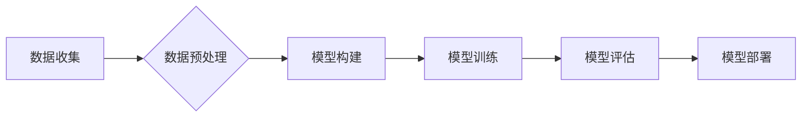

> 大模型、人工智能、深度学习、自然语言处理、计算机视觉、商业应用、未来趋势

## 1. 背景介绍

近年来，人工智能（AI）技术取得了飞速发展，其中大模型作为AI领域的重要突破口，正在深刻地改变着我们生活的方方面面。大模型是指参数规模庞大、训练数据海量的人工智能模型，其强大的学习能力和泛化能力使其能够在自然语言处理、计算机视觉、语音识别等多个领域取得突破性进展。

传统的机器学习模型通常需要针对特定任务进行训练，而大模型则能够通过预训练的方式学习到更广泛的知识和模式，从而在不同任务上表现出更强的能力。例如，GPT-3 这样的语言模型能够生成逼真的文本、翻译语言、编写代码，甚至创作诗歌和剧本；DALL-E 这样的图像生成模型能够根据文本描述生成逼真的图像，甚至能够进行图像编辑和合成。

大模型的出现，标志着人工智能技术迈入了新的时代，其强大的能力和广泛的应用前景，为商业领域带来了前所未有的机遇。

## 2. 核心概念与联系

大模型的核心概念在于利用海量数据和强大的计算能力，训练出参数规模庞大的模型，从而实现更精准、更智能的决策和服务。

**大模型的架构通常包括以下几个关键部分：**

* **输入层:**接收原始数据，例如文本、图像、音频等。
* **隐藏层:**通过多层神经网络进行特征提取和表示学习，将原始数据转化为抽象的特征向量。
* **输出层:**根据训练数据和隐藏层的输出，生成最终的预测结果，例如文本、图像、分类标签等。

**大模型的训练过程通常包括以下几个步骤：**

1. **数据收集和预处理:**收集海量数据并进行清洗、格式化等预处理工作。
2. **模型构建:**根据任务需求选择合适的模型架构，并设置模型参数。
3. **模型训练:**利用训练数据和优化算法，训练模型参数，使其能够准确地预测目标输出。
4. **模型评估:**使用测试数据评估模型的性能，并根据评估结果进行模型调优。
5. **模型部署:**将训练好的模型部署到实际应用场景中，提供服务或进行决策。

**大模型的训练流程图:**



## 3. 核心算法原理 & 具体操作步骤

### 3.1  算法原理概述

大模型的训练主要基于深度学习算法，其中最常用的算法是**Transformer**。Transformer 是一种基于注意力机制的神经网络架构，能够有效地捕捉文本序列中的长距离依赖关系，从而实现更精准的文本理解和生成。

**Transformer 的核心思想是通过注意力机制来学习文本序列中不同词语之间的关系。** 注意力机制可以理解为一种“关注”机制，模型会根据输入序列中的每个词语，计算其与其他词语之间的相关性，并根据相关性权重来分配注意力，从而更好地理解文本的语义。

### 3.2  算法步骤详解

**Transformer 的训练过程可以概括为以下几个步骤：**

1. **词嵌入:** 将每个词语映射到一个低维的向量空间中，每个词语的向量表示其语义信息。
2. **多头注意力:** 对输入序列中的每个词语，计算其与其他词语之间的注意力权重，并根据权重进行加权求和，得到每个词语的上下文表示。
3. **前馈神经网络:** 对每个词语的上下文表示进行进一步的处理，提取更深层次的语义特征。
4. **位置编码:** 将词语在序列中的位置信息编码到词语向量中，因为 Transformer 模型没有循环结构，无法直接捕捉词语的顺序信息。
5. **输出层:** 根据训练数据和隐藏层的输出，生成最终的预测结果，例如文本、图像、分类标签等。

### 3.3  算法优缺点

**Transformer 算法的优点:**

* **能够有效地捕捉长距离依赖关系:** 注意力机制能够捕捉文本序列中不同词语之间的长距离依赖关系，从而实现更精准的文本理解和生成。
* **并行训练效率高:** Transformer 模型的架构使得其能够并行训练，训练效率更高。
* **泛化能力强:** 预训练的 Transformer 模型能够在不同任务上表现出较强的泛化能力。

**Transformer 算法的缺点:**

* **参数量大:** Transformer 模型的参数量较大，需要大量的计算资源进行训练。
* **训练时间长:** 训练 Transformer 模型需要较长的训练时间。
* **数据需求高:** Transformer 模型需要大量的训练数据才能达到最佳性能。

### 3.4  算法应用领域

Transformer 算法在自然语言处理领域有着广泛的应用，例如：

* **机器翻译:** 将一种语言翻译成另一种语言。
* **文本摘要:** 将长篇文本压缩成短篇摘要。
* **问答系统:** 回答用户提出的问题。
* **对话系统:** 与用户进行自然语言对话。
* **文本生成:** 生成各种类型的文本，例如诗歌、剧本、新闻报道等。

## 4. 数学模型和公式 & 详细讲解 & 举例说明

### 4.1  数学模型构建

Transformer 模型的核心是**注意力机制**，其数学模型可以表示为以下公式：

$$
Attention(Q, K, V) = softmax(\frac{QK^T}{\sqrt{d_k}})V
$$

其中：

* $Q$：查询矩阵，表示当前词语的语义信息。
* $K$：键矩阵，表示所有词语的语义信息。
* $V$：值矩阵，表示所有词语的上下文信息。
* $d_k$：键向量的维度。
* $softmax$：softmax 函数，将注意力权重归一化到[0, 1]之间。

### 4.2  公式推导过程

注意力机制的公式推导过程可以分为以下几个步骤：

1. 计算查询矩阵 $Q$ 与键矩阵 $K$ 的点积，得到一个得分矩阵。
2. 对得分矩阵进行归一化，得到注意力权重矩阵。
3. 将注意力权重矩阵与值矩阵 $V$ 进行加权求和，得到每个词语的上下文表示。

### 4.3  案例分析与讲解

例如，在机器翻译任务中，Transformer 模型会将源语言的文本序列作为查询矩阵 $Q$，目标语言的词典作为键矩阵 $K$，目标语言的词嵌入作为值矩阵 $V$。通过注意力机制，模型可以学习到源语言和目标语言之间的对应关系，从而实现文本翻译。

## 5. 项目实践：代码实例和详细解释说明

### 5.1  开发环境搭建

为了实现大模型的开发和训练，需要搭建相应的开发环境。常用的开发环境包括：

* **操作系统:** Linux 或 macOS
* **编程语言:** Python
* **深度学习框架:** TensorFlow 或 PyTorch
* **硬件环境:** GPU 

### 5.2  源代码详细实现

由于大模型的代码实现较为复杂，这里只提供一个简单的 Transformer 模型的代码示例：

```python
import torch
import torch.nn as nn

class Transformer(nn.Module):
    def __init__(self, vocab_size, embedding_dim, num_heads, num_layers):
        super(Transformer, self).__init__()
        self.embedding = nn.Embedding(vocab_size, embedding_dim)
        self.transformer_layers = nn.ModuleList([
            nn.TransformerEncoderLayer(embedding_dim, num_heads)
            for _ in range(num_layers)
        ])
        self.linear = nn.Linear(embedding_dim, vocab_size)

    def forward(self, x):
        x = self.embedding(x)
        for layer in self.transformer_layers:
            x = layer(x)
        x = self.linear(x)
        return x
```

### 5.3  代码解读与分析

该代码示例定义了一个简单的 Transformer 模型，其主要结构包括：

* **嵌入层:** 将词语映射到低维向量空间。
* **Transformer 层:** 多层 Transformer Encoder 层，用于捕捉文本序列中的长距离依赖关系。
* **线性层:** 将 Transformer 层的输出映射到目标输出空间。

### 5.4  运行结果展示

为了展示 Transformer 模型的运行结果，需要使用训练数据进行训练和评估。训练过程通常需要使用 GPU 进行加速，并根据评估结果进行模型调优。

## 6. 实际应用场景

大模型在商业领域有着广泛的应用场景，例如：

### 6.1  客户服务

大模型可以用于构建智能客服系统，自动回答客户常见问题，提高客户服务效率。

### 6.2  营销推广

大模型可以用于生成个性化的营销文案，精准地触达目标客户，提高营销效果。

### 6.3  产品推荐

大模型可以分析用户行为数据，推荐个性化的产品，提高用户购买意愿。

### 6.4  未来应用展望

随着大模型技术的不断发展，其应用场景将会更加广泛，例如：

* **自动代码生成:** 大模型可以根据自然语言描述自动生成代码，提高开发效率。
* **智能写作辅助:** 大模型可以帮助用户进行写作，提供语法检查、风格建议等功能。
* **个性化教育:** 大模型可以根据学生的学习情况提供个性化的学习内容和辅导。

## 7. 工具和资源推荐

### 7.1  学习资源推荐

* **书籍:**
    * 《深度学习》
    * 《自然语言处理》
    * 《Transformer 详解》
* **在线课程:**
    * Coursera: 深度学习
    * Udacity: 自然语言处理
    * fast.ai: 深度学习

### 7.2  开发工具推荐

* **深度学习框架:** TensorFlow, PyTorch
* **编程语言:** Python
* **云计算平台:** AWS, Azure, GCP

### 7.3  相关论文推荐

* 《Attention Is All You Need》
* 《BERT: Pre-training of Deep Bidirectional Transformers for Language Understanding》
* 《GPT-3: Language Models are Few-Shot Learners》

## 8. 总结：未来发展趋势与挑战

### 8.1  研究成果总结

大模型技术取得了显著的进展，在自然语言处理、计算机视觉等领域取得了突破性成果。

### 8.2  未来发展趋势

未来大模型的发展趋势包括：

* **模型规模更大:** 参数规模将继续扩大，模型能力将进一步提升。
* **训练效率更高:** 训练算法和硬件技术将不断改进，降低训练成本和时间。
* **应用场景更广泛:** 大模型将应用于更多领域，例如医疗、金融、教育等。

### 8.3  面临的挑战

大模型技术也面临着一些挑战，例如：

* **数据安全和隐私:** 大模型的训练需要海量数据，如何保证数据安全和隐私是一个重要问题。
* **模型可解释性:** 大模型的决策过程较为复杂，如何提高模型的可解释性是一个重要的研究方向。
* **伦理问题:** 大模型的应用可能会带来一些伦理问题，例如算法偏见、信息操纵等，需要引起重视。

### 8.4  研究展望

未来，大模型技术将继续发展，并对社会产生深远的影响。我们需要加强对大模型技术的研究和应用，并积极应对其带来的挑战，确保大模型技术能够造福人类。

## 9. 附录：常见问题与解答

### 9.1  常见问题

* **什么是大模型？**
* **大模型有哪些应用场景？**
* **如何训练大模型？**
* **大模型有哪些挑战？**

### 9.2  解答

* **什么是大模型？** 大模型是指参数规模庞大、训练数据海量的人工智能模型，其强大的学习能力和泛化能力使其能够在自然语言处理、计算机视觉等多个领域取得突破性进展。
* **大模型有哪些应用场景？** 大模型在商业领域有着广泛的应用场景