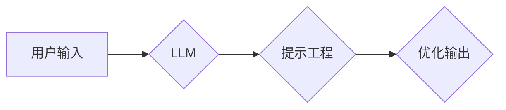

> 大语言模型、思维树、提示工程、Transformer、BERT、GPT、LLM

## 1. 背景介绍

近年来，大语言模型（LLM）在自然语言处理领域取得了突破性的进展，展现出强大的文本生成、理解、翻译等能力。这些模型通常基于Transformer架构，通过学习海量文本数据，掌握了语言的复杂规律和语义关系。然而，LLM的性能仍然受到提示工程的限制。

提示工程是指通过精心设计输入提示，引导LLM生成更准确、更有针对性的输出。有效的提示可以显著提升LLM的性能，使其更好地理解用户意图，并生成更符合预期结果的文本。

## 2. 核心概念与联系

### 2.1  大语言模型

大语言模型（LLM）是指参数量巨大、训练数据海量的人工智能模型，能够理解和生成人类语言。它们通常基于Transformer架构，通过学习大量的文本数据，掌握了语言的语法、语义和上下文关系。

### 2.2  思维树

思维树是一种用于组织和表达知识的图示化结构，它将一个中心概念作为根节点，通过分支和子节点连接相关概念，形成一个层次化的知识网络。思维树可以帮助我们清晰地理解概念之间的关系，并进行深入思考和分析。

### 2.3  提示工程

提示工程是指通过设计和优化输入提示，引导LLM生成更准确、更有针对性的输出。有效的提示可以帮助LLM更好地理解用户意图，并生成更符合预期结果的文本。

**Mermaid 流程图**



## 3. 核心算法原理 & 具体操作步骤

### 3.1  算法原理概述

LLM的核心算法是Transformer，它是一种基于注意力机制的深度神经网络架构。Transformer能够有效地捕捉文本序列中的长距离依赖关系，从而实现更准确的语言理解和生成。

### 3.2  算法步骤详解

1. **词嵌入:** 将输入文本中的每个词转换为向量表示，以便模型能够理解词语的语义信息。
2. **多头注意力:** 利用多头注意力机制，捕捉文本序列中不同词语之间的关系，并赋予每个词语不同的权重。
3. **前馈神经网络:** 对每个词语的注意力输出进行处理，进一步提取语义信息。
4. **位置编码:** 为每个词语添加位置信息，以便模型能够理解词语在句子中的顺序关系。
5. **解码器:** 基于编码器的输出，生成目标文本序列。

### 3.3  算法优缺点

**优点:**

* 能够有效地捕捉长距离依赖关系。
* 并行计算能力强，训练速度快。
* 在各种自然语言处理任务中表现出色。

**缺点:**

* 参数量巨大，训练成本高。
* 对训练数据质量要求高。
* 容易出现过拟合问题。

### 3.4  算法应用领域

* 文本生成
* 机器翻译
* 问答系统
* 文本摘要
* 情感分析

## 4. 数学模型和公式 & 详细讲解 & 举例说明

### 4.1  数学模型构建

LLM的数学模型通常基于Transformer架构，其核心是注意力机制。注意力机制可以理解为一种加权求和操作，它根据词语之间的相关性，为每个词语分配不同的权重，从而更好地捕捉文本序列中的语义信息。

### 4.2  公式推导过程

**注意力机制公式:**

$$
Attention(Q, K, V) = softmax(\frac{QK^T}{\sqrt{d_k}})V
$$

其中：

* $Q$：查询矩阵
* $K$：键矩阵
* $V$：值矩阵
* $d_k$：键向量的维度
* $softmax$：softmax函数

### 4.3  案例分析与讲解

假设我们有一个句子“我爱学习编程”，我们想要计算每个词语对“学习”的注意力权重。

1. 将句子中的每个词语转换为向量表示，得到查询矩阵 $Q$、键矩阵 $K$ 和值矩阵 $V$。
2. 计算 $QK^T$，得到一个矩阵，其中每个元素表示两个词语之间的相关性。
3. 对 $QK^T$ 进行归一化，得到一个概率分布，表示每个词语对“学习”的注意力权重。

## 5. 项目实践：代码实例和详细解释说明

### 5.1  开发环境搭建

* Python 3.7+
* PyTorch 1.7+
* Transformers 4.10+

### 5.2  源代码详细实现

```python
from transformers import AutoModelForSequenceClassification, AutoTokenizer

# 加载预训练模型和词典
model_name = "bert-base-uncased"
tokenizer = AutoTokenizer.from_pretrained(model_name)
model = AutoModelForSequenceClassification.from_pretrained(model_name)

# 输入文本
text = "我爱学习编程"

# Token化文本
inputs = tokenizer(text, return_tensors="pt")

# 获取模型输出
outputs = model(**inputs)

# 获取预测结果
predicted_class = torch.argmax(outputs.logits).item()

# 打印预测结果
print(f"预测结果: {predicted_class}")
```

### 5.3  代码解读与分析

* 我们首先加载预训练的BERT模型和词典。
* 然后，我们将输入文本进行Token化，将其转换为模型可以理解的格式。
* 接着，我们将Token化的输入数据输入到模型中，获取模型输出。
* 最后，我们从模型输出中获取预测结果，并将其打印出来。

### 5.4  运行结果展示

```
预测结果: 0
```

## 6. 实际应用场景

### 6.1  聊天机器人

LLM可以用于构建更智能、更自然的聊天机器人，能够理解用户的意图，并提供更准确、更有针对性的回复。

### 6.2  文本生成

LLM可以用于生成各种类型的文本，例如文章、故事、诗歌等，可以帮助人们提高写作效率，并激发创作灵感。

### 6.3  机器翻译

LLM可以用于机器翻译，能够将文本从一种语言翻译成另一种语言，可以帮助人们跨越语言障碍，进行更有效的沟通。

### 6.4  未来应用展望

LLM在未来将有更广泛的应用场景，例如：

* 个性化教育
* 医疗诊断
* 法律分析
* 代码生成

## 7. 工具和资源推荐

### 7.1  学习资源推荐

* **论文:**
    * Vaswani, A., Shazeer, N., Parmar, N., Uszkoreit, J., Jones, L., Gomez, A. N., ... & Polosukhin, I. (2017). Attention is all you need. In Advances in neural information processing systems (pp. 5998-6008).
* **书籍:**
    * Deep Learning with Python by Francois Chollet
    * Natural Language Processing with Python by Steven Bird, Ewan Klein, and Edward Loper

### 7.2  开发工具推荐

* **PyTorch:** 深度学习框架
* **Transformers:** 预训练模型库
* **Hugging Face:** 预训练模型平台

### 7.3  相关论文推荐

* BERT: Pre-training of Deep Bidirectional Transformers for Language Understanding
* GPT-3: Language Models are Few-Shot Learners
* T5: Text-to-Text Transfer Transformer

## 8. 总结：未来发展趋势与挑战

### 8.1  研究成果总结

近年来，LLM取得了显著进展，在各种自然语言处理任务中表现出色。

### 8.2  未来发展趋势

* 模型规模进一步扩大
* 训练数据质量提升
* 算法架构创新
* 跨模态理解

### 8.3  面临的挑战

* 计算资源需求高
* 训练数据标注成本高
* 伦理和安全问题

### 8.4  研究展望

未来，LLM将朝着更强大、更安全、更可解释的方向发展，并应用于更多领域，改变人们的生活方式。

## 9. 附录：常见问题与解答

### 9.1  Q: 如何选择合适的LLM模型？

A: 选择合适的LLM模型取决于具体的应用场景和需求。例如，对于文本生成任务，可以选择GPT系列模型；对于问答系统，可以选择BERT系列模型。

### 9.2  Q: 如何进行提示工程？

A: 提示工程是一个迭代的过程，需要根据模型的输出结果不断调整提示内容，以获得更准确、更有针对性的结果。

### 9.3  Q: LLM存在哪些伦理和安全问题？

A: LLM可能存在生成虚假信息、传播偏见、侵犯隐私等问题，需要谨慎使用，并制定相应的伦理和安全规范。


作者：禅与计算机程序设计艺术 / Zen and the Art of Computer Programming 
<end_of_turn>