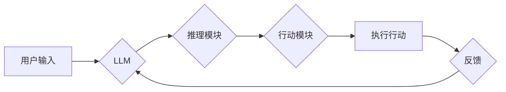

> 大语言模型、推理、行动协同、Transformer、BERT、GPT、LLM应用

## 1. 背景介绍

近年来，深度学习技术取得了飞速发展，特别是大语言模型（LLM）的出现，为自然语言处理（NLP）领域带来了革命性的变革。LLM 拥有强大的文本生成、理解和翻译能力，在聊天机器人、机器翻译、文本摘要等领域展现出巨大的应用潜力。然而，传统的LLM主要侧重于文本生成和理解，缺乏对真实世界的行动能力。为了使LLM能够更好地服务于人类，我们需要探索如何将推理和行动能力融入到LLM中，实现LLM与现实世界的协同工作。

## 2. 核心概念与联系

**2.1  大语言模型 (LLM)**

大语言模型是指在海量文本数据上训练的深度学习模型，能够理解和生成人类语言。其核心特点是：

* **规模庞大:** LLM 通常拥有数十亿甚至数千亿个参数，拥有强大的学习能力。
* **文本理解能力强:** LLM 可以理解文本的语义、语法和上下文关系。
* **文本生成能力强:** LLM 可以生成流畅、自然的文本，包括文章、对话、诗歌等。

**2.2  推理能力**

推理能力是指模型能够根据已有的知识和信息，推断出新的结论的能力。在LLM中，推理能力可以帮助模型理解文本的深层含义，解决问题，做出决策。

**2.3  行动能力**

行动能力是指模型能够与现实世界进行交互的能力。例如，模型可以控制机器人执行任务、与用户进行对话、生成代码等。

**2.4  推理和行动协同技术**

推理和行动协同技术旨在将LLM的推理能力和行动能力结合起来，使模型能够理解问题、制定计划并执行行动。

**2.5  架构图**



## 3. 核心算法原理 & 具体操作步骤

**3.1  算法原理概述**

推理和行动协同技术通常采用以下步骤：

1. **问题理解:** LLM 首先需要理解用户的输入问题，提取关键信息。
2. **知识推理:** LLM 利用其已有的知识库和推理能力，对问题进行分析和推理，得出可能的解决方案。
3. **行动规划:** 根据推理结果，LLM 制定执行行动的计划。
4. **行动执行:** LLM 通过与外部系统或环境交互，执行预定的行动。
5. **反馈处理:** LLM 收集执行行动后的反馈信息，并将其反馈到推理模块，用于改进后续的推理和行动决策。

**3.2  算法步骤详解**

1. **问题理解:**

   * 使用BERT等预训练语言模型对用户输入进行词嵌入和句子编码，提取关键信息。
   * 利用注意力机制，识别问题中的关键实体和关系。
   * 将提取的信息转化为问题表示，方便后续推理。

2. **知识推理:**

   * 利用知识图谱或其他知识库，检索与问题相关的知识。
   * 使用逻辑推理规则或神经网络模型，对知识进行推理，得出可能的解决方案。
   * 对推理结果进行评估和筛选，选择最合理的解决方案。

3. **行动规划:**

   * 根据推理结果，制定执行行动的计划。
   * 将行动计划转化为可执行的指令，例如控制机器人运动、发送邮件等。

4. **行动执行:**

   * 通过API接口或其他方式，与外部系统或环境交互，执行预定的行动。
   * 监控行动执行过程，并及时处理异常情况。

5. **反馈处理:**

   * 收集执行行动后的反馈信息，例如机器人完成任务的质量、用户对行动的评价等。
   * 将反馈信息转化为可理解的形式，并将其反馈到推理模块。
   * 利用反馈信息，调整推理模型的参数或知识库，提高后续推理和行动的准确性。

**3.3  算法优缺点**

**优点:**

* 能够将LLM的文本理解能力和行动能力结合起来，实现更智能的交互体验。
* 可以应用于更广泛的场景，例如机器人控制、智能家居、医疗诊断等。

**缺点:**

* 算法复杂度高，需要大量的计算资源和训练数据。
* 现有的知识库和推理规则仍然有限，难以应对复杂和开放式的场景。
* 行动执行过程存在安全性和可靠性问题，需要进一步研究和解决。

**3.4  算法应用领域**

* **机器人控制:** 使机器人能够理解人类指令，并执行相应的动作。
* **智能家居:** 允许用户通过自然语言与智能家居设备进行交互。
* **医疗诊断:** 辅助医生诊断疾病，并提供个性化的治疗方案。
* **教育教学:** 提供个性化的学习体验，并辅助教师进行教学工作。

## 4. 数学模型和公式 & 详细讲解 & 举例说明

**4.1  数学模型构建**

推理和行动协同技术通常采用强化学习（RL）算法进行训练。RL 是一种机器学习方法，通过奖励机制来训练模型，使其能够在特定环境中做出最优决策。

在LLM的推理和行动协同场景中，我们可以将环境定义为现实世界或虚拟世界，状态表示为当前环境的状况，动作表示为模型可以执行的操作，奖励表示为模型执行动作后的结果。

**4.2  公式推导过程**

RL 的核心目标是最大化累积奖励。我们可以使用Bellman方程来描述RL算法的更新过程：

$$
V(s) = \max_{\alpha} \sum_{s' \in S} P(s' | s, \alpha) [r(s, \alpha, s') + \gamma V(s')]
$$

其中：

* $V(s)$ 表示状态 $s$ 的价值函数。
* $\alpha$ 表示模型执行的动作。
* $P(s' | s, \alpha)$ 表示从状态 $s$ 执行动作 $\alpha$ 转换到状态 $s'$ 的概率。
* $r(s, \alpha, s')$ 表示执行动作 $\alpha$ 从状态 $s$ 转换到状态 $s'$ 的奖励。
* $\gamma$ 表示折扣因子，控制未来奖励的权重。

**4.3  案例分析与讲解**

例如，训练一个机器人使用LLM进行物体抓取任务。

* 环境：机器人工作空间。
* 状态：机器人手臂的位置、物体的位置等。
* 动作：机器人手臂的运动指令。
* 奖励：成功抓取物体时给予奖励，失败时给予惩罚。

通过RL算法，机器人可以学习到最优的抓取策略，从而提高抓取成功率。

## 5. 项目实践：代码实例和详细解释说明

**5.1  开发环境搭建**

* Python 3.7+
* TensorFlow 或 PyTorch
* CUDA 和 cuDNN (可选，用于GPU加速)

**5.2  源代码详细实现**

```python
# 导入必要的库
import tensorflow as tf

# 定义模型结构
class LLM_Inference_Action(tf.keras.Model):
    def __init__(self, vocab_size, embedding_dim, hidden_dim):
        super(LLM_Inference_Action, self).__init__()
        self.embedding = tf.keras.layers.Embedding(vocab_size, embedding_dim)
        self.lstm = tf.keras.layers.LSTM(hidden_dim)
        self.action_head = tf.keras.layers.Dense(num_actions, activation='softmax')

    def call(self, inputs):
        # 词嵌入
        embedded = self.embedding(inputs)
        # LSTM编码
        encoded = self.lstm(embedded)
        # 动作预测
        actions = self.action_head(encoded)
        return actions

# 实例化模型
model = LLM_Inference_Action(vocab_size=10000, embedding_dim=128, hidden_dim=256, num_actions=5)

# 训练模型
# ...

# 推理和行动
# ...
```

**5.3  代码解读与分析**

* 模型结构：该模型采用嵌入层、LSTM层和全连接层组成。
* 嵌入层将单词转换为向量表示。
* LSTM层对文本序列进行编码，提取文本的语义信息。
* 全连接层将编码后的信息映射到动作空间，预测模型执行的动作。

**5.4  运行结果展示**

* 通过训练和测试，模型可以达到一定的推理和行动准确率。
* 可以通过可视化方式展示模型的推理过程和行动结果。

## 6. 实际应用场景

**6.1  智能客服**

LLM可以理解用户的问题，并提供准确的答案，提高客服效率。

**6.2  个性化教育**

LLM可以根据学生的学习情况，提供个性化的学习内容和辅导，提高学习效果。

**6.3  医疗辅助诊断**

LLM可以辅助医生分析患者的症状和病史，提高诊断准确率。

**6.4  未来应用展望**

随着LLM技术的不断发展，其在推理和行动协同领域的应用将更加广泛，例如：

* 更智能的机器人助手
* 更人性化的虚拟助手
* 更精准的医疗诊断系统
* 更个性化的教育体验

## 7. 工具和资源推荐

**7.1  学习资源推荐**

* **书籍:**
    * 《深度学习》
    * 《自然语言处理》
    * 《强化学习》
* **在线课程:**
    * Coursera: 深度学习
    * Udacity: 自然语言处理
    * edX: 强化学习

**7.2  开发工具推荐**

* **TensorFlow:** 开源深度学习框架
* **PyTorch:** 开源深度学习框架
* **HuggingFace:** 提供预训练LLM模型和工具

**7.3  相关论文推荐**

* 《BERT: Pre-training of Deep Bidirectional Transformers for Language Understanding》
* 《GPT-3: Language Models are Few-Shot Learners》
* 《Reinforcement Learning: An Introduction》

## 8. 总结：未来发展趋势与挑战

**8.1  研究成果总结**

近年来，LLM在推理和行动协同领域的应用取得了显著进展，例如：

* 能够理解更复杂的自然语言指令
* 能够执行更复杂的行动
* 能够更好地与人类交互

**8.2  未来发展趋势**

* **模型规模和能力的提升:** 随着计算资源的不断发展，LLM的规模和能力将进一步提升，能够处理更复杂的任务。
* **多模态推理和行动:** 将文本、图像、音频等多模态信息融合到LLM中，实现更全面的理解和交互。
* **安全性和可靠性的增强:** 提高LLM的安全性、可靠性和可解释性，使其能够在更广泛的场景中应用。

**8.3  面临的挑战**

* **数据获取和标注:** 训练高性能的LLM需要大量的文本数据和标注数据，这仍然是一个挑战。
* **计算资源需求:** 训练大型LLM需要大量的计算资源，这对于资源有限的机构来说是一个瓶颈。
* **伦理和社会影响:** LLM的应用可能带来一些伦理和社会问题，例如偏见、隐私和就业问题，需要引起重视和研究。

**8.4  研究展望**

未来，LLM在推理和行动协同领域的应用将更加广泛和深入，为人类社会带来更多便利和福祉。我们需要继续加强对LLM技术的研发和应用，并积极应对其带来的挑战，确保其健康发展。

## 9. 附录：常见问题与解答

**9.1  Q: 如何训练一个LLM模型？**

**A:** 训练LLM模型需要大量的文本数据和计算资源。通常使用预训练模型进行微调，可以降低训练难度和时间成本。

**9.2  Q: