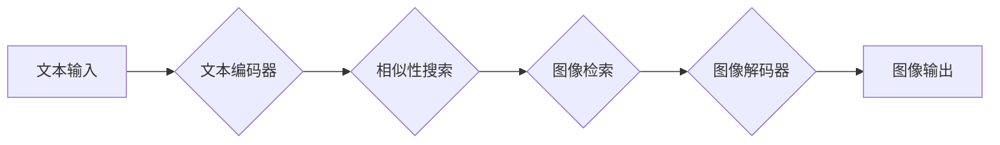

> 大语言模型、相似性搜索、多模态对齐、Transformer、BERT、GPT、视觉理解、自然语言理解

## 1. 背景介绍

近年来，大语言模型（LLM）在自然语言处理（NLP）领域取得了显著进展，例如文本生成、翻译、问答等任务。然而，LLM主要依赖于文本数据进行训练，难以处理多模态信息，例如图像、音频、视频等。多模态对齐是指将不同模态的信息融合，实现跨模态理解和交互，是人工智能领域的重要研究方向。

基于相似性搜索的多模态对齐方法，通过学习不同模态之间的语义相似度，将文本与其他模态信息进行关联。这种方法具有以下优势：

* **灵活性和可扩展性:** 可以处理多种模态数据，并根据需要添加新的模态。
* **高效性和实时性:** 相似性搜索算法通常具有较高的效率，可以实现实时多模态交互。
* **可解释性和透明性:** 相似性搜索的结果可以直观地反映不同模态之间的关系，易于理解和解释。

## 2. 核心概念与联系

**2.1  大语言模型 (LLM)**

大语言模型是一种基于Transformer架构的深度学习模型，通过学习大量的文本数据，掌握语言的语法、语义和上下文关系。常见的LLM包括BERT、GPT、T5等。

**2.2  相似性搜索**

相似性搜索是指在海量数据中找到与给定查询最相似的文档或数据点。常用的相似性搜索算法包括余弦相似度、欧氏距离、Jaccard系数等。

**2.3  多模态对齐**

多模态对齐是指将不同模态的信息融合，实现跨模态理解和交互。常见的多模态对齐方法包括：

* **特征融合:** 将不同模态的特征向量进行融合，例如将文本特征与图像特征进行拼接。
* **跨模态注意力:** 使用注意力机制学习不同模态之间的关系，例如将文本注意力机制应用于图像理解。
* **多模态预训练:** 使用多模态数据进行预训练，学习不同模态之间的语义关联。

**2.4  Mermaid 流程图**



## 3. 核心算法原理 & 具体操作步骤

### 3.1  算法原理概述

基于相似性搜索的多模态对齐方法，主要包括以下步骤：

1. **模态编码:** 将不同模态的信息转换为向量表示，例如使用BERT编码文本，使用CNN或ResNet编码图像。
2. **相似性计算:** 使用余弦相似度、欧氏距离等方法计算不同模态向量之间的相似度。
3. **检索与匹配:** 根据相似度排序，检索与给定查询最相似的模态数据，并进行匹配。
4. **结果融合:** 将检索到的模态数据进行融合，生成最终的输出结果。

### 3.2  算法步骤详解

1. **文本编码:** 将输入文本序列通过预训练的BERT模型进行编码，得到文本的语义向量表示。
2. **图像编码:** 将输入图像通过预训练的CNN模型进行编码，得到图像的特征向量表示。
3. **相似性计算:** 使用余弦相似度计算文本向量和图像向量之间的相似度。
4. **图像检索:** 根据相似度排序，检索与文本向量最相似的图像数据。
5. **结果融合:** 将检索到的图像数据与文本信息进行融合，例如生成描述图像的文本，或者根据图像内容生成相应的文本。

### 3.3  算法优缺点

**优点:**

* 灵活性和可扩展性强，可以处理多种模态数据。
* 效率高，可以实现实时多模态交互。
* 可解释性和透明性高，结果易于理解和解释。

**缺点:**

* 需要大量的训练数据，才能获得良好的性能。
* 难以处理复杂的多模态关系，例如视频理解。

### 3.4  算法应用领域

基于相似性搜索的多模态对齐方法在以下领域有广泛应用：

* **图像搜索:** 根据文本查询检索相关的图像数据。
* **视频理解:** 根据视频内容生成文本描述，或者根据文本查询检索相关的视频数据。
* **跨模态问答:** 根据文本和图像信息回答问题。
* **多模态对话系统:** 实现人机交互，理解和生成文本、图像、语音等多模态信息。

## 4. 数学模型和公式 & 详细讲解 & 举例说明

### 4.1  数学模型构建

假设我们有文本向量 $T$ 和图像向量 $I$，我们需要计算它们之间的相似度。可以使用余弦相似度来衡量两个向量的相似度。

### 4.2  公式推导过程

余弦相似度公式如下：

$$
\text{cosine similarity}(T, I) = \frac{T \cdot I}{||T|| ||I||}
$$

其中：

* $T \cdot I$ 是文本向量 $T$ 和图像向量 $I$ 的点积。
* $||T||$ 和 $||I||$ 分别是文本向量 $T$ 和图像向量 $I$ 的模长。

### 4.3  案例分析与讲解

假设我们有一个文本向量 $T = [0.2, 0.3, 0.5]$ 和一个图像向量 $I = [0.1, 0.4, 0.7]$，那么它们的余弦相似度为：

$$
\text{cosine similarity}(T, I) = \frac{[0.2, 0.3, 0.5] \cdot [0.1, 0.4, 0.7]}{|| [0.2, 0.3, 0.5] || || [0.1, 0.4, 0.7] ||}
$$

$$
= \frac{0.2 \cdot 0.1 + 0.3 \cdot 0.4 + 0.5 \cdot 0.7}{\sqrt{0.2^2 + 0.3^2 + 0.5^2} \sqrt{0.1^2 + 0.4^2 + 0.7^2}}
$$

$$
= \frac{0.53}{\sqrt{0.38} \sqrt{0.66}}
$$

$$
\approx 0.85
$$

因此，文本向量 $T$ 和图像向量 $I$ 的余弦相似度为 0.85，说明它们之间具有较高的相似度。

## 5. 项目实践：代码实例和详细解释说明

### 5.1  开发环境搭建

* Python 3.7+
* PyTorch 1.7+
* Transformers 4.0+
* OpenCV 4.5+

### 5.2  源代码详细实现

```python
import torch
from transformers import AutoTokenizer, AutoModel
from torchvision import transforms
from PIL import Image
import numpy as np

# 加载预训练模型和词典
tokenizer = AutoTokenizer.from_pretrained("bert-base-uncased")
model = AutoModel.from_pretrained("bert-base-uncased")

# 定义图像预处理函数
def preprocess_image(image_path):
    image = Image.open(image_path)
    transform = transforms.Compose([
        transforms.Resize((224, 224)),
        transforms.ToTensor(),
        transforms.Normalize(mean=[0.485, 0.456, 0.406], std=[0.229, 0.224, 0.225])
    ])
    image = transform(image).unsqueeze(0)
    return image

# 定义文本编码函数
def encode_text(text):
    inputs = tokenizer(text, return_tensors="pt")
    outputs = model(**inputs)
    return outputs.last_hidden_state[:, 0, :]

# 定义相似性计算函数
def calculate_similarity(text_embedding, image_embedding):
    cosine_similarity = torch.nn.functional.cosine_similarity(text_embedding, image_embedding)
    return cosine_similarity.item()

# 示例代码
text = "一只小猫在草地上玩耍"
image_path = "cat.jpg"

# 编码文本和图像
text_embedding = encode_text(text)
image_embedding = preprocess_image(image_path)

# 计算相似性
similarity = calculate_similarity(text_embedding, image_embedding)

# 打印结果
print(f"文本和图像的相似度为: {similarity}")
```

### 5.3  代码解读与分析

* 代码首先加载预训练的BERT模型和词典。
* 定义了图像预处理函数，将图像转换为模型可识别的格式。
* 定义了文本编码函数，将文本转换为文本嵌入向量。
* 定义了相似性计算函数，使用余弦相似度计算文本嵌入向量和图像嵌入向量的相似度。
* 示例代码演示了如何使用这些函数计算文本和图像的相似度。

### 5.4  运行结果展示

运行代码后，会输出文本和图像的相似度值。

## 6. 实际应用场景

### 6.1  图像搜索

基于相似性搜索的多模态对齐方法可以用于图像搜索，例如根据文本查询检索相关的图像数据。

### 6.2  视频理解

可以根据视频内容生成文本描述，或者根据文本查询检索相关的视频数据。

### 6.3  跨模态问答

根据文本和图像信息回答问题。

### 6.4  未来应用展望

* **更复杂的场景理解:** 能够处理更复杂的场景，例如理解视频中的动作和事件。
* **个性化多模态交互:** 根据用户的偏好和需求，提供个性化的多模态交互体验。
* **跨语言多模态理解:** 实现跨语言的多模态理解，打破语言障碍。

## 7. 工具和资源推荐

### 7.1  学习资源推荐

* **书籍:**
    * 《深度学习》
    * 《自然语言处理》
    * 《计算机视觉》
* **在线课程:**
    * Coursera: 深度学习
    * edX: 自然语言处理
    * Udacity: 计算机视觉

### 7.2  开发工具推荐

* **PyTorch:** 深度学习框架
* **TensorFlow:** 深度学习框架
* **OpenCV:** 图像处理库
* **Transformers:** 预训练模型库

### 7.3  相关论文推荐

* **BERT: Pre-training of Deep Bidirectional Transformers for Language Understanding**
* **GPT: Generative Pre-trained Transformer**
* **Attention Is All You Need**

## 8. 总结：未来发展趋势与挑战

### 8.1  研究成果总结

基于相似性搜索的多模态对齐方法取得了显著进展，在图像搜索、视频理解、跨模态问答等领域取得了成功应用。

### 8.2  未来发展趋势

* **更强大的多模态模型:** 开发更强大的多模态模型，能够更好地理解和生成多模态信息。
* **更有效的训练方法:** 研究更有效的训练方法，例如迁移学习和自监督学习，提高模型的效率和性能。
* **更广泛的应用场景:** 将多模态对齐技术应用于更广泛的场景，例如医疗、教育、娱乐等。

### 8.3  面临的挑战

* **数据标注:** 多模态数据的标注成本高，难以获得高质量的标注数据。
* **模态融合:** 如何有效地融合不同模态的信息，仍然是一个挑战。
* **解释性和可解释性:** 多模态模型的决策过程难以解释，缺乏透明度。

### 8.4  研究展望

未来，我们将继续致力于研究基于相似性搜索的多模态对齐方法，开发更强大、