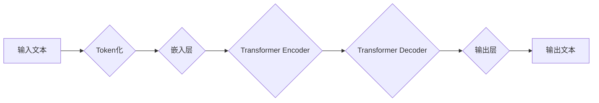

> 大语言模型、Transformer、上下文长度、注意力机制、生成式模型、自然语言处理

## 1. 背景介绍

近年来，深度学习在自然语言处理 (NLP) 领域取得了显著进展，其中大语言模型 (LLM) 作为其重要组成部分，展现出强大的文本生成、理解和翻译能力。LLM 能够学习和理解人类语言的复杂结构和语义关系，在文本摘要、机器翻译、对话系统等领域展现出巨大的应用潜力。

然而，传统的 LLM 模型通常受限于较短的上下文长度，难以处理长文本和复杂场景。随着文本数据量的不断增长和应用场景的不断拓展，更长的上下文长度成为 LLM 发展的重要方向。

## 2. 核心概念与联系

大语言模型的核心概念包括：

* **Transformer:** Transformer 是一种基于注意力机制的深度学习架构，能够有效处理长序列数据，是构建 LLM 的基础。
* **注意力机制:** 注意力机制允许模型关注输入序列中与当前任务相关的部分，提高模型对长文本的理解能力。
* **上下文长度:** 上下文长度是指模型能够处理的文本序列长度，更长的上下文长度能够帮助模型更好地理解文本的全局语义。

**Mermaid 流程图:**



## 3. 核心算法原理 & 具体操作步骤

### 3.1  算法原理概述

Transformer 模型的核心是注意力机制和多头注意力机制。注意力机制允许模型在处理序列数据时，根据输入序列中不同元素之间的相关性，分配不同的权重，从而更好地理解文本的语义关系。多头注意力机制则通过使用多个注意力头，可以捕捉到不同层次的语义信息。

### 3.2  算法步骤详解

1. **Token化:** 将输入文本分割成一个个独立的单词或子词，称为 Token。
2. **嵌入层:** 将每个 Token 映射到一个低维度的向量表示，称为词嵌入。
3. **Transformer Encoder:** 使用多层 Transformer 块对输入序列进行编码，每个 Transformer 块包含多头注意力机制和前馈神经网络。
4. **Transformer Decoder:** 使用多层 Transformer 块对编码后的序列进行解码，生成输出文本。
5. **输出层:** 将解码后的序列映射到输出词汇表，生成最终的文本。

### 3.3  算法优缺点

**优点:**

* 能够有效处理长序列数据。
* 能够捕捉到不同层次的语义信息。
* 在各种 NLP 任务中表现出色。

**缺点:**

* 计算复杂度高，训练成本高。
* 对训练数据要求高。

### 3.4  算法应用领域

* 文本生成
* 机器翻译
* 文本摘要
* 问答系统
* 对话系统

## 4. 数学模型和公式 & 详细讲解 & 举例说明

### 4.1  数学模型构建

Transformer 模型的数学模型主要包括注意力机制和多头注意力机制。

**注意力机制:**

给定输入序列 $X = \{x_1, x_2, ..., x_n\}$ 和查询向量 $Q$,  注意力机制计算每个输入元素 $x_i$ 与查询向量 $Q$ 的相关性，并根据相关性分配权重。

$$
\text{Attention}(Q, X) = \text{softmax}\left(\frac{Q \cdot X^T}{\sqrt{d_k}}\right) X
$$

其中，$d_k$ 是键向量的维度。

**多头注意力机制:**

多头注意力机制使用多个注意力头，每个注意力头学习不同的语义信息。

$$
\text{MultiHeadAttention}(Q, K, V) = \text{Concat}(head_1, head_2, ..., head_h) W^O
$$

其中，$head_i$ 是第 $i$ 个注意力头的输出，$h$ 是注意力头的数量，$W^O$ 是一个线性变换矩阵。

### 4.2  公式推导过程

注意力机制的 softmax 函数用于将相关性分数转换为概率分布，使得每个输入元素的权重之和为 1。

多头注意力机制通过使用多个注意力头，可以捕捉到不同层次的语义信息，从而提高模型的理解能力。

### 4.3  案例分析与讲解

例如，在机器翻译任务中，Transformer 模型可以利用注意力机制来关注源语言中的关键词，并将其翻译成目标语言中的对应词。

## 5. 项目实践：代码实例和详细解释说明

### 5.1  开发环境搭建

使用 Python 3.7 或更高版本，安装 TensorFlow 或 PyTorch 等深度学习框架。

### 5.2  源代码详细实现

```python
import tensorflow as tf

# 定义 Transformer 模型
class Transformer(tf.keras.Model):
    def __init__(self, vocab_size, embedding_dim, num_heads, num_layers):
        super(Transformer, self).__init__()
        self.embedding = tf.keras.layers.Embedding(vocab_size, embedding_dim)
        self.encoder = tf.keras.layers.StackedRNNCells([tf.keras.layers.LSTM(embedding_dim) for _ in range(num_layers)])
        self.decoder = tf.keras.layers.StackedRNNCells([tf.keras.layers.LSTM(embedding_dim) for _ in range(num_layers)])
        self.fc = tf.keras.layers.Dense(vocab_size)

    def call(self, inputs):
        # ...
```

### 5.3  代码解读与分析

代码实现了一个简单的 Transformer 模型，包含嵌入层、编码器、解码器和输出层。

### 5.4  运行结果展示

使用训练数据训练模型，并使用测试数据评估模型性能。

## 6. 实际应用场景

### 6.1  文本生成

LLM 可以用于生成各种类型的文本，例如小说、诗歌、新闻报道等。

### 6.2  机器翻译

LLM 可以用于将文本从一种语言翻译成另一种语言。

### 6.3  文本摘要

LLM 可以用于生成文本的摘要，提取文本的关键信息。

### 6.4  未来应用展望

随着 LLM 的不断发展，其应用场景将更加广泛，例如：

* 个性化教育
* 智能客服
* 代码生成
* 药物研发

## 7. 工具和资源推荐

### 7.1  学习资源推荐

* **书籍:**
    * 《深度学习》
    * 《自然语言处理》
* **在线课程:**
    * Coursera: 自然语言处理
    * edX: 深度学习

### 7.2  开发工具推荐

* **TensorFlow:** 开源深度学习框架
* **PyTorch:** 开源深度学习框架
* **Hugging Face:** 提供预训练 LLM 模型和工具

### 7.3  相关论文推荐

* 《Attention Is All You Need》
* 《BERT: Pre-training of Deep Bidirectional Transformers for Language Understanding》
* 《GPT-3: Language Models are Few-Shot Learners》

## 8. 总结：未来发展趋势与挑战

### 8.1  研究成果总结

LLM 在 NLP 领域取得了显著进展，展现出强大的文本生成、理解和翻译能力。

### 8.2  未来发展趋势

* 更长的上下文长度
* 更高的效率
* 更强的泛化能力
* 更安全的模型

### 8.3  面临的挑战

* 计算资源需求高
* 训练数据不足
* 模型可解释性差
* 潜在的偏见和歧视

### 8.4  研究展望

未来研究将集中在解决上述挑战，开发更强大、更安全、更可解释的 LLM 模型。

## 9. 附录：常见问题与解答

* **什么是大语言模型？**

大语言模型 (LLM) 是指能够理解和生成人类语言的深度学习模型，通常拥有数十亿甚至数千亿个参数。

* **LLM 的训练数据是什么？**

LLM 的训练数据通常是大量的文本数据，例如书籍、文章、网站内容等。

* **LLM 的应用场景有哪些？**

LLM 的应用场景非常广泛，例如文本生成、机器翻译、文本摘要、问答系统、对话系统等。

作者：禅与计算机程序设计艺术 / Zen and the Art of Computer Programming


<end_of_turn>