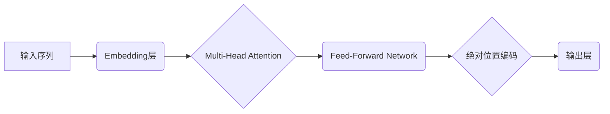

> 大语言模型，绝对位置编码，Transformer，BERT，GPT，自然语言处理，深度学习

## 1. 背景介绍

大语言模型（Large Language Models，LLMs）近年来在自然语言处理（Natural Language Processing，NLP）领域取得了显著的进展，展现出强大的文本生成、翻译、问答和代码生成能力。这些模型的核心在于其强大的表示能力，能够捕捉文本中的语义和结构信息。

Transformer架构是LLMs发展的重要里程碑，其自注意力机制（Self-Attention）能够有效地捕捉长距离依赖关系，显著提升了模型的性能。然而，Transformer架构最初缺乏对序列位置信息的直接编码，这限制了其对文本顺序信息的理解能力。为了解决这个问题，研究者们提出了各种位置编码方案，其中绝对位置编码（Absolute Positional Encoding）是一种常用的方法。

## 2. 核心概念与联系

**2.1 核心概念**

* **Transformer架构:**  一种基于注意力机制的神经网络架构，用于处理序列数据，如文本。
* **自注意力机制:**  允许模型关注输入序列中的不同位置，并学习它们之间的关系。
* **位置编码:**  将序列位置信息编码到模型的输入中，帮助模型理解文本的顺序信息。
* **绝对位置编码:**  一种位置编码方案，将每个位置映射到一个固定的向量，表示该位置的特征。

**2.2  架构关系**



## 3. 核心算法原理 & 具体操作步骤

**3.1 算法原理概述**

绝对位置编码的核心思想是为每个位置分配一个固定的向量，该向量包含该位置的特征信息。这些向量可以是随机初始化的，也可以通过训练学习得到。在模型的输入层，每个词的嵌入向量与对应的绝对位置编码向量相加，形成最终的输入向量。

**3.2 算法步骤详解**

1. **定义位置向量维度:**  根据模型的需求，选择一个合适的向量维度来表示每个位置。
2. **初始化位置向量:**  可以使用随机初始化或预训练好的位置向量。
3. **将位置向量与词嵌入向量相加:**  在模型的输入层，每个词的嵌入向量与对应的绝对位置编码向量相加，形成最终的输入向量。
4. **训练模型:**  使用训练数据训练模型，学习最优的位置编码向量。

**3.3 算法优缺点**

* **优点:**
    * 简单易实现。
    * 可以有效地捕捉位置信息。
    * 不需要额外的训练数据。
* **缺点:**
    * 无法捕捉相对位置信息。
    * 位置向量维度较大，可能增加模型的计算复杂度。

**3.4 算法应用领域**

绝对位置编码广泛应用于各种基于Transformer的LLMs，例如BERT、GPT等。

## 4. 数学模型和公式 & 详细讲解 & 举例说明

**4.1 数学模型构建**

设输入序列长度为 *n*，每个词的嵌入向量维度为 *d*。则每个位置的绝对位置编码向量为一个 *d* 维向量，记为 *PE(i)*，其中 *i* 表示位置索引。

**4.2 公式推导过程**

一个常见的绝对位置编码方法是使用正弦和余弦函数来生成位置向量：

$$
PE(i, j) = sin(i / 10000^{2j / d})
$$

$$
PE(i, j) = cos(i / 10000^{2j / d})
$$

其中 *j* 表示向量维度索引。

**4.3 案例分析与讲解**

假设我们有一个长度为5的输入序列，每个词的嵌入向量维度为128。则每个位置的绝对位置编码向量为一个128维向量。

例如，第一个位置的绝对位置编码向量为：

$$
PE(0, 0) = sin(0 / 10000^{2 * 0 / 128})
$$

$$
PE(0, 1) = cos(0 / 10000^{2 * 1 / 128})
$$

$$
...
$$

$$
PE(0, 127) = sin(0 / 10000^{2 * 127 / 128})
$$

## 5. 项目实践：代码实例和详细解释说明

**5.1 开发环境搭建**

* Python 3.7+
* PyTorch 1.7+
* CUDA 10.2+

**5.2 源代码详细实现**

```python
import torch
import torch.nn as nn

class AbsolutePositionalEncoding(nn.Module):
    def __init__(self, d_model, max_len):
        super(AbsolutePositionalEncoding, self).__init__()
        self.d_model = d_model
        self.max_len = max_len

        pe = torch.zeros(max_len, d_model)
        position = torch.arange(0, max_len, dtype=torch.float).unsqueeze(1)
        div_term = torch.exp(torch.arange(0, d_model, 2).float() * (-torch.log(10000.0) / d_model))
        pe[:, 0::2] = torch.sin(position * div_term)
        pe[:, 1::2] = torch.cos(position * div_term)
        pe = pe.unsqueeze(0)
        self.register_buffer('pe', pe)

    def forward(self, x):
        return x + self.pe[:, :x.size(1), :]
```

**5.3 代码解读与分析**

* `__init__` 方法：初始化位置编码器，设置模型维度 `d_model` 和最大序列长度 `max_len`。
* `pe` 变量：存储预计算好的位置编码向量。
* `forward` 方法：将输入序列 `x` 与对应的绝对位置编码向量相加，生成最终的输入向量。

**5.4 运行结果展示**

运行上述代码，可以生成包含位置信息的输入向量，用于后续的Transformer模型训练。

## 6. 实际应用场景

绝对位置编码在各种基于Transformer的LLMs中得到广泛应用，例如：

* **文本分类:**  BERT模型使用绝对位置编码来捕捉文本中的位置信息，提高文本分类的准确率。
* **机器翻译:**  GPT模型使用绝对位置编码来理解文本的顺序信息，提高机器翻译的质量。
* **问答系统:**  XLNet模型使用绝对位置编码来捕捉问题和答案之间的关系，提高问答系统的性能。

**6.4 未来应用展望**

随着LLMs的不断发展，绝对位置编码将继续在NLP领域发挥重要作用。未来，研究者们可能会探索新的位置编码方案，例如：

* **相对位置编码:**  捕捉文本中词语之间的相对位置信息。
* **动态位置编码:**  根据输入序列的长度动态调整位置编码向量。
* **可学习位置编码:**  通过训练学习最优的位置编码向量。

## 7. 工具和资源推荐

**7.1 学习资源推荐**

* **论文:**  "Attention Is All You Need"
* **博客:**  "The Illustrated Transformer"
* **课程:**  Stanford CS224N: Natural Language Processing with Deep Learning

**7.2 开发工具推荐**

* **PyTorch:**  一个开源的深度学习框架。
* **TensorFlow:**  另一个开源的深度学习框架。
* **Hugging Face Transformers:**  一个用于加载和使用预训练Transformer模型的库。

**7.3 相关论文推荐**

* "BERT: Pre-training of Deep Bidirectional Transformers for Language Understanding"
* "GPT: Generative Pre-trained Transformer"
* "XLNet: Generalized Autoregressive Pretraining for Language Understanding"

## 8. 总结：未来发展趋势与挑战

**8.1 研究成果总结**

绝对位置编码是Transformer架构中重要的组成部分，有效地解决了模型对位置信息的理解问题。近年来，研究者们提出了各种不同的位置编码方案，并取得了显著的成果。

**8.2 未来发展趋势**

未来，LLMs将朝着更强大、更通用、更安全的方向发展。绝对位置编码也将继续演进，探索新的方法来捕捉和利用位置信息。

**8.3 面临的挑战**

* **计算复杂度:**  一些位置编码方案的计算复杂度较高，需要进一步优化。
* **数据效率:**  训练高效的LLMs需要大量的训练数据，如何提高数据效率是一个重要的挑战。
* **可解释性:**  LLMs的决策过程往往难以理解，提高模型的可解释性是一个重要的研究方向。

**8.4 研究展望**

未来，研究者们将继续探索新的位置编码方案，并结合其他技术，例如自监督学习和强化学习，构建更强大、更智能的LLMs。

## 9. 附录：常见问题与解答

**9.1  为什么需要位置编码？**

Transformer架构最初缺乏对序列位置信息的直接编码，这限制了其对文本顺序信息的理解能力。位置编码可以将位置信息编码到模型的输入中，帮助模型理解文本的顺序信息。

**9.2  绝对位置编码和相对位置编码有什么区别？**

绝对位置编码为每个位置分配一个固定的向量，而相对位置编码则表示词语之间的相对位置信息。

**9.3  如何选择合适的绝对位置编码方案？**

选择合适的绝对位置编码方案需要根据具体的应用场景和模型架构进行选择。一些常见的方案包括：

* **Sinusoidal Positional Encodings:**  使用正弦和余弦函数生成位置向量。
* **Learned Positional Encodings:**  通过训练学习最优的位置编码向量。


作者：禅与计算机程序设计艺术 / Zen and the Art of Computer Programming 
<end_of_turn>